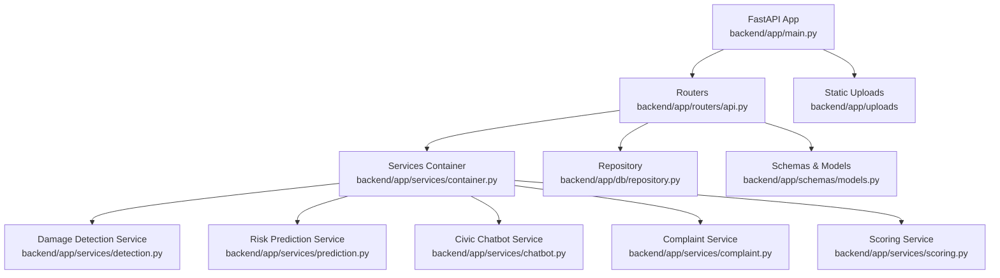
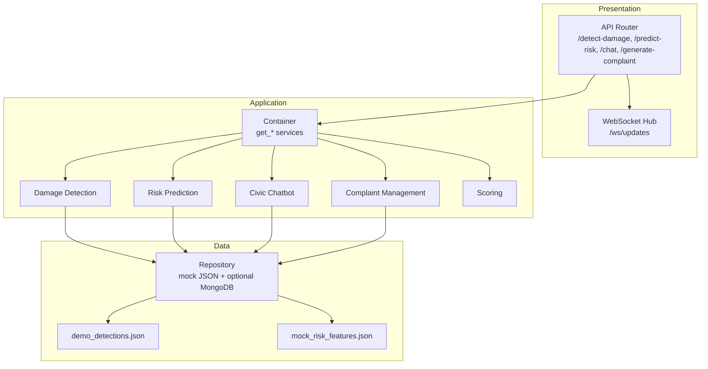
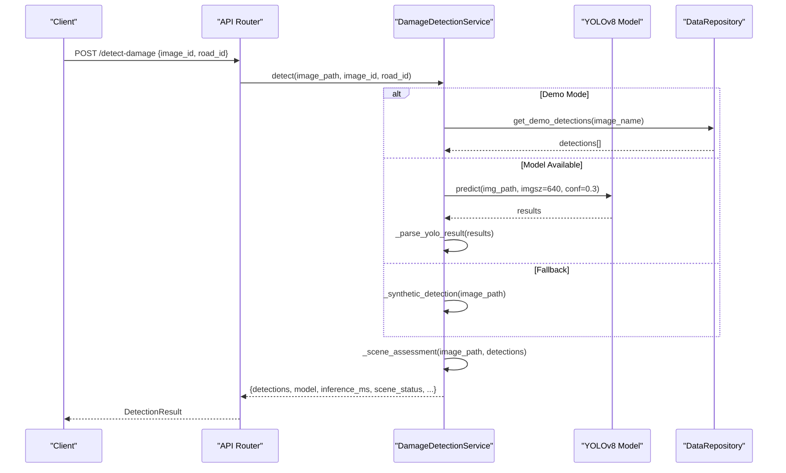
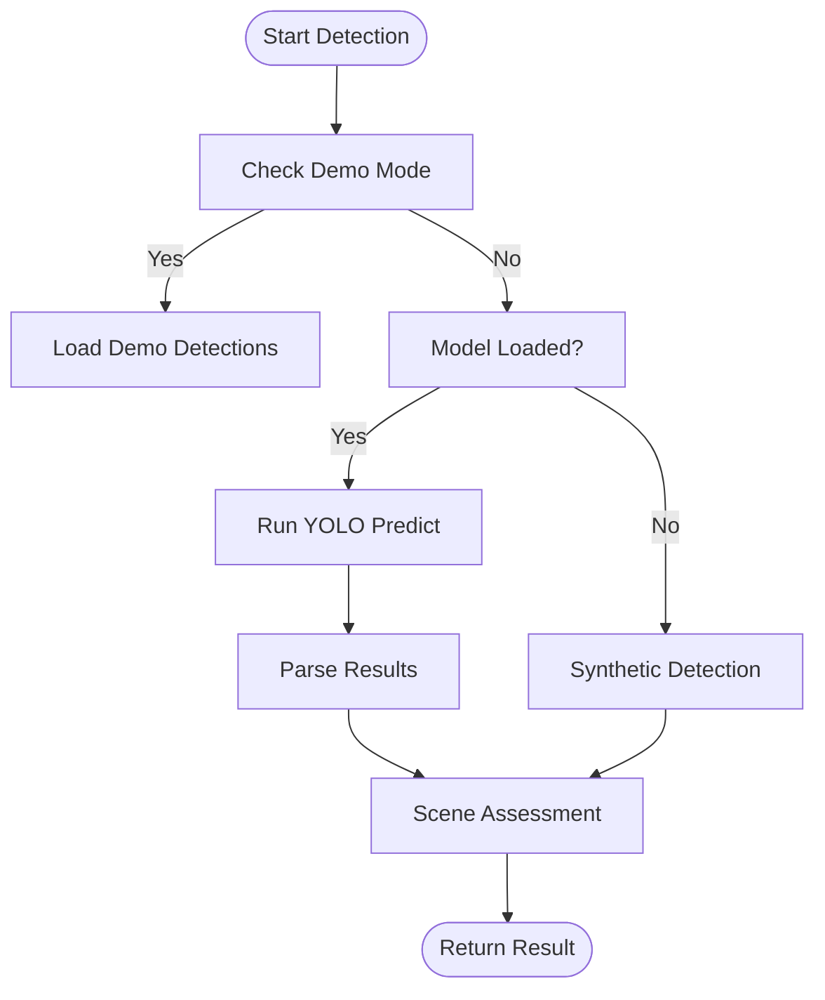
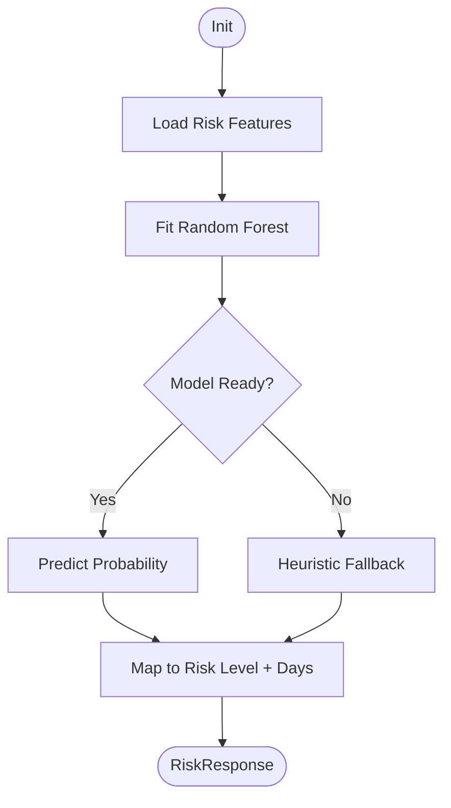
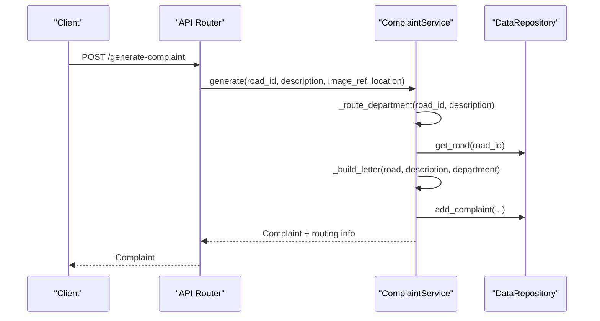
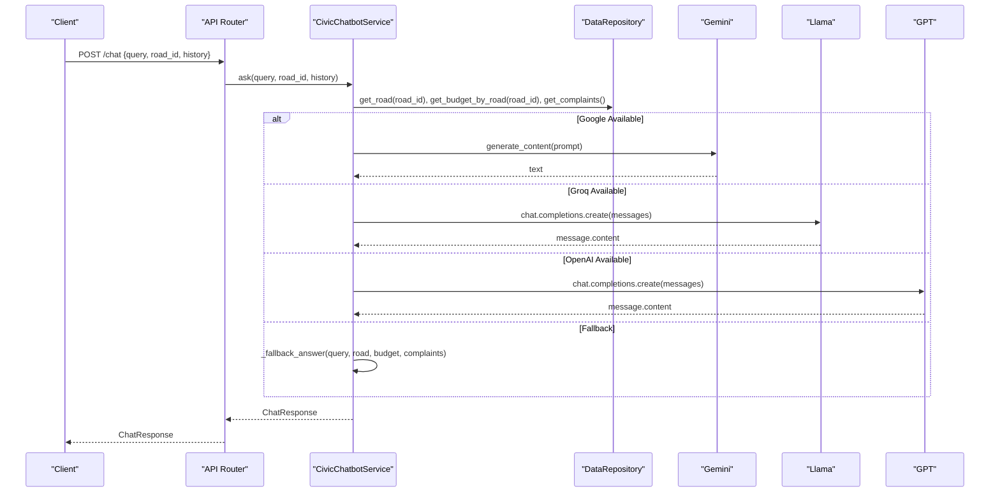
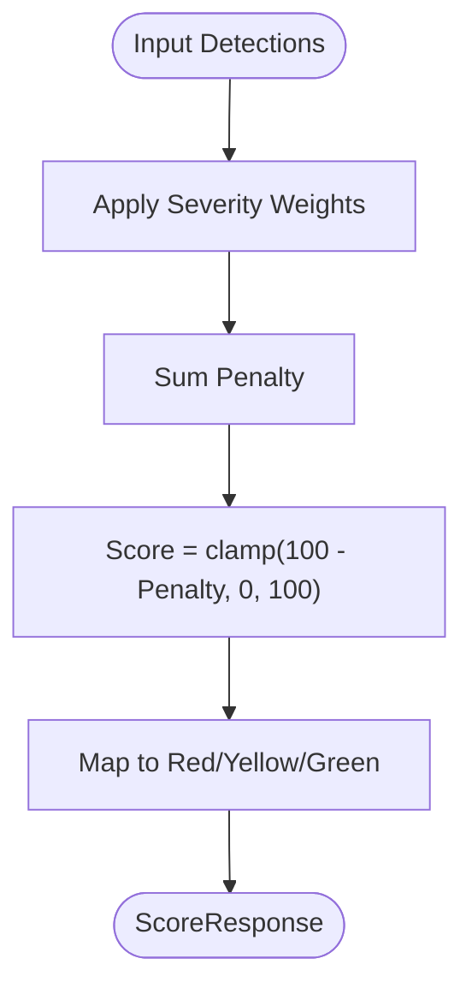
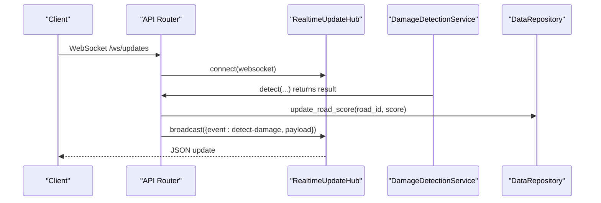
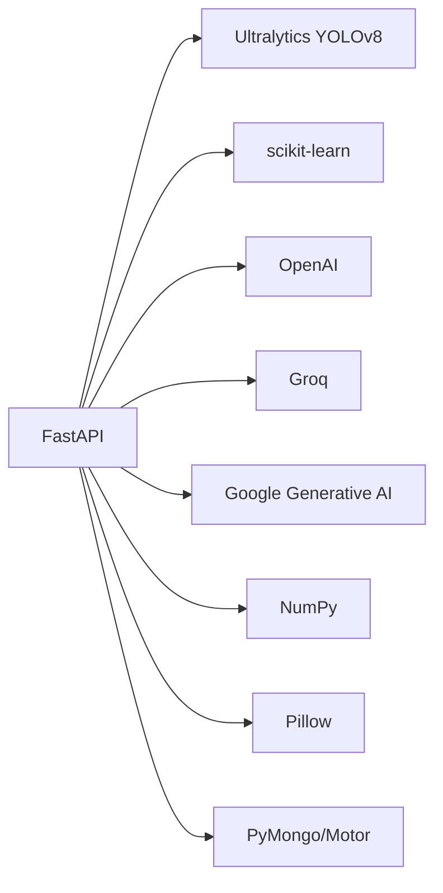

# AI/ML Services

<cite>
**Referenced Files in This Document**
- [main.py](file://backend/app/main.py)
- [config.py](file://backend/app/core/config.py)
- [container.py](file://backend/app/services/container.py)
- [detection.py](file://backend/app/services/detection.py)
- [prediction.py](file://backend/app/services/prediction.py)
- [chatbot.py](file://backend/app/services/chatbot.py)
- [complaint.py](file://backend/app/services/complaint.py)
- [scoring.py](file://backend/app/services/scoring.py)
- [repository.py](file://backend/app/db/repository.py)
- [api.py](file://backend/app/routers/api.py)
- [models.py](file://backend/app/schemas/models.py)
- [demo_detections.json](file://backend/app/data/demo_detections.json)
- [mock_risk_features.json](file://backend/app/data/mock_risk_features.json)
- [requirements.txt](file://backend/requirements.txt)
- [MODEL_INTEGRATION.md](file://docs/MODEL_INTEGRATION.md)
</cite>

## Table of Contents
1. [Introduction](#introduction)
2. [Project Structure](#project-structure)
3. [Core Components](#core-components)
4. [Architecture Overview](#architecture-overview)
5. [Detailed Component Analysis](#detailed-component-analysis)
6. [Dependency Analysis](#dependency-analysis)
7. [Performance Considerations](#performance-considerations)
8. [Troubleshooting Guide](#troubleshooting-guide)
9. [Conclusion](#conclusion)
10. [Appendices](#appendices)

## Introduction
This document describes RoadWatch AI’s artificial intelligence and machine learning services. It covers:
- YOLOv8 integration for road damage detection with model loading, inference pipeline, and synthetic fallback algorithms
- Risk prediction service using Random Forest classifiers for road deterioration forecasting
- Automated complaint management system with routing logic and letter generation
- Multi-LLM chatbot integration supporting OpenAI, Groq, and Google models with fallback mechanisms
- Model training data preparation, performance optimization, accuracy metrics, and deployment considerations
- Computer vision preprocessing, scene assessment, quality control, and real-time inference capabilities

## Project Structure
The backend is a FastAPI application with modular services, a data repository abstraction, and typed request/response models. The primary runtime entrypoint initializes middleware, mounts static uploads, and registers API routes.

**Diagram sources**
- [main.py:1-37](file://backend/app/main.py#L1-L37)
- [api.py:1-427](file://backend/app/routers/api.py#L1-L427)
- [container.py:1-37](file://backend/app/services/container.py#L1-L37)
- [detection.py:1-319](file://backend/app/services/detection.py#L1-L319)
- [prediction.py:1-79](file://backend/app/services/prediction.py#L1-L79)
- [chatbot.py:1-280](file://backend/app/services/chatbot.py#L1-L280)
- [complaint.py:1-94](file://backend/app/services/complaint.py#L1-L94)
- [scoring.py:1-36](file://backend/app/services/scoring.py#L1-L36)
- [repository.py:1-447](file://backend/app/db/repository.py#L1-L447)
- [models.py:1-177](file://backend/app/schemas/models.py#L1-L177)

**Section sources**
- [main.py:1-37](file://backend/app/main.py#L1-L37)
- [api.py:1-427](file://backend/app/routers/api.py#L1-L427)

## Core Components
- Damage Detection Service: YOLOv8-based detection with deterministic demo mode and synthetic fallback heuristics. Includes scene assessment and severity computation.
- Risk Prediction Service: Random Forest classifier trained on synthetic risk features; falls back to heuristic when ML unavailable.
- Civic Chatbot Service: Multi-provider LLM orchestration with Google, Groq, and OpenAI, plus robust fallback.
- Complaint Service: Routing logic by keywords and road characteristics, with standardized letter generation.
- Scoring Service: Computes road health score from detection results using severity weights.
- Repository: In-memory mock datasets plus optional MongoDB integration; provides CRUD and analytics helpers.
- API Router: Exposes endpoints for detection, scoring, risk prediction, chat, complaints, and real-time updates.

**Section sources**
- [detection.py:1-319](file://backend/app/services/detection.py#L1-L319)
- [prediction.py:1-79](file://backend/app/services/prediction.py#L1-L79)
- [chatbot.py:1-280](file://backend/app/services/chatbot.py#L1-L280)
- [complaint.py:1-94](file://backend/app/services/complaint.py#L1-L94)
- [scoring.py:1-36](file://backend/app/services/scoring.py#L1-L36)
- [repository.py:1-447](file://backend/app/db/repository.py#L1-L447)
- [api.py:1-427](file://backend/app/routers/api.py#L1-L427)

## Architecture Overview
The system follows a layered architecture:
- Presentation: FastAPI routes expose REST and WebSocket endpoints
- Application: Services encapsulate AI/ML logic and business workflows
- Data: Repository abstracts data sources (JSON mocks and optional MongoDB)
- Configuration: Pydantic settings loaded from environment

**Diagram sources**
- [api.py:1-427](file://backend/app/routers/api.py#L1-L427)
- [container.py:1-37](file://backend/app/services/container.py#L1-L37)
- [detection.py:1-319](file://backend/app/services/detection.py#L1-L319)
- [prediction.py:1-79](file://backend/app/services/prediction.py#L1-L79)
- [chatbot.py:1-280](file://backend/app/services/chatbot.py#L1-L280)
- [complaint.py:1-94](file://backend/app/services/complaint.py#L1-L94)
- [scoring.py:1-36](file://backend/app/services/scoring.py#L1-L36)
- [repository.py:1-447](file://backend/app/db/repository.py#L1-L447)
- [demo_detections.json:1-102](file://backend/app/data/demo_detections.json#L1-L102)
- [mock_risk_features.json:1-492](file://backend/app/data/mock_risk_features.json#L1-L492)

## Detailed Component Analysis

### YOLOv8 Damage Detection Pipeline
The Damage Detection Service integrates YOLOv8 for road surface defect detection, with deterministic demo mode and synthetic fallback heuristics. It performs scene assessment and computes severity from bounding box areas.

**Diagram sources**
- [api.py:164-190](file://backend/app/routers/api.py#L164-L190)
- [detection.py:36-93](file://backend/app/services/detection.py#L36-L93)
- [repository.py:359-360](file://backend/app/db/repository.py#L359-L360)

Key implementation highlights:
- Model loading: attempts to load YOLO from configured path; otherwise uses fallback
- Inference: calls predict with fixed parameters; parses bounding boxes, labels, confidence, and severity
- Severity mapping: derived from pixel area thresholds
- Scene assessment: validates image quality and content keywords to guide user feedback
- Fallback heuristics: detects non-road scenes and applies region-of-interest analysis to find potholes

**Diagram sources**
- [detection.py:28-93](file://backend/app/services/detection.py#L28-L93)
- [detection.py:133-254](file://backend/app/services/detection.py#L133-L254)
- [detection.py:264-318](file://backend/app/services/detection.py#L264-L318)

**Section sources**
- [detection.py:1-319](file://backend/app/services/detection.py#L1-L319)
- [api.py:164-190](file://backend/app/routers/api.py#L164-L190)
- [demo_detections.json:1-102](file://backend/app/data/demo_detections.json#L1-L102)

### Risk Prediction Service (Random Forest)
The Risk Prediction Service trains a Random Forest model on synthetic risk features and predicts deterioration likelihood with risk levels and timeframes.

**Diagram sources**
- [prediction.py:21-78](file://backend/app/services/prediction.py#L21-L78)
- [mock_risk_features.json:1-492](file://backend/app/data/mock_risk_features.json#L1-L492)

Training and inference details:
- Features: weather_index, traffic_index, complaint_count_30d
- Target: deteriorated (binary)
- Model: Random Forest with tuned hyperparameters
- Fallback: affine combination of inputs capped to realistic bounds

**Section sources**
- [prediction.py:1-79](file://backend/app/services/prediction.py#L1-L79)
- [mock_risk_features.json:1-492](file://backend/app/data/mock_risk_features.json#L1-L492)

### Automated Complaint Management
The Complaint Service generates standardized letters and routes requests based on road attributes and keywords.

**Diagram sources**
- [api.py:198-247](file://backend/app/routers/api.py#L198-L247)
- [complaint.py:12-32](file://backend/app/services/complaint.py#L12-L32)
- [complaint.py:40-80](file://backend/app/services/complaint.py#L40-L80)
- [complaint.py:82-94](file://backend/app/services/complaint.py#L82-L94)

Routing logic:
- Keyword-based matching for specialized departments (drainage, streetlight, footpath, garbage)
- Highway vs municipal classification via road name tokens
- Ward-based targeting for zonal offices
- Fallback to Tamil Nadu Highways Department when ambiguous

Letter generation:
- Standardized template with recipient, subject, and user report
- Auto-inserts road name and ward

**Section sources**
- [complaint.py:1-94](file://backend/app/services/complaint.py#L1-L94)
- [api.py:198-247](file://backend/app/routers/api.py#L198-L247)

### Multi-LLM Chatbot Integration
The Civic Chatbot Service orchestrates multiple LLM providers with graceful fallback and contextual retrieval from repository data.

**Diagram sources**
- [api.py:348-365](file://backend/app/routers/api.py#L348-L365)
- [chatbot.py:52-175](file://backend/app/services/chatbot.py#L52-L175)
- [chatbot.py:188-279](file://backend/app/services/chatbot.py#L188-L279)

Provider selection and fallback:
- Configured via environment keys; each provider is initialized if both key and SDK are available
- Fallback chain: Google → Groq → OpenAI → Rule-based assistant
- Context injection: road metadata, budget, and recent complaints
- Safety: error wrapping and safe error messages

**Section sources**
- [chatbot.py:1-280](file://backend/app/services/chatbot.py#L1-L280)
- [api.py:348-365](file://backend/app/routers/api.py#L348-L365)

### Road Health Scoring
The scoring service aggregates detection severities into a single road health score with color-coded bands.

**Diagram sources**
- [scoring.py:19-35](file://backend/app/services/scoring.py#L19-L35)

**Section sources**
- [scoring.py:1-36](file://backend/app/services/scoring.py#L1-L36)
- [models.py:47-50](file://backend/app/schemas/models.py#L47-L50)

### Real-Time Inference and Updates
The API exposes a WebSocket hub for real-time broadcasting of detection and complaint events, enabling live dashboards and UI updates.

**Diagram sources**
- [api.py:38-60](file://backend/app/routers/api.py#L38-L60)
- [api.py:177-188](file://backend/app/routers/api.py#L177-L188)

**Section sources**
- [api.py:122-132](file://backend/app/routers/api.py#L122-L132)
- [api.py:177-188](file://backend/app/routers/api.py#L177-L188)

## Dependency Analysis
External libraries and their roles:
- FastAPI and Uvicorn: web framework and ASGI server
- NumPy: numerical operations for image preprocessing and heuristics
- scikit-learn: Random Forest for risk prediction
- OpenAI, Groq, Google Generative AI: multi-LLM support
- Ultralytics YOLOv8: object detection
- Pillow: image dimension extraction
- PyMongo/Motor: optional MongoDB integration
- python-dotenv: environment variable loading

**Diagram sources**
- [requirements.txt:1-18](file://backend/requirements.txt#L1-L18)

**Section sources**
- [requirements.txt:1-18](file://backend/requirements.txt#L1-L18)

## Performance Considerations
- Model inference: YOLO runs with fixed imgsz and confidence; consider batching and GPU acceleration for production throughput
- Preprocessing: Synthetic fallback avoids heavy compute; keep image dimensions reasonable to reduce memory pressure
- Random Forest: Tune hyperparameters and consider incremental retraining with drift monitoring
- LLM calls: Implement request timeouts, retry with backoff, and rate limiting; cache frequent prompts
- Real-time updates: Broadcast only essential fields; throttle updates to avoid overload
- Storage: Persist model artifacts and maintain versioned datasets; compress uploads where appropriate

[No sources needed since this section provides general guidance]

## Troubleshooting Guide
Common issues and resolutions:
- YOLO model not loaded: Verify YOLO_MODEL_PATH and DEMO_MODE; ensure model file exists and is accessible
- No detections returned: Confirm image quality and content; use scene assessment feedback to request reuploads
- Risk prediction returns heuristic: Install scikit-learn and provide training data; reinitialize service after data updates
- LLM provider errors: Check API keys and SDK availability; fallback responses are logged in cited_data
- Complaint routing ambiguity: Adjust keyword mappings or refine road name parsing rules
- WebSocket disconnects: Validate client connection lifecycle and handle exceptions gracefully

**Section sources**
- [detection.py:28-35](file://backend/app/services/detection.py#L28-L35)
- [detection.py:78-83](file://backend/app/services/detection.py#L78-L83)
- [prediction.py:22-23](file://backend/app/services/prediction.py#L22-L23)
- [chatbot.py:40-51](file://backend/app/services/chatbot.py#L40-L51)
- [chatbot.py:169-175](file://backend/app/services/chatbot.py#L169-L175)
- [complaint.py:40-80](file://backend/app/services/complaint.py#L40-L80)

## Conclusion
RoadWatch AI’s backend provides a cohesive foundation for AI-driven road maintenance workflows. The YOLOv8 detection pipeline supports both demo and production modes with robust fallbacks. Risk prediction leverages a simple yet effective Random Forest model, while the complaint system automates routing and letter generation. The multi-LLM chatbot delivers contextual assistance with provider diversity and failover. Together, these services enable real-time inference, quality control, and transparent civic engagement.

[No sources needed since this section summarizes without analyzing specific files]

## Appendices

### Configuration and Environment
- Settings include API host/port, MongoDB URI, YOLO model path, and LLM credentials
- Demo mode toggles deterministic behavior and dataset usage

**Section sources**
- [config.py:10-39](file://backend/app/core/config.py#L10-L39)

### Data Preparation and Training
- Demo detections: predefined per-image results for testing
- Risk features: synthetic dataset for training the Random Forest model
- Repository loads JSON fixtures and optionally seeds MongoDB collections

**Section sources**
- [demo_detections.json:1-102](file://backend/app/data/demo_detections.json#L1-L102)
- [mock_risk_features.json:1-492](file://backend/app/data/mock_risk_features.json#L1-L492)
- [repository.py:41-51](file://backend/app/db/repository.py#L41-L51)
- [repository.py:59-92](file://backend/app/db/repository.py#L59-L92)

### API Reference Highlights
- Health and model info endpoints
- Image upload and damage detection
- Risk prediction and road scoring
- Complaint generation and status updates
- Chat assistant with context-aware responses
- Real-time WebSocket updates

**Section sources**
- [api.py:66-93](file://backend/app/routers/api.py#L66-L93)
- [api.py:134-161](file://backend/app/routers/api.py#L134-L161)
- [api.py:164-190](file://backend/app/routers/api.py#L164-L190)
- [api.py:335-345](file://backend/app/routers/api.py#L335-L345)
- [api.py:348-365](file://backend/app/routers/api.py#L348-L365)
- [api.py:122-132](file://backend/app/routers/api.py#L122-L132)