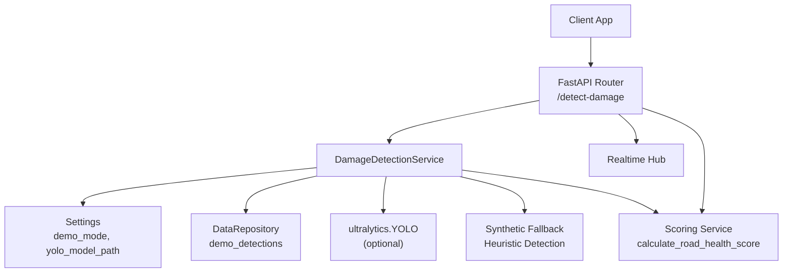
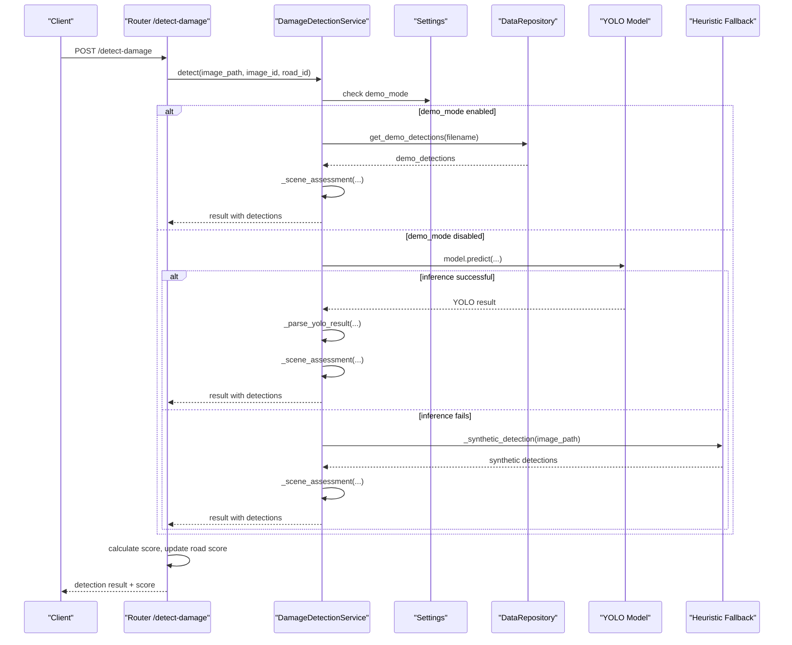
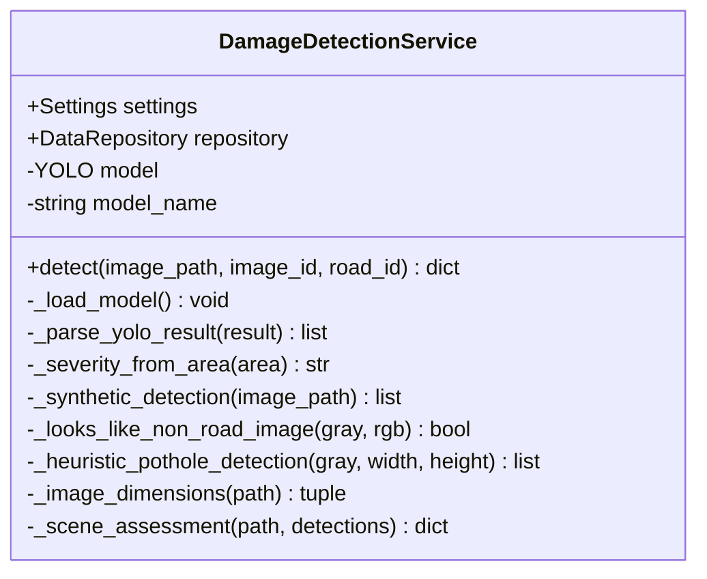
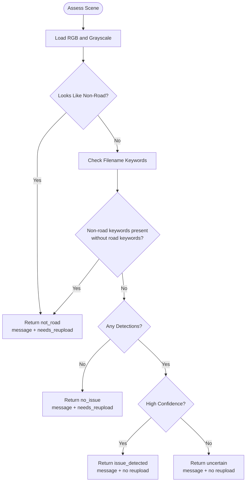
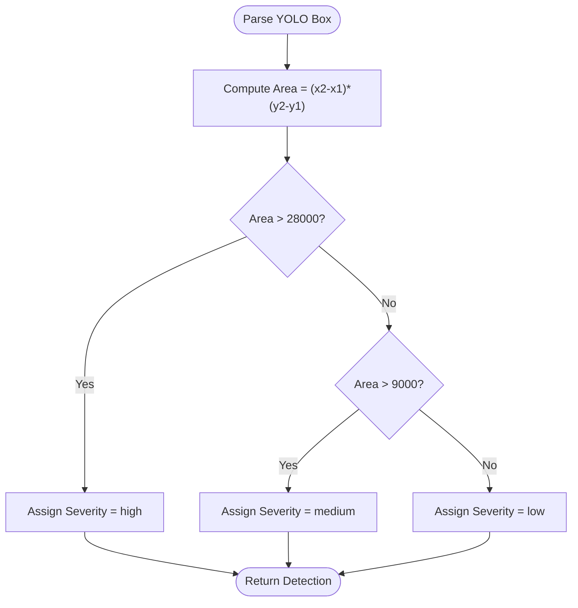
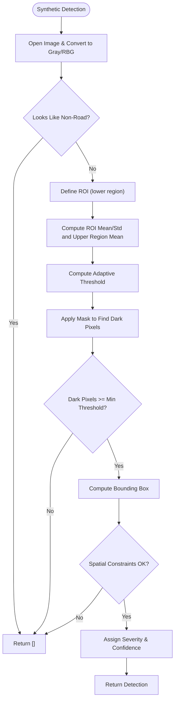
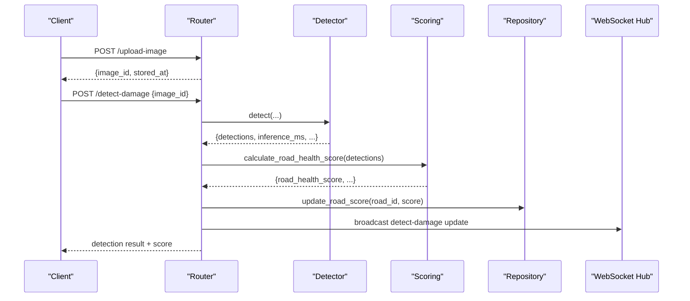
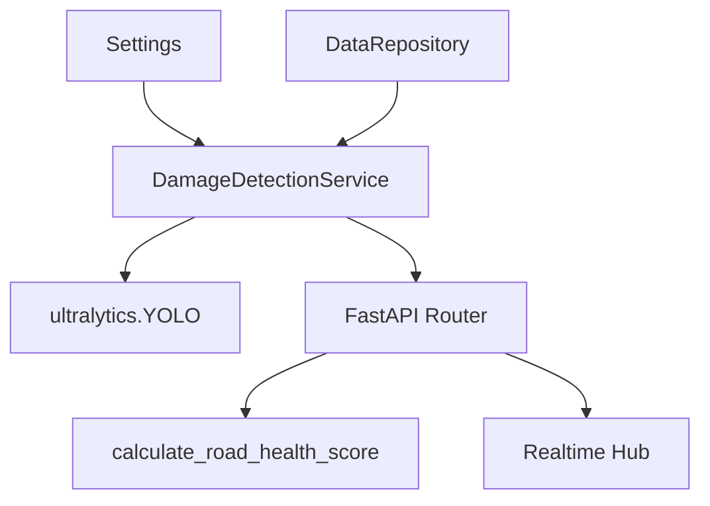

# Damage Detection Service

<cite>
**Referenced Files in This Document**
- [detection.py](file://backend/app/services/detection.py)
- [config.py](file://backend/app/core/config.py)
- [repository.py](file://backend/app/db/repository.py)
- [api.py](file://backend/app/routers/api.py)
- [models.py](file://backend/app/schemas/models.py)
- [container.py](file://backend/app/services/container.py)
- [main.py](file://backend/app/main.py)
- [demo_detections.json](file://backend/app/data/demo_detections.json)
- [mock_risk_features.json](file://backend/app/data/mock_risk_features.json)
- [README.md](file://README.md)
- [MODEL_INTEGRATION.md](file://docs/MODEL_INTEGRATION.md)
</cite>

## Table of Contents
1. [Introduction](#introduction)
2. [Project Structure](#project-structure)
3. [Core Components](#core-components)
4. [Architecture Overview](#architecture-overview)
5. [Detailed Component Analysis](#detailed-component-analysis)
6. [Dependency Analysis](#dependency-analysis)
7. [Performance Considerations](#performance-considerations)
8. [Troubleshooting Guide](#troubleshooting-guide)
9. [Conclusion](#conclusion)
10. [Appendices](#appendices)

## Introduction
This document describes the Damage Detection Service that powers YOLOv8-based road damage detection within the RoadWatch AI backend. It explains the computer vision pipeline, model loading, inference processing, synthetic fallback algorithms, scene assessment, severity classification, and demo-mode operation. It also covers performance measurement, accuracy considerations, image preprocessing, quality validation, and fallback strategies for non-YOLO environments.

## Project Structure
The backend is a FastAPI application that exposes endpoints for image upload, damage detection, scoring, and related analytics. The detection service encapsulates:
- YOLOv8 model loading and inference
- Synthetic fallback detection for non-road images and when YOLO is unavailable
- Scene assessment to validate image quality and road relevance
- Severity classification based on bounding box area
- Demo-mode behavior returning deterministic detections

**Diagram sources**
- [api.py:164-190](file://backend/app/routers/api.py#L164-L190)
- [detection.py:20-93](file://backend/app/services/detection.py#L20-L93)
- [config.py:10-39](file://backend/app/core/config.py#L10-L39)
- [repository.py:359-360](file://backend/app/db/repository.py#L359-L360)
- [scoring.py:19-35](file://backend/app/services/scoring.py#L19-L35)

**Section sources**
- [README.md:104-120](file://README.md#L104-L120)
- [main.py:32-36](file://backend/app/main.py#L32-L36)

## Core Components
- DamageDetectionService: Orchestrates detection, including YOLO inference, synthetic fallback, scene assessment, and severity calculation.
- DataRepository: Provides demo detections and training data; supports MongoDB integration.
- FastAPI Router: Exposes endpoints for detection, scoring, and real-time updates.
- Scoring Service: Computes road health score from detections.
- Settings: Controls demo mode and model path.

Key responsibilities:
- Load YOLO model if available and configured
- Parse YOLO results into standardized detection records
- Classify severity by bounding box area
- Validate scene quality and road relevance
- Provide deterministic demo results when YOLO is unavailable
- Measure inference time and return structured results

**Section sources**
- [detection.py:20-93](file://backend/app/services/detection.py#L20-L93)
- [config.py:10-39](file://backend/app/core/config.py#L10-L39)
- [repository.py:359-360](file://backend/app/db/repository.py#L359-L360)
- [api.py:164-190](file://backend/app/routers/api.py#L164-L190)
- [scoring.py:19-35](file://backend/app/services/scoring.py#L19-L35)

## Architecture Overview
The detection flow integrates model inference, fallback logic, and scene validation. The router coordinates the process and publishes real-time updates.

**Diagram sources**
- [api.py:164-190](file://backend/app/routers/api.py#L164-L190)
- [detection.py:36-93](file://backend/app/services/detection.py#L36-L93)
- [repository.py:359-360](file://backend/app/db/repository.py#L359-L360)

## Detailed Component Analysis

### Damage Detection Service
The service encapsulates the entire detection pipeline with robust fallbacks and scene validation.

**Diagram sources**
- [detection.py:20-319](file://backend/app/services/detection.py#L20-L319)

Key behaviors:
- Model loading: Attempts to load YOLO if available and path exists; otherwise uses a mock detector name.
- Inference: Calls model.predict with fixed parameters; parses results into standardized format.
- Severity classification: Maps bounding box area to severity categories.
- Scene assessment: Validates image quality and road relevance; returns status and guidance.
- Fallback: If YOLO fails or is unavailable, runs heuristic detection on grayscale imagery.
- Demo mode: Returns deterministic detections for matching filenames.

**Section sources**
- [detection.py:28-35](file://backend/app/services/detection.py#L28-L35)
- [detection.py:62-93](file://backend/app/services/detection.py#L62-L93)
- [detection.py:95-123](file://backend/app/services/detection.py#L95-L123)
- [detection.py:125-131](file://backend/app/services/detection.py#L125-L131)
- [detection.py:133-145](file://backend/app/services/detection.py#L133-L145)
- [detection.py:147-184](file://backend/app/services/detection.py#L147-L184)
- [detection.py:186-254](file://backend/app/services/detection.py#L186-L254)
- [detection.py:264-318](file://backend/app/services/detection.py#L264-L318)

### Scene Assessment System
The scene assessment validates image quality and determines road relevance using:
- Non-road heuristics based on luminance statistics, border vs center contrast, and color saturation
- Filename keyword matching to distinguish road vs non-road images
- Detection presence and confidence thresholds to decide issue status

**Diagram sources**
- [detection.py:264-318](file://backend/app/services/detection.py#L264-L318)

**Section sources**
- [detection.py:147-184](file://backend/app/services/detection.py#L147-L184)
- [detection.py:278-304](file://backend/app/services/detection.py#L278-L304)
- [detection.py:306-318](file://backend/app/services/detection.py#L306-L318)

### Severity Classification Algorithm
Severity is derived from bounding box area:
- High: area > 28000
- Medium: area > 9000
- Low: otherwise

Confidence values are rounded to two decimals during parsing.

**Diagram sources**
- [detection.py:113-131](file://backend/app/services/detection.py#L113-L131)

**Section sources**
- [detection.py:113-131](file://backend/app/services/detection.py#L113-L131)

### Heuristic Detection System (Non-YOLO Environments)
When YOLO is unavailable or inference fails, the service performs a grayscale-based heuristic detection:
- ROI selection in lower portion of image
- Dark pixel detection via adaptive thresholding
- Minimum pixel count threshold
- Spatial constraints to avoid false positives
- Severity assignment based on area and score

**Diagram sources**
- [detection.py:133-145](file://backend/app/services/detection.py#L133-L145)
- [detection.py:186-254](file://backend/app/services/detection.py#L186-L254)

**Section sources**
- [detection.py:133-145](file://backend/app/services/detection.py#L133-L145)
- [detection.py:186-254](file://backend/app/services/detection.py#L186-L254)

### Endpoint Integration and Real-Time Updates
The router coordinates detection, scoring, and real-time notifications:
- Uploads images and persists metadata
- Invokes detection service and computes road health score
- Updates road score in repository
- Publishes real-time updates via WebSocket hub

**Diagram sources**
- [api.py:134-161](file://backend/app/routers/api.py#L134-L161)
- [api.py:164-190](file://backend/app/routers/api.py#L164-L190)
- [scoring.py:19-35](file://backend/app/services/scoring.py#L19-L35)

**Section sources**
- [api.py:134-190](file://backend/app/routers/api.py#L134-L190)

## Dependency Analysis
The detection service depends on configuration, repository, and optional YOLO library. The router composes the service via dependency injection.

**Diagram sources**
- [container.py:11-20](file://backend/app/services/container.py#L11-L20)
- [config.py:10-39](file://backend/app/core/config.py#L10-L39)
- [repository.py:31-52](file://backend/app/db/repository.py#L31-L52)
- [detection.py:14-26](file://backend/app/services/detection.py#L14-L26)
- [api.py:22-31](file://backend/app/routers/api.py#L22-L31)

**Section sources**
- [container.py:11-20](file://backend/app/services/container.py#L11-L20)
- [config.py:10-39](file://backend/app/core/config.py#L10-L39)
- [repository.py:31-52](file://backend/app/db/repository.py#L31-L52)
- [detection.py:14-26](file://backend/app/services/detection.py#L14-L26)
- [api.py:22-31](file://backend/app/routers/api.py#L22-L31)

## Performance Considerations
- Inference timing: The service measures inference duration in milliseconds around model.predict and synthetic detection.
- Model parameters: Fixed imgsz and conf thresholds are applied during inference to balance speed and accuracy.
- Fallback cost: When YOLO is unavailable, heuristic detection operates on grayscale arrays and applies ROI masking and thresholding.
- Image dimension fallback: If image metadata cannot be read, defaults are used to maintain robustness.
- Real-time updates: WebSocket broadcasting occurs after scoring and road score updates.

Recommendations:
- Tune imgsz and conf thresholds for device constraints.
- Cache model after initial load to reduce startup latency.
- Consider resizing or aspect ratio checks to optimize inference throughput.
- Monitor inference_ms in production logs to track performance regressions.

**Section sources**
- [detection.py:42-49](file://backend/app/services/detection.py#L42-L49)
- [detection.py:64](file://backend/app/services/detection.py#L64)
- [detection.py:257-262](file://backend/app/services/detection.py#L257-L262)

## Troubleshooting Guide
Common issues and resolutions:
- YOLO not available: The service gracefully falls back to synthetic detection and demo-mode behavior when the YOLO library is not importable.
- Model path invalid: If the configured model path does not exist, the service continues with a mock detector name and synthetic fallback.
- Non-road images: Scene assessment returns not_road with guidance to upload a clear road image.
- No detections: Scene assessment returns no_issue with suggestion to re-upload a clearer image.
- Low-confidence detections: Scene assessment returns uncertain with guidance to improve image quality.
- Demo-mode behavior: When demo_mode is enabled, deterministic detections are returned for matching filenames.

Operational tips:
- Verify YOLO_MODEL_PATH in environment and ensure model file exists.
- Confirm demo_mode setting for deterministic behavior.
- Review inference_ms in results to identify slow inference on edge devices.
- Use scene_status and scene_message to guide user feedback.

**Section sources**
- [detection.py:14-17](file://backend/app/services/detection.py#L14-L17)
- [detection.py:28-34](file://backend/app/services/detection.py#L28-L34)
- [detection.py:46-60](file://backend/app/services/detection.py#L46-L60)
- [detection.py:269-276](file://backend/app/services/detection.py#L269-L276)
- [detection.py:306-311](file://backend/app/services/detection.py#L306-L311)
- [config.py:15](file://backend/app/core/config.py#L15)
- [MODEL_INTEGRATION.md:11-22](file://docs/MODEL_INTEGRATION.md#L11-L22)

## Conclusion
The Damage Detection Service provides a robust, demo-friendly pipeline for road damage detection. It leverages YOLOv8 when available, otherwise falls back to a carefully designed heuristic system. Scene assessment ensures high-quality inputs and meaningful user feedback. Severity classification is straightforward and interpretable, while performance is measured and suitable for real-time applications.

## Appendices

### API Definitions
- POST /detect-damage: Accepts DetectionRequest, returns DetectionResult extended with score and scene assessment.
- POST /calculate-score: Accepts ScoreRequest, returns ScoreResponse.
- POST /upload-image: Accepts multipart/form-data, returns upload metadata.

**Section sources**
- [api.py:164-190](file://backend/app/routers/api.py#L164-L190)
- [api.py:193-195](file://backend/app/routers/api.py#L193-L195)
- [api.py:134-161](file://backend/app/routers/api.py#L134-L161)
- [models.py:28-34](file://backend/app/schemas/models.py#L28-L34)
- [models.py:43-44](file://backend/app/schemas/models.py#L43-L44)

### Demo Mode Operation
- Demo detections are loaded from demo_detections.json and matched by filename.
- When demo_mode is enabled, detect-damage returns deterministic results and scene assessment.
- Router exposes api-info to indicate demo_mode and model info.

**Section sources**
- [repository.py:49-51](file://backend/app/db/repository.py#L49-L51)
- [demo_detections.json:1-102](file://backend/app/data/demo_detections.json#L1-L102)
- [api.py:78-93](file://backend/app/routers/api.py#L78-L93)
- [config.py:15](file://backend/app/core/config.py#L15)

### Model Integration Notes
- To enable real YOLO inference, set YOLO_MODEL_PATH and DEMO_MODE=false in environment.
- Expected outputs include bounding boxes, labels, confidence, and severity.

**Section sources**
- [MODEL_INTEGRATION.md:11-22](file://docs/MODEL_INTEGRATION.md#L11-L22)
- [MODEL_INTEGRATION.md:24-28](file://docs/MODEL_INTEGRATION.md#L24-L28)