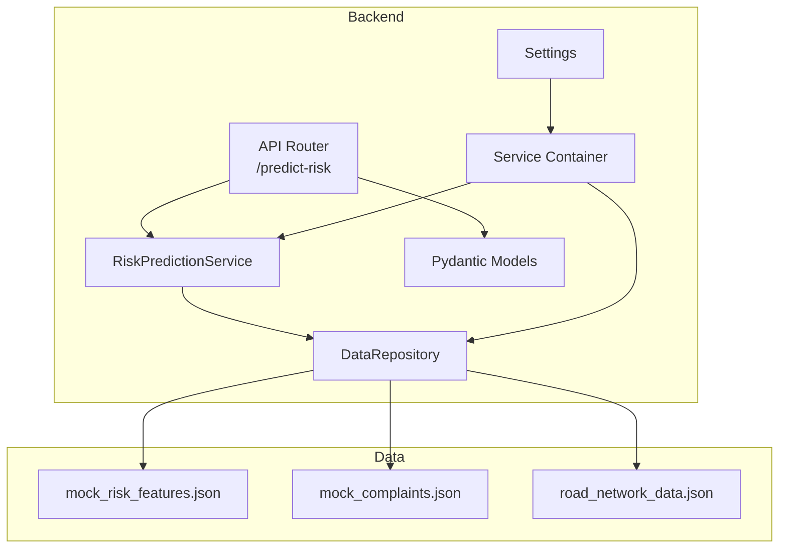
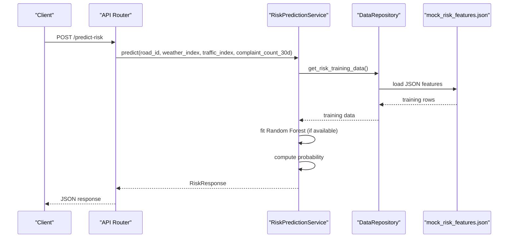
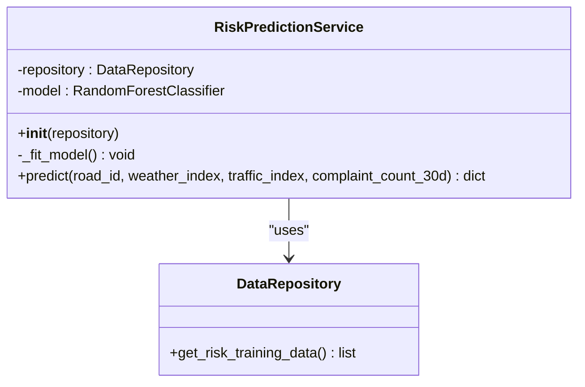
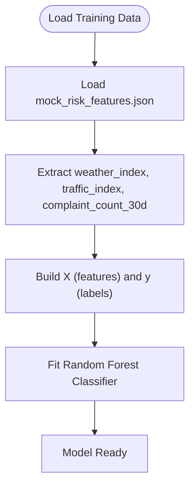
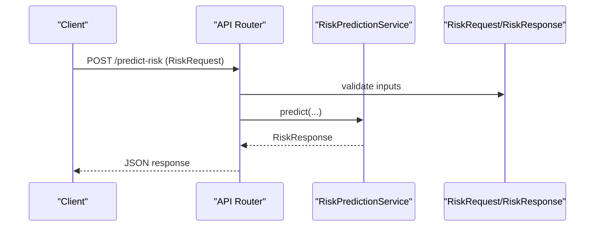
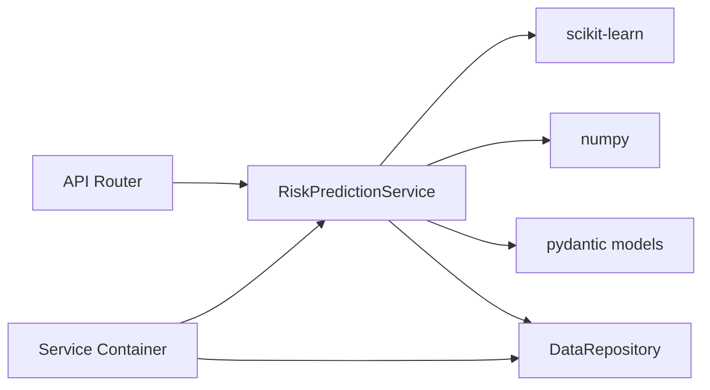

# Risk Prediction Service

<cite>
**Referenced Files in This Document**
- [prediction.py](file://roadwatch_ai/backend/app/services/prediction.py)
- [repository.py](file://roadwatch_ai/backend/app/db/repository.py)
- [models.py](file://roadwatch_ai/backend/app/schemas/models.py)
- [api.py](file://roadwatch_ai/backend/app/routers/api.py)
- [container.py](file://roadwatch_ai/backend/app/services/container.py)
- [config.py](file://roadwatch_ai/backend/app/core/config.py)
- [requirements.txt](file://roadwatch_ai/backend/requirements.txt)
- [mock_risk_features.json](file://roadwatch_ai/backend/app/data/mock_risk_features.json)
- [mock_complaints.json](file://roadwatch_ai/backend/app/data/mock_complaints.json)
- [road_network_data.json](file://roadwatch_ai/backend/app/data/road_network_data.json)
- [main.py](file://roadwatch_ai/backend/app/main.py)
- [MODEL_INTEGRATION.md](file://roadwatch_ai/docs/MODEL_INTEGRATION.md)
</cite>

## Table of Contents
1. [Introduction](#introduction)
2. [Project Structure](#project-structure)
3. [Core Components](#core-components)
4. [Architecture Overview](#architecture-overview)
5. [Detailed Component Analysis](#detailed-component-analysis)
6. [Dependency Analysis](#dependency-analysis)
7. [Performance Considerations](#performance-considerations)
8. [Troubleshooting Guide](#troubleshooting-guide)
9. [Conclusion](#conclusion)
10. [Appendices](#appendices)

## Introduction
This document describes the Risk Prediction Service that forecasts road deterioration using Random Forest classifiers. The service integrates with the broader RoadWatch AI platform to provide risk assessments based on environmental, traffic, and community feedback signals. It includes the machine learning pipeline, data preparation, model training, prediction algorithms, and operational considerations for deployment and maintenance.

## Project Structure
The Risk Prediction Service is implemented as part of the FastAPI backend and interacts with data repositories, schemas, and API routers. The service is initialized via a dependency container and exposed through a dedicated endpoint.

**Diagram sources**
- [api.py:335-346](file://roadwatch_ai/backend/app/routers/api.py#L335-L346)
- [prediction.py:15-79](file://roadwatch_ai/backend/app/services/prediction.py#L15-L79)
- [repository.py:31-52](file://roadwatch_ai/backend/app/db/repository.py#L31-L52)
- [models.py:125-137](file://roadwatch_ai/backend/app/schemas/models.py#L125-L137)
- [container.py:24-25](file://roadwatch_ai/backend/app/services/container.py#L24-L25)
- [config.py:10-39](file://roadwatch_ai/backend/app/core/config.py#L10-L39)
- [mock_risk_features.json:1-492](file://roadwatch_ai/backend/app/data/mock_risk_features.json#L1-L492)
- [mock_complaints.json:1-1817](file://roadwatch_ai/backend/app/data/mock_complaints.json#L1-L1817)
- [road_network_data.json:1-5589](file://roadwatch_ai/backend/app/data/road_network_data.json#L1-L5589)

**Section sources**
- [api.py:335-346](file://roadwatch_ai/backend/app/routers/api.py#L335-L346)
- [prediction.py:15-79](file://roadwatch_ai/backend/app/services/prediction.py#L15-L79)
- [repository.py:31-52](file://roadwatch_ai/backend/app/db/repository.py#L31-L52)
- [models.py:125-137](file://roadwatch_ai/backend/app/schemas/models.py#L125-L137)
- [container.py:24-25](file://roadwatch_ai/backend/app/services/container.py#L24-L25)
- [config.py:10-39](file://roadwatch_ai/backend/app/core/config.py#L10-L39)

## Core Components
- RiskPredictionService: Implements Random Forest-based prediction and a heuristic fallback when ML libraries are unavailable. It trains on historical risk features and predicts risk levels with associated probabilities and decline timelines.
- DataRepository: Provides access to mock datasets and initializes MongoDB connections. It supplies training data for the risk model and supports other platform features.
- Pydantic Models: Define request/response schemas for risk predictions, including validation for input indices and output risk categories.
- API Router: Exposes the /predict-risk endpoint and integrates with the RiskPredictionService via dependency injection.
- Service Container: Creates and caches RiskPredictionService instances, injecting the DataRepository.
- Configuration: Centralizes environment settings including model paths and API keys.

Key implementation references:
- RiskPredictionService training and prediction logic: [prediction.py:21-79](file://roadwatch_ai/backend/app/services/prediction.py#L21-L79)
- RiskRequest/RiskResponse schemas: [models.py:125-137](file://roadwatch_ai/backend/app/schemas/models.py#L125-L137)
- /predict-risk endpoint: [api.py:335-346](file://roadwatch_ai/backend/app/routers/api.py#L335-L346)
- Risk model initialization and caching: [container.py:24-25](file://roadwatch_ai/backend/app/services/container.py#L24-L25)
- Training data provider: [repository.py:362-363](file://roadwatch_ai/backend/app/db/repository.py#L362-L363)

**Section sources**
- [prediction.py:15-79](file://roadwatch_ai/backend/app/services/prediction.py#L15-L79)
- [models.py:125-137](file://roadwatch_ai/backend/app/schemas/models.py#L125-L137)
- [api.py:335-346](file://roadwatch_ai/backend/app/routers/api.py#L335-L346)
- [container.py:24-25](file://roadwatch_ai/backend/app/services/container.py#L24-L25)
- [repository.py:362-363](file://roadwatch_ai/backend/app/db/repository.py#L362-L363)

## Architecture Overview
The Risk Prediction Service follows a layered architecture:
- Presentation Layer: FastAPI router exposes /predict-risk.
- Application Layer: RiskPredictionService encapsulates ML logic and business rules.
- Data Access Layer: DataRepository manages data sources and persistence.
- Configuration Layer: Settings drive service behavior and integrations.

**Diagram sources**
- [api.py:335-346](file://roadwatch_ai/backend/app/routers/api.py#L335-L346)
- [prediction.py:15-79](file://roadwatch_ai/backend/app/services/prediction.py#L15-L79)
- [repository.py:362-363](file://roadwatch_ai/backend/app/db/repository.py#L362-L363)
- [mock_risk_features.json:1-492](file://roadwatch_ai/backend/app/data/mock_risk_features.json#L1-L492)

## Detailed Component Analysis

### RiskPredictionService
Implements the Random Forest classifier and a fallback heuristic:
- Training: Loads historical risk features, constructs feature matrix X and target vector y, fits a Random Forest with fixed hyperparameters, and stores the trained model.
- Prediction: Accepts weather_index, traffic_index, and complaint_count_30d; returns risk_level, probability_of_deterioration, and predicted_days_to_decline. Uses the fitted model when available; otherwise applies a weighted linear combination with clamping to produce a conservative estimate.

**Diagram sources**
- [prediction.py:15-79](file://roadwatch_ai/backend/app/services/prediction.py#L15-L79)
- [repository.py:362-363](file://roadwatch_ai/backend/app/db/repository.py#L362-L363)

Key implementation references:
- Model training and feature extraction: [prediction.py:21-40](file://roadwatch_ai/backend/app/services/prediction.py#L21-L40)
- Prediction logic and risk thresholds: [prediction.py:42-79](file://roadwatch_ai/backend/app/services/prediction.py#L42-L79)
- Training data source: [repository.py:362-363](file://roadwatch_ai/backend/app/db/repository.py#L362-L363)
- Mock training data: [mock_risk_features.json:1-492](file://roadwatch_ai/backend/app/data/mock_risk_features.json#L1-L492)

**Section sources**
- [prediction.py:15-79](file://roadwatch_ai/backend/app/services/prediction.py#L15-L79)
- [repository.py:362-363](file://roadwatch_ai/backend/app/db/repository.py#L362-L363)
- [mock_risk_features.json:1-492](file://roadwatch_ai/backend/app/data/mock_risk_features.json#L1-L492)

### Data Preparation and Feature Engineering
The service consumes three primary features:
- weather_index: Normalized measure of weather impact (0 clear to 1 extreme).
- traffic_index: Normalized measure of traffic intensity (0 low to 1 heavy).
- complaint_count_30d: Count of complaints in the past 30 days.

Training data is structured as a list of records containing these features and a binary label indicating whether the road deteriorated.

**Diagram sources**
- [prediction.py:21-40](file://roadwatch_ai/backend/app/services/prediction.py#L21-L40)
- [mock_risk_features.json:1-492](file://roadwatch_ai/backend/app/data/mock_risk_features.json#L1-L492)

Feature engineering considerations:
- No explicit normalization or scaling is applied during training; features are expected to be pre-normalized.
- Missing values are not handled in the current implementation; ensure inputs are complete before calling predict.

**Section sources**
- [prediction.py:21-40](file://roadwatch_ai/backend/app/services/prediction.py#L21-L40)
- [mock_risk_features.json:1-492](file://roadwatch_ai/backend/app/data/mock_risk_features.json#L1-L492)

### Prediction Workflow
The prediction endpoint validates inputs, invokes the service, and returns a structured response with risk level, probability, and decline timeline.

**Diagram sources**
- [api.py:335-346](file://roadwatch_ai/backend/app/routers/api.py#L335-L346)
- [models.py:125-137](file://roadwatch_ai/backend/app/schemas/models.py#L125-L137)
- [prediction.py:42-79](file://roadwatch_ai/backend/app/services/prediction.py#L42-L79)

**Section sources**
- [api.py:335-346](file://roadwatch_ai/backend/app/routers/api.py#L335-L346)
- [models.py:125-137](file://roadwatch_ai/backend/app/schemas/models.py#L125-L137)
- [prediction.py:42-79](file://roadwatch_ai/backend/app/services/prediction.py#L42-L79)

### Integration with External Data Sources
- Historical road condition data: Provided via mock_risk_features.json, which includes weather_index, traffic_index, complaint_count_30d, and a binary deterioration label.
- Weather patterns: The weather_index is consumed as-is; no direct weather API integration is implemented in the current code.
- Traffic volume: The traffic_index is consumed as-is; no direct traffic API integration is implemented in the current code.
- Complaint frequency: The complaint_count_30d is consumed as-is; the mock_complaints.json dataset is available for inspection and potential integration.

Operational notes:
- The repository loads mock datasets from disk; MongoDB integration is optional and used for other features.
- The service does not implement external API calls for weather or traffic; these would need to be added to supply the required indices.

**Section sources**
- [repository.py:41-52](file://roadwatch_ai/backend/app/db/repository.py#L41-L52)
- [mock_risk_features.json:1-492](file://roadwatch_ai/backend/app/data/mock_risk_features.json#L1-L492)
- [mock_complaints.json:1-1817](file://roadwatch_ai/backend/app/data/mock_complaints.json#L1-L1817)

## Dependency Analysis
The Risk Prediction Service depends on:
- scikit-learn for Random Forest classification.
- NumPy for numerical operations.
- Pydantic models for input validation.
- DataRepository for training data access.
- FastAPI for endpoint exposure.

**Diagram sources**
- [prediction.py:1-12](file://roadwatch_ai/backend/app/services/prediction.py#L1-L12)
- [requirements.txt:7-8](file://roadwatch_ai/backend/requirements.txt#L7-L8)
- [models.py:1-12](file://roadwatch_ai/backend/app/schemas/models.py#L1-L12)
- [api.py:30-31](file://roadwatch_ai/backend/app/routers/api.py#L30-L31)
- [container.py:24-25](file://roadwatch_ai/backend/app/services/container.py#L24-L25)

**Section sources**
- [prediction.py:1-12](file://roadwatch_ai/backend/app/services/prediction.py#L1-L12)
- [requirements.txt:7-8](file://roadwatch_ai/backend/requirements.txt#L7-L8)
- [models.py:1-12](file://roadwatch_ai/backend/app/schemas/models.py#L1-L12)
- [api.py:30-31](file://roadwatch_ai/backend/app/routers/api.py#L30-L31)
- [container.py:24-25](file://roadwatch_ai/backend/app/services/container.py#L24-L25)

## Performance Considerations
- Model complexity: The Random Forest uses a small ensemble (n_estimators=120) and shallow trees (max_depth=5), balancing speed and interpretability.
- Inference cost: Single-row prediction is lightweight; batch processing can leverage vectorization if needed.
- Data locality: Training data is loaded once during service initialization; consider caching for repeated requests.
- Memory footprint: The model is held in memory; ensure adequate resources for concurrent predictions.
- Scikit-learn availability: The service gracefully handles missing scikit-learn by falling back to a heuristic.

[No sources needed since this section provides general guidance]

## Troubleshooting Guide
Common issues and resolutions:
- Missing scikit-learn: The service checks for RandomForestClassifier availability and uses a heuristic fallback when unavailable. Verify installation in the environment.
- Empty training data: If get_risk_training_data() returns no rows, the model remains unfitted; ensure mock_risk_features.json is present and populated.
- Input validation errors: RiskRequest enforces bounds for weather_index and traffic_index and complaint_count_30d; adjust inputs to meet schema constraints.
- No MongoDB configured: The repository falls back to mock datasets; confirm settings and environment variables if persistent storage is desired.

**Section sources**
- [prediction.py:9-23](file://roadwatch_ai/backend/app/services/prediction.py#L9-L23)
- [repository.py:59-93](file://roadwatch_ai/backend/app/db/repository.py#L59-L93)
- [models.py:125-129](file://roadwatch_ai/backend/app/schemas/models.py#L125-L129)

## Conclusion
The Risk Prediction Service provides a robust foundation for forecasting road deterioration using Random Forest classification. It integrates seamlessly with the RoadWatch AI platform, validates inputs rigorously, and offers a fallback mechanism for reliability. Future enhancements should focus on incorporating real-world weather and traffic data, expanding training datasets, adding model evaluation metrics, and implementing confidence scoring and drift monitoring.

[No sources needed since this section summarizes without analyzing specific files]

## Appendices

### API Definition
- Endpoint: POST /predict-risk
- Request body: RiskRequest (road_id, weather_index, traffic_index, complaint_count_30d)
- Response body: RiskResponse (road_id, risk_level, probability_of_deterioration, predicted_days_to_decline)

**Section sources**
- [api.py:335-346](file://roadwatch_ai/backend/app/routers/api.py#L335-L346)
- [models.py:125-137](file://roadwatch_ai/backend/app/schemas/models.py#L125-L137)

### Model Training Data Schema
- Fields: road_id, weather_index, traffic_index, complaint_count_30d, deteriorated
- Source: mock_risk_features.json

**Section sources**
- [mock_risk_features.json:1-492](file://roadwatch_ai/backend/app/data/mock_risk_features.json#L1-L492)

### Configuration Reference
- Settings: app_name, demo_mode, mongo_uri, mongo_db, yolo_model_path, openai_api_key, openai_model, groq_api_key, groq_model, google_api_key, google_model, frontend_origin
- Source: config.py

**Section sources**
- [config.py:10-39](file://roadwatch_ai/backend/app/core/config.py#L10-L39)

### Deployment Considerations
- Environment: Ensure scikit-learn and numpy are installed; configure environment variables as needed.
- Persistence: MongoDB is optional; the service can operate with mock datasets.
- Scaling: The service is stateless; scale horizontally behind a load balancer.
- Monitoring: Integrate with existing health endpoints and logging.

**Section sources**
- [requirements.txt:7-8](file://roadwatch_ai/backend/requirements.txt#L7-L8)
- [main.py:13-36](file://roadwatch_ai/backend/app/main.py#L13-L36)