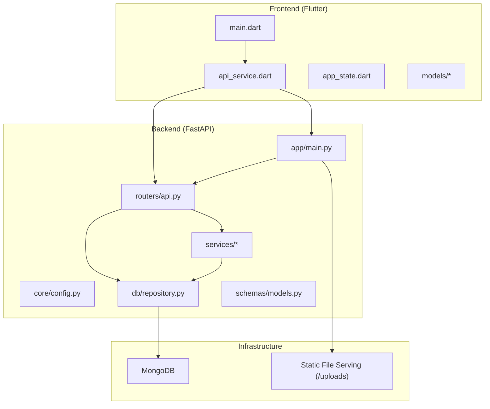
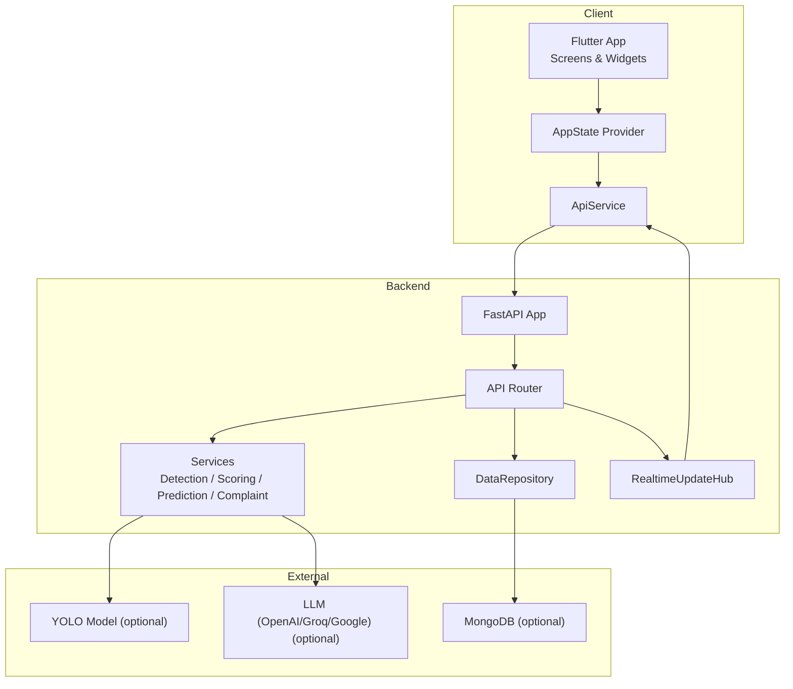
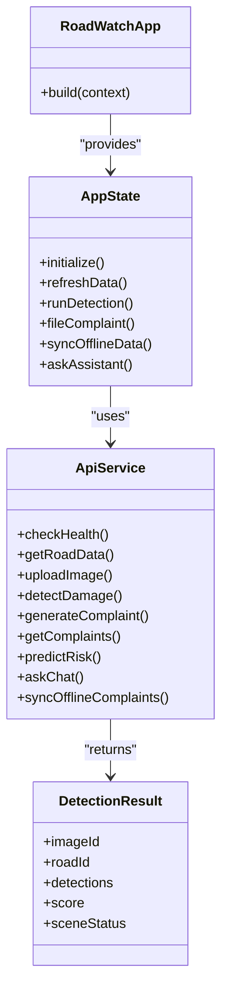
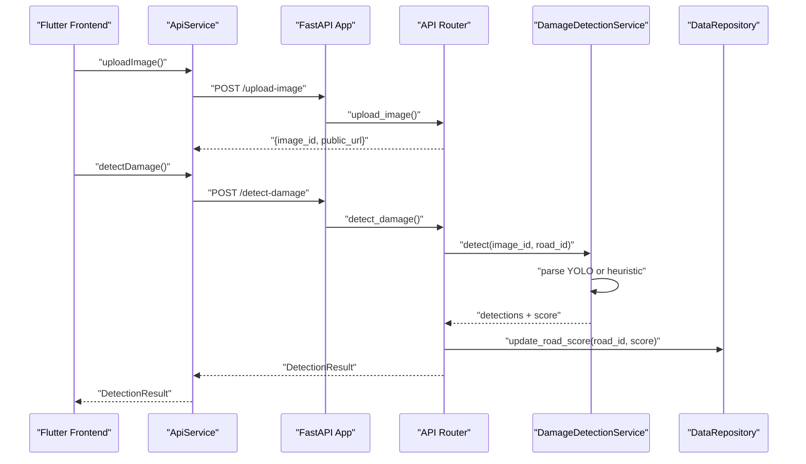
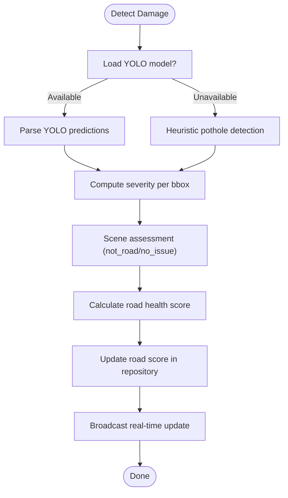
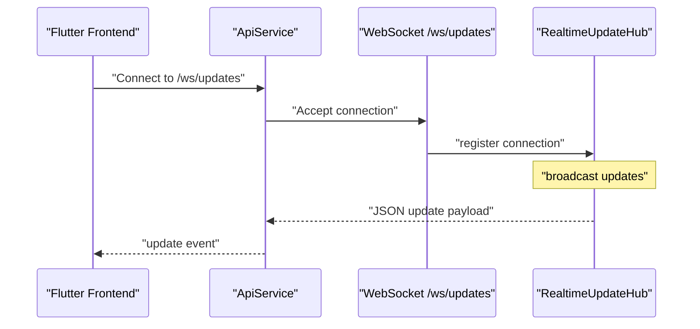
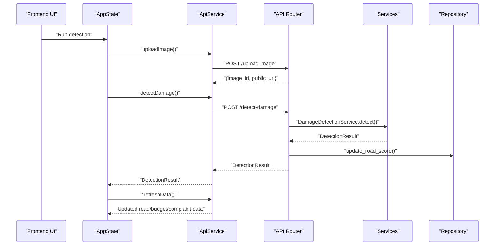
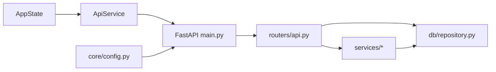
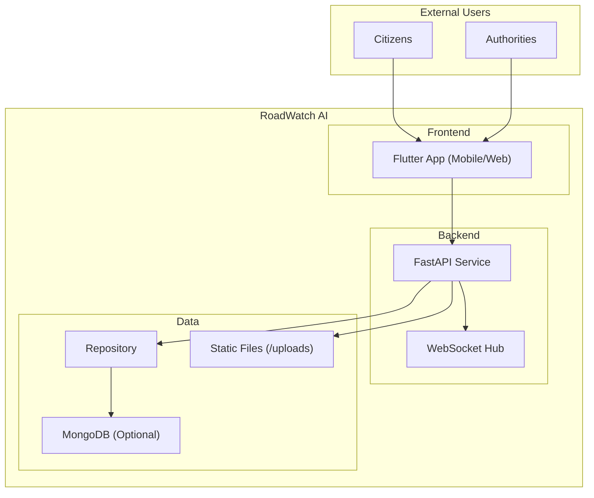

# Architecture Overview

<cite>
**Referenced Files in This Document**
- [README.md](file://README.md)
- [ARCHITECTURE.md](file://docs/ARCHITECTURE.md)
- [docker-compose.yml](file://docker-compose.yml)
- [backend/app/main.py](file://backend/app/main.py)
- [backend/app/routers/api.py](file://backend/app/routers/api.py)
- [backend/app/core/config.py](file://backend/app/core/config.py)
- [backend/app/db/repository.py](file://backend/app/db/repository.py)
- [backend/app/services/detection.py](file://backend/app/services/detection.py)
- [backend/app/services/prediction.py](file://backend/app/services/prediction.py)
- [backend/app/schemas/models.py](file://backend/app/schemas/models.py)
- [frontend/lib/main.dart](file://frontend/lib/main.dart)
- [frontend/lib/services/api_service.dart](file://frontend/lib/services/api_service.dart)
- [frontend/lib/providers/app_state.dart](file://frontend/lib/providers/app_state.dart)
- [frontend/lib/models/detection.dart](file://frontend/lib/models/detection.dart)
</cite>

## Table of Contents
1. [Introduction](#introduction)
2. [Project Structure](#project-structure)
3. [Core Components](#core-components)
4. [Architecture Overview](#architecture-overview)
5. [Detailed Component Analysis](#detailed-component-analysis)
6. [Dependency Analysis](#dependency-analysis)
7. [Performance Considerations](#performance-considerations)
8. [Troubleshooting Guide](#troubleshooting-guide)
9. [Conclusion](#conclusion)
10. [Appendices](#appendices)

## Introduction
This document presents the architecture of the RoadWatch AI system, a smart platform that monitors road infrastructure using AI and public data. It enables citizens to capture road images, detects damage using a YOLO-compatible pipeline, calculates road health scores, predicts risk, files and tracks complaints, and engages with a chatbot assistant. The system supports demo-first behavior, offline operation, and real-time updates via WebSockets.

The system follows a clean architecture pattern with four layers:
- Presentation: Flutter frontend (mobile and web)
- Application: FastAPI backend REST and WebSocket endpoints
- Domain: Business logic for detection, scoring, risk prediction, and complaint workflows
- Infrastructure: Data repository abstraction, static file serving, and optional MongoDB integration

Cross-cutting concerns include:
- Real-time updates via WebSockets
- Offline queue and sync
- Demo fallbacks for robust demo-day behavior
- CORS, gzip compression, and static asset serving

## Project Structure
The repository is organized into three main areas:
- frontend/: Flutter application with screens, services, models, and providers
- backend/: FastAPI service with routers, services, schemas, and data repository
- docs/: Architecture, API reference, setup, and demo materials
- docker-compose.yml: Local deployment topology with backend and MongoDB

**Diagram sources**
- [frontend/lib/main.dart:1-116](file://frontend/lib/main.dart#L1-L116)
- [frontend/lib/services/api_service.dart:1-381](file://frontend/lib/services/api_service.dart#L1-L381)
- [frontend/lib/providers/app_state.dart:1-637](file://frontend/lib/providers/app_state.dart#L1-L637)
- [backend/app/main.py:1-37](file://backend/app/main.py#L1-L37)
- [backend/app/routers/api.py:1-427](file://backend/app/routers/api.py#L1-L427)
- [backend/app/core/config.py:1-40](file://backend/app/core/config.py#L1-L40)
- [backend/app/db/repository.py:1-447](file://backend/app/db/repository.py#L1-L447)

**Section sources**
- [README.md:15-102](file://README.md#L15-L102)
- [docker-compose.yml:1-35](file://docker-compose.yml#L1-L35)

## Core Components
- Flutter Frontend
  - Entry point initializes theme, providers, and routes to the shell screen
  - ApiService encapsulates HTTP calls, retry logic, and demo fallbacks
  - AppState orchestrates state, connectivity, timers, real-time updates, and offline sync
  - Models define typed DTOs for detections, budgets, risks, and complaints

- FastAPI Backend
  - Main app registers middleware (CORS, gzip), static file serving, and includes routers
  - Routers expose REST endpoints for detection, scoring, risk prediction, complaints, transparency, and chat
  - Real-time hub broadcasts WebSocket events to clients
  - Services implement YOLO detection, road health scoring, risk prediction, and complaint workflows
  - Repository abstracts data access with mock JSON datasets and optional MongoDB integration

- Clean Architecture Mapping
  - Presentation: Flutter screens and services
  - Application: FastAPI routers and WebSocket hub
  - Domain: Services implementing detection, scoring, risk prediction, and complaint logic
  - Infrastructure: Repository, static file serving, and database connections

**Section sources**
- [frontend/lib/main.dart:13-116](file://frontend/lib/main.dart#L13-L116)
- [frontend/lib/services/api_service.dart:17-381](file://frontend/lib/services/api_service.dart#L17-L381)
- [frontend/lib/providers/app_state.dart:20-637](file://frontend/lib/providers/app_state.dart#L20-L637)
- [backend/app/main.py:13-37](file://backend/app/main.py#L13-L37)
- [backend/app/routers/api.py:38-132](file://backend/app/routers/api.py#L38-L132)
- [backend/app/services/detection.py:20-319](file://backend/app/services/detection.py#L20-L319)
- [backend/app/services/prediction.py:15-79](file://backend/app/services/prediction.py#L15-L79)
- [backend/app/db/repository.py:31-447](file://backend/app/db/repository.py#L31-L447)

## Architecture Overview
The system’s high-level architecture integrates a Flutter frontend with a FastAPI backend and optional AI/ML services. The backend exposes REST endpoints and a WebSocket endpoint for real-time updates. Data is served from mock JSON datasets by default, with optional MongoDB integration. The frontend supports offline mode and demo-first behavior.

**Diagram sources**
- [frontend/lib/main.dart:17-116](file://frontend/lib/main.dart#L17-L116)
- [frontend/lib/providers/app_state.dart:20-116](file://frontend/lib/providers/app_state.dart#L20-L116)
- [frontend/lib/services/api_service.dart:17-381](file://frontend/lib/services/api_service.dart#L17-L381)
- [backend/app/main.py:13-37](file://backend/app/main.py#L13-L37)
- [backend/app/routers/api.py:38-132](file://backend/app/routers/api.py#L38-L132)
- [backend/app/services/detection.py:20-319](file://backend/app/services/detection.py#L20-L319)
- [backend/app/services/prediction.py:15-79](file://backend/app/services/prediction.py#L15-L79)
- [backend/app/db/repository.py:31-447](file://backend/app/db/repository.py#L31-L447)

## Detailed Component Analysis

### Frontend: Flutter Application
- Entry point initializes theme, providers, and Material app
- AppState manages connectivity, periodic refresh, health checks, real-time socket connection, and offline queues
- ApiService centralizes HTTP calls, retry logic, and demo fallbacks for all backend endpoints
- Models define strongly-typed data contracts for backend responses

**Diagram sources**
- [frontend/lib/main.dart:17-116](file://frontend/lib/main.dart#L17-L116)
- [frontend/lib/providers/app_state.dart:20-637](file://frontend/lib/providers/app_state.dart#L20-L637)
- [frontend/lib/services/api_service.dart:17-381](file://frontend/lib/services/api_service.dart#L17-L381)
- [frontend/lib/models/detection.dart:44-89](file://frontend/lib/models/detection.dart#L44-L89)

**Section sources**
- [frontend/lib/main.dart:13-116](file://frontend/lib/main.dart#L13-L116)
- [frontend/lib/providers/app_state.dart:78-144](file://frontend/lib/providers/app_state.dart#L78-L144)
- [frontend/lib/services/api_service.dart:54-381](file://frontend/lib/services/api_service.dart#L54-L381)
- [frontend/lib/models/detection.dart:1-89](file://frontend/lib/models/detection.dart#L1-L89)

### Backend: FastAPI Service Layer
- Main app sets up CORS, gzip, static file serving, and includes the API router
- Router defines endpoints for detection, scoring, risk prediction, complaints, transparency, chat, and health
- Real-time hub maintains WebSocket connections and broadcasts updates
- Services implement detection (YOLO or heuristic), scoring, risk prediction, and complaint workflows
- Repository abstracts data access with mock datasets and optional MongoDB

**Diagram sources**
- [backend/app/main.py:13-37](file://backend/app/main.py#L13-L37)
- [backend/app/routers/api.py:134-191](file://backend/app/routers/api.py#L134-L191)
- [backend/app/services/detection.py:36-94](file://backend/app/services/detection.py#L36-L94)
- [backend/app/db/repository.py:113-134](file://backend/app/db/repository.py#L113-L134)

**Section sources**
- [backend/app/main.py:13-37](file://backend/app/main.py#L13-L37)
- [backend/app/routers/api.py:134-191](file://backend/app/routers/api.py#L134-L191)
- [backend/app/services/detection.py:20-319](file://backend/app/services/detection.py#L20-L319)
- [backend/app/db/repository.py:31-134](file://backend/app/db/repository.py#L31-L134)

### AI/ML Processing Components
- Damage Detection Service
  - Attempts to load a YOLO model; falls back to synthetic/heuristic detection if unavailable
  - Parses YOLO results and computes severity and scene assessment
- Risk Prediction Service
  - Uses scikit-learn RandomForest if available; otherwise applies heuristic formula
- Scoring Engine
  - Computes road health score from detections and blends with existing road score

**Diagram sources**
- [backend/app/services/detection.py:28-94](file://backend/app/services/detection.py#L28-L94)
- [backend/app/services/detection.py:264-319](file://backend/app/services/detection.py#L264-L319)
- [backend/app/db/repository.py:113-134](file://backend/app/db/repository.py#L113-L134)
- [backend/app/routers/api.py:101-120](file://backend/app/routers/api.py#L101-L120)

**Section sources**
- [backend/app/services/detection.py:20-319](file://backend/app/services/detection.py#L20-L319)
- [backend/app/services/prediction.py:15-79](file://backend/app/services/prediction.py#L15-L79)
- [backend/app/db/repository.py:113-134](file://backend/app/db/repository.py#L113-L134)

### Real-Time Communication via WebSockets
- WebSocket endpoint accepts connections and broadcasts updates to clients
- Events include detection results, complaint previews/generations, and offline sync outcomes
- Clients subscribe to updates and apply incremental state changes

**Diagram sources**
- [backend/app/routers/api.py:122-132](file://backend/app/routers/api.py#L122-L132)
- [backend/app/routers/api.py:38-60](file://backend/app/routers/api.py#L38-L60)
- [frontend/lib/providers/app_state.dart:92-102](file://frontend/lib/providers/app_state.dart#L92-L102)

**Section sources**
- [backend/app/routers/api.py:38-132](file://backend/app/routers/api.py#L38-L132)
- [frontend/lib/providers/app_state.dart:92-102](file://frontend/lib/providers/app_state.dart#L92-L102)

### Data Flow Between Frontend and Backend
- Upload image → Detect damage → Calculate score → Update road score → Broadcast real-time update
- File complaint → Preview broadcast → Generate complaint → Update state and road data
- Transparency queries → Compare expected vs actual scores → Highlight mismatches
- Offline mode → Queue actions locally → Sync on reconnect → Batch process

**Diagram sources**
- [frontend/lib/providers/app_state.dart:416-454](file://frontend/lib/providers/app_state.dart#L416-L454)
- [frontend/lib/services/api_service.dart:127-216](file://frontend/lib/services/api_service.dart#L127-L216)
- [backend/app/routers/api.py:164-191](file://backend/app/routers/api.py#L164-L191)
- [backend/app/services/detection.py:36-94](file://backend/app/services/detection.py#L36-L94)
- [backend/app/db/repository.py:113-134](file://backend/app/db/repository.py#L113-L134)

**Section sources**
- [frontend/lib/providers/app_state.dart:416-585](file://frontend/lib/providers/app_state.dart#L416-L585)
- [frontend/lib/services/api_service.dart:127-216](file://frontend/lib/services/api_service.dart#L127-L216)
- [backend/app/routers/api.py:164-191](file://backend/app/routers/api.py#L164-L191)

### Cross-Cutting Concerns
- Real-time updates: WebSocket hub and client subscription
- Offline functionality: Local storage queues for detections and complaints; sync on reconnect
- Demo-first behavior: Deterministic demo payloads and fallbacks when backend or models are unavailable
- Security and production hardening: CORS, gzip, health endpoints, and environment-driven configuration

**Section sources**
- [frontend/lib/providers/app_state.dart:544-585](file://frontend/lib/providers/app_state.dart#L544-L585)
- [frontend/lib/services/api_service.dart:127-168](file://frontend/lib/services/api_service.dart#L127-L168)
- [backend/app/main.py:22-31](file://backend/app/main.py#L22-L31)
- [backend/app/core/config.py:10-40](file://backend/app/core/config.py#L10-L40)

## Dependency Analysis
The frontend depends on ApiService for all HTTP interactions and AppState for state orchestration. The backend composes services and repository abstractions. Optional integrations include YOLO for detection and LLMs for chatbot assistance.

**Diagram sources**
- [frontend/lib/services/api_service.dart:17-381](file://frontend/lib/services/api_service.dart#L17-L381)
- [frontend/lib/providers/app_state.dart:20-637](file://frontend/lib/providers/app_state.dart#L20-L637)
- [backend/app/main.py:13-37](file://backend/app/main.py#L13-L37)
- [backend/app/routers/api.py:1-427](file://backend/app/routers/api.py#L1-L427)
- [backend/app/core/config.py:10-40](file://backend/app/core/config.py#L10-L40)
- [backend/app/db/repository.py:31-447](file://backend/app/db/repository.py#L31-L447)

**Section sources**
- [backend/app/routers/api.py:1-427](file://backend/app/routers/api.py#L1-L427)
- [backend/app/db/repository.py:31-447](file://backend/app/db/repository.py#L31-L447)

## Performance Considerations
- Gzip compression reduces payload sizes for REST responses
- Static file serving avoids extra processing for uploaded images
- Demo mode and fallbacks prevent backend bottlenecks during demos
- Periodic refresh and health checks balance responsiveness with resource usage
- WebSocket broadcasting is optimized to skip disconnected clients

[No sources needed since this section provides general guidance]

## Troubleshooting Guide
- Health endpoint: Verify backend availability and dataset counts
- CORS errors: Confirm frontend origin matches backend configuration
- Image uploads: Ensure content-type is supported and uploads directory is writable
- Real-time updates: Check WebSocket connection status and hub registration
- Offline sync: Confirm local storage queues and retry logic

**Section sources**
- [backend/app/routers/api.py:66-75](file://backend/app/routers/api.py#L66-L75)
- [backend/app/main.py:22-28](file://backend/app/main.py#L22-L28)
- [backend/app/routers/api.py:134-162](file://backend/app/routers/api.py#L134-L162)
- [frontend/lib/providers/app_state.dart:92-102](file://frontend/lib/providers/app_state.dart#L92-L102)
- [frontend/lib/providers/app_state.dart:544-585](file://frontend/lib/providers/app_state.dart#L544-L585)

## Conclusion
RoadWatch AI demonstrates a clean, layered architecture that separates presentation, application, domain, and infrastructure concerns. The Flutter frontend delivers a responsive, demo-friendly experience with offline capabilities and real-time updates. The FastAPI backend provides a cohesive service layer with optional AI/ML integrations and robust fallbacks. The system is designed for easy deployment, extensibility, and production hardening.

[No sources needed since this section summarizes without analyzing specific files]

## Appendices

### System Context Diagram

**Diagram sources**
- [frontend/lib/main.dart:17-116](file://frontend/lib/main.dart#L17-L116)
- [backend/app/main.py:13-37](file://backend/app/main.py#L13-L37)
- [backend/app/routers/api.py:38-132](file://backend/app/routers/api.py#L38-L132)
- [backend/app/db/repository.py:31-447](file://backend/app/db/repository.py#L31-L447)

### Deployment Topology
- Local development uses docker-compose to run backend and MongoDB
- Environment variables configure app name, demo mode, API host/port, frontend origin, and database URIs
- Static file serving exposes uploaded images for frontend display

**Section sources**
- [docker-compose.yml:1-35](file://docker-compose.yml#L1-L35)
- [backend/app/main.py:33-34](file://backend/app/main.py#L33-L34)
- [backend/app/core/config.py:10-40](file://backend/app/core/config.py#L10-L40)