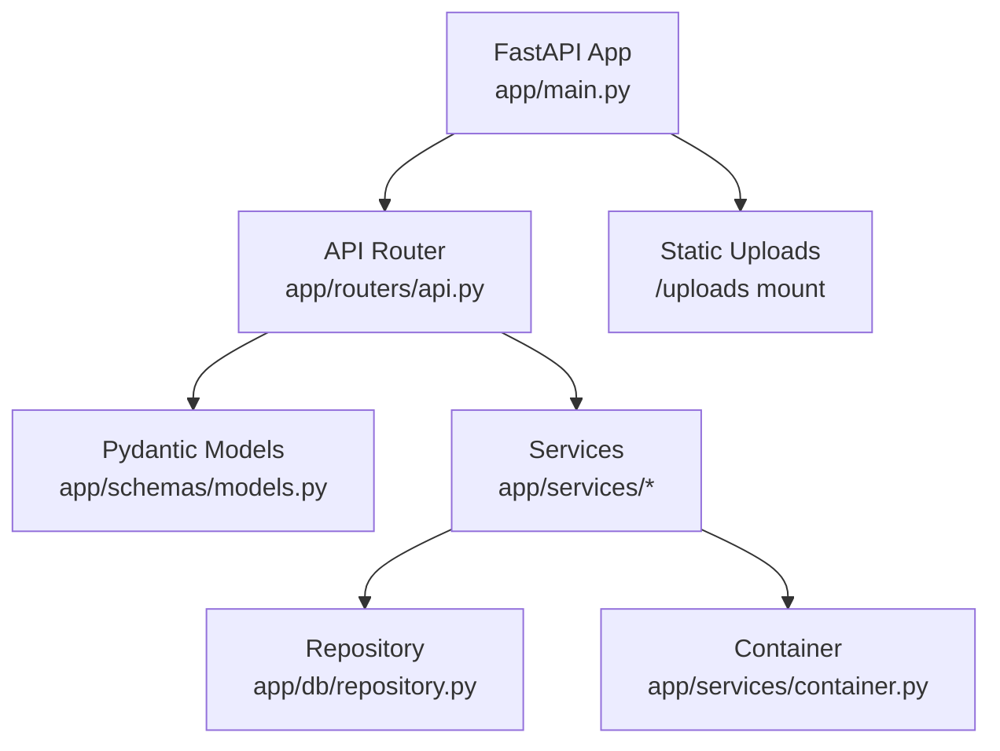
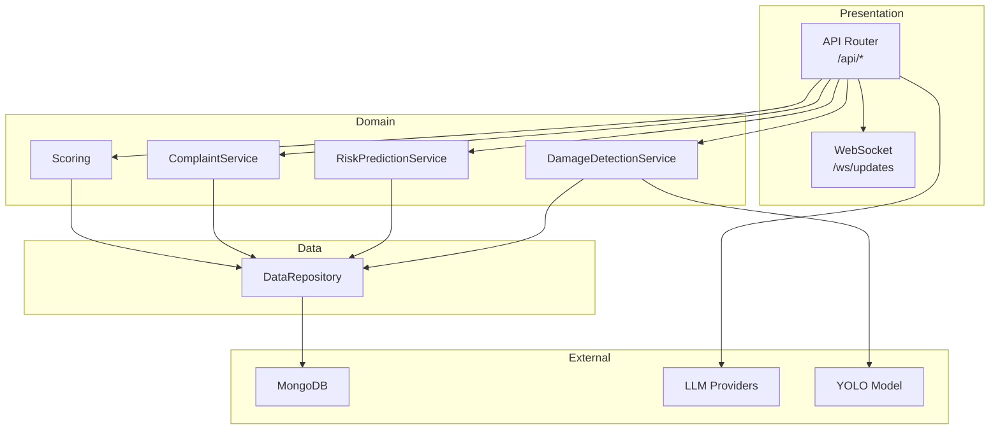
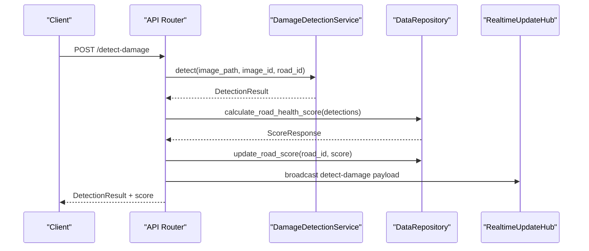
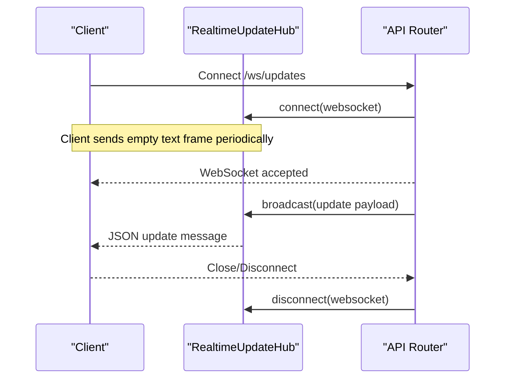
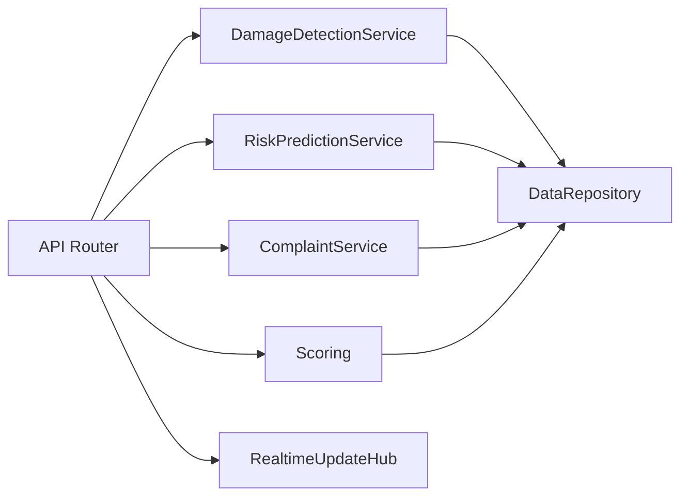

# Backend API Reference

<cite>
**Referenced Files in This Document**
- [main.py](file://roadwatch_ai/backend/app/main.py)
- [api.py](file://roadwatch_ai/backend/app/routers/api.py)
- [models.py](file://roadwatch_ai/backend/app/schemas/models.py)
- [detection.py](file://roadwatch_ai/backend/app/services/detection.py)
- [scoring.py](file://roadwatch_ai/backend/app/services/scoring.py)
- [prediction.py](file://roadwatch_ai/backend/app/services/prediction.py)
- [complaint.py](file://roadwatch_ai/backend/app/services/complaint.py)
- [repository.py](file://roadwatch_ai/backend/app/db/repository.py)
- [config.py](file://roadwatch_ai/backend/app/core/config.py)
- [container.py](file://roadwatch_ai/backend/app/services/container.py)
- [API_REFERENCE.md](file://roadwatch_ai/docs/API_REFERENCE.md)
- [requirements.txt](file://roadwatch_ai/backend/requirements.txt)
- [test_api_smoke.py](file://roadwatch_ai/backend/tests/test_api_smoke.py)
</cite>

## Table of Contents
1. [Introduction](#introduction)
2. [Project Structure](#project-structure)
3. [Core Components](#core-components)
4. [Architecture Overview](#architecture-overview)
5. [Detailed Component Analysis](#detailed-component-analysis)
6. [Dependency Analysis](#dependency-analysis)
7. [Performance Considerations](#performance-considerations)
8. [Troubleshooting Guide](#troubleshooting-guide)
9. [Conclusion](#conclusion)
10. [Appendices](#appendices)

## Introduction
This document provides comprehensive API documentation for the RoadWatch AI backend. It covers all REST endpoints specified in the objective, including POST /upload-image, POST /detect-damage, POST /calculate-score, POST /generate-complaint, GET /get-road-data, GET /get-budget-data, and POST /predict-risk. It also documents the WebSocket endpoint /ws/updates for real-time updates. For each endpoint, you will find HTTP method, URL pattern, request/response schemas using Pydantic models, authentication requirements, error handling, examples, parameter validation rules, status codes, and rate limiting considerations. Additionally, it includes client implementation guidelines, authentication patterns, integration examples, API versioning, backward compatibility, and deprecation policies.

## Project Structure
The backend is built with FastAPI and organized into modular components:
- Application entrypoint initializes the ASGI app, middleware, static file serving, and includes the API router.
- Routers define REST endpoints and WebSocket handlers.
- Schemas define request/response models using Pydantic.
- Services encapsulate business logic for detection, scoring, risk prediction, complaint generation, and chatbot.
- Repository abstracts data access and provides mock data plus optional MongoDB integration.
- Container manages dependency injection for services and repositories.
- Core configuration loads environment variables and settings.

**Diagram sources**
- [main.py:13-36](file://roadwatch_ai/backend/app/main.py#L13-L36)
- [api.py:33-427](file://roadwatch_ai/backend/app/routers/api.py#L33-L427)
- [models.py:1-177](file://roadwatch_ai/backend/app/schemas/models.py#L1-L177)
- [repository.py:31-447](file://roadwatch_ai/backend/app/db/repository.py#L31-L447)
- [container.py:11-37](file://roadwatch_ai/backend/app/services/container.py#L11-L37)

**Section sources**
- [main.py:1-37](file://roadwatch_ai/backend/app/main.py#L1-L37)
- [api.py:1-427](file://roadwatch_ai/backend/app/routers/api.py#L1-L427)
- [models.py:1-177](file://roadwatch_ai/backend/app/schemas/models.py#L1-L177)
- [repository.py:1-447](file://roadwatch_ai/backend/app/db/repository.py#L1-L447)
- [container.py:1-37](file://roadwatch_ai/backend/app/services/container.py#L1-L37)

## Core Components
- FastAPI App: Initializes CORS, gzip compression, static uploads, and includes the API router.
- API Router: Defines REST endpoints and WebSocket handler, orchestrates service calls, and publishes real-time updates.
- Pydantic Models: Define strict request/response schemas for all endpoints.
- Services:
  - DamageDetectionService: Performs road damage detection with fallbacks.
  - RiskPredictionService: Predicts road risk using ML or heuristic fallback.
  - ComplaintService: Generates and routes complaints.
  - Scoring: Computes road health score from detections.
- Repository: Provides mock datasets and optional MongoDB integration; supports pagination and spatial queries.
- Container: Provides dependency injection for services and repositories.

**Section sources**
- [main.py:13-36](file://roadwatch_ai/backend/app/main.py#L13-L36)
- [api.py:33-427](file://roadwatch_ai/backend/app/routers/api.py#L33-L427)
- [models.py:14-177](file://roadwatch_ai/backend/app/schemas/models.py#L14-L177)
- [detection.py:20-319](file://roadwatch_ai/backend/app/services/detection.py#L20-L319)
- [prediction.py:15-79](file://roadwatch_ai/backend/app/services/prediction.py#L15-L79)
- [complaint.py:8-94](file://roadwatch_ai/backend/app/services/complaint.py#L8-L94)
- [scoring.py:19-36](file://roadwatch_ai/backend/app/services/scoring.py#L19-L36)
- [repository.py:31-447](file://roadwatch_ai/backend/app/db/repository.py#L31-L447)
- [container.py:11-37](file://roadwatch_ai/backend/app/services/container.py#L11-L37)

## Architecture Overview
The API follows a layered architecture:
- Presentation Layer: FastAPI router exposes endpoints and WebSocket.
- Domain Layer: Services encapsulate business logic.
- Data Access Layer: Repository abstracts data sources and provides pagination and filtering.
- External Integrations: Optional MongoDB, LLM providers, and image processing libraries.

**Diagram sources**
- [api.py:33-427](file://roadwatch_ai/backend/app/routers/api.py#L33-L427)
- [detection.py:20-319](file://roadwatch_ai/backend/app/services/detection.py#L20-L319)
- [prediction.py:15-79](file://roadwatch_ai/backend/app/services/prediction.py#L15-L79)
- [complaint.py:8-94](file://roadwatch_ai/backend/app/services/complaint.py#L8-L94)
- [scoring.py:19-36](file://roadwatch_ai/backend/app/services/scoring.py#L19-L36)
- [repository.py:31-447](file://roadwatch_ai/backend/app/db/repository.py#L31-L447)

## Detailed Component Analysis

### Authentication and Authorization
- No authentication middleware is configured in the application. All endpoints are public.
- Production hardening guidance recommends adding JWT authentication for citizens and admins.

**Section sources**
- [main.py:22-28](file://roadwatch_ai/backend/app/main.py#L22-L28)
- [config.py:10-39](file://roadwatch_ai/backend/app/core/config.py#L10-L39)
- [ARCHITECTURE.md:58-66](file://roadwatch_ai/docs/ARCHITECTURE.md#L58-L66)

### Rate Limiting
- No rate limiting middleware is configured. Production deployments should implement rate limiting and abuse controls.

**Section sources**
- [main.py:30](file://roadwatch_ai/backend/app/main.py#L30)
- [ARCHITECTURE.md:58-66](file://roadwatch_ai/docs/ARCHITECTURE.md#L58-L66)

### API Versioning and Compatibility
- The application sets a version field in the FastAPI app metadata.
- No explicit API versioning strategy is implemented in the router. Backward compatibility should be maintained by preserving request/response shapes and avoiding breaking changes.

**Section sources**
- [main.py:15](file://roadwatch_ai/backend/app/main.py#L15)
- [API_REFERENCE.md:3](file://roadwatch_ai/docs/API_REFERENCE.md#L3)

### Endpoint Catalog

#### POST /upload-image
- Purpose: Upload an image file and return metadata for later processing.
- Request:
  - Method: POST
  - URL: /upload-image
  - Content-Type: multipart/form-data
  - Form fields:
    - file (required): image/jpeg, image/png, image/jpg, image/webp, image/svg+xml, application/octet-stream
    - road_id (optional): string
- Response:
  - JSON object containing image_id, road_id, size_bytes, stored_at, and public_url
- Validation:
  - Only allowed content types are accepted; otherwise 400 Bad Request
- Status Codes:
  - 200 OK on success
  - 400 Bad Request for unsupported content type
- Example:
  - See [API_REFERENCE.md:5-23](file://roadwatch_ai/docs/API_REFERENCE.md#L5-L23)

**Section sources**
- [api.py:134-162](file://roadwatch_ai/backend/app/routers/api.py#L134-L162)
- [API_REFERENCE.md:5-23](file://roadwatch_ai/docs/API_REFERENCE.md#L5-L23)

#### POST /detect-damage
- Purpose: Run damage detection on an uploaded image and compute road health score.
- Request:
  - Method: POST
  - URL: /detect-damage
  - Body: DetectionRequest
- Response:
  - DetectionResult with detections, model name, inference time, and score
- Validation:
  - Uses Pydantic model for request body
- Side Effects:
  - Updates road score in repository if road_id provided
  - Publishes real-time update event
- Status Codes:
  - 200 OK on success
  - 422 Unprocessable Entity for invalid request schema
- Example:
  - See [API_REFERENCE.md:25-60](file://roadwatch_ai/docs/API_REFERENCE.md#L25-L60)

**Diagram sources**
- [api.py:164-190](file://roadwatch_ai/backend/app/routers/api.py#L164-L190)
- [detection.py:36-93](file://roadwatch_ai/backend/app/services/detection.py#L36-L93)
- [scoring.py:19-36](file://roadwatch_ai/backend/app/services/scoring.py#L19-L36)
- [repository.py:113-134](file://roadwatch_ai/backend/app/db/repository.py#L113-L134)

**Section sources**
- [api.py:164-190](file://roadwatch_ai/backend/app/routers/api.py#L164-L190)
- [models.py:36-51](file://roadwatch_ai/backend/app/schemas/models.py#L36-L51)
- [detection.py:36-93](file://roadwatch_ai/backend/app/services/detection.py#L36-L93)
- [scoring.py:19-36](file://roadwatch_ai/backend/app/services/scoring.py#L19-L36)
- [repository.py:113-134](file://roadwatch_ai/backend/app/db/repository.py#L113-L134)

#### POST /calculate-score
- Purpose: Compute road health score from a list of detections.
- Request:
  - Method: POST
  - URL: /calculate-score
  - Body: ScoreRequest
- Response:
  - ScoreResponse
- Validation:
  - Uses Pydantic model for request body
- Status Codes:
  - 200 OK on success
  - 422 Unprocessable Entity for invalid request schema

**Section sources**
- [api.py:193-196](file://roadwatch_ai/backend/app/routers/api.py#L193-L196)
- [models.py:43-51](file://roadwatch_ai/backend/app/schemas/models.py#L43-L51)
- [scoring.py:19-36](file://roadwatch_ai/backend/app/services/scoring.py#L19-L36)

#### POST /generate-complaint
- Purpose: Generate a complaint for a road issue and publish a real-time preview.
- Request:
  - Method: POST
  - URL: /generate-complaint
  - Body: ComplaintCreateRequest
- Response:
  - Complaint with timeline, routing info, and submission status
- Validation:
  - Uses Pydantic model for request body
- Side Effects:
  - Publishes real-time preview event, then a final event
- Status Codes:
  - 200 OK on success
  - 422 Unprocessable Entity for invalid request schema

**Section sources**
- [api.py:198-247](file://roadwatch_ai/backend/app/routers/api.py#L198-L247)
- [models.py:118-123](file://roadwatch_ai/backend/app/schemas/models.py#L118-L123)
- [complaint.py:12-32](file://roadwatch_ai/backend/app/services/complaint.py#L12-L32)
- [repository.py:236-282](file://roadwatch_ai/backend/app/db/repository.py#L236-L282)

#### GET /get-road-data
- Purpose: Retrieve road overview, roads list, recent complaints, intelligence snapshot, or detailed data for a specific road.
- Request:
  - Method: GET
  - URL: /get-road-data
  - Query parameters:
    - road_id (optional): string
- Response:
  - Without road_id: overview, roads, recent_complaints, intelligence
  - With road_id: road, budget, complaints, nearby_network
- Validation:
  - Returns 404 Not Found if road_id is specified but road not found
- Status Codes:
  - 200 OK on success
  - 404 Not Found if road not found

**Section sources**
- [api.py:250-276](file://roadwatch_ai/backend/app/routers/api.py#L250-L276)
- [repository.py:102-111](file://roadwatch_ai/backend/app/db/repository.py#L102-L111)

#### GET /get-budget-data
- Purpose: Retrieve paginated budget records or a specific budget record by road_id.
- Request:
  - Method: GET
  - URL: /get-budget-data
  - Query parameters:
    - road_id (optional): string
    - page (optional, default 1): integer ≥ 1
    - limit (optional, default 50): integer ≥ 1 and ≤ 200
- Response:
  - If road_id provided: single budget record
  - Otherwise: list of budget records (paginated)
- Validation:
  - Returns 404 Not Found if road_id provided but budget record not found
- Status Codes:
  - 200 OK on success
  - 404 Not Found if budget record not found

**Section sources**
- [api.py:279-291](file://roadwatch_ai/backend/app/routers/api.py#L279-L291)
- [repository.py:162-168](file://roadwatch_ai/backend/app/db/repository.py#L162-L168)

#### POST /predict-risk
- Purpose: Predict road risk level and decline timeline based on weather, traffic, and complaint metrics.
- Request:
  - Method: POST
  - URL: /predict-risk
  - Body: RiskRequest
- Response:
  - RiskResponse with risk_level, probability_of_deterioration, predicted_days_to_decline
- Validation:
  - Uses Pydantic model for request body
- Fallback:
  - If ML model unavailable, uses heuristic calculation
- Status Codes:
  - 200 OK on success
  - 422 Unprocessable Entity for invalid request schema

**Section sources**
- [api.py:335-345](file://roadwatch_ai/backend/app/routers/api.py#L335-L345)
- [models.py:125-137](file://roadwatch_ai/backend/app/schemas/models.py#L125-L137)
- [prediction.py:42-79](file://roadwatch_ai/backend/app/services/prediction.py#L42-L79)

#### WebSocket /ws/updates
- Purpose: Real-time updates for detect-damage, generate-complaint, and sync-offline events.
- Protocol: Text frames; server broadcasts JSON payloads to connected clients.
- Events:
  - detect-damage
  - generate-complaint-preview
  - generate-complaint
  - sync-offline
- Behavior:
  - Accepts connections and maintains a hub of active connections
  - Broadcasts structured messages with type, event, timestamp, and payload-specific fields
  - Gracefully handles disconnects and exceptions

**Diagram sources**
- [api.py:122-132](file://roadwatch_ai/backend/app/routers/api.py#L122-L132)
- [api.py:38-58](file://roadwatch_ai/backend/app/routers/api.py#L38-L58)

**Section sources**
- [api.py:122-132](file://roadwatch_ai/backend/app/routers/api.py#L122-L132)
- [api.py:38-58](file://roadwatch_ai/backend/app/routers/api.py#L38-L58)

### Request/Response Schemas (Pydantic)
Key models used across endpoints:
- DetectionRequest: image_id, road_id
- DetectionResult: image_id, road_id, detections, model, inference_ms
- ScoreRequest: detections
- ScoreResponse: road_health_score, severity_breakdown, color
- ComplaintCreateRequest: road_id, description, image_ref, location
- Complaint: complaint fields including timeline
- RiskRequest: road_id, weather_index, traffic_index, complaint_count_30d
- RiskResponse: risk_level, probability_of_deterioration, predicted_days_to_decline
- Coordinate: lat, lng
- HealthOverview, RoadDetailResponse, ApiInfoResponse: overview and metadata

Validation rules:
- Severity: "low" | "medium" | "high"
- ComplaintStatus: "Filed" | "Sent" | "Delivered" | "Read" | "In Progress" | "Resolved"
- RiskLevel: "Low" | "Medium" | "High"
- DetectionBox: label ∈ {"pothole","crack"}, confidence ∈ [0,1], bbox length 4
- RiskRequest: weather_index ∈ [0,1], traffic_index ∈ [0,1], complaint_count_30d ≥ 0
- Pagination: page ≥ 1, limit ∈ [1..200]

**Section sources**
- [models.py:9-177](file://roadwatch_ai/backend/app/schemas/models.py#L9-L177)

### Error Handling
- HTTPException is raised for:
  - Unsupported content type in /upload-image
  - Not found errors for roads and budget records
- Safe error messages are truncated to avoid leaking internal details.
- Chat endpoint returns a safe response on failure.

**Section sources**
- [api.py:144-147](file://roadwatch_ai/backend/app/routers/api.py#L144-L147)
- [api.py:257-258](file://roadwatch_ai/backend/app/routers/api.py#L257-L258)
- [api.py:288-289](file://roadwatch_ai/backend/app/routers/api.py#L288-L289)
- [api.py:96-98](file://roadwatch_ai/backend/app/routers/api.py#L96-L98)
- [api.py:360-365](file://roadwatch_ai/backend/app/routers/api.py#L360-L365)

### Client Implementation Guidelines
- Base URL: http://localhost:8000 (adjust per deployment)
- Upload image using multipart/form-data with field file and optional road_id.
- For detect-damage, send DetectionRequest JSON.
- For calculate-score, send ScoreRequest JSON.
- For generate-complaint, send ComplaintCreateRequest JSON.
- For get-road-data and get-budget-data, use query parameters as documented.
- For predict-risk, send RiskRequest JSON.
- Subscribe to /ws/updates for real-time notifications.

**Section sources**
- [API_REFERENCE.md:3-145](file://roadwatch_ai/docs/API_REFERENCE.md#L3-L145)

### Integration Examples
- Smoke tests demonstrate typical usage patterns for health checks, road data retrieval, damage detection, complaint generation, risk prediction, and pagination.

**Section sources**
- [test_api_smoke.py:9-122](file://roadwatch_ai/backend/tests/test_api_smoke.py#L9-L122)

## Dependency Analysis
The API router depends on services and repository for business logic, and publishes real-time updates via a hub. Services depend on repository for data access and optionally on external libraries for ML/image processing.

**Diagram sources**
- [api.py:33-427](file://roadwatch_ai/backend/app/routers/api.py#L33-L427)
- [detection.py:20-319](file://roadwatch_ai/backend/app/services/detection.py#L20-L319)
- [prediction.py:15-79](file://roadwatch_ai/backend/app/services/prediction.py#L15-L79)
- [complaint.py:8-94](file://roadwatch_ai/backend/app/services/complaint.py#L8-L94)
- [scoring.py:19-36](file://roadwatch_ai/backend/app/services/scoring.py#L19-L36)
- [repository.py:31-447](file://roadwatch_ai/backend/app/db/repository.py#L31-L447)

**Section sources**
- [api.py:33-427](file://roadwatch_ai/backend/app/routers/api.py#L33-L427)
- [container.py:11-37](file://roadwatch_ai/backend/app/services/container.py#L11-L37)

## Performance Considerations
- GZip compression is enabled for responses larger than 1000 bytes.
- Static uploads are served efficiently via mounted directory.
- Image processing and ML inference may be CPU-bound; consider scaling horizontally and caching results where appropriate.
- Real-time broadcasting iterates over connections; monitor connection counts in production.

**Section sources**
- [main.py:30](file://roadwatch_ai/backend/app/main.py#L30)
- [main.py:33-34](file://roadwatch_ai/backend/app/main.py#L33-L34)

## Troubleshooting Guide
- Health check: GET /health returns uptime and dataset counts.
- API info: GET /api-info returns version, demo mode, dataset counts, and model info.
- If detect-damage fails, verify image_id exists or use a demo image; check repository.get_demo_detections.
- If predict-risk returns heuristic values, ensure training data is available in repository.
- For complaints, verify routing logic and that repository.add_complaint succeeds.

**Section sources**
- [api.py:66-75](file://roadwatch_ai/backend/app/routers/api.py#L66-L75)
- [api.py:78-93](file://roadwatch_ai/backend/app/routers/api.py#L78-L93)
- [detection.py:46-60](file://roadwatch_ai/backend/app/services/detection.py#L46-L60)
- [prediction.py:21-41](file://roadwatch_ai/backend/app/services/prediction.py#L21-L41)
- [repository.py:236-282](file://roadwatch_ai/backend/app/db/repository.py#L236-L282)

## Conclusion
This API provides a robust foundation for road damage detection, scoring, complaint automation, budget insights, and risk prediction, with real-time updates via WebSocket. While currently unauthenticated and without rate limiting, the codebase is structured to support production hardening, including JWT authentication, rate limiting, and scalable data backends.

## Appendices

### API Endpoints Summary
- POST /upload-image: Upload image, return metadata
- POST /detect-damage: Run detection, compute score, publish updates
- POST /calculate-score: Compute score from detections
- POST /generate-complaint: Create complaint, publish preview and final
- GET /get-road-data: Overview or detailed road data
- GET /get-budget-data: Paginated budget records or specific record
- POST /predict-risk: Predict risk level and decline timeline
- WebSocket /ws/updates: Real-time event streaming

**Section sources**
- [api.py:134-162](file://roadwatch_ai/backend/app/routers/api.py#L134-L162)
- [api.py:164-190](file://roadwatch_ai/backend/app/routers/api.py#L164-L190)
- [api.py:193-196](file://roadwatch_ai/backend/app/routers/api.py#L193-L196)
- [api.py:198-247](file://roadwatch_ai/backend/app/routers/api.py#L198-L247)
- [api.py:250-276](file://roadwatch_ai/backend/app/routers/api.py#L250-L276)
- [api.py:279-291](file://roadwatch_ai/backend/app/routers/api.py#L279-L291)
- [api.py:335-345](file://roadwatch_ai/backend/app/routers/api.py#L335-L345)
- [api.py:122-132](file://roadwatch_ai/backend/app/routers/api.py#L122-L132)

### Dependencies
- FastAPI, Uvicorn, Pydantic, NumPy, scikit-learn, Pillow, Ultralytics, PyMongo/Motor, OpenAI/Groq/Google Generative AI.

**Section sources**
- [requirements.txt:1-18](file://roadwatch_ai/backend/requirements.txt#L1-L18)