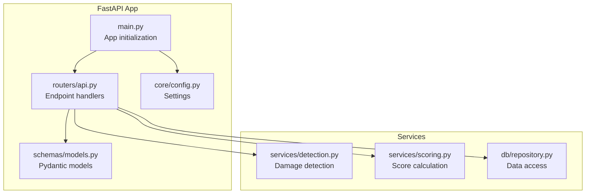
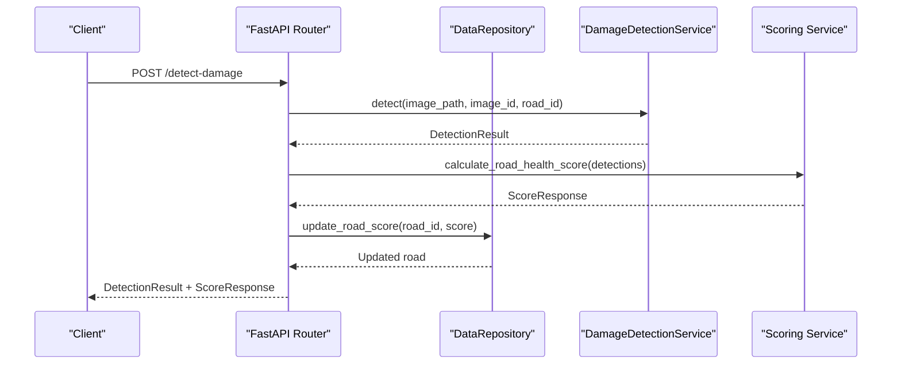
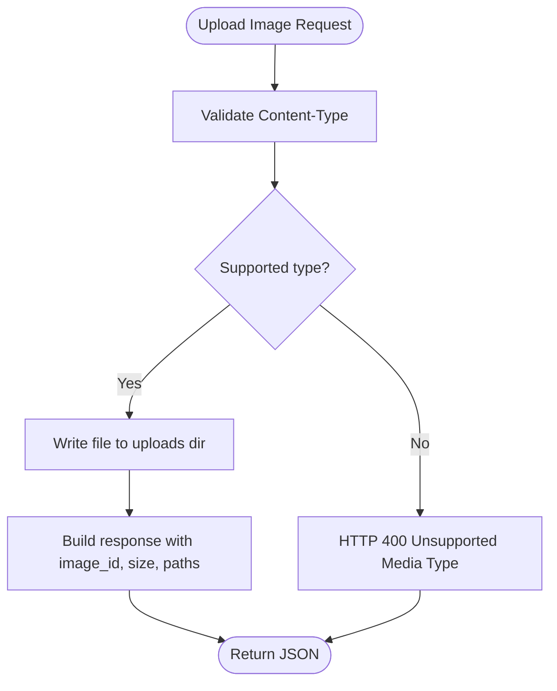
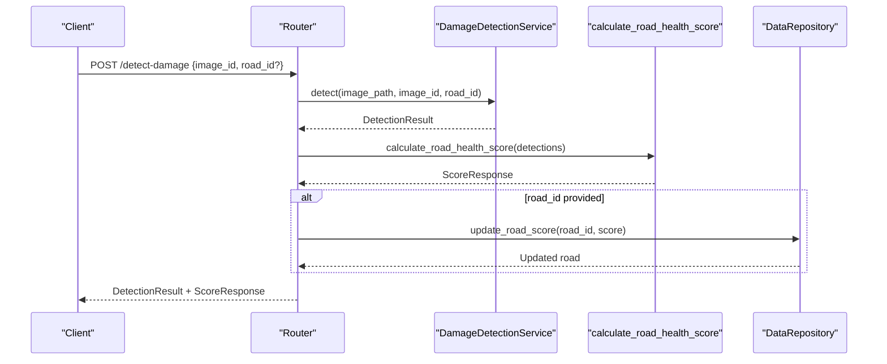
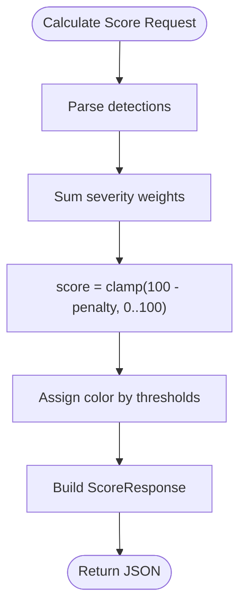
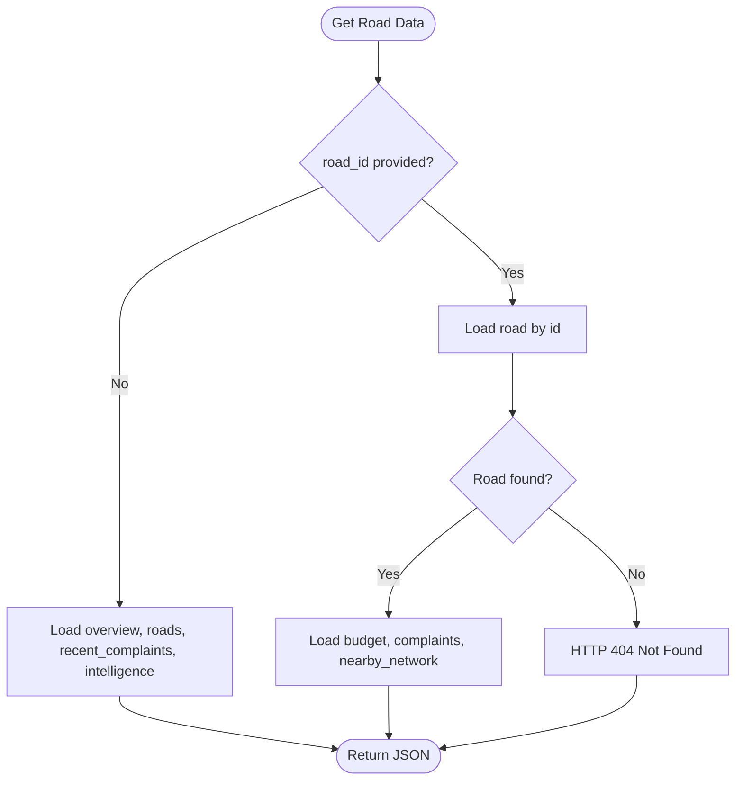
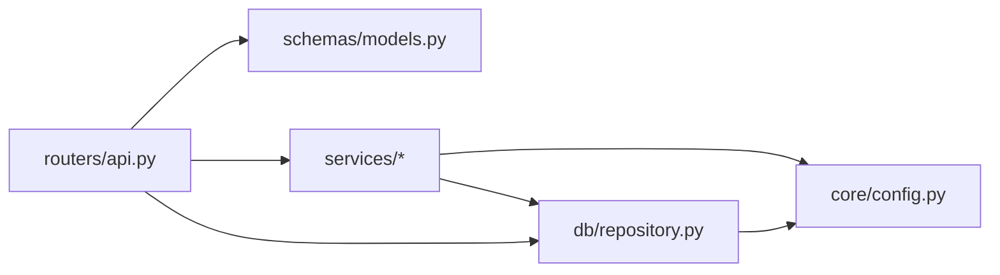

# Core Endpoints

<cite>
**Referenced Files in This Document**
- [main.py](file://roadwatch_ai/backend/app/main.py)
- [api.py](file://roadwatch_ai/backend/app/routers/api.py)
- [models.py](file://roadwatch_ai/backend/app/schemas/models.py)
- [detection.py](file://roadwatch_ai/backend/app/services/detection.py)
- [scoring.py](file://roadwatch_ai/backend/app/services/scoring.py)
- [repository.py](file://roadwatch_ai/backend/app/db/repository.py)
- [config.py](file://roadwatch_ai/backend/app/core/config.py)
- [API_REFERENCE.md](file://roadwatch_ai/docs/API_REFERENCE.md)
- [test_api_smoke.py](file://roadwatch_ai/backend/tests/test_api_smoke.py)
- [api_service.dart](file://roadwatch_ai/frontend/lib/services/api_service.dart)
</cite>

## Table of Contents
1. [Introduction](#introduction)
2. [Project Structure](#project-structure)
3. [Core Components](#core-components)
4. [Architecture Overview](#architecture-overview)
5. [Detailed Component Analysis](#detailed-component-analysis)
6. [Dependency Analysis](#dependency-analysis)
7. [Performance Considerations](#performance-considerations)
8. [Troubleshooting Guide](#troubleshooting-guide)
9. [Conclusion](#conclusion)
10. [Appendices](#appendices)

## Introduction
This document provides comprehensive API documentation for RoadWatch AI’s core endpoints focused on road damage detection and analytics. It covers:
- HTTP methods and URL patterns
- Request and response schemas using Pydantic models
- Authentication requirements
- Error handling and status codes
- Parameter validation rules
- Integration patterns and client implementation guidelines
- Common use cases and examples

The endpoints documented here are:
- POST /upload-image
- POST /detect-damage
- POST /calculate-score
- GET /get-road-data

## Project Structure
The backend is a FastAPI application with modular components:
- Application entrypoint initializes middleware and mounts the API router
- Routers define endpoint handlers and orchestrate service calls
- Schemas define request/response models validated by Pydantic
- Services encapsulate detection, scoring, and prediction logic
- Repository abstracts data access and integrates with local JSON and MongoDB
- Configuration manages environment settings

**Diagram sources**
- [main.py:1-37](file://roadwatch_ai/backend/app/main.py#L1-L37)
- [api.py:1-427](file://roadwatch_ai/backend/app/routers/api.py#L1-L427)
- [models.py:1-177](file://roadwatch_ai/backend/app/schemas/models.py#L1-L177)
- [detection.py:1-319](file://roadwatch_ai/backend/app/services/detection.py#L1-L319)
- [scoring.py:1-36](file://roadwatch_ai/backend/app/services/scoring.py#L1-L36)
- [repository.py:1-447](file://roadwatch_ai/backend/app/db/repository.py#L1-L447)
- [config.py:1-40](file://roadwatch_ai/backend/app/core/config.py#L1-L40)

**Section sources**
- [main.py:1-37](file://roadwatch_ai/backend/app/main.py#L1-L37)
- [api.py:1-427](file://roadwatch_ai/backend/app/routers/api.py#L1-L427)
- [models.py:1-177](file://roadwatch_ai/backend/app/schemas/models.py#L1-L177)
- [detection.py:1-319](file://roadwatch_ai/backend/app/services/detection.py#L1-L319)
- [scoring.py:1-36](file://roadwatch_ai/backend/app/services/scoring.py#L1-L36)
- [repository.py:1-447](file://roadwatch_ai/backend/app/db/repository.py#L1-L447)
- [config.py:1-40](file://roadwatch_ai/backend/app/core/config.py#L1-L40)

## Core Components
- Pydantic models define strict request/response schemas for validation and serialization
- Endpoint handlers validate inputs, call services, and return structured responses
- Services encapsulate detection logic and scoring computation
- Repository abstracts data access and provides mock datasets and MongoDB integration
- Configuration controls environment behavior (e.g., demo mode, model paths)

Key schemas used by the core endpoints:
- DetectionRequest: image_id and optional road_id
- DetectionResult: detection boxes, metadata, and computed score
- ScoreRequest: list of DetectionBox entries
- ScoreResponse: road_health_score, severity breakdown, and color indicator

**Section sources**
- [models.py:36-51](file://roadwatch_ai/backend/app/schemas/models.py#L36-L51)
- [models.py:14-51](file://roadwatch_ai/backend/app/schemas/models.py#L14-L51)
- [scoring.py:19-36](file://roadwatch_ai/backend/app/services/scoring.py#L19-L36)

## Architecture Overview
The core endpoints follow a layered architecture:
- HTTP layer: FastAPI routes handle requests and responses
- Validation layer: Pydantic models enforce schema correctness
- Service layer: Business logic for detection and scoring
- Persistence layer: Repository provides data access and blending

**Diagram sources**
- [api.py:164-190](file://roadwatch_ai/backend/app/routers/api.py#L164-L190)
- [detection.py:36-93](file://roadwatch_ai/backend/app/services/detection.py#L36-L93)
- [scoring.py:19-36](file://roadwatch_ai/backend/app/services/scoring.py#L19-L36)
- [repository.py:113-134](file://roadwatch_ai/backend/app/db/repository.py#L113-L134)

## Detailed Component Analysis

### POST /upload-image
- Method: POST
- URL: /upload-image
- Purpose: Accepts an image file and returns a stable identifier and metadata
- Authentication: Not required by default; CORS configured via settings
- Request:
  - Form-encoded multipart/form-data
  - Field: file (image; supported types include JPEG, PNG, WEBP, SVG, and octet-stream)
  - Optional query parameter: road_id (string)
- Response:
  - image_id (string): Unique filename for stored image
  - road_id (string or null): Provided input
  - size_bytes (integer): Uploaded file size
  - stored_at (string): Local filesystem path
  - public_url (string): Publicly accessible URL for the uploaded image
- Validation rules:
  - Content-Type must be one of supported image types
  - Filename extension is preserved; defaults to .jpg if missing
- Error handling:
  - 400 Bad Request if unsupported content type
- Example usage:
  - Client uploads image bytes with field name "file"
  - Optionally passes road_id as query parameter
  - Receives image_id to reference in subsequent detection calls

**Diagram sources**
- [api.py:134-161](file://roadwatch_ai/backend/app/routers/api.py#L134-L161)

**Section sources**
- [api.py:134-161](file://roadwatch_ai/backend/app/routers/api.py#L134-L161)
- [API_REFERENCE.md:5-24](file://roadwatch_ai/docs/API_REFERENCE.md#L5-L24)
- [api_service.dart:127-168](file://roadwatch_ai/frontend/lib/services/api_service.dart#L127-L168)

### POST /detect-damage
- Method: POST
- URL: /detect-damage
- Purpose: Runs damage detection on an uploaded image and computes a road health score
- Authentication: Not required
- Request body: DetectionRequest
  - image_id (string): Must match an existing uploaded file or a demo image id
  - road_id (string or null): Optional; if provided, repository updates the road score
- Response body: DetectionResult
  - image_id (string)
  - road_id (string or null)
  - detections (list of DetectionBox)
  - model (string): Detector model name
  - inference_ms (integer): Inference duration in milliseconds
  - Additional fields from scene assessment (e.g., scene_status, scene_message, needs_reupload)
  - score (ScoreResponse): road_health_score, severity_breakdown, color
- Validation rules:
  - image_id must reference an existing uploaded file or a known demo image
  - detections are parsed from either demo data or model inference
- Processing logic:
  - Resolve image path from uploads directory or raw image_id
  - Call DamageDetectionService.detect
  - Compute road health score via calculate_road_health_score
  - Update repository road score if road_id provided
  - Publish real-time update via WebSocket hub
- Error handling:
  - 422 Unprocessable Entity if request schema invalid
  - 500 Internal Server Error if detection fails unexpectedly
- Example usage:
  - After uploading an image, call /detect-damage with the returned image_id
  - Optionally include road_id to associate the detection with a road

**Diagram sources**
- [api.py:164-190](file://roadwatch_ai/backend/app/routers/api.py#L164-L190)
- [detection.py:36-93](file://roadwatch_ai/backend/app/services/detection.py#L36-L93)
- [scoring.py:19-36](file://roadwatch_ai/backend/app/services/scoring.py#L19-L36)
- [repository.py:113-134](file://roadwatch_ai/backend/app/db/repository.py#L113-L134)

**Section sources**
- [api.py:164-190](file://roadwatch_ai/backend/app/routers/api.py#L164-L190)
- [models.py:36-51](file://roadwatch_ai/backend/app/schemas/models.py#L36-L51)
- [models.py:14-51](file://roadwatch_ai/backend/app/schemas/models.py#L14-L51)
- [detection.py:36-93](file://roadwatch_ai/backend/app/services/detection.py#L36-L93)
- [scoring.py:19-36](file://roadwatch_ai/backend/app/services/scoring.py#L19-L36)
- [repository.py:113-134](file://roadwatch_ai/backend/app/db/repository.py#L113-L134)
- [API_REFERENCE.md:25-60](file://roadwatch_ai/docs/API_REFERENCE.md#L25-L60)
- [test_api_smoke.py:25-35](file://roadwatch_ai/backend/tests/test_api_smoke.py#L25-L35)

### POST /calculate-score
- Method: POST
- URL: /calculate-score
- Purpose: Computes a road health score from a list of DetectionBox entries
- Authentication: Not required
- Request body: ScoreRequest
  - detections (list of DetectionBox)
- Response body: ScoreResponse
  - road_health_score (integer): Clamped to [0, 100]
  - severity_breakdown (object): Counts per severity level
  - color (string): "red", "yellow", or "green"
- Validation rules:
  - detections must conform to DetectionBox schema
- Scoring algorithm:
  - Penalty = Σ(severity_weight)
  - severity_weights: low=4, medium=9, high=15
  - score = max(0, min(100, 100 - penalty))
  - color derived from score thresholds
- Error handling:
  - 422 Unprocessable Entity if request schema invalid
- Example usage:
  - Clients can compute scores independently without invoking detection

**Diagram sources**
- [scoring.py:19-36](file://roadwatch_ai/backend/app/services/scoring.py#L19-L36)
- [models.py:43-51](file://roadwatch_ai/backend/app/schemas/models.py#L43-L51)

**Section sources**
- [scoring.py:19-36](file://roadwatch_ai/backend/app/services/scoring.py#L19-L36)
- [models.py:43-51](file://roadwatch_ai/backend/app/schemas/models.py#L43-L51)
- [API_REFERENCE.md:62-81](file://roadwatch_ai/docs/API_REFERENCE.md#L62-L81)

### GET /get-road-data
- Method: GET
- URL: /get-road-data
- Purpose: Retrieves road analytics and contextual data
- Authentication: Not required
- Query parameters:
  - road_id (string or null): If provided, returns single road plus related data
- Response variants:
  - Without road_id:
    - overview (HealthOverview): Aggregate metrics
    - roads (list of dicts): All roads
    - recent_complaints (list of dicts): Recent complaints
    - intelligence (dict): Trends and insights snapshot
  - With road_id:
    - road (dict): Single road record
    - budget (dict or null): Budget record for the road
    - complaints (list of dicts): All complaints associated with the road
    - nearby_network (list of dicts): Nearby road network items
- Validation rules:
  - 404 Not Found if road_id is specified but road not found
- Error handling:
  - 404 Not Found for invalid road_id
- Example usage:
  - Dashboard queries overview for city-wide stats
  - Detail page queries by road_id to show localized data

**Diagram sources**
- [api.py:250-276](file://roadwatch_ai/backend/app/routers/api.py#L250-L276)
- [repository.py:107-134](file://roadwatch_ai/backend/app/db/repository.py#L107-L134)
- [repository.py:170-217](file://roadwatch_ai/backend/app/db/repository.py#L170-L217)

**Section sources**
- [api.py:250-276](file://roadwatch_ai/backend/app/routers/api.py#L250-L276)
- [models.py:155-169](file://roadwatch_ai/backend/app/schemas/models.py#L155-L169)
- [repository.py:107-134](file://roadwatch_ai/backend/app/db/repository.py#L107-L134)
- [repository.py:170-217](file://roadwatch_ai/backend/app/db/repository.py#L170-L217)
- [API_REFERENCE.md:99-105](file://roadwatch_ai/docs/API_REFERENCE.md#L99-L105)
- [test_api_smoke.py:16-23](file://roadwatch_ai/backend/tests/test_api_smoke.py#L16-L23)
- [test_api_smoke.py:100-106](file://roadwatch_ai/backend/tests/test_api_smoke.py#L100-L106)

## Dependency Analysis
- Router depends on:
  - Pydantic models for validation
  - Services for detection and scoring
  - Repository for data access and updates
- Services depend on:
  - Configuration for model paths and demo mode
  - Repository for demo detections and dataset counts
- Repository depends on:
  - Local JSON datasets for mock data
  - Optional MongoDB for persistence

**Diagram sources**
- [api.py:1-427](file://roadwatch_ai/backend/app/routers/api.py#L1-L427)
- [models.py:1-177](file://roadwatch_ai/backend/app/schemas/models.py#L1-L177)
- [detection.py:1-319](file://roadwatch_ai/backend/app/services/detection.py#L1-L319)
- [scoring.py:1-36](file://roadwatch_ai/backend/app/services/scoring.py#L1-L36)
- [repository.py:1-447](file://roadwatch_ai/backend/app/db/repository.py#L1-L447)
- [config.py:1-40](file://roadwatch_ai/backend/app/core/config.py#L1-L40)

**Section sources**
- [api.py:1-427](file://roadwatch_ai/backend/app/routers/api.py#L1-L427)
- [models.py:1-177](file://roadwatch_ai/backend/app/schemas/models.py#L1-L177)
- [detection.py:1-319](file://roadwatch_ai/backend/app/services/detection.py#L1-L319)
- [scoring.py:1-36](file://roadwatch_ai/backend/app/services/scoring.py#L1-L36)
- [repository.py:1-447](file://roadwatch_ai/backend/app/db/repository.py#L1-L447)
- [config.py:1-40](file://roadwatch_ai/backend/app/core/config.py#L1-L40)

## Performance Considerations
- Image upload:
  - File size is recorded; ensure clients compress images appropriately
  - Only supported image types are accepted to reduce processing overhead
- Detection:
  - Inference_ms indicates processing time; consider batching or caching results
  - Demo mode uses precomputed detections for faster responses
- Scoring:
  - O(n) over detections; keep detection lists concise
- Repository:
  - Uses in-memory datasets in demo mode; production MongoDB requires connection tuning

[No sources needed since this section provides general guidance]

## Troubleshooting Guide
Common issues and resolutions:
- Unsupported media type on /upload-image:
  - Ensure Content-Type is one of the supported image types
  - Verify filename extension or treat as octet-stream
- 404 Not Found on /get-road-data:
  - Confirm road_id exists; otherwise omit road_id to retrieve overview
- Detection failures:
  - Verify image_id references an existing uploaded file or a demo image id
  - Check that the image is a clear road photo; scene assessment may require reupload
- Score calculation errors:
  - Ensure detections conform to DetectionBox schema
  - Validate severity values and bounding boxes

**Section sources**
- [api.py:134-161](file://roadwatch_ai/backend/app/routers/api.py#L134-L161)
- [api.py:250-276](file://roadwatch_ai/backend/app/routers/api.py#L250-L276)
- [detection.py:264-318](file://roadwatch_ai/backend/app/services/detection.py#L264-L318)
- [scoring.py:19-36](file://roadwatch_ai/backend/app/services/scoring.py#L19-L36)

## Conclusion
The core endpoints provide a robust pipeline for image-based road damage detection, scoring, and contextual analytics. They leverage Pydantic models for strict validation, services for modular logic, and a repository abstraction for flexible data access. Clients should follow the documented schemas, handle errors gracefully, and integrate with the provided frontend patterns for reliable operation.

[No sources needed since this section summarizes without analyzing specific files]

## Appendices

### Authentication and Security
- No authentication is enforced by default in the application configuration
- CORS is configurable via settings; ensure frontend origin is set appropriately
- For production, consider adding JWT or API key authentication and HTTPS termination

**Section sources**
- [config.py:34](file://roadwatch_ai/backend/app/core/config.py#L34)
- [main.py:22-28](file://roadwatch_ai/backend/app/main.py#L22-L28)

### Client Implementation Guidelines
- Use multipart/form-data for /upload-image with field name "file"
- Pass optional road_id as query parameter to /upload-image
- For /detect-damage, send DetectionRequest JSON with image_id and optional road_id
- For /calculate-score, send ScoreRequest JSON with detections
- For /get-road-data, use query parameter road_id to target a specific road
- Follow the frontend’s retry and timeout patterns for resilient HTTP calls

**Section sources**
- [api_service.dart:127-168](file://roadwatch_ai/frontend/lib/services/api_service.dart#L127-L168)
- [api_service.dart:170-216](file://roadwatch_ai/frontend/lib/services/api_service.dart#L170-L216)
- [api_service.dart:259-279](file://roadwatch_ai/frontend/lib/services/api_service.dart#L259-L279)
- [API_REFERENCE.md:3-145](file://roadwatch_ai/docs/API_REFERENCE.md#L3-L145)

### Status Codes Summary
- 200 OK: Successful responses for all endpoints
- 400 Bad Request: Unsupported media type on /upload-image
- 404 Not Found: Invalid road_id on /get-road-data
- 422 Unprocessable Entity: Schema validation failures
- 500 Internal Server Error: Unexpected server-side failures

**Section sources**
- [api.py:134-161](file://roadwatch_ai/backend/app/routers/api.py#L134-L161)
- [api.py:250-276](file://roadwatch_ai/backend/app/routers/api.py#L250-L276)