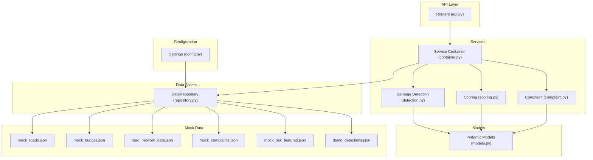
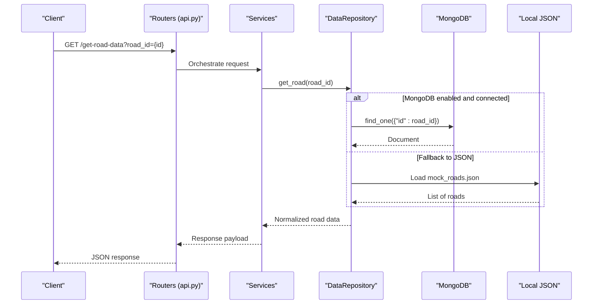
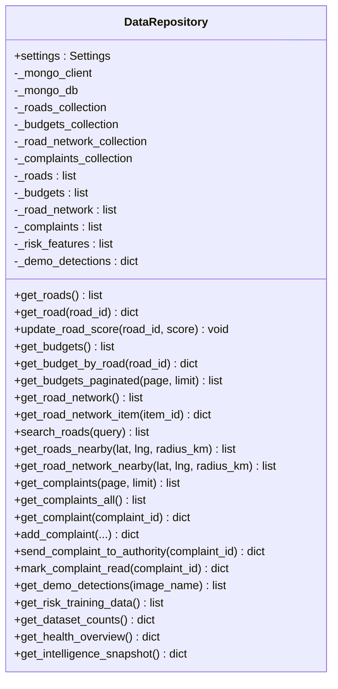
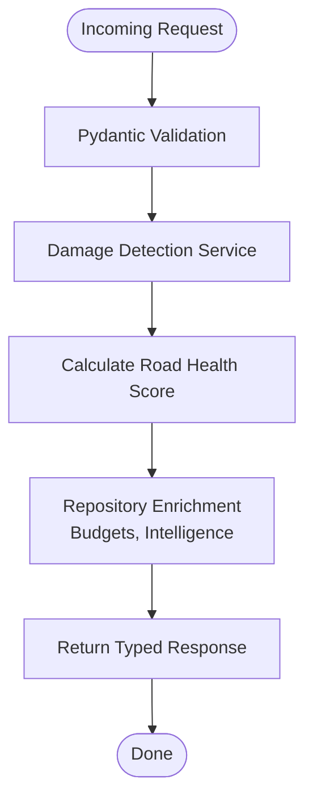
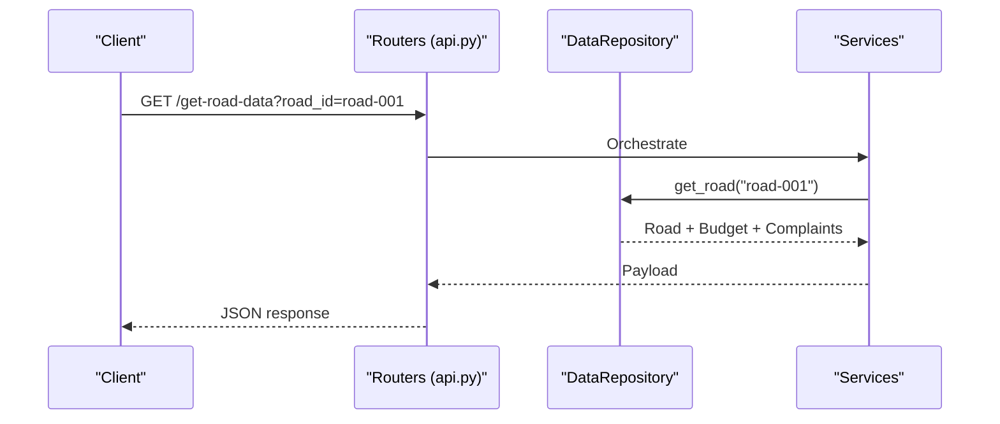
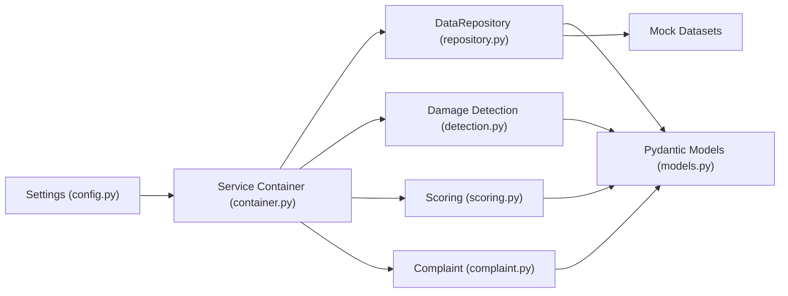

# Data Management

<cite>
**Referenced Files in This Document**
- [repository.py](file://roadwatch_ai/backend/app/db/repository.py)
- [models.py](file://roadwatch_ai/backend/app/schemas/models.py)
- [config.py](file://roadwatch_ai/backend/app/core/config.py)
- [main.py](file://roadwatch_ai/backend/app/main.py)
- [api.py](file://roadwatch_ai/backend/app/routers/api.py)
- [container.py](file://roadwatch_ai/backend/app/services/container.py)
- [detection.py](file://roadwatch_ai/backend/app/services/detection.py)
- [complaint.py](file://roadwatch_ai/backend/app/services/complaint.py)
- [scoring.py](file://roadwatch_ai/backend/app/services/scoring.py)
- [demo_detections.json](file://roadwatch_ai/backend/app/data/demo_detections.json)
- [mock_complaints.json](file://roadwatch_ai/backend/app/data/mock_complaints.json)
- [mock_budget.json](file://roadwatch_ai/backend/app/data/mock_budget.json)
- [mock_risk_features.json](file://roadwatch_ai/backend/app/data/mock_risk_features.json)
- [mock_roads.json](file://roadwatch_ai/backend/app/data/mock_roads.json)
- [road_network_data.json](file://roadwatch_ai/backend/app/data/road_network_data.json)
</cite>

## Table of Contents
1. [Introduction](#introduction)
2. [Project Structure](#project-structure)
3. [Core Components](#core-components)
4. [Architecture Overview](#architecture-overview)
5. [Detailed Component Analysis](#detailed-component-analysis)
6. [Dependency Analysis](#dependency-analysis)
7. [Performance Considerations](#performance-considerations)
8. [Troubleshooting Guide](#troubleshooting-guide)
9. [Conclusion](#conclusion)
10. [Appendices](#appendices)

## Introduction
This document explains the data management layer of RoadWatch AI, focusing on the DataRepository abstraction that seamlessly supports both local JSON datasets and optional MongoDB integration. It documents the Pydantic data models used across the system, the transformation and validation pipeline, caching strategies, and performance optimizations. It also covers the mock data ecosystem, data lifecycle and retention considerations, and outlines security and access control approaches.

## Project Structure
The data management system spans several layers:
- Configuration defines environment-driven settings (MongoDB URI, demo mode, model paths).
- The DataRepository encapsulates data access, normalization, and hybrid persistence.
- Pydantic models define strict schemas for all data exchanged across the API.
- Services transform raw inputs into validated domain objects and compute derived metrics.
- Routers expose endpoints that orchestrate data retrieval, transformation, and real-time updates.
- Mock datasets provide a fully functional demo without external databases.

**Diagram sources**
- [api.py:1-427](file://roadwatch_ai/backend/app/routers/api.py#L1-L427)
- [container.py:1-37](file://roadwatch_ai/backend/app/services/container.py#L1-L37)
- [detection.py:1-319](file://roadwatch_ai/backend/app/services/detection.py#L1-L319)
- [scoring.py:1-36](file://roadwatch_ai/backend/app/services/scoring.py#L1-L36)
- [complaint.py:1-94](file://roadwatch_ai/backend/app/services/complaint.py#L1-L94)
- [repository.py:1-447](file://roadwatch_ai/backend/app/db/repository.py#L1-L447)
- [models.py:1-177](file://roadwatch_ai/backend/app/schemas/models.py#L1-L177)
- [config.py:1-40](file://roadwatch_ai/backend/app/core/config.py#L1-L40)
- [mock_roads.json:1-1382](file://roadwatch_ai/backend/app/data/mock_roads.json#L1-L1382)
- [mock_budget.json:1-542](file://roadwatch_ai/backend/app/data/mock_budget.json#L1-L542)
- [road_network_data.json:1-5589](file://roadwatch_ai/backend/app/data/road_network_data.json#L1-L5589)
- [mock_complaints.json:1-1817](file://roadwatch_ai/backend/app/data/mock_complaints.json#L1-L1817)
- [mock_risk_features.json:1-492](file://roadwatch_ai/backend/app/data/mock_risk_features.json#L1-L492)
- [demo_detections.json:1-102](file://roadwatch_ai/backend/app/data/demo_detections.json#L1-L102)

**Section sources**
- [main.py:1-37](file://roadwatch_ai/backend/app/main.py#L1-L37)
- [config.py:1-40](file://roadwatch_ai/backend/app/core/config.py#L1-L40)
- [repository.py:1-447](file://roadwatch_ai/backend/app/db/repository.py#L1-L447)
- [models.py:1-177](file://roadwatch_ai/backend/app/schemas/models.py#L1-L177)
- [api.py:1-427](file://roadwatch_ai/backend/app/routers/api.py#L1-L427)

## Core Components
- DataRepository: Central abstraction that loads local JSON datasets and optionally connects to MongoDB. It exposes CRUD-like methods for roads, budgets, road network, complaints, and risk training data. It also computes derived metrics and maintains a simple in-memory cache of loaded datasets.
- Pydantic Models: Strict schemas for DetectionBox, Complaint, RoadSegment, RiskResponse, ChatResponse, and related request/response types. These models enforce field types, constraints, and enums.
- Services: Damage detection, scoring, and complaint routing services that transform raw inputs into validated domain objects and derive insights.
- Routers: API endpoints that orchestrate data retrieval, transformation, and real-time broadcasting.

Key responsibilities:
- Hybrid persistence: Reads from local JSON files and writes to MongoDB when configured.
- Validation: Uses Pydantic models to validate and normalize inputs/outputs.
- Transformation: Computes derived metrics (scores, risk levels, intelligence snapshots).
- Caching: Keeps loaded datasets in memory for fast access during requests.
- Real-time updates: Broadcasts events to connected clients via WebSockets.

**Section sources**
- [repository.py:31-447](file://roadwatch_ai/backend/app/db/repository.py#L31-L447)
- [models.py:14-177](file://roadwatch_ai/backend/app/schemas/models.py#L14-L177)
- [detection.py:20-319](file://roadwatch_ai/backend/app/services/detection.py#L20-L319)
- [scoring.py:19-36](file://roadwatch_ai/backend/app/services/scoring.py#L19-L36)
- [complaint.py:8-94](file://roadwatch_ai/backend/app/services/complaint.py#L8-L94)
- [api.py:66-427](file://roadwatch_ai/backend/app/routers/api.py#L66-L427)

## Architecture Overview
The system follows a layered architecture:
- Presentation: FastAPI routers expose endpoints.
- Application: Services encapsulate business logic and coordinate with the repository.
- Data Access: DataRepository abstracts storage and provides unified access.
- Data Models: Pydantic models ensure strong typing and validation.
- Persistence: Local JSON files serve as the default; MongoDB is optional and auto-populated on first connection.

**Diagram sources**
- [api.py:250-276](file://roadwatch_ai/backend/app/routers/api.py#L250-L276)
- [repository.py:102-134](file://roadwatch_ai/backend/app/db/repository.py#L102-L134)
- [mock_roads.json:1-1382](file://roadwatch_ai/backend/app/data/mock_roads.json#L1-L1382)

**Section sources**
- [api.py:1-427](file://roadwatch_ai/backend/app/routers/api.py#L1-L427)
- [repository.py:59-93](file://roadwatch_ai/backend/app/db/repository.py#L59-L93)

## Detailed Component Analysis

### DataRepository Abstraction
Responsibilities:
- Initialize from local JSON files and populate MongoDB on first successful connection.
- Provide unified accessors for roads, budgets, road network, complaints, and risk features.
- Compute derived metrics (health overview, intelligence snapshot).
- Support pagination and filtering for budget and complaint listings.
- Maintain a lightweight in-memory cache of loaded datasets.

Implementation highlights:
- Hybrid initialization: Loads JSON datasets and inserts into MongoDB if empty and connection succeeds.
- Safe ID stripping: Removes MongoDB’s ObjectId from returned documents.
- Derived computations: Budget alignment notes, health overview counts, and intelligence metrics.
- Proximity queries: Haversine-based distance calculations for roads and synthetic distances for highway network items.

**Diagram sources**
- [repository.py:31-447](file://roadwatch_ai/backend/app/db/repository.py#L31-L447)

**Section sources**
- [repository.py:31-447](file://roadwatch_ai/backend/app/db/repository.py#L31-L447)

### Pydantic Data Models
Core models and their roles:
- DetectionBox: Encodes detection label, confidence, severity, and bounding box.
- DetectionResult: Aggregates detection results with metadata (image_id, road_id, model, inference_ms).
- ScoreRequest/ScoreResponse: Validates incoming detection boxes and produces a road health score with severity breakdown and color.
- RoadSegment: Represents road entity with health score, color, and counts.
- RoadNetworkItem: Describes highway/motorway segments with attributes like type, districts, budget, and condition.
- BudgetRecord: Budget allocation and spending data linked to roads.
- Complaint and ComplaintTimelineEvent: Full complaint lifecycle with status, timestamps, and timeline entries.
- RiskRequest/RiskResponse: Risk prediction inputs and outputs with risk level and probability.
- ChatRequest/ChatResponse: Chat interface with citations.
- HealthOverview and ApiInfoResponse: System-wide summaries and metadata.

Validation characteristics:
- Enumerated statuses and risk levels.
- Field constraints (min/max lengths, numeric bounds).
- Nested models for coordinates and timeline events.

```mermaid
classDiagram
class DetectionBox {
+label : "pothole|crack"
+confidence : float [0,1]
+severity : "low|medium|high"
+bbox : [x_min,y_min,x_max,y_max]
}
class DetectionResult {
+image_id : str
+road_id : str?
+detections : DetectionBox[]
+model : str
+inference_ms : int
}
class ScoreRequest {
+detections : DetectionBox[]
}
class ScoreResponse {
+road_health_score : int [0,100]
+severity_breakdown : dict
+color : "red|yellow|green"
}
class RoadSegment {
+id : str
+name : str
+ward : str
+polyline : Coordinate[]
+road_health_score : int
+color : "red|yellow|green"
+nearby_issues : int
+recent_complaints : int
}
class RoadNetworkItem {
+id : str
+name : str
+type : "NH|SH|MDR"
+route : str
+districts : str[]
+length_km : int
+year : int
+contractor : str
+budget_crore : int
+condition : "Good|Moderate|Poor"
+issues : str[]
+summary : str
}
class BudgetRecord {
+road_id : str
+project_id : str
+allocated_inr : int
+spent_inr : int
+contractor : str
+last_repair_date : str
+expected_score : int
+actual_score : int
+transparency_note : str
}
class ComplaintTimelineEvent {
+status : "Filed|Sent|Delivered|Read|In Progress|Resolved"
+at : str
+note : str
}
class Complaint {
+id : str
+road_id : str
+description : str
+image_ref : str?
+location : Coordinate
+timestamp : str
+status : "Filed|Sent|Delivered|Read|In Progress|Resolved"
+authority_ticket : str
+recommended_department : str
+routing_reason : str
+complaint_letter : str
+sent_to_authority : bool
+delivered_to_authority : bool
+read_by_authority : bool
+sent_at : str?
+delivered_at : str?
+read_at : str?
+timeline : ComplaintTimelineEvent[]
}
class RiskRequest {
+road_id : str
+weather_index : float [0,1]
+traffic_index : float [0,1]
+complaint_count_30d : int
}
class RiskResponse {
+road_id : str
+risk_level : "Low|Medium|High"
+probability_of_deterioration : float
+predicted_days_to_decline : int
}
class ChatMessage {
+role : "user|assistant"
+content : str
}
class ChatRequest {
+query : str
+road_id : str?
+history : ChatMessage[]
}
class ChatResponse {
+answer : str
+cited_data : dict
}
class HealthOverview {
+overall_score : int
+total_roads : int
+red_roads : int
+yellow_roads : int
+green_roads : int
+generated_at : datetime
}
class ApiInfoResponse {
+version : str
+demo_mode : bool
+dataset_counts : dict
+model_info : dict
+uptime_seconds : float?
}
```

**Diagram sources**
- [models.py:14-177](file://roadwatch_ai/backend/app/schemas/models.py#L14-L177)

**Section sources**
- [models.py:1-177](file://roadwatch_ai/backend/app/schemas/models.py#L1-L177)

### Data Transformation and Validation Pipeline
- Input validation: Pydantic models validate request payloads (e.g., DetectionRequest, ComplaintCreateRequest).
- Detection pipeline: DamageDetectionService selects demo detections in demo mode or uses YOLO otherwise, then derives severity and bounding boxes.
- Scoring: calculate_road_health_score aggregates DetectionBox severity weights into a normalized ScoreResponse.
- Complaint routing: ComplaintService analyzes road and description to recommend a department and generate a standardized letter.
- Repository enrichment: DataRepository augments budgets with actual scores and adds transparency notes; computes intelligence snapshots.

**Diagram sources**
- [detection.py:36-94](file://roadwatch_ai/backend/app/services/detection.py#L36-L94)
- [scoring.py:19-36](file://roadwatch_ai/backend/app/services/scoring.py#L19-L36)
- [repository.py:135-160](file://roadwatch_ai/backend/app/db/repository.py#L135-L160)

**Section sources**
- [detection.py:1-319](file://roadwatch_ai/backend/app/services/detection.py#L1-L319)
- [scoring.py:1-36](file://roadwatch_ai/backend/app/services/scoring.py#L1-L36)
- [complaint.py:1-94](file://roadwatch_ai/backend/app/services/complaint.py#L1-L94)
- [repository.py:135-160](file://roadwatch_ai/backend/app/db/repository.py#L135-L160)

### Mock Data Ecosystem
- Demo detections: Predefined detection lists keyed by image name for demo mode.
- Budget records: Road budget allocations, spending, contractors, and expected vs. observed scores.
- Complaints: Historical complaints with statuses, timelines, and routing metadata.
- Risk features: Weather, traffic, complaint counts, and target labels for training.
- Roads and road network: Polyline geometries, health scores, and highway segment metadata.

Usage:
- DataRepository loads these files at startup and serves them via unified accessors.
- In demo mode, detection results are served directly from demo_detections.json.

**Section sources**
- [demo_detections.json:1-102](file://roadwatch_ai/backend/app/data/demo_detections.json#L1-L102)
- [mock_budget.json:1-542](file://roadwatch_ai/backend/app/data/mock_budget.json#L1-L542)
- [mock_complaints.json:1-1817](file://roadwatch_ai/backend/app/data/mock_complaints.json#L1-L1817)
- [mock_risk_features.json:1-492](file://roadwatch_ai/backend/app/data/mock_risk_features.json#L1-L492)
- [mock_roads.json:1-1382](file://roadwatch_ai/backend/app/data/mock_roads.json#L1-L1382)
- [road_network_data.json:1-5589](file://roadwatch_ai/backend/app/data/road_network_data.json#L1-L5589)

### Data Lifecycle Management and Retention
- In-memory caching: Loaded datasets are cached in DataRepository for fast access during requests.
- MongoDB population: On first successful connection, local datasets are inserted into MongoDB if empty.
- Data updates: Complaints support mutation (send/read), and road scores can be updated; these changes persist in MongoDB when enabled.
- Cleanup: No explicit retention policies are implemented; data remains in memory and/or MongoDB until manual deletion or reinitialization.

**Section sources**
- [repository.py:41-52](file://roadwatch_ai/backend/app/db/repository.py#L41-L52)
- [repository.py:69-78](file://roadwatch_ai/backend/app/db/repository.py#L69-L78)
- [repository.py:113-134](file://roadwatch_ai/backend/app/db/repository.py#L113-L134)
- [repository.py:284-296](file://roadwatch_ai/backend/app/db/repository.py#L284-L296)

### Security, Privacy, and Access Control
- CORS: Configured via settings; origins can be restricted.
- Authentication: Not implemented in the current codebase; endpoints are open.
- Data exposure: All endpoints return JSON; sensitive fields are not masked by default.
- Recommendations:
  - Add JWT-based authentication and role-based access control.
  - Sanitize and redact sensitive fields in responses.
  - Enforce rate limiting and input validation at gateway/proxy.
  - Encrypt MongoDB connections and secrets at rest.

**Section sources**
- [main.py:22-30](file://roadwatch_ai/backend/app/main.py#L22-L30)
- [config.py:34-34](file://roadwatch_ai/backend/app/core/config.py#L34-L34)

### Examples of Data Querying Patterns and Integrations
- Get road details and nearby network: Endpoint returns a road plus budget, complaints, and nearby highway items.
- Paginated budget listing: Returns budget records with configurable page and limit.
- Complaints listing with filters: Supports pagination and optional road_id filter.
- Proximity searches: Finds roads and highway network items within a radius using geometric heuristics.
- Risk prediction: Accepts weather, traffic, and complaint metrics to produce risk level and probability.

**Diagram sources**
- [api.py:250-276](file://roadwatch_ai/backend/app/routers/api.py#L250-L276)
- [repository.py:102-134](file://roadwatch_ai/backend/app/db/repository.py#L102-L134)

**Section sources**
- [api.py:250-292](file://roadwatch_ai/backend/app/routers/api.py#L250-L292)
- [repository.py:184-217](file://roadwatch_ai/backend/app/db/repository.py#L184-L217)

## Dependency Analysis
The system exhibits clean separation of concerns:
- Routers depend on services and the repository.
- Services depend on the repository and Pydantic models.
- Repository depends on configuration and local JSON files.
- Configuration drives whether MongoDB is used and how models are loaded.

**Diagram sources**
- [container.py:1-37](file://roadwatch_ai/backend/app/services/container.py#L1-L37)
- [config.py:1-40](file://roadwatch_ai/backend/app/core/config.py#L1-L40)
- [repository.py:1-447](file://roadwatch_ai/backend/app/db/repository.py#L1-L447)
- [models.py:1-177](file://roadwatch_ai/backend/app/schemas/models.py#L1-L177)
- [detection.py:1-319](file://roadwatch_ai/backend/app/services/detection.py#L1-L319)
- [scoring.py:1-36](file://roadwatch_ai/backend/app/services/scoring.py#L1-L36)
- [complaint.py:1-94](file://roadwatch_ai/backend/app/services/complaint.py#L1-L94)

**Section sources**
- [container.py:1-37](file://roadwatch_ai/backend/app/services/container.py#L1-L37)
- [api.py:1-427](file://roadwatch_ai/backend/app/routers/api.py#L1-L427)

## Performance Considerations
- Caching: DataRepository caches loaded datasets in memory to avoid repeated file reads.
- Lazy model loading: YOLO model is loaded only when present and requested; otherwise, demo/fallback logic is used.
- Pagination: Budget and complaint endpoints support pagination to limit payload sizes.
- Compression: GZip middleware reduces response sizes.
- Proximity computations: Haversine distance calculation is O(n) per dataset; consider indexing or spatial libraries for large-scale deployments.
- Real-time updates: WebSocket hub broadcasts minimal payloads to subscribed clients.

Recommendations:
- Index MongoDB collections on frequently queried fields (e.g., road_id, timestamp).
- Use database cursors and projections to reduce payload sizes.
- Implement Redis caching for hot queries (e.g., health overview, recent complaints).
- Batch insertions for initial MongoDB population.

**Section sources**
- [repository.py:41-52](file://roadwatch_ai/backend/app/db/repository.py#L41-L52)
- [detection.py:28-35](file://roadwatch_ai/backend/app/services/detection.py#L28-L35)
- [api.py:280-292](file://roadwatch_ai/backend/app/routers/api.py#L280-L292)
- [main.py:30-30](file://roadwatch_ai/backend/app/main.py#L30-L30)

## Troubleshooting Guide
Common issues and resolutions:
- MongoDB connectivity failures: Repository gracefully disables MongoDB features and falls back to JSON. Verify mongo_uri and credentials.
- Empty or missing datasets: Ensure JSON files exist and are readable; repository logs exceptions during init.
- Complaint routing mismatches: Review keyword-based routing logic and adjust as needed.
- Inference errors: Detector falls back to synthetic detection when YOLO fails; check image validity and dimensions.
- Real-time updates not received: Confirm WebSocket connection and hub membership.

Operational checks:
- Health endpoint returns dataset_counts and uptime.
- API info endpoint reveals model availability and demo mode status.

**Section sources**
- [repository.py:59-93](file://roadwatch_ai/backend/app/db/repository.py#L59-L93)
- [repository.py:284-296](file://roadwatch_ai/backend/app/db/repository.py#L284-L296)
- [detection.py:78-93](file://roadwatch_ai/backend/app/services/detection.py#L78-L93)
- [api.py:66-93](file://roadwatch_ai/backend/app/routers/api.py#L66-L93)
- [api.py:122-132](file://roadwatch_ai/backend/app/routers/api.py#L122-L132)

## Conclusion
RoadWatch AI’s data management layer provides a robust, extensible foundation that supports both rapid prototyping with mock datasets and production-grade MongoDB integration. Pydantic models ensure strong validation, while services and the repository encapsulate transformation and persistence logic. With proper security hardening, caching, and indexing, the system can scale to handle larger datasets and higher throughput.

## Appendices

### API Reference Highlights
- Health and API info endpoints expose system metadata and dataset counts.
- Damage detection and scoring endpoints integrate with the repository to update road health.
- Complaint generation routes requests intelligently and supports sending and marking read.
- Risk prediction endpoint consumes structured inputs and returns risk assessments.
- Real-time updates via WebSocket broadcast significant events.

**Section sources**
- [api.py:66-427](file://roadwatch_ai/backend/app/routers/api.py#L66-L427)