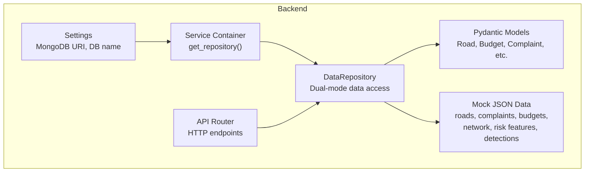
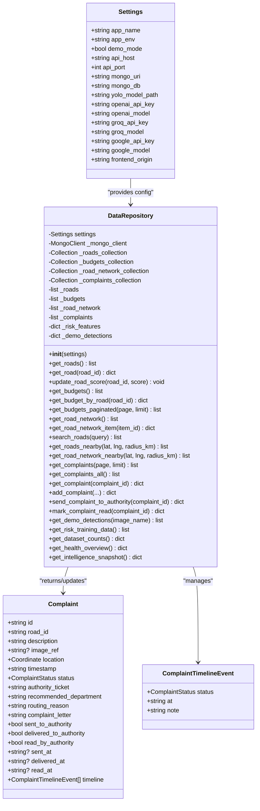
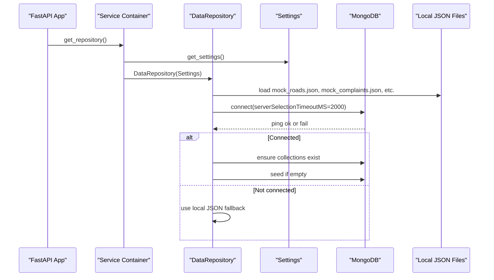
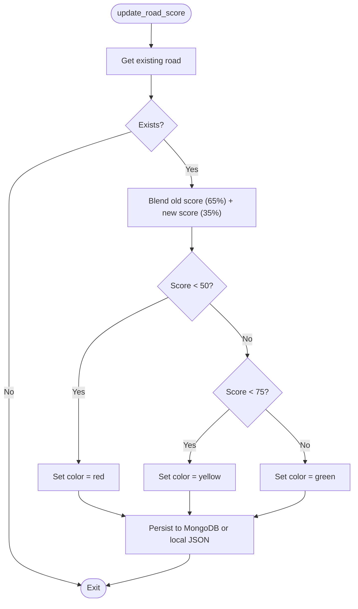
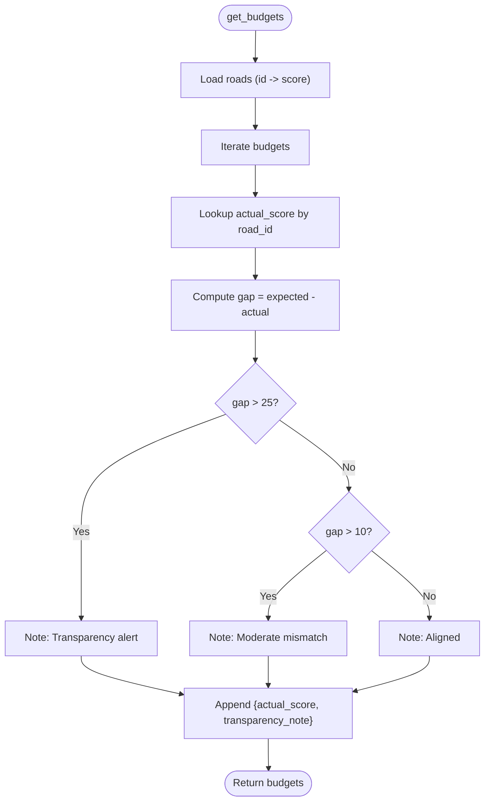
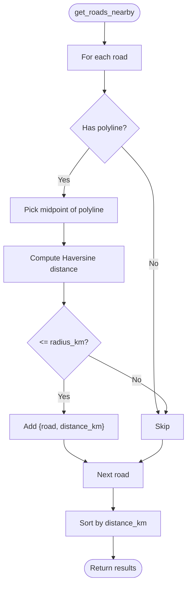
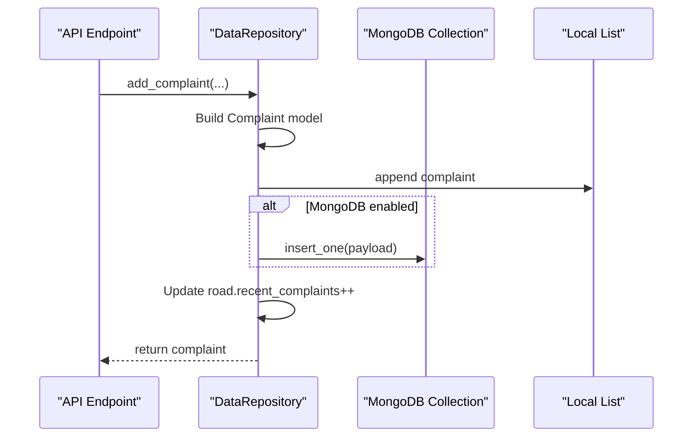
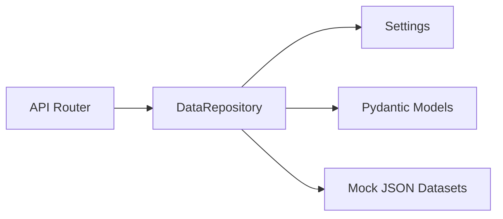

# Data Repository

<cite>
**Referenced Files in This Document**
- [repository.py](file://roadwatch_ai/backend/app/db/repository.py)
- [config.py](file://roadwatch_ai/backend/app/core/config.py)
- [models.py](file://roadwatch_ai/backend/app/schemas/models.py)
- [api.py](file://roadwatch_ai/backend/app/routers/api.py)
- [container.py](file://roadwatch_ai/backend/app/services/container.py)
- [main.py](file://roadwatch_ai/backend/app/main.py)
- [mock_roads.json](file://roadwatch_ai/backend/app/data/mock_roads.json)
- [mock_complaints.json](file://roadwatch_ai/backend/app/data/mock_complaints.json)
- [mock_budget.json](file://roadwatch_ai/backend/app/data/mock_budget.json)
- [road_network_data.json](file://roadwatch_ai/backend/app/data/road_network_data.json)
- [mock_risk_features.json](file://roadwatch_ai/backend/app/data/mock_risk_features.json)
- [demo_detections.json](file://roadwatch_ai/backend/app/data/demo_detections.json)
</cite>

## Table of Contents
1. [Introduction](#introduction)
2. [Project Structure](#project-structure)
3. [Core Components](#core-components)
4. [Architecture Overview](#architecture-overview)
5. [Detailed Component Analysis](#detailed-component-analysis)
6. [Dependency Analysis](#dependency-analysis)
7. [Performance Considerations](#performance-considerations)
8. [Troubleshooting Guide](#troubleshooting-guide)
9. [Conclusion](#conclusion)
10. [Appendices](#appendices)

## Introduction
This document provides comprehensive documentation for the DataRepository class, which serves as the central abstraction layer for data access in RoadWatch AI. It supports dual-mode operation: MongoDB-backed persistence and a local JSON-based mock fallback. The repository exposes a unified interface for roads, budgets, road network data, and complaints, including advanced features such as geospatial search, complaint lifecycle management, and intelligence snapshots.

## Project Structure
The DataRepository resides in the backend application under app/db and integrates with:
- Configuration (Settings) for MongoDB connectivity
- Pydantic models for typed data structures
- API routes for HTTP endpoints
- Service container for dependency injection
- Local JSON datasets for mock fallback

**Diagram sources**
- [config.py:10-39](file://roadwatch_ai/backend/app/core/config.py#L10-L39)
- [container.py:11-14](file://roadwatch_ai/backend/app/services/container.py#L11-L14)
- [repository.py:31-52](file://roadwatch_ai/backend/app/db/repository.py#L31-L52)
- [models.py:14-177](file://roadwatch_ai/backend/app/schemas/models.py#L14-L177)
- [api.py:12-31](file://roadwatch_ai/backend/app/routers/api.py#L12-L31)

**Section sources**
- [config.py:10-39](file://roadwatch_ai/backend/app/core/config.py#L10-L39)
- [container.py:11-14](file://roadwatch_ai/backend/app/services/container.py#L11-L14)
- [repository.py:31-52](file://roadwatch_ai/backend/app/db/repository.py#L31-L52)
- [models.py:14-177](file://roadwatch_ai/backend/app/schemas/models.py#L14-L177)
- [api.py:12-31](file://roadwatch_ai/backend/app/routers/api.py#L12-L31)

## Core Components
- DataRepository: Central abstraction managing MongoDB and local JSON datasets, exposing CRUD and analytics methods.
- Settings: Configuration for MongoDB URI and database name.
- Pydantic models: Typed schemas for roads, budgets, complaints, and related structures.
- API Router: HTTP endpoints that delegate to DataRepository for data retrieval and transformations.
- Service Container: Provides singleton-like access to DataRepository via dependency injection.

Key responsibilities:
- Initialization: Loads local JSON datasets and attempts MongoDB connection.
- Dual-mode operation: Uses MongoDB when available; falls back to local JSON otherwise.
- Data transformations: Blending AI scores with historical data, computing transparency notes, and generating intelligence snapshots.
- Geospatial search: Haversine-based distance calculation for roads and synthetic distances for highway network items.
- Complaint lifecycle: Timeline tracking, status updates, and persistence.

**Section sources**
- [repository.py:31-52](file://roadwatch_ai/backend/app/db/repository.py#L31-L52)
- [config.py:10-39](file://roadwatch_ai/backend/app/core/config.py#L10-L39)
- [models.py:14-177](file://roadwatch_ai/backend/app/schemas/models.py#L14-L177)
- [api.py:12-31](file://roadwatch_ai/backend/app/routers/api.py#L12-L31)
- [container.py:11-14](file://roadwatch_ai/backend/app/services/container.py#L11-L14)

## Architecture Overview
The DataRepository sits behind the API layer and is injected into services. It encapsulates:
- MongoDB collections (when connected)
- Local JSON datasets (fallback)
- Data transformation logic
- Geospatial utilities

**Diagram sources**
- [config.py:10-39](file://roadwatch_ai/backend/app/core/config.py#L10-L39)
- [repository.py:31-447](file://roadwatch_ai/backend/app/db/repository.py#L31-L447)
- [models.py:91-116](file://roadwatch_ai/backend/app/schemas/models.py#L91-L116)

**Section sources**
- [repository.py:31-447](file://roadwatch_ai/backend/app/db/repository.py#L31-L447)
- [models.py:91-116](file://roadwatch_ai/backend/app/schemas/models.py#L91-L116)
- [config.py:10-39](file://roadwatch_ai/backend/app/core/config.py#L10-L39)

## Detailed Component Analysis

### Initialization and Dual-Mode Operation
- Local JSON datasets are loaded during construction from app/data.
- MongoDB initialization attempts to connect using Settings.mongo_uri and creates collections if empty.
- If MongoDB is unavailable or disabled, all operations fall back to local JSON lists.

**Diagram sources**
- [container.py:11-14](file://roadwatch_ai/backend/app/services/container.py#L11-L14)
- [repository.py:31-93](file://roadwatch_ai/backend/app/db/repository.py#L31-L93)
- [config.py:20-21](file://roadwatch_ai/backend/app/core/config.py#L20-L21)

**Section sources**
- [repository.py:31-93](file://roadwatch_ai/backend/app/db/repository.py#L31-L93)
- [container.py:11-14](file://roadwatch_ai/backend/app/services/container.py#L11-L14)
- [config.py:20-21](file://roadwatch_ai/backend/app/core/config.py#L20-L21)

### Data Access Methods

#### Roads
- get_roads(): Returns all roads, sorted by id.
- get_road(road_id): Retrieves a specific road by id.
- update_road_score(road_id, score): Blends AI score with existing health score and sets color category.

**Diagram sources**
- [repository.py:113-134](file://roadwatch_ai/backend/app/db/repository.py#L113-L134)

**Section sources**
- [repository.py:102-134](file://roadwatch_ai/backend/app/db/repository.py#L102-L134)

#### Budgets
- get_budgets(): Computes transparency notes based on expected vs. actual scores derived from roads.
- get_budget_by_road(road_id): Filters budget records by road id.
- get_budgets_paginated(page, limit): Paginates budget records.

**Diagram sources**
- [repository.py:135-160](file://roadwatch_ai/backend/app/db/repository.py#L135-L160)

**Section sources**
- [repository.py:135-160](file://roadwatch_ai/backend/app/db/repository.py#L135-L160)

#### Road Network
- get_road_network(): Sorts by type (NH, SH, MDR) then name.
- get_road_network_item(item_id): Retrieves a specific network item by id.

**Section sources**
- [repository.py:170-182](file://roadwatch_ai/backend/app/db/repository.py#L170-L182)

#### Search and Geospatial
- search_roads(query): Case-insensitive substring search across name, ward, and id.
- get_roads_nearby(lat, lng, radius_km): Haversine distance from midpoint of road polyline.
- get_road_network_nearby(lat, lng, radius_km): Synthetic distance with Chennai-district heuristic.

**Diagram sources**
- [repository.py:192-202](file://roadwatch_ai/backend/app/db/repository.py#L192-L202)
- [repository.py:204-217](file://roadwatch_ai/backend/app/db/repository.py#L204-L217)
- [repository.py:20-28](file://roadwatch_ai/backend/app/db/repository.py#L20-L28)

**Section sources**
- [repository.py:184-217](file://roadwatch_ai/backend/app/db/repository.py#L184-L217)
- [repository.py:20-28](file://roadwatch_ai/backend/app/db/repository.py#L20-L28)

### Complaint Management
- get_complaints(page, limit) and get_complaints_all(): Lists complaints, newest first.
- get_complaint(complaint_id): Retrieves a complaint by id.
- add_complaint(...): Creates a new complaint with initial timeline and increments road recent_complaints.
- send_complaint_to_authority(complaint_id): Adds Sent/Delivered events and marks statuses.
- mark_complaint_read(complaint_id): Adds Read event and marks read.

**Diagram sources**
- [repository.py:236-282](file://roadwatch_ai/backend/app/db/repository.py#L236-L282)

**Section sources**
- [repository.py:219-282](file://roadwatch_ai/backend/app/db/repository.py#L219-L282)

### Intelligence and Analytics
- get_dataset_counts(): Counts roads, complaints, budgets, and network items.
- get_health_overview(): Computes overall score and counts by color.
- get_intelligence_snapshot(): Builds monthly damage trends, budget vs condition, repair frequency, and prediction text.

**Section sources**
- [repository.py:365-446](file://roadwatch_ai/backend/app/db/repository.py#L365-L446)

### Data Transformation and Fallback Mechanisms
- _strip_mongo_id(): Removes MongoDB’s ObjectId from payloads for consistent serialization.
- Local JSON fallback: All methods check for MongoDB collection presence; if absent, use local lists.
- Demo data: get_demo_detections(image_name) returns precomputed detection boxes for demo images.

**Section sources**
- [repository.py:94-100](file://roadwatch_ai/backend/app/db/repository.py#L94-L100)
- [repository.py:359-360](file://roadwatch_ai/backend/app/db/repository.py#L359-L360)

## Dependency Analysis
- API endpoints depend on DataRepository via dependency injection.
- DataRepository depends on Settings for MongoDB configuration.
- DataRepository depends on Pydantic models for typed data structures.
- DataRepository depends on local JSON datasets for fallback.

**Diagram sources**
- [api.py:12-31](file://roadwatch_ai/backend/app/routers/api.py#L12-L31)
- [repository.py:31-52](file://roadwatch_ai/backend/app/db/repository.py#L31-L52)
- [models.py:14-177](file://roadwatch_ai/backend/app/schemas/models.py#L14-L177)
- [config.py:10-39](file://roadwatch_ai/backend/app/core/config.py#L10-L39)

**Section sources**
- [api.py:12-31](file://roadwatch_ai/backend/app/routers/api.py#L12-L31)
- [repository.py:31-52](file://roadwatch_ai/backend/app/db/repository.py#L31-L52)
- [models.py:14-177](file://roadwatch_ai/backend/app/schemas/models.py#L14-L177)
- [config.py:10-39](file://roadwatch_ai/backend/app/core/config.py#L10-L39)

## Performance Considerations
- Connection handling: MongoDB connection uses a short serverSelectionTimeoutMS to avoid blocking startup.
- Local fallback: JSON loading occurs once at initialization; subsequent reads are in-memory.
- Sorting and filtering: get_roads() sorts by id; search_roads() performs linear scan; consider indexing or vector search for production.
- Pagination: get_budgets_paginated() slices results; consider database-side pagination for large datasets.
- Geospatial: Haversine computation is O(n); consider spatial indexes or libraries for large-scale usage.
- Caching: No explicit caching layer; consider memoization for frequently accessed datasets.

[No sources needed since this section provides general guidance]

## Troubleshooting Guide
Common issues and resolutions:
- MongoDB not configured: If Settings.mongo_uri is None, DataRepository falls back to local JSON. Verify environment configuration.
- Connection failures: Short timeout prevents long waits; logs indicate failure and disables MongoDB mode.
- Data seeding: On first connect, collections are seeded from local JSON if empty; verify that seed data exists.
- Complaint persistence: If MongoDB is disabled, complaints persist only in memory list; restart loses data.
- Geospatial results: get_road_network_nearby() uses synthetic distances; adjust radius or implement real geocoding for accuracy.

**Section sources**
- [repository.py:59-93](file://roadwatch_ai/backend/app/db/repository.py#L59-L93)
- [repository.py:71-78](file://roadwatch_ai/backend/app/db/repository.py#L71-L78)

## Conclusion
The DataRepository provides a robust, dual-mode data access layer for RoadWatch AI. It seamlessly switches between MongoDB and local JSON datasets, offers rich analytics and geospatial features, and manages the complaint lifecycle with timeline tracking. While designed for development and demos, it can be extended to support production-grade performance and scalability.

[No sources needed since this section summarizes without analyzing specific files]

## Appendices

### API Endpoints Using DataRepository
- GET /health: Returns service health and dataset counts.
- GET /api-info: Returns API metadata and model info.
- GET /get-road-data: Returns road detail, budget, complaints, and nearby network.
- GET /get-budget-data: Returns paginated budgets or a specific budget by road id.
- GET /get-road-network-data: Returns network items or nearby items with synthetic distances.
- GET /get-road-network-data/{item_id}: Returns a specific network item.
- GET /search-roads: Searches roads by query.
- GET /roads-nearby: Returns nearby roads by geospatial distance.
- GET /complaints: Lists complaints with pagination and optional road filter.
- POST /complaints/{complaint_id}/send: Sends complaint to authority.
- POST /complaints/{complaint_id}/read: Marks complaint as read.

**Section sources**
- [api.py:66-427](file://roadwatch_ai/backend/app/routers/api.py#L66-L427)

### Extending the Repository
- Adding new data sources:
  - Define a new collection in MongoDB and initialize it similarly to existing collections.
  - Add a new property to DataRepository for the collection and load data from JSON if needed.
  - Implement CRUD methods mirroring existing patterns.
- Implementing custom queries:
  - Use aggregation pipelines for complex analytics.
  - Introduce indexes on frequently queried fields.
  - Add pagination and sorting helpers.

[No sources needed since this section provides general guidance]