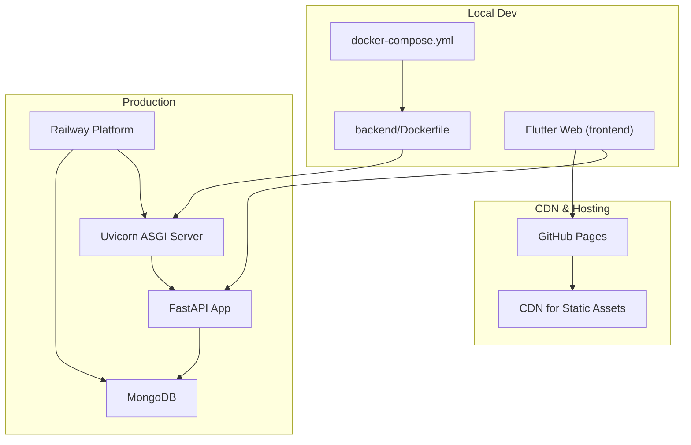
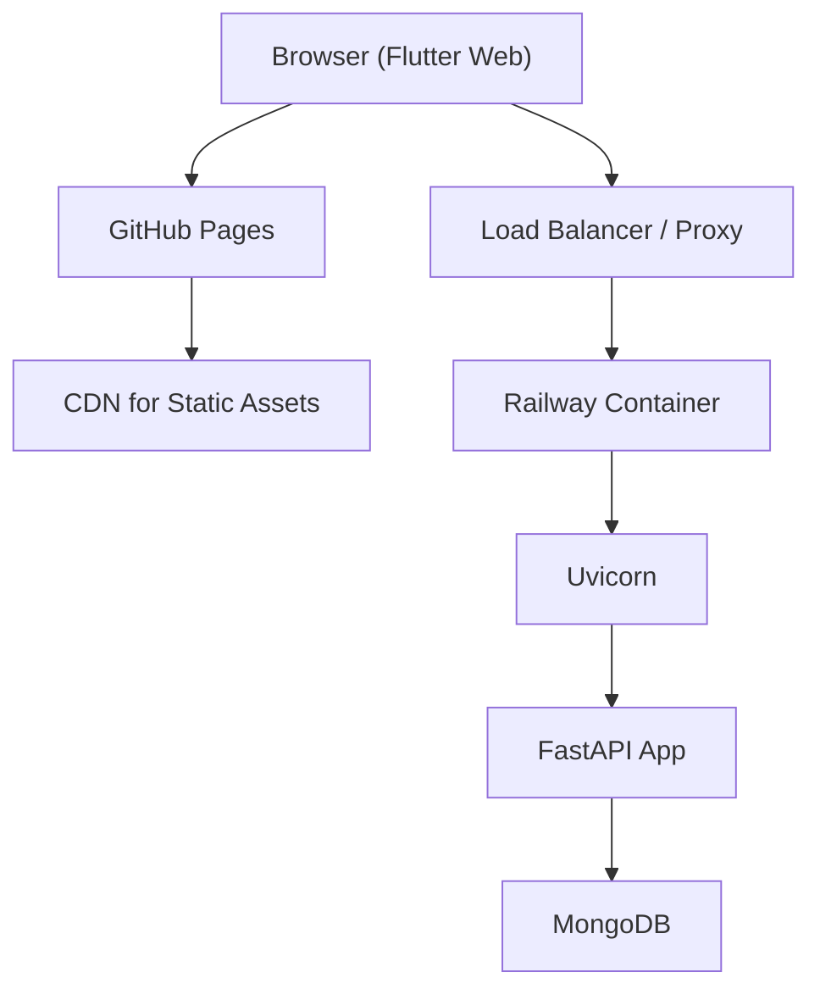
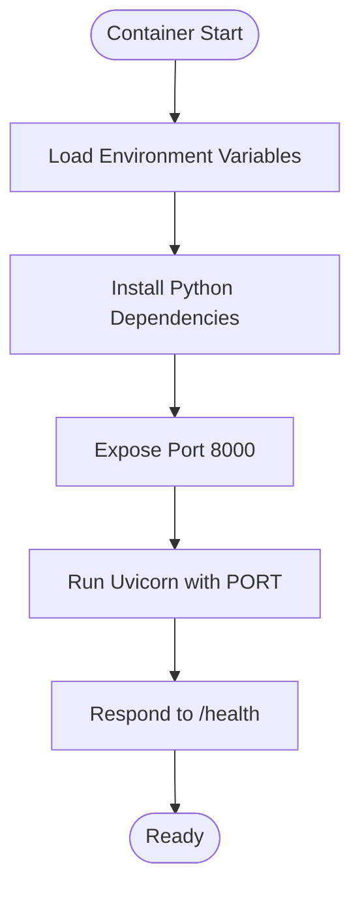
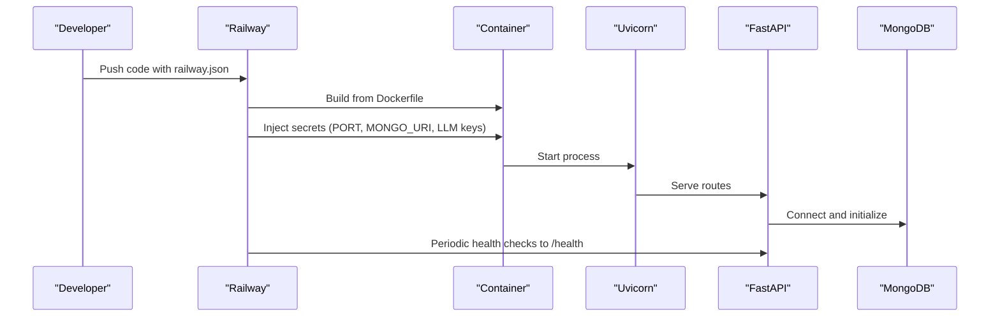
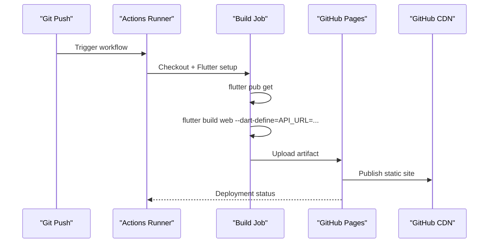
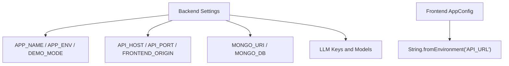
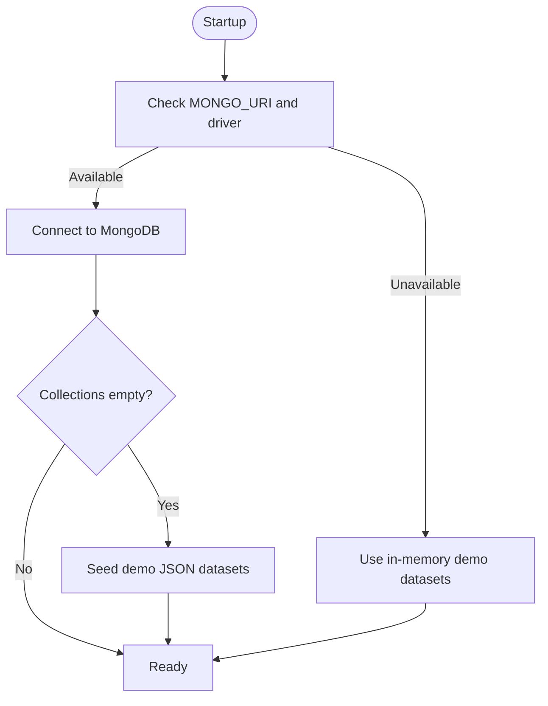
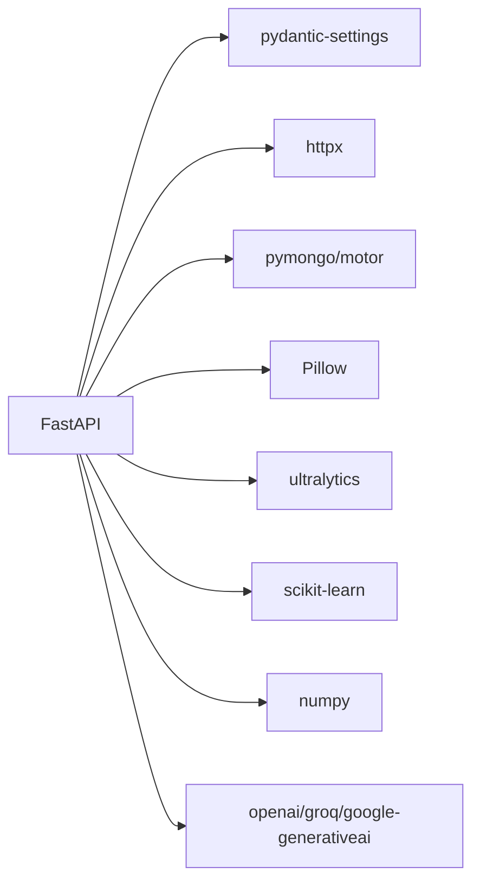

# Deployment Guide

<cite>
**Referenced Files in This Document**
- [docker-compose.yml](file://docker-compose.yml)
- [backend/Dockerfile](file://backend/Dockerfile)
- [.github/workflows/deploy-pages.yml](file://.github/workflows/deploy-pages.yml)
- [backend/railway.json](file://backend/railway.json)
- [README.md](file://README.md)
- [docs/SETUP.md](file://docs/SETUP.md)
- [docs/API_REFERENCE.md](file://docs/API_REFERENCE.md)
- [backend/app/main.py](file://backend/app/main.py)
- [backend/app/core/config.py](file://backend/app/core/config.py)
- [backend/app/routers/api.py](file://backend/app/routers/api.py)
- [backend/app/db/repository.py](file://backend/app/db/repository.py)
- [backend/requirements.txt](file://backend/requirements.txt)
- [frontend/pubspec.yaml](file://frontend/pubspec.yaml)
- [frontend/lib/config/app_config.dart](file://frontend/lib/config/app_config.dart)
</cite>

## Table of Contents
1. [Introduction](#introduction)
2. [Project Structure](#project-structure)
3. [Core Components](#core-components)
4. [Architecture Overview](#architecture-overview)
5. [Detailed Component Analysis](#detailed-component-analysis)
6. [Dependency Analysis](#dependency-analysis)
7. [Performance Considerations](#performance-considerations)
8. [Troubleshooting Guide](#troubleshooting-guide)
9. [Conclusion](#conclusion)
10. [Appendices](#appendices)

## Introduction
This guide documents how to deploy RoadWatch AI in production using Docker and multi-service orchestration, how to deploy the backend to Railway, how to automate frontend deployment to GitHub Pages, and how to configure environment variables, databases, and service dependencies. It also covers monitoring via health checks, logging, security considerations, SSL/TLS, CDN integration for static assets, deployment checklists, rollback procedures, and performance optimization.

## Project Structure
RoadWatch AI consists of:
- A FastAPI backend with Uvicorn ASGI server, MongoDB for persistence, and a health endpoint.
- A Flutter web application that consumes the backend API.
- GitHub Actions workflow to build and publish the Flutter web app to GitHub Pages.
- Docker Compose for local development and multi-service orchestration.
- Railway configuration for containerized deployment with health checks.



**Diagram sources**
- [docker-compose.yml:1-35](file://docker-compose.yml#L1-L35)
- [backend/Dockerfile:1-13](file://backend/Dockerfile#L1-L13)
- [backend/app/main.py:1-37](file://backend/app/main.py#L1-L37)
- [backend/app/routers/api.py:66-75](file://backend/app/routers/api.py#L66-L75)
- [backend/app/db/repository.py:59-93](file://backend/app/db/repository.py#L59-L93)
- [.github/workflows/deploy-pages.yml:1-64](file://.github/workflows/deploy-pages.yml#L1-L64)

**Section sources**
- [README.md:1-150](file://README.md#L1-L150)
- [docs/SETUP.md:1-120](file://docs/SETUP.md#L1-L120)

## Core Components
- Backend service: FastAPI app with Uvicorn, CORS/GZip middleware, static uploads mount, and health endpoint.
- Database: MongoDB initialized by the backend repository; supports both in-memory demo data and real-time persistence.
- Frontend: Flutter web app built with environment-driven base URL and hosted on GitHub Pages.
- CI/CD: GitHub Actions workflow builds and deploys Flutter web to GitHub Pages.
- Orchestration: Docker Compose for local dev; Railway for production containerization and health checks.

Key deployment-relevant endpoints:
- Health: GET /health
- API info: GET /api-info
- Upload image: POST /upload-image
- Detect damage: POST /detect-damage
- Calculate score: POST /calculate-score
- Generate complaint: POST /generate-complaint
- Get road data: GET /get-road-data
- Get budget data: GET /get-budget-data
- Predict risk: POST /predict-risk
- Chat: POST /chat
- Complaints: GET /complaints
- Sync offline: POST /sync-offline

**Section sources**
- [docs/API_REFERENCE.md:1-145](file://docs/API_REFERENCE.md#L1-L145)
- [backend/app/routers/api.py:66-75](file://backend/app/routers/api.py#L66-L75)
- [backend/app/main.py:1-37](file://backend/app/main.py#L1-L37)

## Architecture Overview
The production architecture centers on a containerized backend with MongoDB, served behind a load balancer or platform proxy. The frontend is built for web and published to GitHub Pages, configured via environment variables to target the backend.



**Diagram sources**
- [.github/workflows/deploy-pages.yml:1-64](file://.github/workflows/deploy-pages.yml#L1-L64)
- [backend/railway.json:1-11](file://backend/railway.json#L1-L11)
- [backend/app/main.py:1-37](file://backend/app/main.py#L1-L37)
- [backend/app/db/repository.py:59-93](file://backend/app/db/repository.py#L59-L93)

## Detailed Component Analysis

### Backend Containerization with Docker
- Base image: Python slim with Python 3.12.
- Dependencies: Installed from requirements.txt.
- Port exposure: 8000.
- Runtime command: Uvicorn serving the FastAPI app with host/port from environment variables.

Environment variables used by the backend:
- PORT: Uvicorn port override.
- APP_NAME, APP_ENV, DEMO_MODE: Application metadata and demo flag.
- API_HOST, API_PORT: Host and port binding.
- FRONTEND_ORIGIN: CORS origin control.
- MONGO_URI, MONGO_DB: MongoDB connection and database name.
- YOLO_MODEL_PATH: Path to YOLO weights.
- OPENAI_API_KEY, OPENAI_MODEL: OpenAI integration.
- GROQ_API_KEY, GROQ_MODEL: Groq integration.
- GOOGLE_API_KEY, GOOGLE_MODEL: Google Gemini integration.

Health check:
- Endpoint: GET /health
- Railway healthcheck path configured to /health.



**Diagram sources**
- [backend/Dockerfile:1-13](file://backend/Dockerfile#L1-L13)
- [backend/app/core/config.py:10-39](file://backend/app/core/config.py#L10-L39)
- [backend/railway.json:7-10](file://backend/railway.json#L7-L10)

**Section sources**
- [backend/Dockerfile:1-13](file://backend/Dockerfile#L1-L13)
- [backend/app/core/config.py:10-39](file://backend/app/core/config.py#L10-L39)
- [backend/railway.json:1-11](file://backend/railway.json#L1-L11)

### Multi-Service Orchestration with Docker Compose
- Services:
  - mongo: MongoDB 7, mapped port 27017, persistent volume.
  - backend: Built from backend/Dockerfile, exposes 8000, depends on mongo, sets environment variables for app and DB.
- Network: Services communicate via service names (mongo hostname resolves to the mongo container).

```mermaid
graph LR
Mongo["mongo:27017"] <- --> |"MONGO_URI"| Backend["backend:8000"]
Browser["Browser"] --> |"HTTP 8000"| Backend
Backend --> |"MongoDB"| Mongo
```

**Diagram sources**
- [docker-compose.yml:1-35](file://docker-compose.yml#L1-L35)

**Section sources**
- [docker-compose.yml:1-35](file://docker-compose.yml#L1-L35)

### Production Deployment on Railway
- Builder: DOCKERFILE with backend/Dockerfile.
- Start command: Uvicorn serving the FastAPI app with $PORT.
- Health check: /health endpoint.
- Secrets management: Use Railway’s secret injection for sensitive variables (e.g., API keys, MONGO_URI).
- Scaling: Increase replica count for the backend service; ensure MongoDB is externalized or provisioned by Railway if needed.



**Diagram sources**
- [backend/railway.json:1-11](file://backend/railway.json#L1-L11)
- [backend/app/routers/api.py:66-75](file://backend/app/routers/api.py#L66-L75)
- [backend/app/db/repository.py:59-93](file://backend/app/db/repository.py#L59-L93)

**Section sources**
- [backend/railway.json:1-11](file://backend/railway.json#L1-L11)

### GitHub Actions Workflow for GitHub Pages
- Triggers: Push to main branch or manual dispatch.
- Permissions: Read/Write for Pages and ID token.
- Jobs:
  - build: Checks out code, sets up Flutter, installs dependencies, builds web with API_URL injected, configures Pages, uploads artifact.
  - deploy: Deploys artifact to GitHub Pages.

Prerequisite:
- Repository variable API_URL must be set to the backend URL.



**Diagram sources**
- [.github/workflows/deploy-pages.yml:1-64](file://.github/workflows/deploy-pages.yml#L1-L64)

**Section sources**
- [.github/workflows/deploy-pages.yml:1-64](file://.github/workflows/deploy-pages.yml#L1-L64)
- [docs/SETUP.md:84-91](file://docs/SETUP.md#L84-L91)

### Environment Variable Configuration
Backend settings and defaults:
- Application: APP_NAME, APP_ENV, DEMO_MODE.
- Networking: API_HOST, API_PORT, FRONTEND_ORIGIN.
- Database: MONGO_URI, MONGO_DB.
- AI models: YOLO_MODEL_PATH, OPENAI_* (keys and model), GROQ_* (keys and model), GOOGLE_* (keys and model).
- Frontend origin: FRONTEND_ORIGIN controls CORS and credentials.

Frontend configuration:
- API_URL is read from the environment at runtime; defaults to a localhost address if not provided.



**Diagram sources**
- [backend/app/core/config.py:10-39](file://backend/app/core/config.py#L10-L39)
- [frontend/lib/config/app_config.dart:5-8](file://frontend/lib/config/app_config.dart#L5-L8)

**Section sources**
- [backend/app/core/config.py:10-39](file://backend/app/core/config.py#L10-L39)
- [frontend/lib/config/app_config.dart:1-30](file://frontend/lib/config/app_config.dart#L1-L30)

### Database Setup and Service Dependencies
- MongoDB initialization:
  - If MONGO_URI is provided and the driver is available, the repository connects to MongoDB and seeds initial collections from JSON files if empty.
  - If MONGO_URI is absent or connection fails, the app continues using in-memory demo datasets.
- Demo mode:
  - Controlled by DEMO_MODE; backend falls back to mock data and deterministic responses when backend services are unavailable.



**Diagram sources**
- [backend/app/db/repository.py:59-93](file://backend/app/db/repository.py#L59-L93)
- [backend/app/core/config.py:20-21](file://backend/app/core/config.py#L20-L21)

**Section sources**
- [backend/app/db/repository.py:59-93](file://backend/app/db/repository.py#L59-L93)
- [README.md:140-145](file://README.md#L140-L145)

### Monitoring and Logging
- Health endpoint: GET /health returns uptime, dataset counts, and service metadata.
- Logging: The API uses Python logging; configure log level and handlers in production as needed.
- Observability:
  - Railway health checks monitor /health.
  - Use platform logs and metrics dashboards.
  - Consider structured logging and correlation IDs for distributed tracing.

**Section sources**
- [backend/app/routers/api.py:66-75](file://backend/app/routers/api.py#L66-L75)
- [backend/railway.json:9-9](file://backend/railway.json#L9-L9)

### Security Considerations, SSL/TLS, and CDN
- CORS: FRONTEND_ORIGIN controls allowed origins and credentials.
- HTTPS: Terminate TLS at the platform/proxy; ensure API_URL uses HTTPS in production.
- Secrets: Store API keys and connection strings as platform secrets (Railway secrets).
- CDN: Serve frontend static assets via GitHub Pages CDN; ensure asset URLs are correct and cache-friendly.

**Section sources**
- [backend/app/main.py:22-28](file://backend/app/main.py#L22-L28)
- [frontend/lib/config/app_config.dart:5-8](file://frontend/lib/config/app_config.dart#L5-L8)

### Disaster Recovery Procedures
- Backup MongoDB: Schedule regular dumps of MongoDB collections.
- Rollback strategy: Keep previous container images; redeploy previous tag on failure.
- Health gates: Use /health and basic smoke tests to validate deployments.
- Data recovery: Restore MongoDB from backups; re-seed demo data if needed.

**Section sources**
- [backend/app/routers/api.py:66-75](file://backend/app/routers/api.py#L66-L75)
- [backend/app/db/repository.py:59-93](file://backend/app/db/repository.py#L59-L93)

## Dependency Analysis
Runtime dependencies include FastAPI, Uvicorn, Pydantic, Pydantic Settings, HTTPX, NumPy, scikit-learn, python-dotenv, OpenAI, Groq, Google Generative AI, PyMongo/Motor, Ultralytics, Pillow, and pytest.



**Diagram sources**
- [backend/requirements.txt:1-18](file://backend/requirements.txt#L1-L18)

**Section sources**
- [backend/requirements.txt:1-18](file://backend/requirements.txt#L1-L18)

## Performance Considerations
- GZip compression: Enabled globally for responses larger than a threshold.
- Static uploads: Uploaded images are served via mounted static files.
- Model inference: Ensure GPU acceleration if using heavy models; cache model weights.
- Database queries: Indexes on hot fields; pagination for large lists.
- Concurrency: Use Uvicorn workers appropriately; monitor memory and CPU under load.

**Section sources**
- [backend/app/main.py:30-30](file://backend/app/main.py#L30-L30)
- [backend/app/routers/api.py:250-277](file://backend/app/routers/api.py#L250-L277)

## Troubleshooting Guide
Common issues and remedies:
- Health check failures:
  - Verify /health responds with expected fields.
  - Confirm MongoDB connectivity and seeding.
- CORS errors:
  - Ensure FRONTEND_ORIGIN matches the origin used by the frontend.
- API_URL misconfiguration:
  - For GitHub Pages, set repository variable API_URL to the backend domain.
- Missing AI integrations:
  - Without keys/models, the app operates in demo mode with fallbacks.

**Section sources**
- [docs/API_REFERENCE.md:139-145](file://docs/API_REFERENCE.md#L139-L145)
- [docs/SETUP.md:84-91](file://docs/SETUP.md#L84-L91)
- [README.md:140-145](file://README.md#L140-L145)

## Conclusion
RoadWatch AI can be deployed locally with Docker Compose and orchestrated for production using Railway with health checks and secrets management. The frontend is built and published to GitHub Pages via GitHub Actions. Robust monitoring, security hardening, and disaster recovery practices ensure reliable operation in production.

## Appendices

### Deployment Checklist
- Backend
  - Build and push container image.
  - Set environment variables (PORT, MONGO_URI, LLM keys).
  - Configure health check path to /health.
  - Scale replicas as needed.
- Database
  - Provision MongoDB (external or managed).
  - Seed initial datasets if required.
- Frontend
  - Set API_URL repository variable.
  - Build and deploy web to GitHub Pages.
  - Verify static assets via CDN.
- Security
  - Enforce HTTPS at ingress.
  - Restrict CORS origins.
  - Store secrets securely.
- Monitoring
  - Confirm /health endpoint.
  - Set up logs and alerts.
- Disaster Recovery
  - Back up MongoDB regularly.
  - Test restore and rollback procedures.

### Rollback Procedure
- Identify failing release and previous stable tag.
- Redeploy previous container image.
- Validate /health and smoke tests.
- Reassess configuration and secrets post-rollback.

### Performance Optimization
- Enable GZip and optimize static file serving.
- Tune Uvicorn worker count and timeouts.
- Cache model weights and frequently accessed data.
- Use pagination and indexing for large datasets.