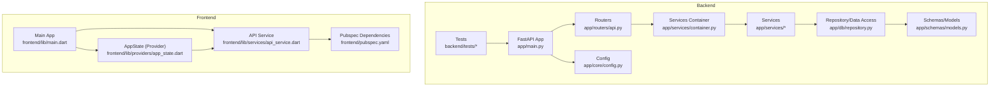
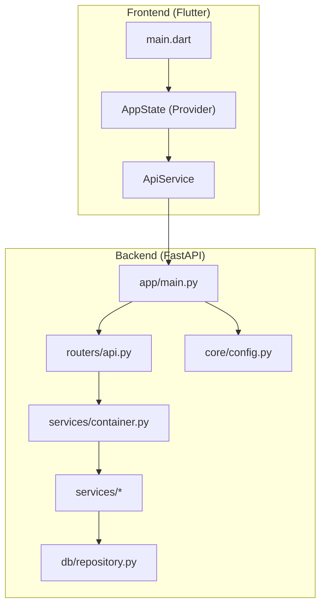
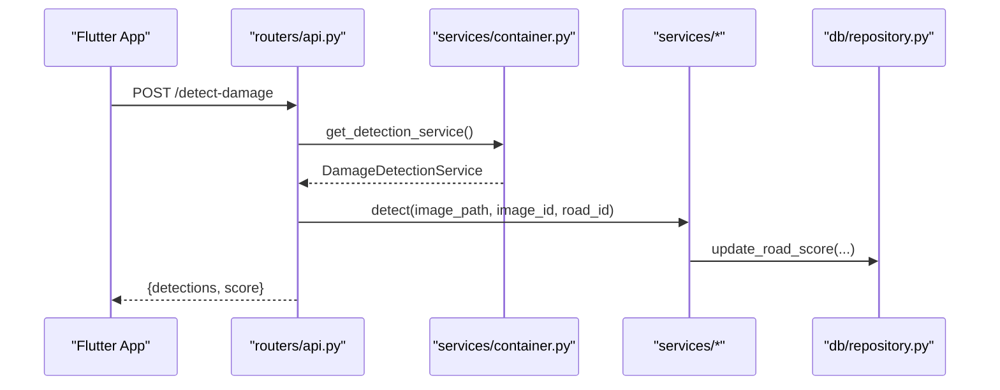
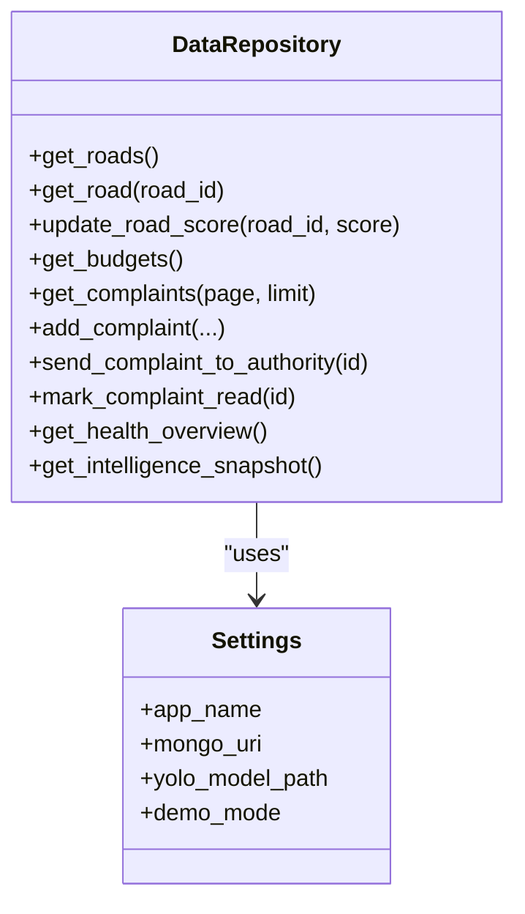
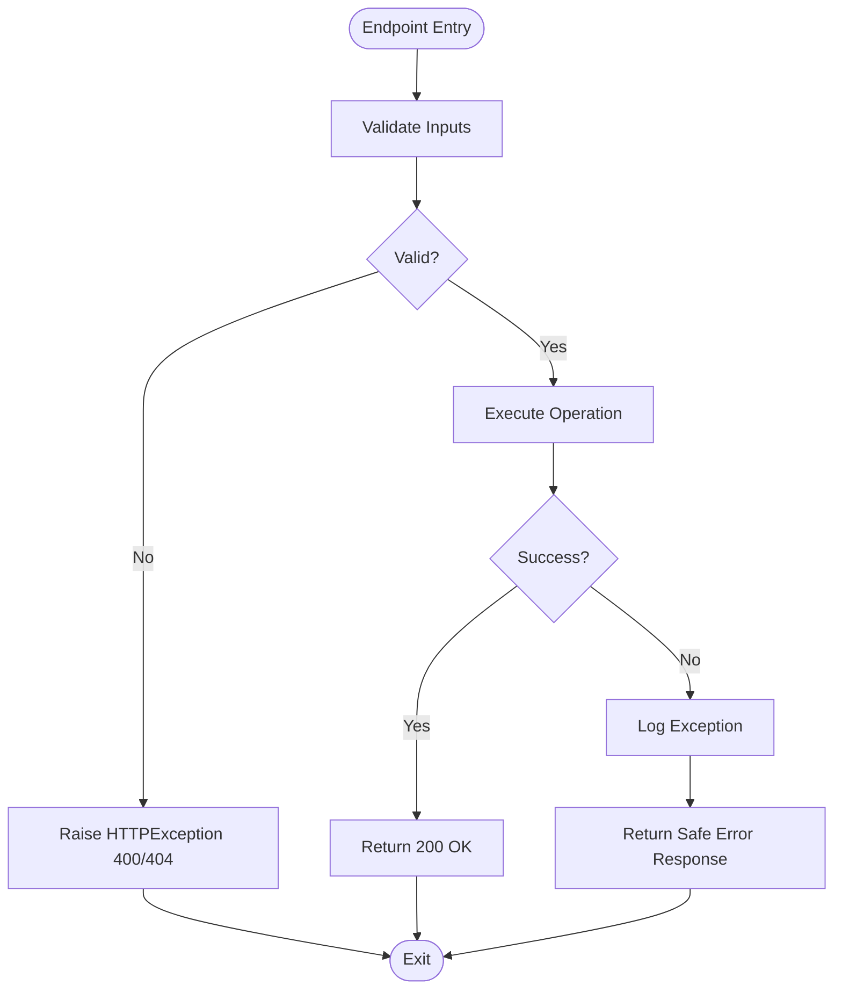
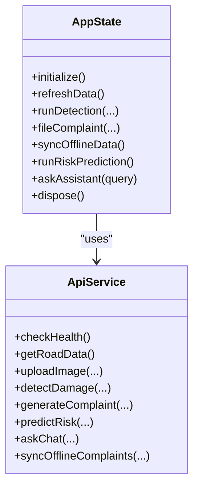
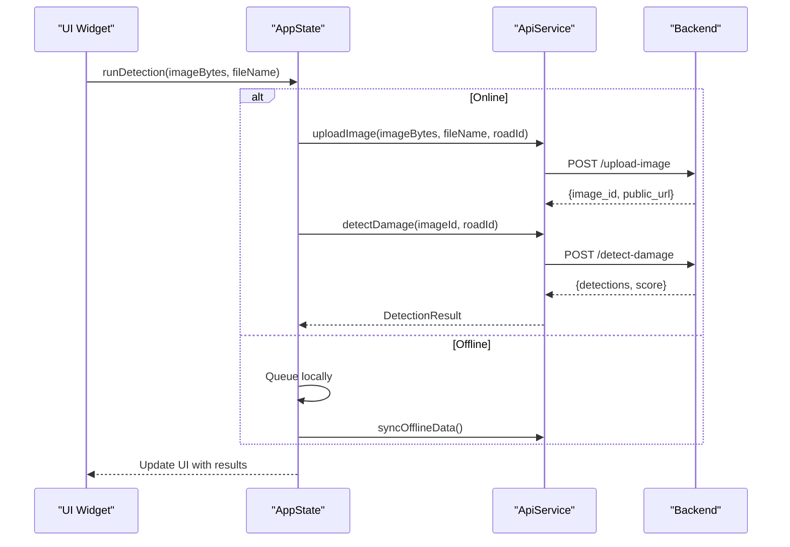
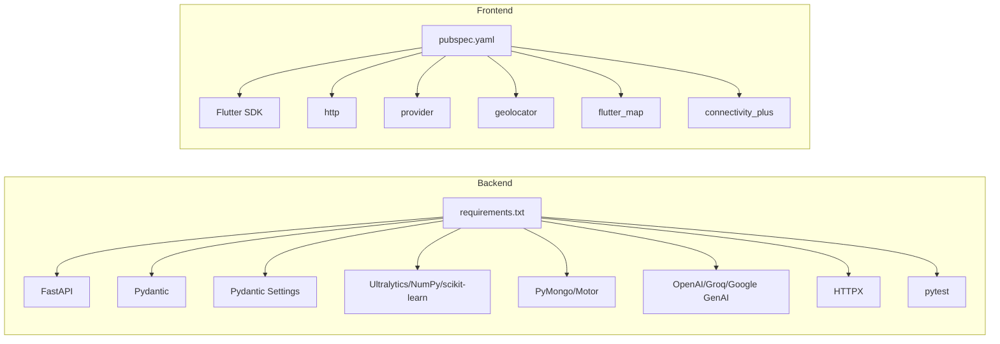

# Development Guidelines

<cite>
**Referenced Files in This Document**
- [main.py](file://roadwatch_ai/backend/app/main.py)
- [config.py](file://roadwatch_ai/backend/app/core/config.py)
- [repository.py](file://roadwatch_ai/backend/app/db/repository.py)
- [api.py](file://roadwatch_ai/backend/app/routers/api.py)
- [container.py](file://roadwatch_ai/backend/app/services/container.py)
- [models.py](file://roadwatch_ai/backend/app/schemas/models.py)
- [requirements.txt](file://roadwatch_ai/backend/requirements.txt)
- [test_api_smoke.py](file://roadwatch_ai/backend/tests/test_api_smoke.py)
- [ARCHITECTURE.md](file://roadwatch_ai/docs/ARCHITECTURE.md)
- [main.dart](file://roadwatch_ai/frontend/lib/main.dart)
- [app_state.dart](file://roadwatch_ai/frontend/lib/providers/app_state.dart)
- [api_service.dart](file://roadwatch_ai/frontend/lib/services/api_service.dart)
- [pubspec.yaml](file://roadwatch_ai/frontend/pubspec.yaml)
</cite>

## Table of Contents
1. [Introduction](#introduction)
2. [Project Structure](#project-structure)
3. [Core Components](#core-components)
4. [Architecture Overview](#architecture-overview)
5. [Detailed Component Analysis](#detailed-component-analysis)
6. [Dependency Analysis](#dependency-analysis)
7. [Performance Considerations](#performance-considerations)
8. [Troubleshooting Guide](#troubleshooting-guide)
9. [Security Coding Practices](#security-coding-practices)
10. [Code Review Guidelines](#code-review-guidelines)
11. [Testing Requirements](#testing-requirements)
12. [Contribution Workflows](#contribution-workflows)
13. [Extending the Platform](#extending-the-platform)
14. [Conclusion](#conclusion)

## Introduction
This document provides comprehensive development guidelines for contributors working on RoadWatch AI. It covers code organization standards, naming conventions, architectural patterns, dependency injection, state management, service layer architecture, error handling, logging, debugging, performance best practices, memory management, optimization techniques, security practices, testing, and contribution workflows. The goal is to ensure consistent, maintainable, and scalable development across both the backend (FastAPI) and frontend (Flutter) components.

## Project Structure
The repository follows a clear separation of concerns:
- Backend: FastAPI application with routers, services, schemas, database/repository abstraction, and tests.
- Frontend: Flutter application with state management via Provider, services for API and connectivity, and models.
- Docs: Architectural overview and implementation plans.
- Scripts and data: Demo datasets and utilities for local development.

**Diagram sources**
- [main.py:1-37](file://roadwatch_ai/backend/app/main.py#L1-L37)
- [api.py:1-427](file://roadwatch_ai/backend/app/routers/api.py#L1-L427)
- [container.py:1-37](file://roadwatch_ai/backend/app/services/container.py#L1-L37)
- [repository.py:1-447](file://roadwatch_ai/backend/app/db/repository.py#L1-L447)
- [models.py:1-177](file://roadwatch_ai/backend/app/schemas/models.py#L1-L177)
- [config.py:1-40](file://roadwatch_ai/backend/app/core/config.py#L1-L40)
- [test_api_smoke.py:1-122](file://roadwatch_ai/backend/tests/test_api_smoke.py#L1-L122)
- [main.dart:1-116](file://roadwatch_ai/frontend/lib/main.dart#L1-L116)
- [app_state.dart:1-637](file://roadwatch_ai/frontend/lib/providers/app_state.dart#L1-L637)
- [api_service.dart:1-381](file://roadwatch_ai/frontend/lib/services/api_service.dart#L1-L381)
- [pubspec.yaml:1-38](file://roadwatch_ai/frontend/pubspec.yaml#L1-L38)

**Section sources**
- [main.py:1-37](file://roadwatch_ai/backend/app/main.py#L1-L37)
- [ARCHITECTURE.md:1-66](file://roadwatch_ai/docs/ARCHITECTURE.md#L1-L66)

## Core Components
- Backend FastAPI application initializes middleware (CORS, gzip), mounts static uploads, and includes routers.
- Configuration is centralized via a cached settings loader with environment-driven keys.
- Data access is abstracted behind a repository that supports both mock JSON datasets and optional MongoDB integration.
- Routers orchestrate service calls using FastAPI dependency injection via a services container.
- Pydantic models define request/response schemas and enforce field constraints.
- Tests use TestClient to validate core endpoints.

Key implementation references:
- Application bootstrap and middleware: [main.py:1-37](file://roadwatch_ai/backend/app/main.py#L1-L37)
- Settings and environment loading: [config.py:1-40](file://roadwatch_ai/backend/app/core/config.py#L1-L40)
- Repository with mock and MongoDB support: [repository.py:1-447](file://roadwatch_ai/backend/app/db/repository.py#L1-L447)
- Routers and dependency injection: [api.py:1-427](file://roadwatch_ai/backend/app/routers/api.py#L1-L427), [container.py:1-37](file://roadwatch_ai/backend/app/services/container.py#L1-L37)
- Schemas and models: [models.py:1-177](file://roadwatch_ai/backend/app/schemas/models.py#L1-L177)
- Backend tests: [test_api_smoke.py:1-122](file://roadwatch_ai/backend/tests/test_api_smoke.py#L1-L122)

**Section sources**
- [main.py:1-37](file://roadwatch_ai/backend/app/main.py#L1-L37)
- [config.py:1-40](file://roadwatch_ai/backend/app/core/config.py#L1-L40)
- [repository.py:1-447](file://roadwatch_ai/backend/app/db/repository.py#L1-L447)
- [api.py:1-427](file://roadwatch_ai/backend/app/routers/api.py#L1-L427)
- [container.py:1-37](file://roadwatch_ai/backend/app/services/container.py#L1-L37)
- [models.py:1-177](file://roadwatch_ai/backend/app/schemas/models.py#L1-L177)
- [test_api_smoke.py:1-122](file://roadwatch_ai/backend/tests/test_api_smoke.py#L1-L122)

## Architecture Overview
RoadWatch AI is a full-stack platform with:
- Citizen interface (Flutter): Map dashboard, image capture, detection, chatbot, complaints, offline sync.
- Governance API (FastAPI): REST endpoints for roads, budgets, complaints, risk, and AI services.
- AI/ML services: YOLO-based detection, road health scoring, risk prediction, and LLM-backed chatbot.
- Data layer: Mock datasets designed to integrate with MongoDB/Firebase.

**Diagram sources**
- [main.dart:1-116](file://roadwatch_ai/frontend/lib/main.dart#L1-L116)
- [app_state.dart:1-637](file://roadwatch_ai/frontend/lib/providers/app_state.dart#L1-L637)
- [api_service.dart:1-381](file://roadwatch_ai/frontend/lib/services/api_service.dart#L1-L381)
- [main.py:1-37](file://roadwatch_ai/backend/app/main.py#L1-L37)
- [api.py:1-427](file://roadwatch_ai/backend/app/routers/api.py#L1-L427)
- [container.py:1-37](file://roadwatch_ai/backend/app/services/container.py#L1-L37)
- [repository.py:1-447](file://roadwatch_ai/backend/app/db/repository.py#L1-L447)
- [config.py:1-40](file://roadwatch_ai/backend/app/core/config.py#L1-L40)

**Section sources**
- [ARCHITECTURE.md:1-66](file://roadwatch_ai/docs/ARCHITECTURE.md#L1-L66)

## Detailed Component Analysis

### Backend: FastAPI Dependency Injection and Service Layer
- Dependency injection pattern: Services are resolved via a container with caching to avoid repeated instantiation.
- Routers depend on services through FastAPI’s Depends, enabling clean separation of concerns.
- Real-time updates are handled via WebSocket hub broadcasting.

**Diagram sources**
- [api.py:164-191](file://roadwatch_ai/backend/app/routers/api.py#L164-L191)
- [container.py:17-21](file://roadwatch_ai/backend/app/services/container.py#L17-L21)
- [repository.py:113-134](file://roadwatch_ai/backend/app/db/repository.py#L113-L134)

**Section sources**
- [api.py:1-427](file://roadwatch_ai/backend/app/routers/api.py#L1-L427)
- [container.py:1-37](file://roadwatch_ai/backend/app/services/container.py#L1-L37)
- [repository.py:1-447](file://roadwatch_ai/backend/app/db/repository.py#L1-L447)

### Backend: Data Repository Pattern
- Centralizes data access with support for mock JSON datasets and optional MongoDB.
- Provides CRUD-like operations and computed analytics (health overview, intelligence snapshot).
- Includes helpers for distance calculations and search.

**Diagram sources**
- [repository.py:31-447](file://roadwatch_ai/backend/app/db/repository.py#L31-L447)
- [config.py:10-39](file://roadwatch_ai/backend/app/core/config.py#L10-L39)

**Section sources**
- [repository.py:1-447](file://roadwatch_ai/backend/app/db/repository.py#L1-L447)
- [config.py:1-40](file://roadwatch_ai/backend/app/core/config.py#L1-L40)

### Backend: Error Handling and Logging
- Centralized logging via Python logging module.
- Safe error messages for chat endpoint with truncation.
- HTTP exceptions raised for invalid inputs and missing resources.

**Diagram sources**
- [api.py:96-98](file://roadwatch_ai/backend/app/routers/api.py#L96-L98)
- [api.py:348-366](file://roadwatch_ai/backend/app/routers/api.py#L348-L366)

**Section sources**
- [api.py:96-98](file://roadwatch_ai/backend/app/routers/api.py#L96-L98)
- [api.py:348-366](file://roadwatch_ai/backend/app/routers/api.py#L348-L366)

### Frontend: Provider State Management
- AppState holds global state, orchestrates periodic refresh, handles connectivity, and manages realtime updates.
- Uses ChangeNotifierProvider to propagate state changes to widgets.
- Implements offline queues and sync logic.

**Diagram sources**
- [app_state.dart:20-637](file://roadwatch_ai/frontend/lib/providers/app_state.dart#L20-L637)
- [api_service.dart:17-381](file://roadwatch_ai/frontend/lib/services/api_service.dart#L17-L381)

**Section sources**
- [app_state.dart:1-637](file://roadwatch_ai/frontend/lib/providers/app_state.dart#L1-L637)
- [api_service.dart:1-381](file://roadwatch_ai/frontend/lib/services/api_service.dart#L1-L381)

### Frontend: API Service and Offline Mode
- ApiService encapsulates HTTP calls with retry logic and timeout handling.
- Provides fallbacks to demo data and mock responses when backend is unavailable.
- Supports offline queueing and sync for detection and complaints.

**Diagram sources**
- [app_state.dart:416-454](file://roadwatch_ai/frontend/lib/providers/app_state.dart#L416-L454)
- [api_service.dart:127-168](file://roadwatch_ai/frontend/lib/services/api_service.dart#L127-L168)
- [api_service.dart:170-216](file://roadwatch_ai/frontend/lib/services/api_service.dart#L170-L216)

**Section sources**
- [app_state.dart:416-454](file://roadwatch_ai/frontend/lib/providers/app_state.dart#L416-L454)
- [api_service.dart:127-168](file://roadwatch_ai/frontend/lib/services/api_service.dart#L127-L168)
- [api_service.dart:170-216](file://roadwatch_ai/frontend/lib/services/api_service.dart#L170-L216)

## Dependency Analysis
- Backend dependencies include FastAPI, Pydantic, Pydantic Settings, HTTPX, NumPy, scikit-learn, OpenAI/Groq/Google Generative AI, PyMongo/Motor, Ultralytics, Pillow, and pytest.
- Frontend dependencies include http, provider, flutter_map, geolocator, connectivity_plus, shared_preferences, path_provider, fl_chart, google_fonts, flutter_svg, and web_socket_channel.

**Diagram sources**
- [requirements.txt:1-18](file://roadwatch_ai/backend/requirements.txt#L1-L18)
- [pubspec.yaml:1-38](file://roadwatch_ai/frontend/pubspec.yaml#L1-L38)

**Section sources**
- [requirements.txt:1-18](file://roadwatch_ai/backend/requirements.txt#L1-L18)
- [pubspec.yaml:1-38](file://roadwatch_ai/frontend/pubspec.yaml#L1-L38)

## Performance Considerations
- Backend
  - Enable gzip compression for responses to reduce payload sizes.
  - Use lru_cache for service and settings resolution to minimize overhead.
  - Optimize image processing and model inference; consider batching and async I/O.
  - Validate inputs early to fail fast and avoid unnecessary computation.
- Frontend
  - Debounce or throttle frequent API calls (e.g., periodic refresh).
  - Use efficient list rendering and lazy loading for large datasets.
  - Cache images and assets where appropriate; leverage offline queues to reduce redundant network calls.

[No sources needed since this section provides general guidance]

## Troubleshooting Guide
- Backend
  - Health checks: Use the /health endpoint to verify service availability and uptime.
  - Logging: Ensure logging is configured to capture exceptions and errors during chat and detection flows.
  - CORS/gzip: Verify middleware configuration matches frontend origin and compression thresholds.
- Frontend
  - Connectivity: AppState listens to connectivity events and disables realtime when offline.
  - Retry logic: ApiService retries transient failures with exponential backoff.
  - Offline sync: Ensure pending queues are persisted and synced upon reconnect.

**Section sources**
- [main.py:22-30](file://roadwatch_ai/backend/app/main.py#L22-L30)
- [api.py:66-75](file://roadwatch_ai/backend/app/routers/api.py#L66-L75)
- [app_state.dart:78-116](file://roadwatch_ai/frontend/lib/providers/app_state.dart#L78-L116)
- [api_service.dart:33-52](file://roadwatch_ai/frontend/lib/services/api_service.dart#L33-L52)

## Security Coding Practices
- Authentication and Authorization
  - Implement role-based authentication (citizen/admin) with JWT tokens.
  - Enforce endpoint-level permissions for sensitive operations.
- Input Validation and Sanitization
  - Validate and sanitize all request payloads using Pydantic models.
  - Restrict file uploads to allowed MIME types and sizes.
- Secrets Management
  - Store secrets in environment variables or a secure vault; avoid committing secrets to version control.
- Network Security
  - Configure CORS properly; restrict origins and credentials.
  - Use HTTPS in production and secure WebSocket connections.
- Data Protection
  - Encrypt sensitive data at rest and in transit.
  - Implement audit trails for critical actions (complaint filing, sending to authority).

[No sources needed since this section provides general guidance]

## Code Review Guidelines
- Backend
  - Ensure all endpoints use Pydantic models for request/response validation.
  - Verify dependency injection via the container is used consistently.
  - Confirm error handling returns appropriate HTTP status codes and safe error messages.
  - Check logging coverage for critical paths.
- Frontend
  - Validate that all state mutations trigger notifyListeners appropriately.
  - Ensure offline queues are handled robustly with clear user feedback.
  - Confirm API calls respect timeouts and retry policies.

[No sources needed since this section provides general guidance]

## Testing Requirements
- Backend
  - Use FastAPI TestClient to test core endpoints (health, detection, complaints, risk).
  - Validate pagination, filtering, and error scenarios.
- Frontend
  - Unit-test state transitions and API service methods.
  - Simulate offline scenarios and verify sync logic.

**Section sources**
- [test_api_smoke.py:1-122](file://roadwatch_ai/backend/tests/test_api_smoke.py#L1-L122)

## Contribution Workflows
- Branching
  - Use feature branches for new features; keep main stable.
- Commits
  - Write clear, concise commit messages; reference related issues.
- Pull Requests
  - Include tests and documentation updates; request reviews from maintainers.
- CI/CD
  - Automated tests should pass before merging; consider linting and formatting checks.

[No sources needed since this section provides general guidance]

## Extending the Platform
- Backend
  - Add new routers under app/routers and register them in app/main.py.
  - Implement services in app/services and expose via the container.
  - Extend repository methods for new data access patterns.
- Frontend
  - Add new models and services under lib/models and lib/services.
  - Integrate new screens and state updates via Provider.
  - Ensure offline compatibility for new features.

[No sources needed since this section provides general guidance]

## Conclusion
These guidelines establish a consistent foundation for developing RoadWatch AI across both backend and frontend. By adhering to the documented patterns—dependency injection, service layer architecture, state management, error handling, logging, performance, security, testing, and contribution workflows—you can extend the platform reliably while maintaining code quality and scalability.