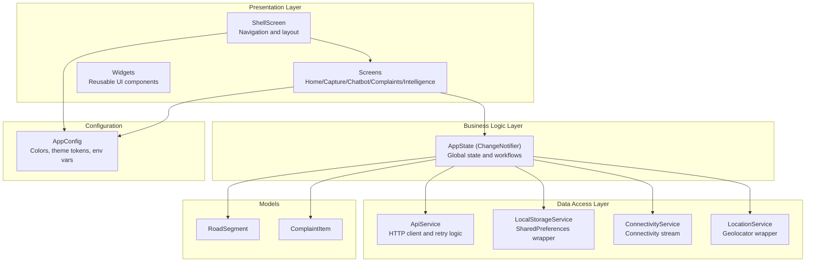
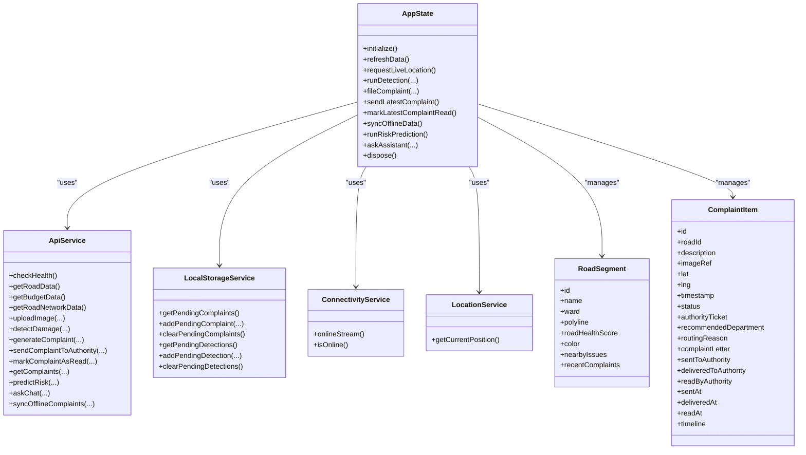
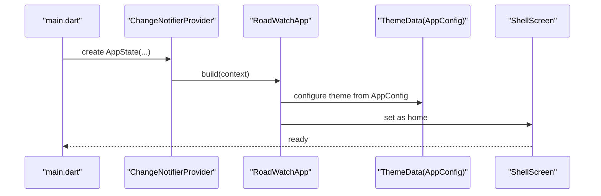
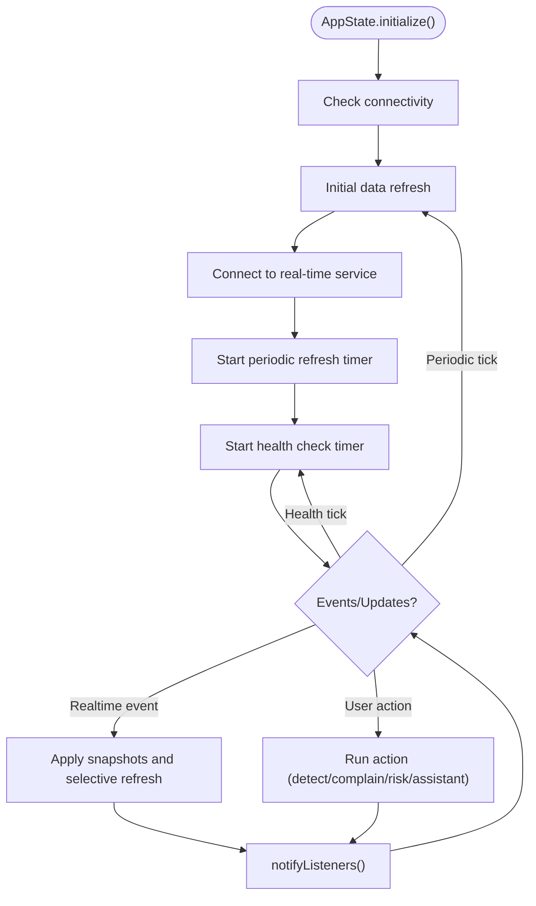
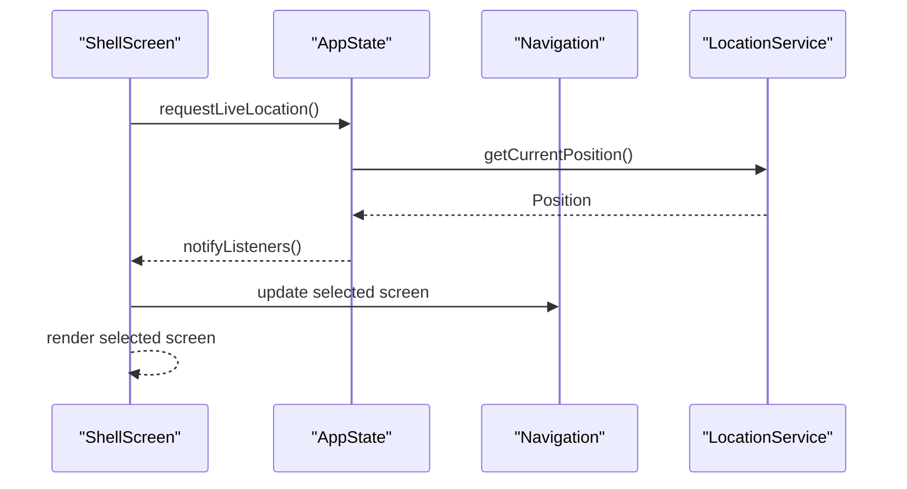
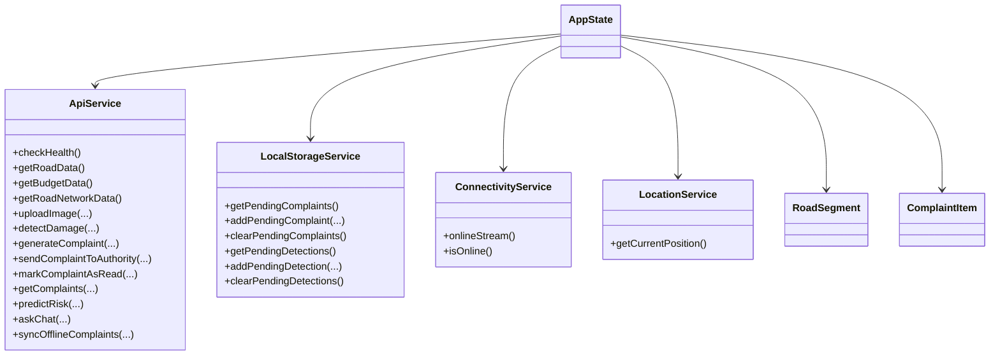
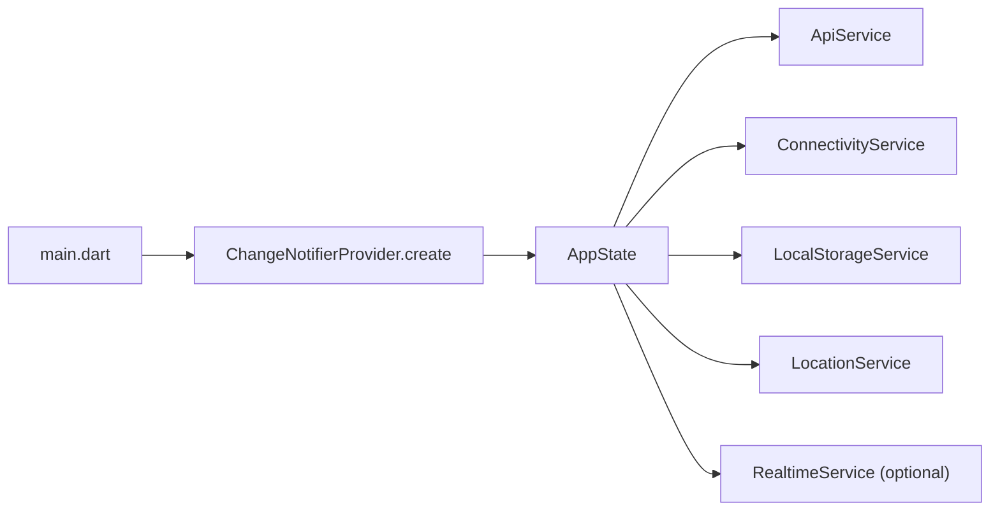

# Application Architecture

<cite>
**Referenced Files in This Document**
- [main.dart](file://roadwatch_ai/frontend/lib/main.dart)
- [app_config.dart](file://roadwatch_ai/frontend/lib/config/app_config.dart)
- [app_state.dart](file://roadwatch_ai/frontend/lib/providers/app_state.dart)
- [shell_screen.dart](file://roadwatch_ai/frontend/lib/screens/shell_screen.dart)
- [api_service.dart](file://roadwatch_ai/frontend/lib/services/api_service.dart)
- [connectivity_service.dart](file://roadwatch_ai/frontend/lib/services/connectivity_service.dart)
- [local_storage_service.dart](file://roadwatch_ai/frontend/lib/services/local_storage_service.dart)
- [location_service.dart](file://roadwatch_ai/frontend/lib/services/location_service.dart)
- [road_segment.dart](file://roadwatch_ai/frontend/lib/models/road_segment.dart)
- [complaint.dart](file://roadwatch_ai/frontend/lib/models/complaint.dart)
- [pubspec.yaml](file://roadwatch_ai/frontend/pubspec.yaml)
</cite>

## Table of Contents
1. [Introduction](#introduction)
2. [Project Structure](#project-structure)
3. [Core Components](#core-components)
4. [Architecture Overview](#architecture-overview)
5. [Detailed Component Analysis](#detailed-component-analysis)
6. [Dependency Analysis](#dependency-analysis)
7. [Performance Considerations](#performance-considerations)
8. [Troubleshooting Guide](#troubleshooting-guide)
9. [Conclusion](#conclusion)

## Introduction
This document explains the Flutter application architecture for the RoadWatch AI platform. It focuses on the MVVM pattern with Provider-based state management, the application entry point structure, and the theme configuration system. It also documents the architectural layers (presentation, business logic, and data access), dependency injection setup, service initialization order, global state management, and the separation of concerns. Design patterns used throughout the application are highlighted to show how they contribute to maintainability and scalability.

## Project Structure
The Flutter frontend is organized into distinct layers:
- Presentation layer: Screens and widgets that render UI and orchestrate user interactions.
- Business logic layer: The AppState provider encapsulates application-wide state and orchestrates workflows.
- Data access layer: Services handle HTTP requests, local storage, connectivity checks, and location retrieval.
- Models: Immutable data transfer objects used across layers.
- Configuration: Centralized theme and environment configuration.

**Diagram sources**
- [shell_screen.dart:12-131](file://roadwatch_ai/frontend/lib/screens/shell_screen.dart#L12-L131)
- [app_state.dart:20-33](file://roadwatch_ai/frontend/lib/providers/app_state.dart#L20-L33)
- [api_service.dart:17-23](file://roadwatch_ai/frontend/lib/services/api_service.dart#L17-L23)
- [local_storage_service.dart:5-52](file://roadwatch_ai/frontend/lib/services/local_storage_service.dart#L5-L52)
- [connectivity_service.dart:5-26](file://roadwatch_ai/frontend/lib/services/connectivity_service.dart#L5-L26)
- [location_service.dart:3-22](file://roadwatch_ai/frontend/lib/services/location_service.dart#L3-L22)
- [road_segment.dart:15-50](file://roadwatch_ai/frontend/lib/models/road_segment.dart#L15-L50)
- [complaint.dart:21-90](file://roadwatch_ai/frontend/lib/models/complaint.dart#L21-L90)
- [app_config.dart:3-29](file://roadwatch_ai/frontend/lib/config/app_config.dart#L3-L29)

**Section sources**
- [main.dart:13-115](file://roadwatch_ai/frontend/lib/main.dart#L13-L115)
- [pubspec.yaml:9-27](file://roadwatch_ai/frontend/pubspec.yaml#L9-L27)

## Core Components
- Application entry point initializes the app shell and global theme, then wraps the UI with Provider to expose AppState across the tree.
- AppState is the central state manager, holding lists of roads, budgets, road network, complaints, and live status flags. It coordinates periodic refreshes, real-time updates, connectivity monitoring, location fetching, and offline synchronization.
- Services encapsulate external concerns: HTTP calls, connectivity, local persistence, and geolocation.
- Models define typed data structures for road segments, complaints, and related entities.
- AppConfig centralizes theme tokens and environment variables.

Key responsibilities:
- Entry point: [main.dart:13-115](file://roadwatch_ai/frontend/lib/main.dart#L13-L115)
- Global state: [app_state.dart:20-637](file://roadwatch_ai/frontend/lib/providers/app_state.dart#L20-L637)
- HTTP and fallbacks: [api_service.dart:17-381](file://roadwatch_ai/frontend/lib/services/api_service.dart#L17-L381)
- Connectivity: [connectivity_service.dart:5-26](file://roadwatch_ai/frontend/lib/services/connectivity_service.dart#L5-L26)
- Local storage: [local_storage_service.dart:5-52](file://roadwatch_ai/frontend/lib/services/local_storage_service.dart#L5-L52)
- Location: [location_service.dart:3-22](file://roadwatch_ai/frontend/lib/services/location_service.dart#L3-L22)
- Models: [road_segment.dart:15-50](file://roadwatch_ai/frontend/lib/models/road_segment.dart#L15-L50), [complaint.dart:21-90](file://roadwatch_ai/frontend/lib/models/complaint.dart#L21-L90)
- Theme and tokens: [app_config.dart:3-29](file://roadwatch_ai/frontend/lib/config/app_config.dart#L3-L29)

**Section sources**
- [main.dart:13-115](file://roadwatch_ai/frontend/lib/main.dart#L13-L115)
- [app_state.dart:20-637](file://roadwatch_ai/frontend/lib/providers/app_state.dart#L20-L637)
- [api_service.dart:17-381](file://roadwatch_ai/frontend/lib/services/api_service.dart#L17-L381)
- [connectivity_service.dart:5-26](file://roadwatch_ai/frontend/lib/services/connectivity_service.dart#L5-L26)
- [local_storage_service.dart:5-52](file://roadwatch_ai/frontend/lib/services/local_storage_service.dart#L5-L52)
- [location_service.dart:3-22](file://roadwatch_ai/frontend/lib/services/location_service.dart#L3-L22)
- [road_segment.dart:15-50](file://roadwatch_ai/frontend/lib/models/road_segment.dart#L15-L50)
- [complaint.dart:21-90](file://roadwatch_ai/frontend/lib/models/complaint.dart#L21-L90)
- [app_config.dart:3-29](file://roadwatch_ai/frontend/lib/config/app_config.dart#L3-L29)

## Architecture Overview
The application follows MVVM with Provider:
- View: Flutter widgets and screens.
- ViewModel: AppState (ChangeNotifier) manages UI state and orchestrates workflows.
- Model: Services and models encapsulate data and business rules.

**Diagram sources**
- [app_state.dart:20-637](file://roadwatch_ai/frontend/lib/providers/app_state.dart#L20-L637)
- [api_service.dart:17-381](file://roadwatch_ai/frontend/lib/services/api_service.dart#L17-L381)
- [local_storage_service.dart:5-52](file://roadwatch_ai/frontend/lib/services/local_storage_service.dart#L5-L52)
- [connectivity_service.dart:5-26](file://roadwatch_ai/frontend/lib/services/connectivity_service.dart#L5-L26)
- [location_service.dart:3-22](file://roadwatch_ai/frontend/lib/services/location_service.dart#L3-L22)
- [road_segment.dart:15-50](file://roadwatch_ai/frontend/lib/models/road_segment.dart#L15-L50)
- [complaint.dart:21-90](file://roadwatch_ai/frontend/lib/models/complaint.dart#L21-L90)

## Detailed Component Analysis

### Application Entry Point and Theme Configuration
The entry point sets up:
- Global Provider with AppState initialized during app build.
- MaterialApp with Material 3 and a comprehensive ThemeData built from AppConfig tokens.
- ShellScreen as the home screen.

**Diagram sources**
- [main.dart:13-115](file://roadwatch_ai/frontend/lib/main.dart#L13-L115)
- [app_config.dart:3-29](file://roadwatch_ai/frontend/lib/config/app_config.dart#L3-L29)

**Section sources**
- [main.dart:13-115](file://roadwatch_ai/frontend/lib/main.dart#L13-L115)
- [app_config.dart:3-29](file://roadwatch_ai/frontend/lib/config/app_config.dart#L3-L29)

### AppState: MVVM ViewModel and Global State Manager
AppState acts as the central ViewModel:
- Holds lists of roads, budgets, road network, complaints, and live status flags.
- Initializes connectivity monitoring, periodic refresh, backend health checks, and real-time socket connection.
- Provides methods for UI actions: detection, complaints, risk prediction, assistant chat, and offline sync.
- Implements snapshot-based updates for real-time events and selective refresh strategies.

**Diagram sources**
- [app_state.dart:78-116](file://roadwatch_ai/frontend/lib/providers/app_state.dart#L78-L116)
- [app_state.dart:214-274](file://roadwatch_ai/frontend/lib/providers/app_state.dart#L214-L274)
- [app_state.dart:276-295](file://roadwatch_ai/frontend/lib/providers/app_state.dart#L276-L295)
- [app_state.dart:416-462](file://roadwatch_ai/frontend/lib/providers/app_state.dart#L416-L462)
- [app_state.dart:464-533](file://roadwatch_ai/frontend/lib/providers/app_state.dart#L464-L533)
- [app_state.dart:587-599](file://roadwatch_ai/frontend/lib/providers/app_state.dart#L587-L599)
- [app_state.dart:601-626](file://roadwatch_ai/frontend/lib/providers/app_state.dart#L601-L626)

**Section sources**
- [app_state.dart:20-637](file://roadwatch_ai/frontend/lib/providers/app_state.dart#L20-L637)

### Screen Navigation and Layout (ShellScreen)
ShellScreen:
- Manages bottom rail or sidebar navigation.
- Requests live location on first frame.
- Shows offline sync FAB when offline.
- Hosts the five main screens: Home, Capture, Assistant, Complaints, Intelligence.

**Diagram sources**
- [shell_screen.dart:19-51](file://roadwatch_ai/frontend/lib/screens/shell_screen.dart#L19-L51)
- [shell_screen.dart:54-131](file://roadwatch_ai/frontend/lib/screens/shell_screen.dart#L54-L131)
- [app_state.dart:276-295](file://roadwatch_ai/frontend/lib/providers/app_state.dart#L276-L295)
- [location_service.dart:3-22](file://roadwatch_ai/frontend/lib/services/location_service.dart#L3-L22)

**Section sources**
- [shell_screen.dart:12-131](file://roadwatch_ai/frontend/lib/screens/shell_screen.dart#L12-L131)

### Data Access Layer: Services and Models
Services:
- ApiService: HTTP client with retry logic, timeouts, and fallbacks to demo data.
- LocalStorageService: SharedPreferences-backed queue for offline actions.
- ConnectivityService: Stream of connectivity changes.
- LocationService: Geolocator wrapper with permission handling.

Models:
- RoadSegment: Typed representation of road data.
- ComplaintItem: Typed representation of complaint records.

**Diagram sources**
- [api_service.dart:17-381](file://roadwatch_ai/frontend/lib/services/api_service.dart#L17-L381)
- [local_storage_service.dart:5-52](file://roadwatch_ai/frontend/lib/services/local_storage_service.dart#L5-L52)
- [connectivity_service.dart:5-26](file://roadwatch_ai/frontend/lib/services/connectivity_service.dart#L5-L26)
- [location_service.dart:3-22](file://roadwatch_ai/frontend/lib/services/location_service.dart#L3-L22)
- [road_segment.dart:15-50](file://roadwatch_ai/frontend/lib/models/road_segment.dart#L15-L50)
- [complaint.dart:21-90](file://roadwatch_ai/frontend/lib/models/complaint.dart#L21-L90)
- [app_state.dart:20-33](file://roadwatch_ai/frontend/lib/providers/app_state.dart#L20-L33)

**Section sources**
- [api_service.dart:17-381](file://roadwatch_ai/frontend/lib/services/api_service.dart#L17-L381)
- [local_storage_service.dart:5-52](file://roadwatch_ai/frontend/lib/services/local_storage_service.dart#L5-L52)
- [connectivity_service.dart:5-26](file://roadwatch_ai/frontend/lib/services/connectivity_service.dart#L5-L26)
- [location_service.dart:3-22](file://roadwatch_ai/frontend/lib/services/location_service.dart#L3-L22)
- [road_segment.dart:15-50](file://roadwatch_ai/frontend/lib/models/road_segment.dart#L15-L50)
- [complaint.dart:21-90](file://roadwatch_ai/frontend/lib/models/complaint.dart#L21-L90)

## Dependency Analysis
Provider-based dependency injection:
- AppState is constructed in the entry point and passed to ChangeNotifierProvider.create.
- AppState receives ApiService, ConnectivityService, LocalStorageService, and LocationService via constructor injection.
- RealtimeService is injected optionally; if absent, a default instance is created inside AppState.

**Diagram sources**
- [main.dart:22-28](file://roadwatch_ai/frontend/lib/main.dart#L22-L28)
- [app_state.dart:27-33](file://roadwatch_ai/frontend/lib/providers/app_state.dart#L27-L33)

Service initialization order:
- Connectivity subscription is established first.
- Initial data refresh runs next.
- Real-time connection attempts are made.
- Periodic timers are started for refresh and health checks.

**Section sources**
- [main.dart:22-28](file://roadwatch_ai/frontend/lib/main.dart#L22-L28)
- [app_state.dart:78-116](file://roadwatch_ai/frontend/lib/providers/app_state.dart#L78-L116)

## Performance Considerations
- Periodic refresh and health checks are gated by online and backend reachability flags to avoid unnecessary work.
- Real-time updates are applied selectively to minimize rebuilds; only affected items are replaced and listeners notified.
- Image upload and detection fall back to demo identifiers when backend is unavailable, ensuring responsiveness.
- Connectivity and location operations are wrapped with timeouts and defensive checks to prevent UI stalls.

[No sources needed since this section provides general guidance]

## Troubleshooting Guide
Common scenarios and diagnostics:
- Offline mode: AppState queues complaints and detections; the sync button triggers sync when online.
- Connectivity issues: AppState listens to connectivity changes and disables auto-refresh until reconnected.
- Backend unreachability: Health checks toggle availability; UI reflects backend status.
- Location errors: LocationService throws descriptive exceptions; AppState surfaces user-friendly messages.

**Section sources**
- [app_state.dart:544-585](file://roadwatch_ai/frontend/lib/providers/app_state.dart#L544-L585)
- [app_state.dart:80-87](file://roadwatch_ai/frontend/lib/providers/app_state.dart#L80-L87)
- [app_state.dart:118-124](file://roadwatch_ai/frontend/lib/providers/app_state.dart#L118-L124)
- [location_service.dart:5-21](file://roadwatch_ai/frontend/lib/services/location_service.dart#L5-L21)

## Conclusion
The application employs a clean MVVM architecture with Provider for state management. AppState centralizes business logic and global state, while services isolate data access concerns. The entry point configures the theme and DI container, and ShellScreen provides a responsive navigation shell. The design emphasizes separation of concerns, resilience through fallbacks, and scalability via modular services and typed models.