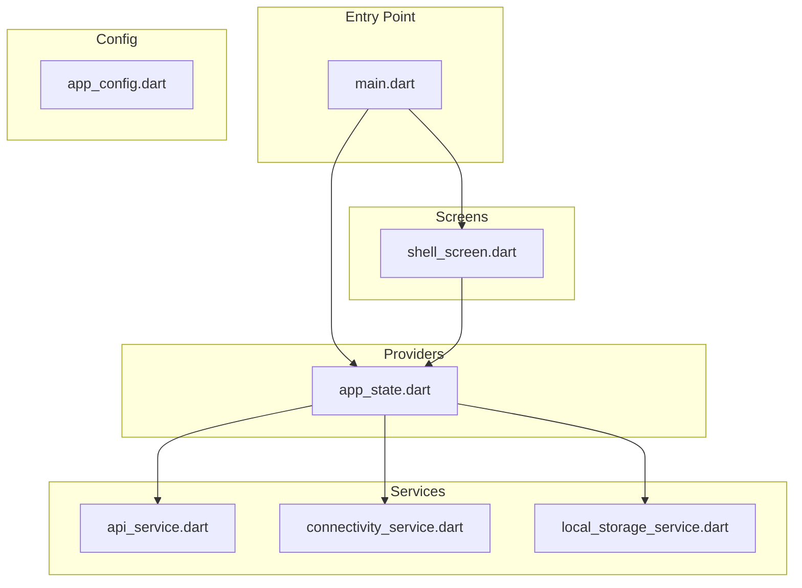
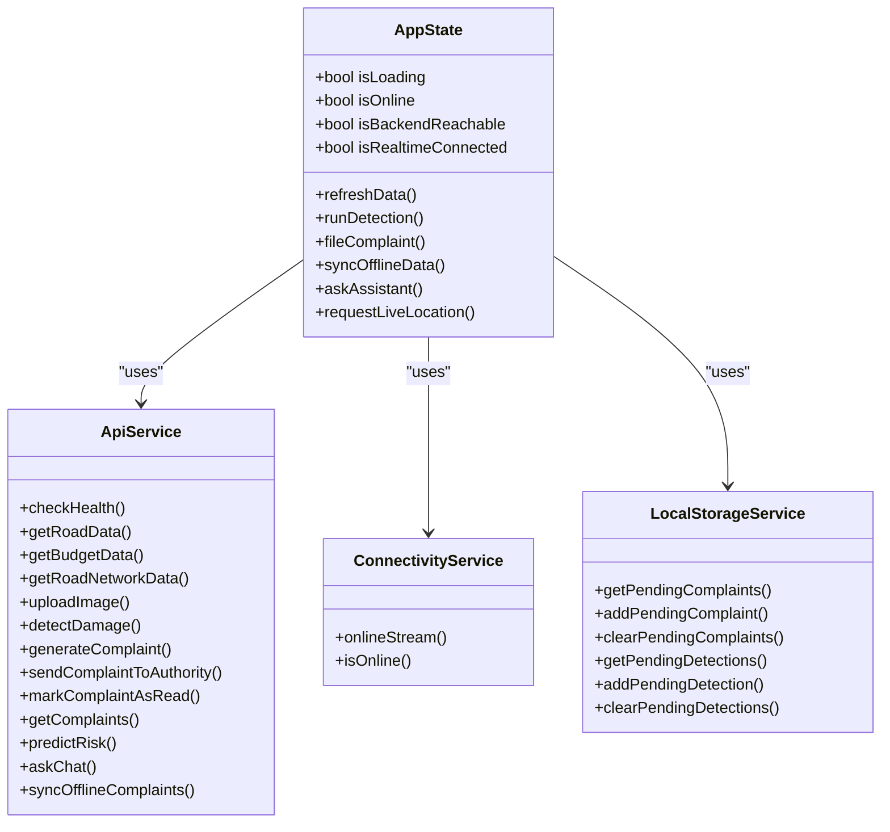
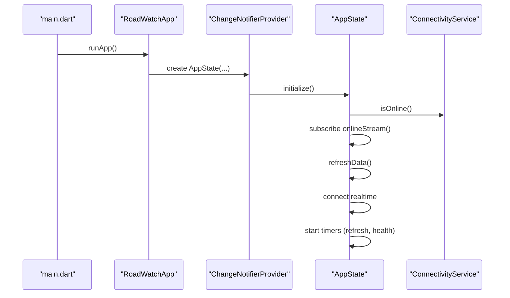
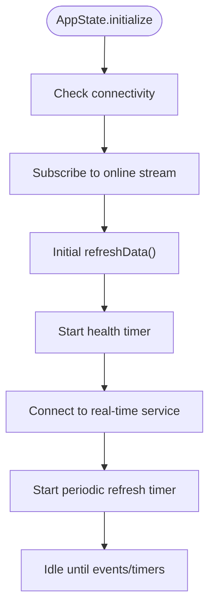
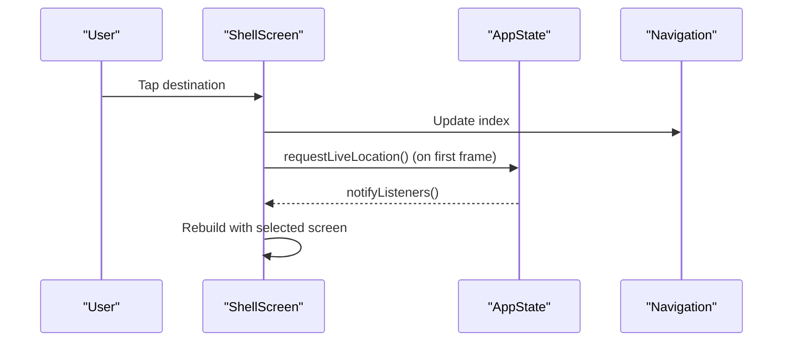
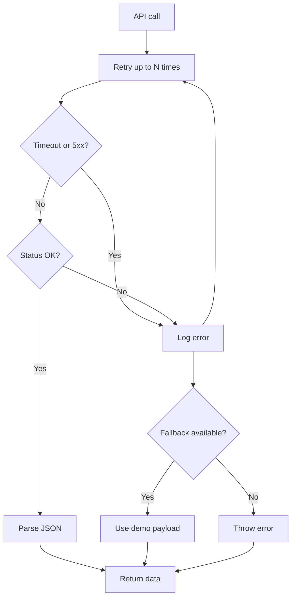
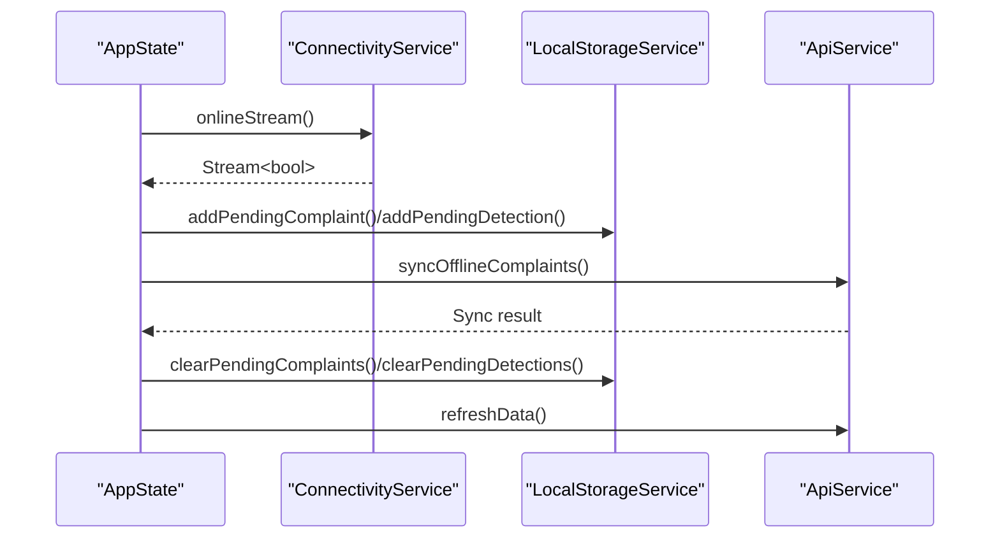
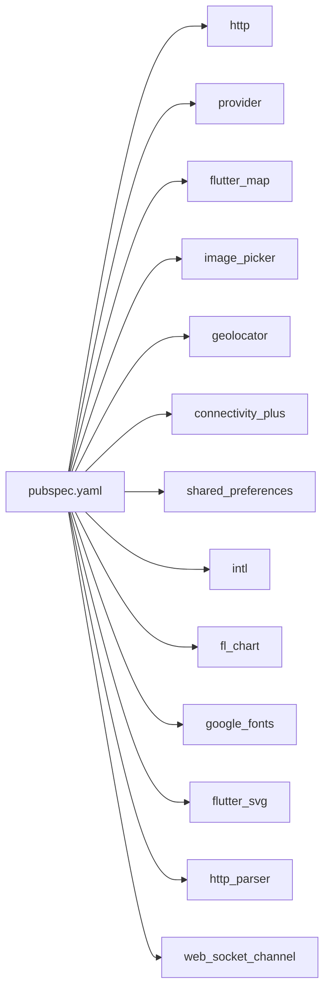

# Frontend Application Guide

<cite>
**Referenced Files in This Document**
- [main.dart](file://roadwatch_ai/frontend/lib/main.dart)
- [app_config.dart](file://roadwatch_ai/frontend/lib/config/app_config.dart)
- [app_state.dart](file://roadwatch_ai/frontend/lib/providers/app_state.dart)
- [shell_screen.dart](file://roadwatch_ai/frontend/lib/screens/shell_screen.dart)
- [api_service.dart](file://roadwatch_ai/frontend/lib/services/api_service.dart)
- [connectivity_service.dart](file://roadwatch_ai/frontend/lib/services/connectivity_service.dart)
- [local_storage_service.dart](file://roadwatch_ai/frontend/lib/services/local_storage_service.dart)
- [pubspec.yaml](file://roadwatch_ai/frontend/pubspec.yaml)
</cite>

## Table of Contents
1. [Introduction](#introduction)
2. [Project Structure](#project-structure)
3. [Core Components](#core-components)
4. [Architecture Overview](#architecture-overview)
5. [Detailed Component Analysis](#detailed-component-analysis)
6. [Dependency Analysis](#dependency-analysis)
7. [Performance Considerations](#performance-considerations)
8. [Troubleshooting Guide](#troubleshooting-guide)
9. [Conclusion](#conclusion)
10. [Appendices](#appendices)

## Introduction
This guide documents the Flutter frontend of the RoadWatch AI application. It explains the application structure, MVVM architecture with Provider-based state management, navigation patterns, async data loading strategies, error handling, offline-first capabilities, responsive design, accessibility, and cross-platform deployment considerations. The key screens covered include Home, Capture, Assistant (Chatbot), Complaints, Intelligence, and Transparency modules.

## Project Structure
The frontend is organized by feature and responsibility:
- Entry point initializes the app shell and global state.
- Providers encapsulate application-wide state and orchestrate async operations.
- Services handle networking, connectivity, local storage, and real-time updates.
- Screens implement UI for each module and consume state via Provider.
- Config defines theme, branding, and environment-driven settings.

**Diagram sources**
- [main.dart:13-115](file://roadwatch_ai/frontend/lib/main.dart#L13-L115)
- [app_state.dart:20-33](file://roadwatch_ai/frontend/lib/providers/app_state.dart#L20-L33)
- [api_service.dart:17-23](file://roadwatch_ai/frontend/lib/services/api_service.dart#L17-L23)
- [connectivity_service.dart:5-26](file://roadwatch_ai/frontend/lib/services/connectivity_service.dart#L5-L26)
- [local_storage_service.dart:5-52](file://roadwatch_ai/frontend/lib/services/local_storage_service.dart#L5-L52)
- [shell_screen.dart:12-131](file://roadwatch_ai/frontend/lib/screens/shell_screen.dart#L12-L131)
- [app_config.dart:3-29](file://roadwatch_ai/frontend/lib/config/app_config.dart#L3-L29)

**Section sources**
- [main.dart:13-115](file://roadwatch_ai/frontend/lib/main.dart#L13-L115)
- [pubspec.yaml:9-38](file://roadwatch_ai/frontend/pubspec.yaml#L9-L38)

## Core Components
- Entry point and theme: Initializes the app, sets Material 3 theme, and wraps the app with Provider for global state.
- AppState (MVVM ViewModel): Central state manager coordinating data fetching, real-time updates, location, and offline sync.
- Services: ApiService handles HTTP requests with retry and fallback; ConnectivityService monitors connectivity; LocalStorageService persists offline actions.
- ShellScreen: Navigation shell implementing bottom rail on mobile and sidebar on wide screens, hosting module screens.

Key responsibilities:
- Global theme and typography via AppConfig and Material 3.
- Provider-based state propagation and change notifications.
- Periodic refresh and health checks.
- Real-time socket integration with graceful degradation.
- Offline-first workflows for detection and complaints.

**Section sources**
- [main.dart:17-115](file://roadwatch_ai/frontend/lib/main.dart#L17-L115)
- [app_state.dart:20-116](file://roadwatch_ai/frontend/lib/providers/app_state.dart#L20-L116)
- [api_service.dart:17-62](file://roadwatch_ai/frontend/lib/services/api_service.dart#L17-L62)
- [connectivity_service.dart:5-26](file://roadwatch_ai/frontend/lib/services/connectivity_service.dart#L5-L26)
- [local_storage_service.dart:5-52](file://roadwatch_ai/frontend/lib/services/local_storage_service.dart#L5-L52)
- [shell_screen.dart:19-131](file://roadwatch_ai/frontend/lib/screens/shell_screen.dart#L19-L131)

## Architecture Overview
The application follows MVVM with Provider:
- Model: Data classes for road segments, budget records, complaints, detections, risk predictions, and chat items.
- View: Screens and widgets rendering UI.
- ViewModel: AppState manages state transitions, async operations, and exposes reactive getters.
- Provider: ChangeNotifierProvider supplies AppState to the widget tree.

**Diagram sources**
- [app_state.dart:20-637](file://roadwatch_ai/frontend/lib/providers/app_state.dart#L20-L637)
- [api_service.dart:17-381](file://roadwatch_ai/frontend/lib/services/api_service.dart#L17-L381)
- [connectivity_service.dart:5-26](file://roadwatch_ai/frontend/lib/services/connectivity_service.dart#L5-L26)
- [local_storage_service.dart:5-52](file://roadwatch_ai/frontend/lib/services/local_storage_service.dart#L5-L52)

## Detailed Component Analysis

### Entry Point and App Initialization
- Initializes AppState with injected services and calls initialize to set up connectivity monitoring, periodic refresh, health checks, and real-time connection.
- Sets Material 3 theme, typography, and global UI styles via AppConfig.

**Diagram sources**
- [main.dart:13-115](file://roadwatch_ai/frontend/lib/main.dart#L13-L115)
- [app_state.dart:78-116](file://roadwatch_ai/frontend/lib/providers/app_state.dart#L78-L116)
- [connectivity_service.dart:8-15](file://roadwatch_ai/frontend/lib/services/connectivity_service.dart#L8-L15)

**Section sources**
- [main.dart:13-115](file://roadwatch_ai/frontend/lib/main.dart#L13-L115)
- [app_state.dart:78-116](file://roadwatch_ai/frontend/lib/providers/app_state.dart#L78-L116)

### AppState (MVVM ViewModel)
Responsibilities:
- Lifecycle: initialize subscribes to connectivity, starts periodic refresh and health checks, connects to real-time service, and triggers initial data load.
- Data orchestration: fetches road, budget, network, and complaints data; exposes reactive getters for selected road/network and computed lists.
- Real-time updates: applies incremental snapshots for road scores and complaints; falls back to refresh when needed.
- Offline-first: queues detection and complaint requests; syncs when online.
- Location: quick acquisition with timeout; status reporting.
- Assistant: maintains chat history and delegates to ApiService.
- Risk prediction: computes risk using selected road metadata and indices.

**Diagram sources**
- [app_state.dart:78-116](file://roadwatch_ai/frontend/lib/providers/app_state.dart#L78-L116)

**Section sources**
- [app_state.dart:20-637](file://roadwatch_ai/frontend/lib/providers/app_state.dart#L20-L637)

### Navigation Shell (ShellScreen)
- Mobile: Bottom NavigationBar with five destinations mapped to module screens.
- Desktop/Wide: Sidebar NavigationRail with status chips and destinations; main content area hosts the selected screen.
- Responsive layout: Uses MediaQuery to switch between layouts.
- Offline action: Floating action button triggers sync when offline.

**Diagram sources**
- [shell_screen.dart:19-131](file://roadwatch_ai/frontend/lib/screens/shell_screen.dart#L19-L131)
- [app_state.dart:276-295](file://roadwatch_ai/frontend/lib/providers/app_state.dart#L276-L295)

**Section sources**
- [shell_screen.dart:19-131](file://roadwatch_ai/frontend/lib/screens/shell_screen.dart#L19-L131)

### API Service (Async Data Loading and Fallbacks)
- Health checks and retry logic with capped attempts and timeouts.
- Fallbacks to demo data when backend is unreachable.
- Robust image upload with content-type detection and public URL preference.
- Real-time-friendly endpoints for detection, complaints, risk prediction, and chat.

**Diagram sources**
- [api_service.dart:33-52](file://roadwatch_ai/frontend/lib/services/api_service.dart#L33-L52)
- [api_service.dart:64-75](file://roadwatch_ai/frontend/lib/services/api_service.dart#L64-L75)

**Section sources**
- [api_service.dart:17-381](file://roadwatch_ai/frontend/lib/services/api_service.dart#L17-L381)

### Connectivity and Offline Storage
- ConnectivityService translates device connectivity changes to a boolean stream.
- LocalStorageService persists pending complaints and detections using SharedPreferences.
- AppState orchestrates offline queuing and sync upon reconnection.

**Diagram sources**
- [connectivity_service.dart:8-15](file://roadwatch_ai/frontend/lib/services/connectivity_service.dart#L8-L15)
- [local_storage_service.dart:9-24](file://roadwatch_ai/frontend/lib/services/local_storage_service.dart#L9-L24)
- [local_storage_service.dart:31-46](file://roadwatch_ai/frontend/lib/services/local_storage_service.dart#L31-L46)
- [app_state.dart:544-585](file://roadwatch_ai/frontend/lib/providers/app_state.dart#L544-L585)
- [api_service.dart:352-368](file://roadwatch_ai/frontend/lib/services/api_service.dart#L352-L368)

**Section sources**
- [connectivity_service.dart:5-26](file://roadwatch_ai/frontend/lib/services/connectivity_service.dart#L5-L26)
- [local_storage_service.dart:5-52](file://roadwatch_ai/frontend/lib/services/local_storage_service.dart#L5-L52)
- [app_state.dart:544-585](file://roadwatch_ai/frontend/lib/providers/app_state.dart#L544-L585)
- [api_service.dart:352-368](file://roadwatch_ai/frontend/lib/services/api_service.dart#L352-L368)

### Screen Modules Overview
- Home: Displays road map, health overview, and intelligence summaries. Uses AppState for data and selected road context.
- Capture: Image selection and upload flow; integrates with detection pipeline and offline queue.
- Assistant (Chatbot): Chat UI with history; queries backend assistant with context.
- Complaints: Complaint creation, preview, sending to authority, and read tracking.
- Intelligence: Risk prediction and analytics insights.
- Transparency: Public data presentation and road network details.

Note: The screens are composed within ShellScreen and consume AppState via Provider. Specific screen implementations are located under the screens directory and referenced here by name.

**Section sources**
- [shell_screen.dart:23-29](file://roadwatch_ai/frontend/lib/screens/shell_screen.dart#L23-L29)

## Dependency Analysis
External dependencies include http, provider, flutter_map, image_picker, geolocator, connectivity_plus, shared_preferences, path_provider, intl, fl_chart, google_fonts, flutter_svg, http_parser, and web_socket_channel. These enable networking, state management, maps, camera, location, connectivity, persistence, charts, fonts, SVG support, and WebSocket channels.

**Diagram sources**
- [pubspec.yaml:9-38](file://roadwatch_ai/frontend/pubspec.yaml#L9-L38)

**Section sources**
- [pubspec.yaml:9-38](file://roadwatch_ai/frontend/pubspec.yaml#L9-L38)

## Performance Considerations
- Minimize rebuilds: Use Provider context.watch only where needed; separate stateful widgets and keep listeners scoped.
- Debounce UI updates: Batch updates when applying real-time snapshots to avoid frequent rebuilds.
- Efficient data structures: Use indexed lookups for selected items and precomputed lists (districts, search results).
- Network resilience: Respect timeouts and retries; leverage fallbacks to maintain responsiveness.
- Timers and intervals: Cancel timers on dispose; avoid redundant subscriptions.
- Images: Prefer smaller previews for uploads; cache where appropriate.
- Offline sync: Defer heavy operations until connectivity resumes.

## Troubleshooting Guide
Common issues and remedies:
- Backend unreachable:
  - Symptoms: Health status false, demo fallbacks, reduced functionality.
  - Actions: Verify API_URL environment; check connectivity; rely on offline queue.
- Real-time disconnect:
  - Symptoms: Realtime status indicates reconnecting.
  - Actions: Ensure WebSocket availability; AppState continues normal operation.
- Offline sync failures:
  - Symptoms: Pending items remain; sync button present.
  - Actions: Re-attempt sync when online; review stored payloads.
- Location errors:
  - Symptoms: Location status messages; null position.
  - Actions: Grant permissions; retry quick position with timeout.
- Navigation glitches:
  - Symptoms: Incorrect destination selection or layout mismatch.
  - Actions: Confirm index updates; verify responsive breakpoints.

**Section sources**
- [app_state.dart:118-124](file://roadwatch_ai/frontend/lib/providers/app_state.dart#L118-L124)
- [app_state.dart:92-102](file://roadwatch_ai/frontend/lib/providers/app_state.dart#L92-L102)
- [app_state.dart:544-585](file://roadwatch_ai/frontend/lib/providers/app_state.dart#L544-L585)
- [app_state.dart:285-295](file://roadwatch_ai/frontend/lib/providers/app_state.dart#L285-L295)
- [shell_screen.dart:105-129](file://roadwatch_ai/frontend/lib/screens/shell_screen.dart#L105-L129)

## Conclusion
The RoadWatch AI Flutter frontend implements a robust MVVM architecture with Provider for state management, resilient async data loading with fallbacks, and comprehensive offline-first workflows. The ShellScreen provides a responsive navigation model across devices, while services encapsulate networking, connectivity, and persistence. The design emphasizes maintainability, scalability, and user experience across mobile and web platforms.

## Appendices
- Theming and brand tokens are centralized in AppConfig for consistent UI.
- Environment variable API_URL controls backend base URL for deployment flexibility.

**Section sources**
- [app_config.dart:3-29](file://roadwatch_ai/frontend/lib/config/app_config.dart#L3-L29)