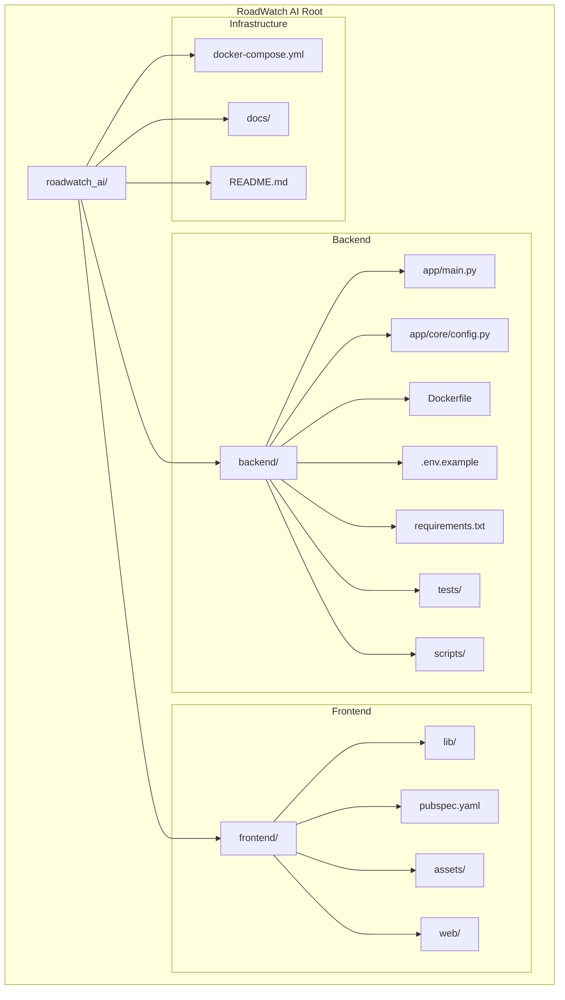
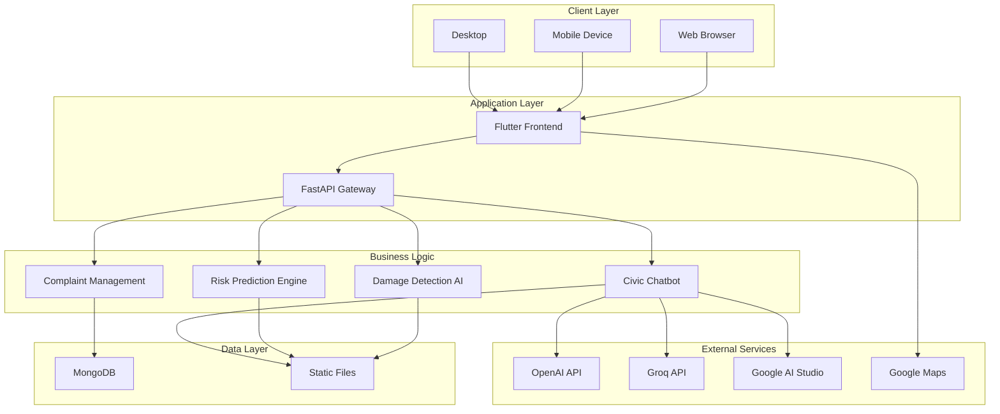
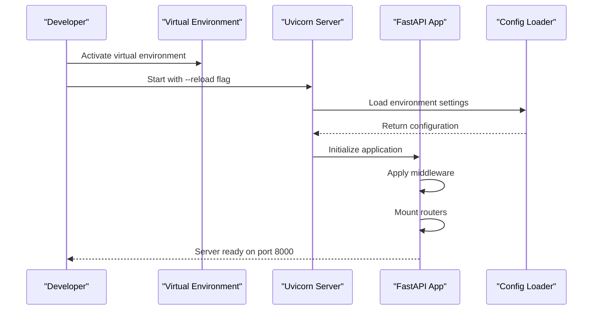
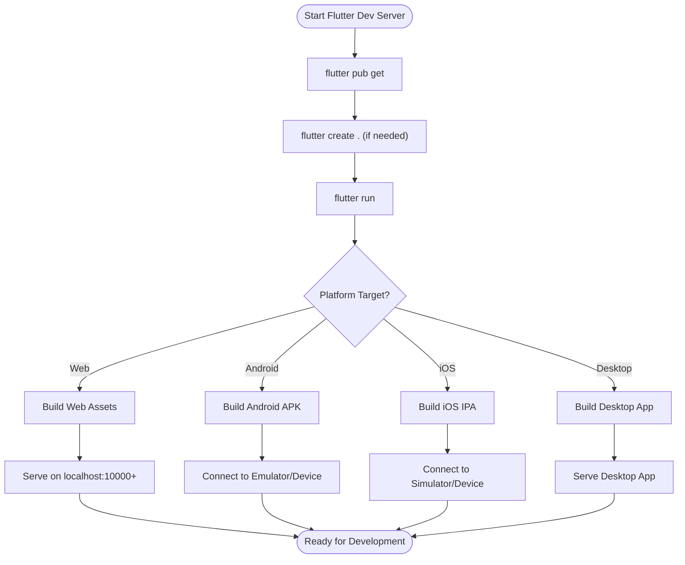
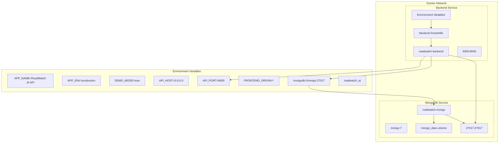
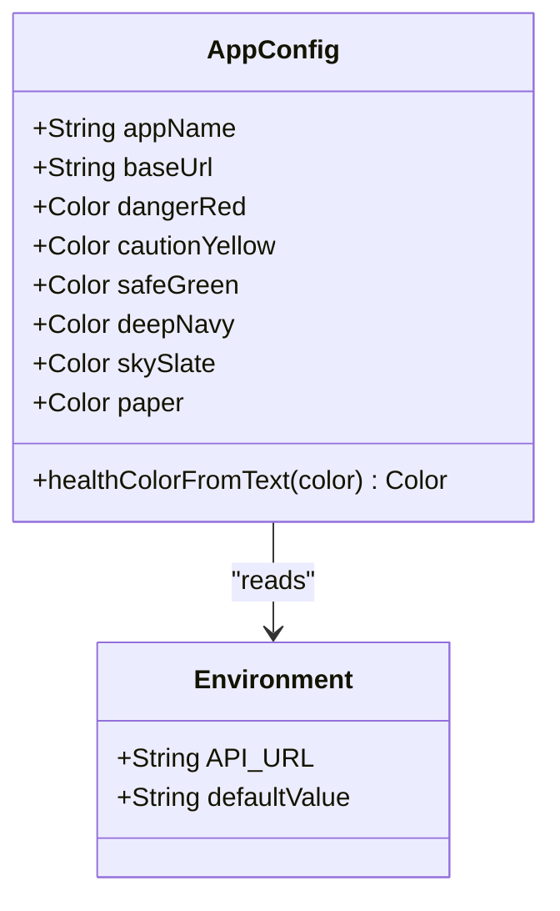
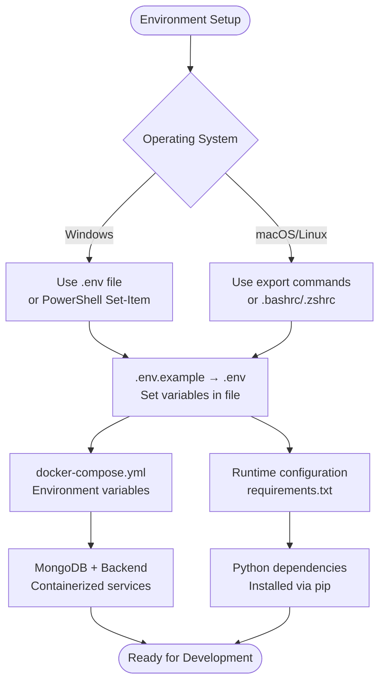

# Getting Started

<cite>
**Referenced Files in This Document**
- [README.md](file://roadwatch_ai/README.md)
- [SETUP.md](file://roadwatch_ai/docs/SETUP.md)
- [docker-compose.yml](file://roadwatch_ai/docker-compose.yml)
- [backend README.md](file://roadwatch_ai/backend/README.md)
- [backend requirements.txt](file://roadwatch_ai/backend/requirements.txt)
- [backend .env.example](file://roadwatch_ai/backend/.env.example)
- [backend Dockerfile](file://roadwatch_ai/backend/Dockerfile)
- [backend main.py](file://roadwatch_ai/backend/app/main.py)
- [backend config.py](file://roadwatch_ai/backend/app/core/config.py)
- [backend smoke_test.py](file://roadwatch_ai/backend/scripts/smoke_test.py)
- [backend test_api_smoke.py](file://roadwatch_ai/backend/tests/test_api_smoke.py)
- [frontend README.md](file://roadwatch_ai/frontend/README.md)
- [frontend pubspec.yaml](file://roadwatch_ai/frontend/pubspec.yaml)
- [frontend app_config.dart](file://roadwatch_ai/frontend/lib/config/app_config.dart)
- [frontend demo README.md](file://roadwatch_ai/frontend/assets/demo/README.md)
- [runtime.txt](file://roadwatch_ai/backend/runtime.txt)
</cite>

## Table of Contents
1. [Introduction](#introduction)
2. [Prerequisites](#prerequisites)
3. [Project Structure](#project-structure)
4. [Core Components](#core-components)
5. [Architecture Overview](#architecture-overview)
6. [Installation and Setup](#installation-and-setup)
7. [Development Server Startup](#development-server-startup)
8. [Docker Compose Local Development](#docker-compose-local-development)
9. [Environment Configuration](#environment-configuration)
10. [Initial Verification](#initial-verification)
11. [Troubleshooting Guide](#troubleshooting-guide)
12. [Platform-Specific Considerations](#platform-specific-considerations)
13. [Conclusion](#conclusion)

## Introduction
RoadWatch AI is an AI-powered civic intelligence platform that monitors road infrastructure using computer vision, spending transparency, complaint automation, and a civic chatbot. The platform consists of a FastAPI backend service and a Flutter frontend application with mobile and web support. This guide provides comprehensive setup instructions for local development across Windows, macOS, and Linux environments.

## Prerequisites
Before installing RoadWatch AI, ensure you have the following prerequisites:

- **Python 3.11+** (3.12 recommended): The backend is built with FastAPI and requires Python 3.11 or higher. The project specifies Python 3.12.10 in runtime configuration.
- **Flutter SDK 3.22+ and Dart SDK**: The frontend is built with Flutter and requires Dart SDK version >= 3.4.0 < 4.0.0.
- **Docker**: Optional but recommended for containerized development and deployment. Requires Docker Engine and Docker Compose.
- **MongoDB**: Optional database for persistent complaint records. Can run locally or use Docker Compose for orchestration.
- **Optional Dependencies**:
  - YOLO model weights for AI damage detection
  - OpenAI API key for advanced chatbot functionality
  - Google Cloud Maps API key for map functionality
  - Android Studio or Xcode for mobile development

**Section sources**
- [SETUP.md:3-8](file://roadwatch_ai/docs/SETUP.md#L3-L8)
- [runtime.txt:1](file://roadwatch_ai/backend/runtime.txt#L1)
- [pubspec.yaml:6](file://roadwatch_ai/frontend/pubspec.yaml#L6)

## Project Structure
The RoadWatch AI project follows a clear separation of concerns with distinct backend and frontend directories:



**Diagram sources**
- [README.md:15-102](file://roadwatch_ai/README.md#L15-L102)
- [backend main.py:1-37](file://roadwatch_ai/backend/app/main.py#L1-L37)
- [frontend pubspec.yaml:1-38](file://roadwatch_ai/frontend/pubspec.yaml#L1-L38)

**Section sources**
- [README.md:15-102](file://roadwatch_ai/README.md#L15-L102)

## Core Components
The RoadWatch AI platform consists of two primary components working together:

### Backend Services
The backend is built with FastAPI and provides:
- RESTful API endpoints for road data, damage detection, and complaint management
- AI-powered damage detection using YOLO models
- Risk prediction algorithms
- Chatbot integration with multiple LLM providers
- MongoDB integration for persistent storage
- Comprehensive test suite and smoke testing capabilities

### Frontend Application
The Flutter frontend offers:
- Cross-platform mobile and web support
- Interactive map dashboard with road health visualization
- AI-powered image capture and damage detection workflow
- Civic chatbot interface
- Transparency panel for budget and spending data
- Complaint timeline and offline queue synchronization
- Intelligence panel with predictive analytics

**Section sources**
- [README.md:9-13](file://roadwatch_ai/README.md#L9-L13)
- [backend README.md:17-31](file://roadwatch_ai/backend/README.md#L17-L31)
- [frontend README.md:13-20](file://roadwatch_ai/frontend/README.md#L13-L20)

## Architecture Overview
The system follows a microservice architecture pattern with clear separation between frontend and backend:



**Diagram sources**
- [backend main.py:13-36](file://roadwatch_ai/backend/app/main.py#L13-L36)
- [backend config.py:10-39](file://roadwatch_ai/backend/app/core/config.py#L10-L39)
- [frontend app_config.dart:5](file://roadwatch_ai/frontend/lib/config/app_config.dart#L5)

## Installation and Setup

### Backend Installation
Follow these steps to set up the backend development environment:

1. **Create Virtual Environment**
   ```bash
   python -m venv backend/.venv
   ```

2. **Activate Virtual Environment**
   - Windows PowerShell: `backend/.venv/Scripts/Activate.ps1`
   - Windows Command Prompt: `backend\venv\Scripts\activate.bat`
   - macOS/Linux: `source backend/.venv/bin/activate`

3. **Install Dependencies**
   ```bash
   pip install -r backend/requirements.txt
   ```

4. **Configure Environment Variables**
   ```bash
   cp backend/.env.example backend/.env
   ```

5. **Run Development Server**
   ```bash
   uvicorn backend/app/main:app --reload --host 0.0.0.0 --port 8000
   ```

**Section sources**
- [SETUP.md:10-22](file://roadwatch_ai/docs/SETUP.md#L10-L22)
- [backend README.md:5-9](file://roadwatch_ai/backend/README.md#L5-L9)
- [backend requirements.txt:1-18](file://roadwatch_ai/backend/requirements.txt#L1-L18)

### Frontend Installation
Set up the Flutter frontend with these steps:

1. **Generate Platform Folders (if missing)**
   ```bash
   cd frontend
   flutter create .
   ```

2. **Install Dependencies**
   ```bash
   flutter pub get
   ```

3. **Run Development Server**
   ```bash
   flutter run
   ```

4. **Configure API URL (optional)**
   ```bash
   flutter run --dart-define=API_URL=http://localhost:8000
   ```

**Section sources**
- [SETUP.md:55-76](file://roadwatch_ai/docs/SETUP.md#L55-L76)
- [frontend README.md:5-9](file://roadwatch_ai/frontend/README.md#L5-L9)

## Development Server Startup

### Backend Development Server
The backend uses Uvicorn for development with hot reload enabled:



**Diagram sources**
- [backend main.py:13-36](file://roadwatch_ai/backend/app/main.py#L13-L36)
- [backend config.py:37-39](file://roadwatch_ai/backend/app/core/config.py#L37-L39)

### Frontend Development Server
The Flutter frontend supports multiple platforms:



**Diagram sources**
- [frontend README.md:5-9](file://roadwatch_ai/frontend/README.md#L5-L9)

**Section sources**
- [backend README.md:5-9](file://roadwatch_ai/backend/README.md#L5-L9)
- [frontend README.md:5-9](file://roadwatch_ai/frontend/README.md#L5-L9)

## Docker Compose Local Development

### Docker Compose Configuration
The project includes a comprehensive Docker Compose setup for local development:



**Diagram sources**
- [docker-compose.yml:3-35](file://roadwatch_ai/docker-compose.yml#L3-L35)
- [backend Dockerfile:1-13](file://roadwatch_ai/backend/Dockerfile#L1-L13)

### Docker Compose Commands
Start the complete development environment:

```bash
# Build and start all services
docker compose up --build

# Start services in detached mode
docker compose up -d

# View service logs
docker compose logs -f

# Stop all services
docker compose down

# Rebuild specific service
docker compose build backend
```

**Section sources**
- [docker-compose.yml:1-35](file://roadwatch_ai/docker-compose.yml#L1-L35)
- [SETUP.md:42-48](file://roadwatch_ai/docs/SETUP.md#L42-L48)

## Environment Configuration

### Backend Environment Variables
The backend uses Pydantic settings loaded from environment files:

| Variable | Description | Default | Required |
|----------|-------------|---------|----------|
| `APP_NAME` | Application name | RoadWatch AI API | No |
| `APP_ENV` | Environment type | development | No |
| `DEMO_MODE` | Enable demo mode | false | No |
| `API_HOST` | Server host binding | 0.0.0.0 | No |
| `API_PORT` | Server port | 8000 | No |
| `MONGO_URI` | MongoDB connection string | None | No |
| `MONGO_DB` | Database name | roadwatch_ai | No |
| `YOLO_MODEL_PATH` | Path to YOLO weights | ./models/yolov8n.pt | No |
| `OPENAI_API_KEY` | OpenAI API key | None | No |
| `OPENAI_MODEL` | OpenAI model | gpt-4o-mini | No |
| `GROQ_API_KEY` | Groq API key | None | No |
| `GROQ_MODEL` | Groq model | llama-3.1-8b-instant | No |
| `GOOGLE_API_KEY` | Google AI key | None | No |
| `GOOGLE_MODEL` | Google model | gemini-1.5-flash | No |
| `FRONTEND_ORIGIN` | CORS origin | * | No |

### Frontend Configuration
The Flutter frontend reads configuration from environment variables:



**Diagram sources**
- [frontend app_config.dart:3-29](file://roadwatch_ai/frontend/lib/config/app_config.dart#L3-L29)

**Section sources**
- [backend .env.example:1-28](file://roadwatch_ai/backend/.env.example#L1-L28)
- [backend config.py:10-39](file://roadwatch_ai/backend/app/core/config.py#L10-L39)
- [frontend app_config.dart:5](file://roadwatch_ai/frontend/lib/config/app_config.dart#L5)

## Initial Verification

### Health Check
Verify the backend is running correctly:

```bash
# Check health endpoint
curl http://localhost:8000/health

# Expected response: {"ok": true}
```

### Smoke Testing
Run comprehensive smoke tests:

```bash
# Backend smoke test script
python backend/scripts/smoke_test.py

# Unit tests
cd backend
pytest -q
```

### Frontend Verification
Test the Flutter frontend:

```bash
# Install dependencies
flutter pub get

# Run on web
flutter run -d chrome

# Or run on mobile
flutter run
```

**Section sources**
- [SETUP.md:24-40](file://roadwatch_ai/docs/SETUP.md#L24-L40)
- [backend smoke_test.py:20-65](file://roadwatch_ai/backend/scripts/smoke_test.py#L20-L65)
- [backend test_api_smoke.py:9-14](file://roadwatch_ai/backend/tests/test_api_smoke.py#L9-L14)

## Troubleshooting Guide

### Common Issues and Solutions

#### Port Conflicts
**Problem**: Port 8000 already in use
**Solution**: Change API_PORT in .env or use a different port
```bash
# Update .env file
API_PORT=8001

# Or run with different port
uvicorn app.main:app --port 8001
```

#### MongoDB Connection Issues
**Problem**: Cannot connect to MongoDB
**Solution**: Verify Docker Compose is running or configure MONGO_URI
```bash
# Check MongoDB service status
docker compose ps mongo

# Test connection
docker compose exec mongo mongosh
```

#### Flutter Dependencies
**Problem**: Flutter pub get fails
**Solution**: Clear cache and reinstall
```bash
# Clear Flutter cache
flutter clean
flutter pub cache repair

# Get dependencies
flutter pub get
```

#### CORS Issues
**Problem**: Frontend cannot communicate with backend
**Solution**: Configure FRONTEND_ORIGIN in .env
```bash
# Allow specific origin
FRONTEND_ORIGIN=http://localhost:5000

# Or allow all (not recommended for production)
FRONTEND_ORIGIN=*
```

#### YOLO Model Loading
**Problem**: YOLO model not found
**Solution**: Download and place model weights
```bash
# Create models directory
mkdir backend/models

# Download YOLOv8n weights
# Place at backend/models/yolov8n.pt
```

**Section sources**
- [SETUP.md:92-119](file://roadwatch_ai/docs/SETUP.md#L92-L119)
- [backend .env.example:7-27](file://roadwatch_ai/backend/.env.example#L7-L27)

## Platform-Specific Considerations

### Windows Setup
- **PowerShell**: Use `backend\.venv\Scripts\Activate.ps1` to activate virtual environment
- **Command Prompt**: Use `backend\venv\Scripts\activate.bat`
- **Path Separators**: Use forward slashes `/` in file paths
- **Docker**: Ensure Docker Desktop is running with WSL2 backend
- **Flutter**: Install Android Studio with Android SDK for mobile development

### macOS Setup
- **Homebrew**: Install dependencies via Homebrew
- **Xcode**: Install Xcode command line tools for iOS development
- **Docker**: Use Docker Desktop for Mac
- **Flutter**: Use `source backend/.venv/bin/activate` for virtual environment

### Linux Setup
- **Ubuntu/Debian**: Install dependencies via apt
- **CentOS/RHEL**: Install dependencies via yum/dnf
- **Docker**: Use Docker Engine directly (no GUI required)
- **Flutter**: Install Flutter SDK manually or via snap

### Environment Variable Management
Different platforms handle environment variables differently:



**Diagram sources**
- [backend .env.example:1-28](file://roadwatch_ai/backend/.env.example#L1-L28)
- [docker-compose.yml:19-27](file://roadwatch_ai/docker-compose.yml#L19-L27)

**Section sources**
- [SETUP.md:5-8](file://roadwatch_ai/docs/SETUP.md#L5-L8)
- [backend requirements.txt:1-18](file://roadwatch_ai/backend/requirements.txt#L1-L18)

## Conclusion
RoadWatch AI provides a comprehensive platform for road infrastructure monitoring with modern technologies. The setup process involves configuring both backend and frontend components, with optional Docker Compose for containerized development. The platform supports multiple deployment scenarios and includes extensive demo functionality for quick evaluation.

Key takeaways for successful setup:
- Ensure Python 3.11+ and Flutter SDK requirements are met
- Configure environment variables appropriately for your development needs
- Use Docker Compose for consistent local development environments
- Leverage the demo functionality for immediate testing
- Follow platform-specific considerations for optimal development experience

For production deployment, refer to the model integration documentation and consider additional security, monitoring, and scaling configurations.