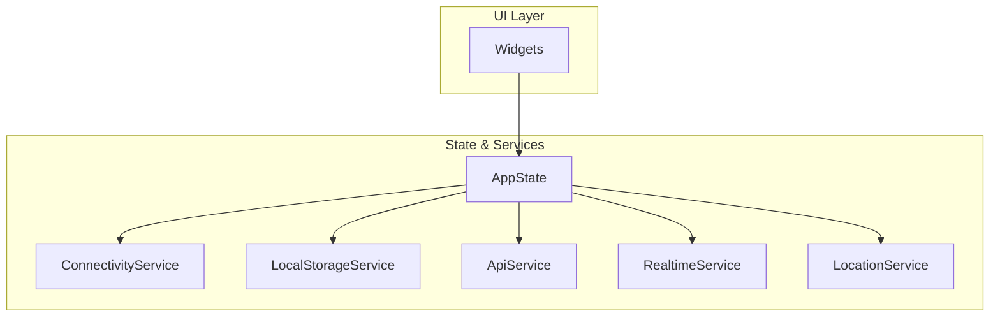
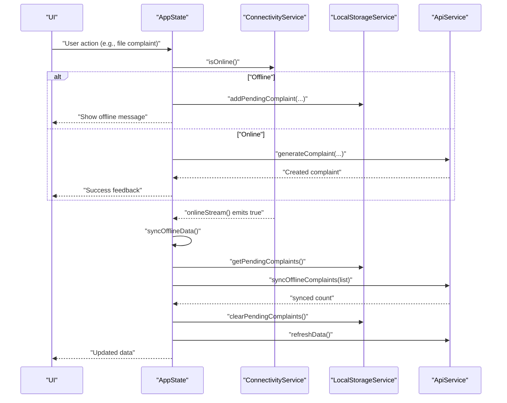
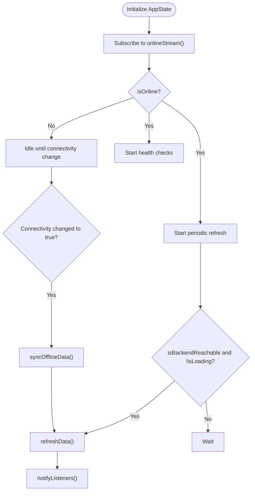
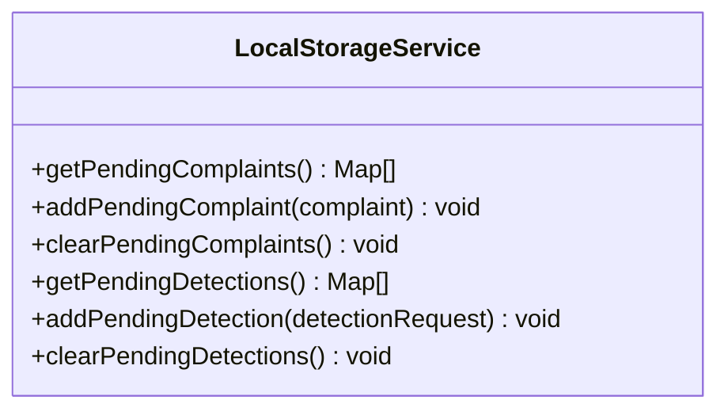
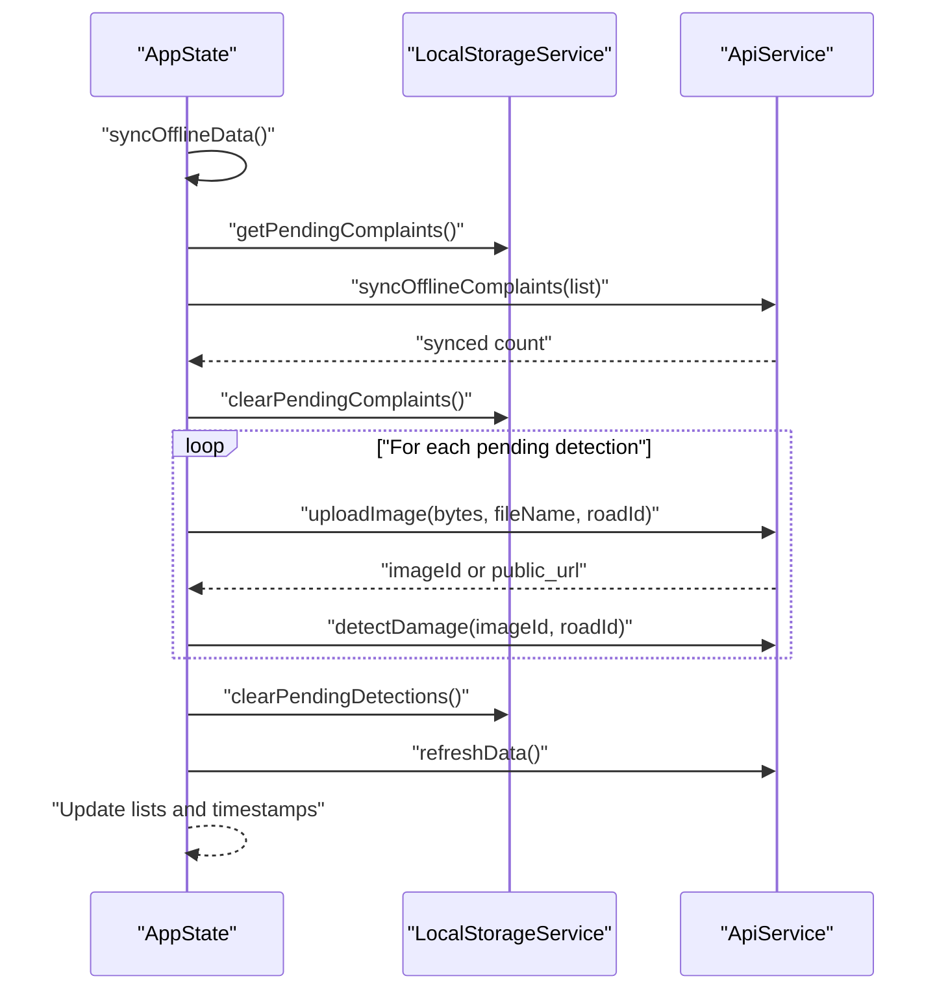
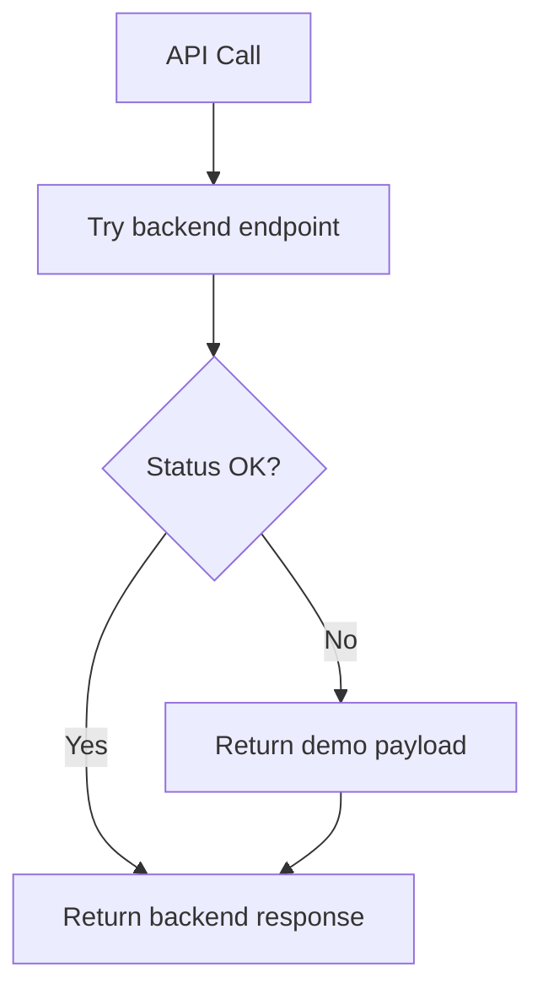
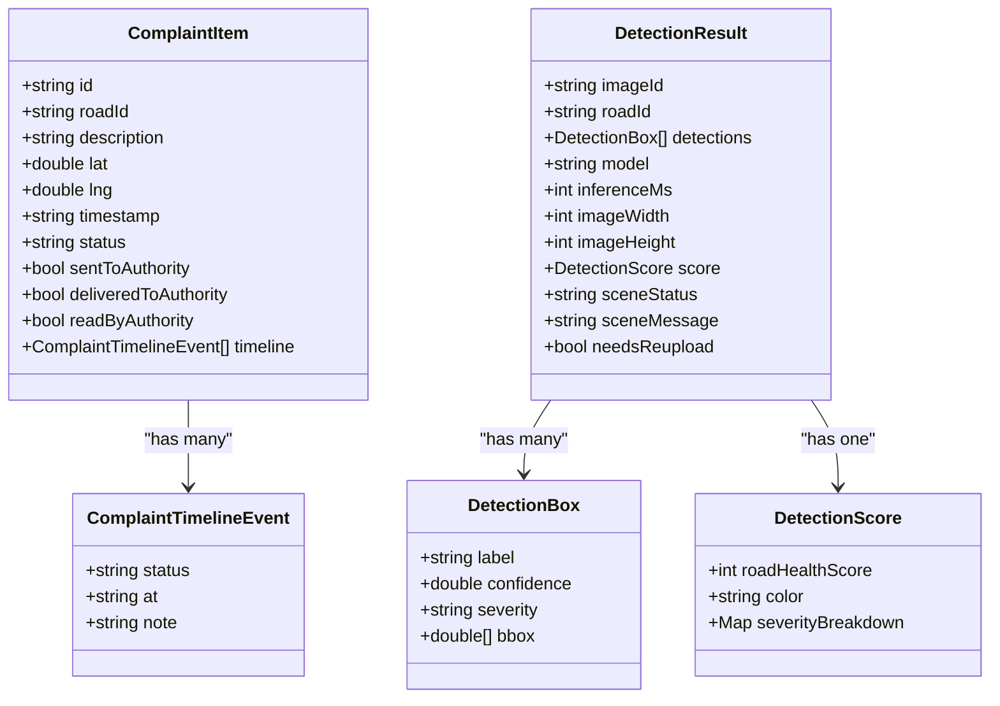
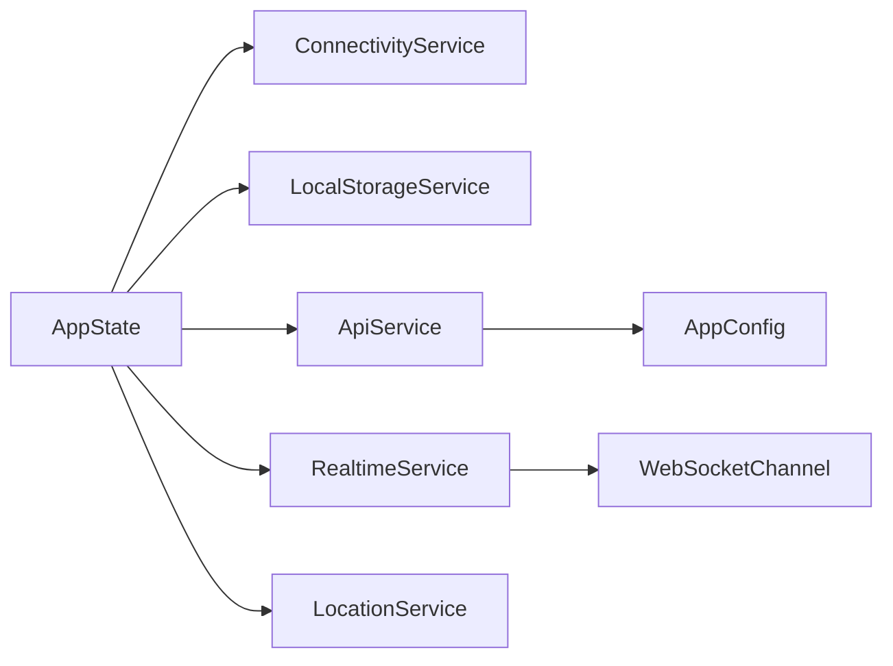

# Offline Functionality

<cite>
**Referenced Files in This Document**
- [main.dart](file://roadwatch_ai/frontend/lib/main.dart)
- [app_state.dart](file://roadwatch_ai/frontend/lib/providers/app_state.dart)
- [connectivity_service.dart](file://roadwatch_ai/frontend/lib/services/connectivity_service.dart)
- [local_storage_service.dart](file://roadwatch_ai/frontend/lib/services/local_storage_service.dart)
- [api_service.dart](file://roadwatch_ai/frontend/lib/services/api_service.dart)
- [realtime_service.dart](file://roadwatch_ai/frontend/lib/services/realtime_service.dart)
- [location_service.dart](file://roadwatch_ai/frontend/lib/services/location_service.dart)
- [complaint.dart](file://roadwatch_ai/frontend/lib/models/complaint.dart)
- [detection.dart](file://roadwatch_ai/frontend/lib/models/detection.dart)
- [demo_data_service.dart](file://roadwatch_ai/frontend/lib/services/demo_data_service.dart)
</cite>

## Table of Contents
1. [Introduction](#introduction)
2. [Project Structure](#project-structure)
3. [Core Components](#core-components)
4. [Architecture Overview](#architecture-overview)
5. [Detailed Component Analysis](#detailed-component-analysis)
6. [Dependency Analysis](#dependency-analysis)
7. [Performance Considerations](#performance-considerations)
8. [Troubleshooting Guide](#troubleshooting-guide)
9. [Conclusion](#conclusion)

## Introduction
This document explains RoadWatch AI’s offline-first architecture for the Flutter frontend. It covers local data persistence using Flutter’s local storage services, offline synchronization queues, connectivity detection, automatic synchronization upon network availability, demo-first behavior for resilience, offline data models, cache invalidation strategies, and user experience considerations for seamless online/offline transitions.

## Project Structure
The offline functionality centers around a small set of services and a state provider:
- Application bootstrap wires AppState with ApiService, ConnectivityService, LocalStorageService, and LocationService.
- AppState orchestrates connectivity monitoring, periodic refresh, health checks, real-time updates, and offline synchronization.
- LocalStorageService persists pending operations to SharedPreferences.
- ApiService encapsulates API calls with retry logic and demo fallbacks.
- RealtimeService provides resilient WebSocket connections for live updates.
- Models define offline-aware data structures.

**Diagram sources**
- [main.dart:13-28](file://roadwatch_ai/frontend/lib/main.dart#L13-L28)
- [app_state.dart:20-33](file://roadwatch_ai/frontend/lib/providers/app_state.dart#L20-L33)
- [connectivity_service.dart:5-26](file://roadwatch_ai/frontend/lib/services/connectivity_service.dart#L5-L26)
- [local_storage_service.dart:5-52](file://roadwatch_ai/frontend/lib/services/local_storage_service.dart#L5-L52)
- [api_service.dart:17-380](file://roadwatch_ai/frontend/lib/services/api_service.dart#L17-L380)
- [realtime_service.dart:8-99](file://roadwatch_ai/frontend/lib/services/realtime_service.dart#L8-L99)
- [location_service.dart:3-22](file://roadwatch_ai/frontend/lib/services/location_service.dart#L3-L22)

**Section sources**
- [main.dart:13-28](file://roadwatch_ai/frontend/lib/main.dart#L13-L28)
- [app_state.dart:78-116](file://roadwatch_ai/frontend/lib/providers/app_state.dart#L78-L116)

## Core Components
- ConnectivityService: Monitors connectivity changes and exposes an online stream and a snapshot check.
- LocalStorageService: Persists pending complaints and detections to SharedPreferences.
- AppState: Central coordinator for connectivity, refresh cycles, health checks, real-time updates, and offline sync.
- ApiService: Wraps HTTP requests with retries and falls back to demo data when backend is unreachable.
- RealtimeService: Manages WebSocket connections with reconnection logic.
- Models: Define offline-aware data structures for complaints and detection results.

**Section sources**
- [connectivity_service.dart:5-26](file://roadwatch_ai/frontend/lib/services/connectivity_service.dart#L5-L26)
- [local_storage_service.dart:5-52](file://roadwatch_ai/frontend/lib/services/local_storage_service.dart#L5-L52)
- [app_state.dart:20-33](file://roadwatch_ai/frontend/lib/providers/app_state.dart#L20-L33)
- [api_service.dart:17-380](file://roadwatch_ai/frontend/lib/services/api_service.dart#L17-L380)
- [realtime_service.dart:8-99](file://roadwatch_ai/frontend/lib/services/realtime_service.dart#L8-L99)
- [complaint.dart:21-91](file://roadwatch_ai/frontend/lib/models/complaint.dart#L21-L91)
- [detection.dart:44-89](file://roadwatch_ai/frontend/lib/models/detection.dart#L44-L89)

## Architecture Overview
RoadWatch AI follows an offline-first design:
- On startup, AppState initializes connectivity, health checks, periodic refresh, and real-time subscriptions.
- When offline, user actions (e.g., filing complaints, running detections) are queued locally.
- When connectivity resumes, AppState triggers sync to upload queued operations and refreshes data.
- Demo data and fallbacks ensure the app remains functional even when backend services are unavailable.

**Diagram sources**
- [app_state.dart:464-503](file://roadwatch_ai/frontend/lib/providers/app_state.dart#L464-L503)
- [app_state.dart:544-585](file://roadwatch_ai/frontend/lib/providers/app_state.dart#L544-L585)
- [connectivity_service.dart:8-15](file://roadwatch_ai/frontend/lib/services/connectivity_service.dart#L8-L15)
- [local_storage_service.dart:9-29](file://roadwatch_ai/frontend/lib/services/local_storage_service.dart#L9-L29)
- [api_service.dart:352-368](file://roadwatch_ai/frontend/lib/services/api_service.dart#L352-L368)

## Detailed Component Analysis

### Connectivity Detection and Automatic Synchronization
- AppState subscribes to ConnectivityService’s online stream and toggles isOnline accordingly.
- When transitioning from offline to online, AppState immediately invokes syncOfflineData().
- A periodic timer refreshes data only when online and backend is reachable.
- Health checks periodically verify backend reachability.

**Diagram sources**
- [app_state.dart:78-116](file://roadwatch_ai/frontend/lib/providers/app_state.dart#L78-L116)
- [connectivity_service.dart:8-15](file://roadwatch_ai/frontend/lib/services/connectivity_service.dart#L8-L15)

**Section sources**
- [app_state.dart:78-116](file://roadwatch_ai/frontend/lib/providers/app_state.dart#L78-L116)
- [connectivity_service.dart:8-15](file://roadwatch_ai/frontend/lib/services/connectivity_service.dart#L8-L15)

### Local Data Persistence and Offline Queue Management
- LocalStorageService stores two queues:
  - Pending complaints: serialized JSON under a dedicated key.
  - Pending detections: serialized JSON under another key.
- Operations are appended to queues; queues are cleared after successful sync.
- The service uses SharedPreferences for reliable, device-local persistence.

**Diagram sources**
- [local_storage_service.dart:5-52](file://roadwatch_ai/frontend/lib/services/local_storage_service.dart#L5-L52)

**Section sources**
- [local_storage_service.dart:5-52](file://roadwatch_ai/frontend/lib/services/local_storage_service.dart#L5-L52)

### Offline Synchronization Workflow
- syncOfflineData() retrieves pending queues, uploads complaints via ApiService, uploads images for detections, runs detections, clears queues, and refreshes data.
- It reports progress and updates the UI.

**Diagram sources**
- [app_state.dart:544-585](file://roadwatch_ai/frontend/lib/providers/app_state.dart#L544-L585)
- [api_service.dart:127-168](file://roadwatch_ai/frontend/lib/services/api_service.dart#L127-L168)
- [api_service.dart:170-216](file://roadwatch_ai/frontend/lib/services/api_service.dart#L170-L216)
- [api_service.dart:352-368](file://roadwatch_ai/frontend/lib/services/api_service.dart#L352-L368)

**Section sources**
- [app_state.dart:544-585](file://roadwatch_ai/frontend/lib/providers/app_state.dart#L544-L585)

### Demo-First Behavior and Fallbacks
- ApiService wraps all endpoints with retry logic and falls back to demo data when backend calls fail.
- getRoadData(), getBudgetData(), getRoadNetworkData(), getComplaints(), predictRisk(), and askChat() all return demo payloads on failure.
- uploadImage() returns deterministic demo identifiers when uploads fail, ensuring detection workflows remain functional.
- This guarantees app functionality even when backend services are unavailable.

**Diagram sources**
- [api_service.dart:64-75](file://roadwatch_ai/frontend/lib/services/api_service.dart#L64-L75)
- [api_service.dart:77-90](file://roadwatch_ai/frontend/lib/services/api_service.dart#L77-L90)
- [api_service.dart:92-117](file://roadwatch_ai/frontend/lib/services/api_service.dart#L92-L117)
- [api_service.dart:259-279](file://roadwatch_ai/frontend/lib/services/api_service.dart#L259-L279)
- [api_service.dart:281-314](file://roadwatch_ai/frontend/lib/services/api_service.dart#L281-L314)
- [api_service.dart:316-350](file://roadwatch_ai/frontend/lib/services/api_service.dart#L316-L350)
- [api_service.dart:127-168](file://roadwatch_ai/frontend/lib/services/api_service.dart#L127-L168)

**Section sources**
- [api_service.dart:33-52](file://roadwatch_ai/frontend/lib/services/api_service.dart#L33-L52)
- [api_service.dart:64-75](file://roadwatch_ai/frontend/lib/services/api_service.dart#L64-L75)
- [api_service.dart:77-90](file://roadwatch_ai/frontend/lib/services/api_service.dart#L77-L90)
- [api_service.dart:92-117](file://roadwatch_ai/frontend/lib/services/api_service.dart#L92-L117)
- [api_service.dart:259-279](file://roadwatch_ai/frontend/lib/services/api_service.dart#L259-L279)
- [api_service.dart:281-314](file://roadwatch_ai/frontend/lib/services/api_service.dart#L281-L314)
- [api_service.dart:316-350](file://roadwatch_ai/frontend/lib/services/api_service.dart#L316-L350)
- [demo_data_service.dart:1-373](file://roadwatch_ai/frontend/lib/services/demo_data_service.dart#L1-L373)

### Offline Data Models
- ComplaintItem and ComplaintTimelineEvent represent complaint records and their timelines.
- DetectionResult, DetectionBox, and DetectionScore capture detection outcomes and scores.
- These models support offline snapshots and updates applied to AppState-managed lists.

**Diagram sources**
- [complaint.dart:21-91](file://roadwatch_ai/frontend/lib/models/complaint.dart#L21-L91)
- [detection.dart:44-89](file://roadwatch_ai/frontend/lib/models/detection.dart#L44-L89)

**Section sources**
- [complaint.dart:21-91](file://roadwatch_ai/frontend/lib/models/complaint.dart#L21-L91)
- [detection.dart:44-89](file://roadwatch_ai/frontend/lib/models/detection.dart#L44-L89)

### Retry Logic and Data Consistency Guarantees
- ApiService uses a retry mechanism for most endpoints, reducing transient failures.
- On successful sync, queues are cleared atomically after each operation succeeds.
- Real-time updates are applied incrementally to maintain consistency when online.
- Demo fallbacks ensure the UI remains responsive and informative during outages.

**Section sources**
- [api_service.dart:33-52](file://roadwatch_ai/frontend/lib/services/api_service.dart#L33-L52)
- [app_state.dart:544-585](file://roadwatch_ai/frontend/lib/providers/app_state.dart#L544-L585)
- [realtime_service.dart:16-76](file://roadwatch_ai/frontend/lib/services/realtime_service.dart#L16-L76)

### Cache Invalidation Strategies
- AppState refreshes data periodically when online and backend is reachable.
- Real-time events trigger targeted updates (snapshots) to avoid full reloads.
- Selected road and network selections are preserved across refreshes.
- Timestamps (lastUpdatedAt) and lastMessage provide user-visible freshness cues.

**Section sources**
- [app_state.dart:105-114](file://roadwatch_ai/frontend/lib/providers/app_state.dart#L105-L114)
- [app_state.dart:214-274](file://roadwatch_ai/frontend/lib/providers/app_state.dart#L214-L274)
- [app_state.dart:355-387](file://roadwatch_ai/frontend/lib/providers/app_state.dart#L355-L387)

### User Experience Considerations
- Offline mode shows explicit messages indicating queuing and automatic sync.
- Real-time status reflects connection state and attempts.
- Demo mode provides immediate feedback and realistic outcomes when backend is down.
- Location requests handle permission prompts and timeouts gracefully.

**Section sources**
- [app_state.dart:416-454](file://roadwatch_ai/frontend/lib/providers/app_state.dart#L416-L454)
- [app_state.dart:464-503](file://roadwatch_ai/frontend/lib/providers/app_state.dart#L464-L503)
- [app_state.dart:146-151](file://roadwatch_ai/frontend/lib/providers/app_state.dart#L146-L151)
- [location_service.dart:3-22](file://roadwatch_ai/frontend/lib/services/location_service.dart#L3-L22)

## Dependency Analysis
- AppState depends on ConnectivityService, LocalStorageService, ApiService, RealtimeService, and LocationService.
- ApiService depends on AppConfig for base URLs and uses http and http_parser.
- RealtimeService depends on web_socket_channel.
- Models are independent data structures consumed by AppState.

**Diagram sources**
- [app_state.dart:20-33](file://roadwatch_ai/frontend/lib/providers/app_state.dart#L20-L33)
- [api_service.dart:17-27](file://roadwatch_ai/frontend/lib/services/api_service.dart#L17-L27)
- [realtime_service.dart:4](file://roadwatch_ai/frontend/lib/services/realtime_service.dart#L4)

**Section sources**
- [app_state.dart:20-33](file://roadwatch_ai/frontend/lib/providers/app_state.dart#L20-L33)
- [api_service.dart:17-27](file://roadwatch_ai/frontend/lib/services/api_service.dart#L17-L27)
- [realtime_service.dart:4](file://roadwatch_ai/frontend/lib/services/realtime_service.dart#L4)

## Performance Considerations
- SharedPreferences is used for small, frequent offline queues; it is efficient for the expected payload sizes.
- Retry logic reduces transient failures and improves reliability without blocking the UI thread.
- Real-time reconnection uses exponential backoff-like delays to conserve resources.
- Demo fallbacks prevent UI stalls and keep users engaged during backend outages.

[No sources needed since this section provides general guidance]

## Troubleshooting Guide
- Connectivity issues: Verify ConnectivityService online stream and AppState’s subscription. Ensure timers are active and health checks are running.
- Sync failures: Confirm pending queues exist, check ApiService sync endpoint response, and verify SharedPreferences keys are cleared after successful sync.
- Real-time disconnections: Check RealtimeService reconnection logic and AppState’s realtime event handler.
- Demo fallbacks: Validate ApiService fallbacks for each endpoint and ensure demo payloads are returned consistently.

**Section sources**
- [connectivity_service.dart:8-15](file://roadwatch_ai/frontend/lib/services/connectivity_service.dart#L8-L15)
- [app_state.dart:78-116](file://roadwatch_ai/frontend/lib/providers/app_state.dart#L78-L116)
- [app_state.dart:544-585](file://roadwatch_ai/frontend/lib/providers/app_state.dart#L544-L585)
- [realtime_service.dart:78-86](file://roadwatch_ai/frontend/lib/services/realtime_service.dart#L78-L86)
- [api_service.dart:352-368](file://roadwatch_ai/frontend/lib/services/api_service.dart#L352-L368)

## Conclusion
RoadWatch AI’s offline-first design leverages SharedPreferences for lightweight persistence, robust retry logic for API calls, and demo fallbacks to ensure continuous user productivity. Connectivity detection triggers automatic synchronization, while targeted real-time updates and periodic refreshes maintain data consistency. The result is a resilient, user-friendly experience that remains functional regardless of backend availability.