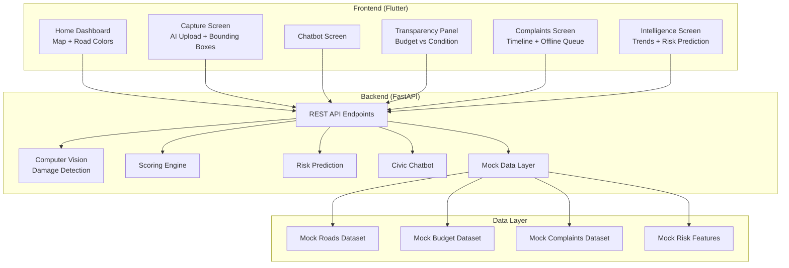
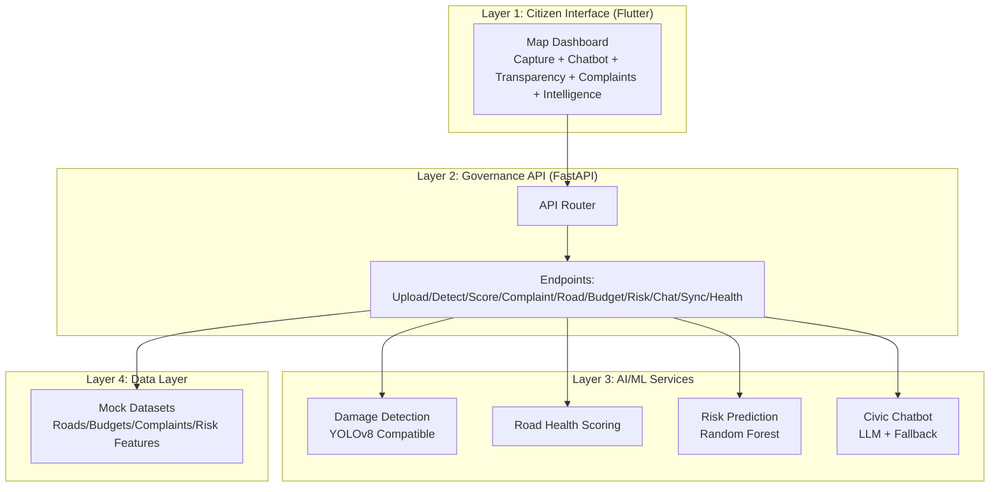
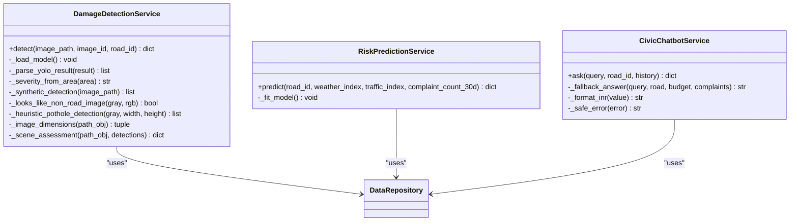
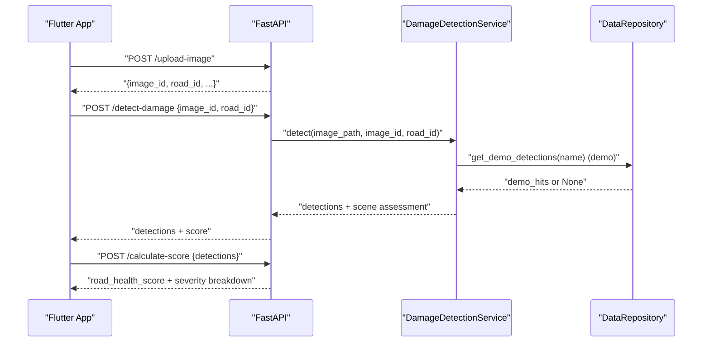
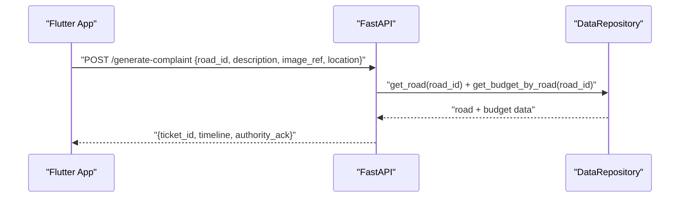
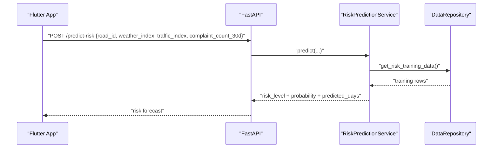
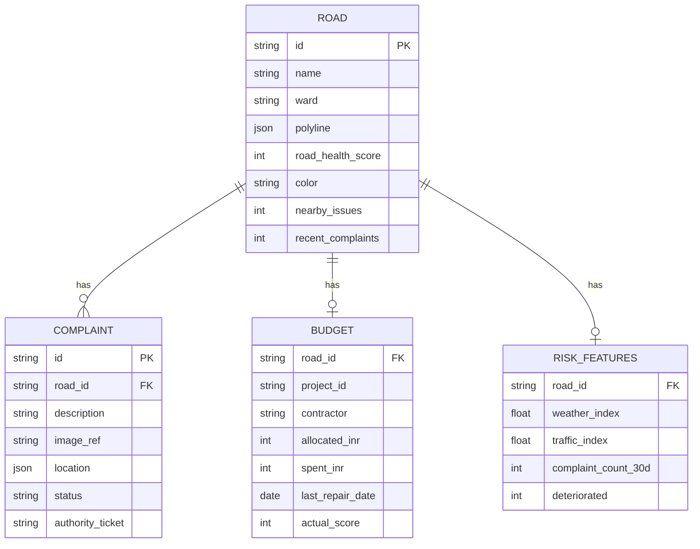
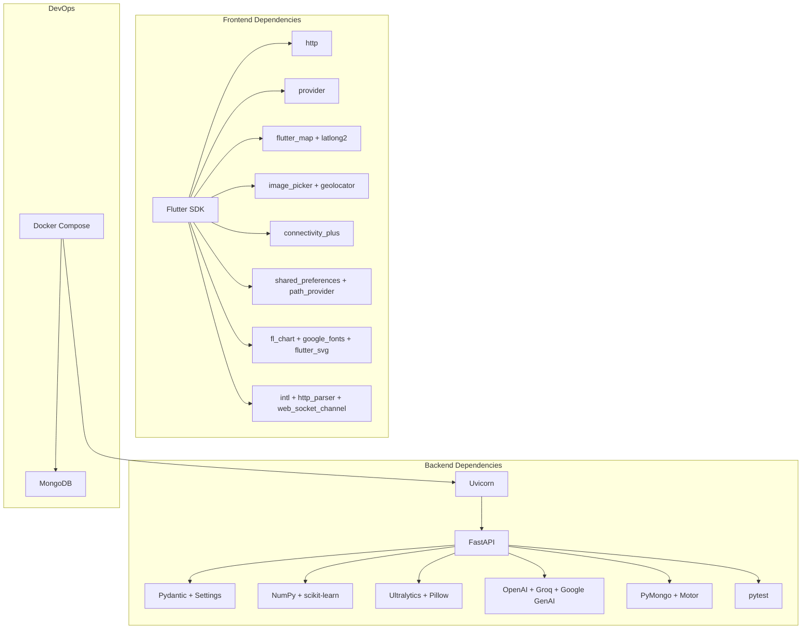

# Project Overview

<cite>
**Referenced Files in This Document**
- [README.md](file://README.md)
- [ARCHITECTURE.md](file://docs/ARCHITECTURE.md)
- [API_REFERENCE.md](file://docs/API_REFERENCE.md)
- [IMPLEMENTATION_PLAN_2_TO_4_WEEKS.md](file://docs/IMPLEMENTATION_PLAN_2_TO_4_WEEKS.md)
- [backend README.md](file://backend/README.md)
- [frontend README.md](file://frontend/README.md)
- [docker-compose.yml](file://docker-compose.yml)
- [backend main.py](file://backend/app/main.py)
- [backend config.py](file://backend/app/core/config.py)
- [backend requirements.txt](file://backend/requirements.txt)
- [frontend pubspec.yaml](file://frontend/pubspec.yaml)
- [backend detection.py](file://backend/app/services/detection.py)
- [backend prediction.py](file://backend/app/services/prediction.py)
- [backend chatbot.py](file://backend/app/services/chatbot.py)
- [backend mock_roads.json](file://backend/app/data/mock_roads.json)
</cite>

## Table of Contents
1. [Introduction](#introduction)
2. [Project Structure](#project-structure)
3. [Core Components](#core-components)
4. [Architecture Overview](#architecture-overview)
5. [Detailed Component Analysis](#detailed-component-analysis)
6. [Dependency Analysis](#dependency-analysis)
7. [Performance Considerations](#performance-considerations)
8. [Troubleshooting Guide](#troubleshooting-guide)
9. [Conclusion](#conclusion)
10. [Appendices](#appendices)

## Introduction
RoadWatch AI is an AI-powered civic intelligence and transparency platform designed to improve road safety governance. It brings together computer vision, spending transparency, complaint automation, and a civic chatbot into a unified mobile and web application. The platform enables citizens to report road issues, view real-time road health scores, understand budget and contractor transparency, and receive intelligent risk predictions. Government agencies and municipal workers can use the platform to monitor infrastructure conditions, prioritize repairs, and demonstrate accountability through transparent data and automated workflows.

Key value propositions:
- Improved road safety through early detection and prioritized maintenance
- Transparency and accountability via budget and contractor visibility
- Automated civic processes that streamline complaint filing and tracking
- Intelligent insights powered by AI-driven scoring and risk prediction

Target audiences:
- Citizens: Report issues, track progress, and stay informed about road conditions
- Municipal workers: Monitor infrastructure health, manage work orders, and allocate resources
- Government agencies: Oversee spending, measure outcomes, and enforce transparency

## Project Structure
The repository is organized into three primary areas:
- Frontend (Flutter): Cross-platform mobile and web UI with map dashboards, AI capture flows, chatbot, transparency, complaints, and intelligence panels
- Backend (FastAPI): REST API with endpoints for image processing, damage detection, scoring, complaints, budget queries, risk prediction, and chatbot
- Docs: Setup, architecture, API reference, model integration, and demo walkthrough materials

**Diagram sources**
- [README.md:15-102](file://README.md#L15-L102)
- [frontend README.md:13-25](file://frontend/README.md#L13-L25)
- [backend README.md:17-36](file://backend/README.md#L17-L36)

**Section sources**
- [README.md:15-102](file://README.md#L15-L102)
- [frontend README.md:13-25](file://frontend/README.md#L13-L25)
- [backend README.md:17-36](file://backend/README.md#L17-L36)

## Core Components
- Citizen Interface (Flutter): Provides a map-based dashboard, AI capture and detection visualization, chatbot-first civic workflow, complaint filing and tracking, transparency panels, and offline queue synchronization
- Governance API (FastAPI): Exposes core endpoints for roads, budget, complaints, risk, and bridges computer vision and scoring with complaint generation
- AI/ML Services: YOLOv8-compatible damage detection, road health scoring engine, Random Forest risk prediction, and an LLM-backed civic chatbot with fallback policy
- Data Layer: Mock datasets for roads, budgets, complaints, and risk features, designed to be swapped to persistent stores and real civic feeds

Key endpoints include:
- Image upload, damage detection, scoring, complaint generation, road/budget retrieval, risk prediction, chat, complaints listing, offline sync, and health checks

**Section sources**
- [README.md:6-14](file://README.md#L6-L14)
- [ARCHITECTURE.md:5-29](file://docs/ARCHITECTURE.md#L5-L29)
- [API_REFERENCE.md:5-145](file://docs/API_REFERENCE.md#L5-L145)

## Architecture Overview
RoadWatch AI follows a layered architecture with four major layers:
- Citizen Interface (Flutter): Map dashboard, image capture, chatbot, transparency, complaints, and offline queue
- Governance API (FastAPI): Core REST API for roads, budget, complaints, risk, and AI/ML orchestration
- AI/ML Services: Computer vision, scoring, risk prediction, and chatbot with fallback policy
- Data Layer: Mock datasets and designed extensibility to MongoDB/Firebase and real civic feeds

Request flow examples:
- Detection + scoring: App uploads image → calls detection → receives bounding boxes + severity + score → blends selected road score to update dashboard
- Complaint generation: User taps file complaint → app captures GPS and timestamp → sends payload to generate-complaint → backend creates structured complaint + simulated authority ticket
- Transparency query: App requests budget data → backend compares expected score vs actual AI score → app highlights mismatch (allocation vs condition)
- Offline mode: If offline, detection/complaint intents are stored locally → on reconnect, app calls sync-offline → pending image detections are uploaded and processed in batch

Security and production hardening checklist includes JWT auth, rate limiting, moving mock data to persistent stores, secure secret handling, signed evidence storage, and observability.

**Diagram sources**
- [ARCHITECTURE.md:3-57](file://docs/ARCHITECTURE.md#L3-L57)

**Section sources**
- [ARCHITECTURE.md:3-66](file://docs/ARCHITECTURE.md#L3-L66)

## Detailed Component Analysis

### Technology Stack Overview
- Backend: FastAPI, Uvicorn, Pydantic, Pydantic Settings, Python-Multipart, NumPy, scikit-learn, OpenAI, Groq, Google Generative AI, PyMongo/Motor, Ultralytics, Pillow, pytest
- Frontend: Flutter (Dart), http, provider, flutter_map, latlong2, image_picker, geolocator, connectivity_plus, shared_preferences, path_provider, intl, fl_chart, google_fonts, flutter_svg, http_parser, web_socket_channel
- DevOps: Docker Compose, GitHub Actions for GitHub Pages deployment

**Section sources**
- [backend requirements.txt:1-18](file://backend/requirements.txt#L1-L18)
- [frontend pubspec.yaml:9-38](file://frontend/pubspec.yaml#L9-L38)
- [docker-compose.yml:1-35](file://docker-compose.yml#L1-L35)

### System Architecture Philosophy
- Demo-first behavior: Deterministic detection for demo image IDs, mock governance datasets, and rule-based chatbot fallback
- Modular services: Clear separation between detection, scoring, risk prediction, and chatbot, enabling independent development and testing
- Extensibility: Designed to swap mock datasets with MongoDB/Firebase and integrate real civic feeds
- Resilience: Offline queue + later sync to handle intermittent connectivity

**Section sources**
- [README.md:140-149](file://README.md#L140-L149)
- [ARCHITECTURE.md:58-66](file://docs/ARCHITECTURE.md#L58-L66)

### How the Platform Addresses Real-World Road Infrastructure Challenges
- Early detection and prioritization: AI-powered damage detection identifies potholes and cracks, enabling targeted maintenance
- Transparency and accountability: Budget and contractor details are surfaced alongside road conditions to highlight allocation vs condition mismatches
- Automated complaint lifecycle: Structured complaint generation and tracking reduce administrative overhead and improve responsiveness
- Predictive maintenance: Risk prediction helps anticipate deterioration, allowing proactive interventions

**Section sources**
- [README.md:1-14](file://README.md#L1-L14)
- [API_REFERENCE.md:99-145](file://docs/API_REFERENCE.md#L99-L145)

### AI/ML Capabilities
- Damage Detection Service: Supports YOLOv8-compatible models with deterministic demo fallback and synthetic heuristics for non-road images
- Scoring Engine: Severity-weighted scoring rules convert detections into road health scores
- Risk Prediction Service: Random Forest model predicts probability of deterioration based on weather, traffic, and complaint counts
- Civic Chatbot Service: Multi-provider LLM integration (OpenAI, Groq, Google) with robust fallback policy and contextual awareness

**Diagram sources**
- [backend detection.py:20-319](file://backend/app/services/detection.py#L20-L319)
- [backend prediction.py:15-79](file://backend/app/services/prediction.py#L15-L79)
- [backend chatbot.py:33-280](file://backend/app/services/chatbot.py#L33-L280)

**Section sources**
- [backend detection.py:20-319](file://backend/app/services/detection.py#L20-L319)
- [backend prediction.py:15-79](file://backend/app/services/prediction.py#L15-L79)
- [backend chatbot.py:33-280](file://backend/app/services/chatbot.py#L33-L280)

### API Workflows

#### Detection + Scoring Sequence

**Diagram sources**
- [API_REFERENCE.md:5-81](file://docs/API_REFERENCE.md#L5-L81)
- [backend detection.py:36-93](file://backend/app/services/detection.py#L36-L93)

#### Complaint Generation Sequence

**Diagram sources**
- [API_REFERENCE.md:82-98](file://docs/API_REFERENCE.md#L82-L98)

#### Risk Prediction Sequence

**Diagram sources**
- [API_REFERENCE.md:113-137](file://docs/API_REFERENCE.md#L113-L137)
- [backend prediction.py:42-79](file://backend/app/services/prediction.py#L42-L79)

### Data Models Overview
The backend includes mock datasets for roads, budgets, complaints, and risk features. These datasets power the demo and enable deterministic scenarios during the hackathon.

**Diagram sources**
- [backend mock_roads.json:1-200](file://backend/app/data/mock_roads.json#L1-L200)

**Section sources**
- [backend mock_roads.json:1-200](file://backend/app/data/mock_roads.json#L1-L200)

## Dependency Analysis
- Backend dependencies include FastAPI, Uvicorn, Pydantic, Pydantic Settings, Python-Multipart, NumPy, scikit-learn, OpenAI, Groq, Google Generative AI, PyMongo/Motor, Ultralytics, Pillow, and pytest
- Frontend dependencies include Flutter SDK, http, provider, flutter_map, latlong2, image_picker, geolocator, connectivity_plus, shared_preferences, path_provider, intl, fl_chart, google_fonts, flutter_svg, http_parser, and web_socket_channel
- Docker Compose provisions MongoDB and the backend service with environment variables for demo mode, CORS origin, and persistence

**Diagram sources**
- [backend requirements.txt:1-18](file://backend/requirements.txt#L1-L18)
- [frontend pubspec.yaml:9-38](file://frontend/pubspec.yaml#L9-L38)
- [docker-compose.yml:3-35](file://docker-compose.yml#L3-L35)

**Section sources**
- [backend requirements.txt:1-18](file://backend/requirements.txt#L1-L18)
- [frontend pubspec.yaml:9-38](file://frontend/pubspec.yaml#L9-L38)
- [docker-compose.yml:3-35](file://docker-compose.yml#L3-L35)

## Performance Considerations
- Demo-first behavior ensures reliable demos even without external services or models
- Deterministic detection for demo image IDs reduces variability and improves presentation consistency
- Rule-based chatbot fallback maintains usability without API keys
- Lightweight scoring and risk prediction models enable responsive UI updates
- GZip middleware and static file serving optimize network performance
- Offline queue + sync minimizes latency impact during connectivity drops

[No sources needed since this section provides general guidance]

## Troubleshooting Guide
Common issues and resolutions:
- Backend not reachable: Verify API host/port and CORS origin in environment variables; confirm Docker Compose is running and ports are exposed
- Missing YOLO weights: Demo mode will return deterministic detections; ensure demo mode flag is enabled for reliable demos
- Chatbot API errors: Fallback policy provides rule-based responses; check API key configuration and SDK availability
- MongoDB persistence: Set MONGO_URI to persist complaint records; otherwise, data remains in memory for demo runs
- Health checks: Use GET /health to verify service uptime and readiness

**Section sources**
- [backend config.py:10-39](file://backend/app/core/config.py#L10-L39)
- [backend main.py:13-37](file://backend/app/main.py#L13-L37)
- [backend README.md:33-36](file://backend/README.md#L33-L36)
- [API_REFERENCE.md:144-145](file://docs/API_REFERENCE.md#L144-L145)

## Conclusion
RoadWatch AI delivers a cohesive, demo-ready platform that combines AI-powered road monitoring with transparency and automated civic processes. Its layered architecture, modular services, and demo-first design enable rapid iteration and compelling demonstrations during hackathons while laying the groundwork for production-grade deployments. By focusing on early detection, budget transparency, complaint automation, and predictive insights, the platform empowers citizens, municipal workers, and government agencies to govern road safety more effectively.

[No sources needed since this section summarizes without analyzing specific files]

## Appendices

### API Reference Highlights
- Upload image: POST /upload-image (multipart form)
- Detect damage: POST /detect-damage (JSON body with image_id and road_id)
- Calculate score: POST /calculate-score (JSON body with detections)
- Generate complaint: POST /generate-complaint (JSON body with road_id, description, image_ref, location)
- Get road data: GET /get-road-data (?road_id optional)
- Get budget data: GET /get-budget-data (?road_id optional)
- Predict risk: POST /predict-risk (JSON body with indices and counts)
- Extra endpoints: POST /chat, GET /complaints, POST /sync-offline, GET /health

**Section sources**
- [API_REFERENCE.md:5-145](file://docs/API_REFERENCE.md#L5-L145)

### Hackathon Scope and Future Roadmap
- Week 1: Foundations + MVP flow (architecture, UX wireframes, map dashboard, image upload/capture, demo detection pipeline)
- Week 2: Core intelligence features (road health scoring, chatbot with context, structured complaint generation, transparency module)
- Week 3: Robustness + offline mode (local offline queue, sync flows, risk prediction, deterministic demo mode)
- Week 4: Polish + judging narrative (performance tuning, storytelling, telemetry/logging, demo walkthrough practice)

Delivery checklist:
- AI detection is reproducible in live demo
- Transparency mismatch stories are visible and defensible
- Chatbot answers governance queries in <3 turns
- Offline mode works without internet
- End-to-end complaint flow is demonstrated from image to ticket

**Section sources**
- [IMPLEMENTATION_PLAN_2_TO_4_WEEKS.md:1-38](file://docs/IMPLEMENTATION_PLAN_2_TO_4_WEEKS.md#L1-L38)