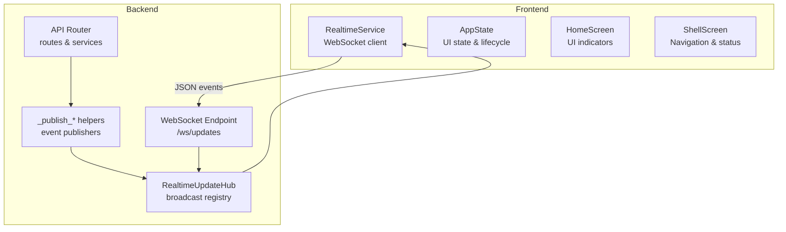
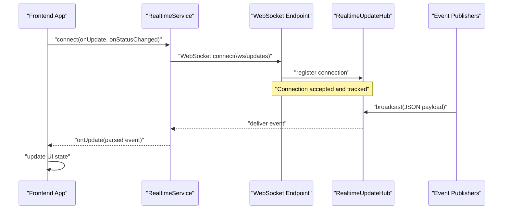
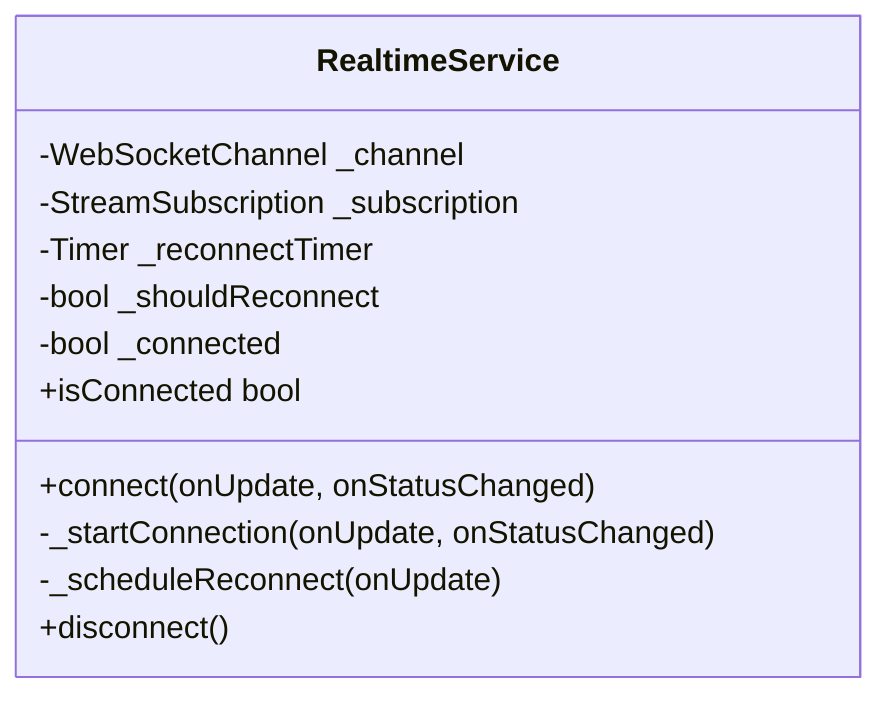
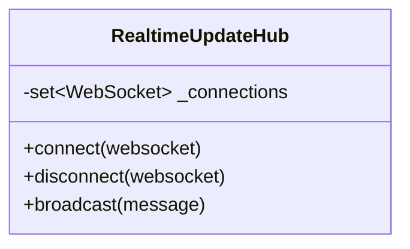
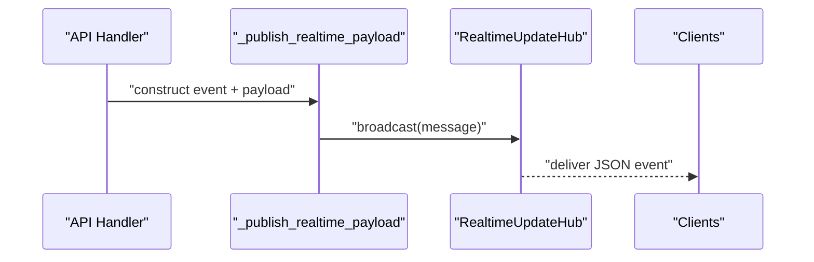
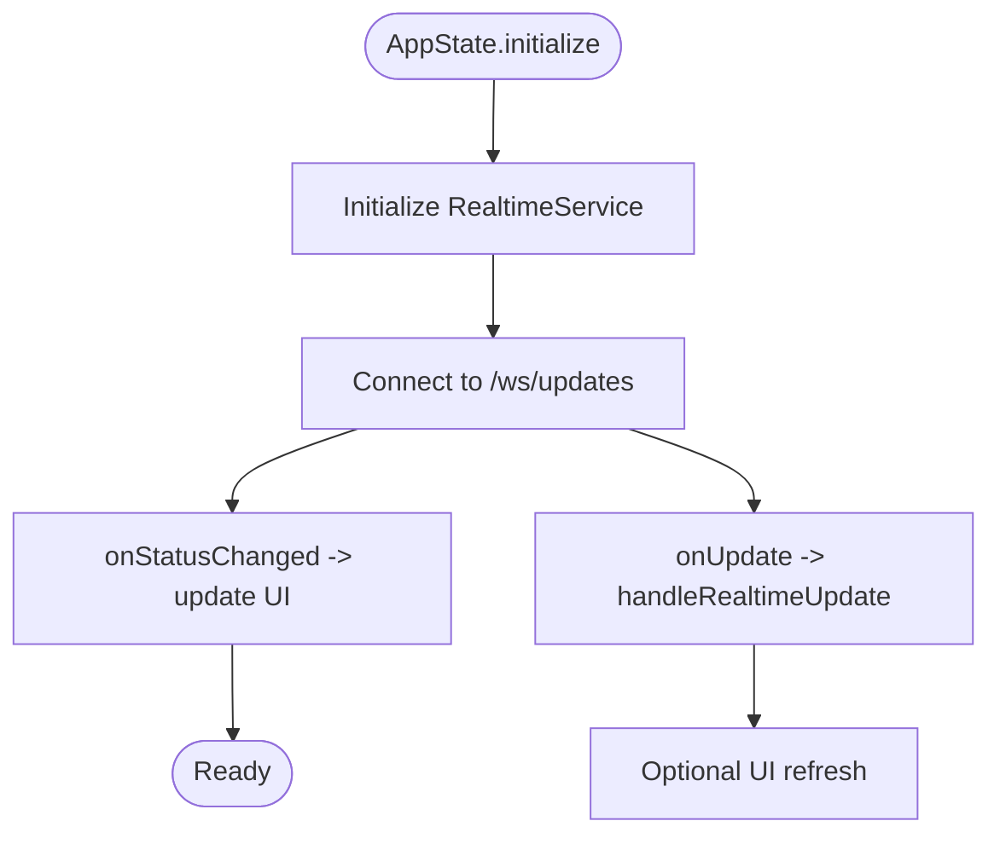
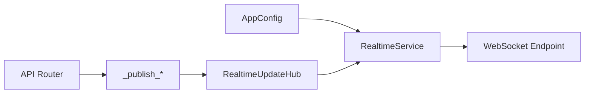

# Real-time Communication

<cite>
**Referenced Files in This Document**
- [realtime_service.dart](file://roadwatch_ai/frontend/lib/services/realtime_service.dart)
- [app_state.dart](file://roadwatch_ai/frontend/lib/providers/app_state.dart)
- [shell_screen.dart](file://roadwatch_ai/frontend/lib/screens/shell_screen.dart)
- [home_screen.dart](file://roadwatch_ai/frontend/lib/screens/home_screen.dart)
- [app_config.dart](file://roadwatch_ai/frontend/lib/config/app_config.dart)
- [api.py](file://roadwatch_ai/backend/app/routers/api.py)
- [main.py](file://roadwatch_ai/backend/app/main.py)
- [models.py](file://roadwatch_ai/backend/app/schemas/models.py)
- [API_REFERENCE.md](file://roadwatch_ai/docs/API_REFERENCE.md)
</cite>

## Table of Contents
1. [Introduction](#introduction)
2. [Project Structure](#project-structure)
3. [Core Components](#core-components)
4. [Architecture Overview](#architecture-overview)
5. [Detailed Component Analysis](#detailed-component-analysis)
6. [Dependency Analysis](#dependency-analysis)
7. [Performance Considerations](#performance-considerations)
8. [Troubleshooting Guide](#troubleshooting-guide)
9. [Conclusion](#conclusion)

## Introduction
This document explains RoadWatch AI’s real-time communication system built on WebSocket technology. It covers the frontend client implementation, backend WebSocket hub coordination, event broadcasting, and end-to-end flows for live updates. It also documents connection lifecycle management, error recovery, and practical examples such as live complaint updates, road condition alerts, and collaborative monitoring. Guidance on scalability, heartbeat considerations, and performance optimization for high concurrency is included.

## Project Structure
The real-time system spans two layers:
- Frontend (Flutter/Dart): WebSocket client, connection management, and UI integration.
- Backend (FastAPI): WebSocket endpoint, hub for managing connections, and event publishers.

**Diagram sources**
- [realtime_service.dart:16-100](file://roadwatch_ai/frontend/lib/services/realtime_service.dart#L16-L100)
- [app_state.dart:78-116](file://roadwatch_ai/frontend/lib/providers/app_state.dart#L78-L116)
- [api.py:122-132](file://roadwatch_ai/backend/app/routers/api.py#L122-L132)
- [api.py:38-58](file://roadwatch_ai/backend/app/routers/api.py#L38-L58)
- [api.py:101-119](file://roadwatch_ai/backend/app/routers/api.py#L101-L119)

**Section sources**
- [realtime_service.dart:16-100](file://roadwatch_ai/frontend/lib/services/realtime_service.dart#L16-L100)
- [app_state.dart:78-116](file://roadwatch_ai/frontend/lib/providers/app_state.dart#L78-L116)
- [api.py:122-132](file://roadwatch_ai/backend/app/routers/api.py#L122-L132)
- [api.py:38-58](file://roadwatch_ai/backend/app/routers/api.py#L38-L58)
- [api.py:101-119](file://roadwatch_ai/backend/app/routers/api.py#L101-L119)

## Core Components
- Frontend RealtimeService: Establishes and maintains a WebSocket connection, parses messages, and schedules reconnection.
- AppState: Initializes the realtime client, wires status callbacks, and triggers periodic data refresh.
- Backend RealtimeUpdateHub: Manages active connections and broadcasts JSON events to all clients.
- Event Publishers: Helper functions that construct and publish structured update events for specific actions.

Key responsibilities:
- Connection establishment: Frontend constructs a WebSocket URI from the configured base URL and connects to the backend endpoint.
- Message formatting: Events are JSON objects with standardized fields (type, event, timestamp, and domain-specific payload).
- Event broadcasting: The backend hub iterates over active connections and sends JSON payloads.
- UI updates: The frontend consumes events and updates state/UI without requiring manual polling.

**Section sources**
- [realtime_service.dart:16-100](file://roadwatch_ai/frontend/lib/services/realtime_service.dart#L16-L100)
- [app_state.dart:78-116](file://roadwatch_ai/frontend/lib/providers/app_state.dart#L78-L116)
- [api.py:38-58](file://roadwatch_ai/backend/app/routers/api.py#L38-L58)
- [api.py:101-119](file://roadwatch_ai/backend/app/routers/api.py#L101-L119)

## Architecture Overview
The real-time pipeline consists of:
- Client-side: RealtimeService manages connection, parsing, and reconnection.
- Server-side: WebSocket endpoint accepts connections and delegates to the hub; event publishers emit updates after backend operations complete.
- UI integration: AppState listens for updates and refreshes relevant views.

**Diagram sources**
- [realtime_service.dart:16-100](file://roadwatch_ai/frontend/lib/services/realtime_service.dart#L16-L100)
- [api.py:122-132](file://roadwatch_ai/backend/app/routers/api.py#L122-L132)
- [api.py:38-58](file://roadwatch_ai/backend/app/routers/api.py#L38-L58)
- [api.py:101-119](file://roadwatch_ai/backend/app/routers/api.py#L101-L119)

## Detailed Component Analysis

### Frontend WebSocket Client (RealtimeService)
Responsibilities:
- Construct WebSocket URL from base configuration.
- Establish connection and listen to incoming messages.
- Parse JSON payloads and forward to the caller.
- Track connection status and schedule reconnection on close/error.
- Gracefully disconnect and cancel timers/cancel subscriptions.

Behavior highlights:
- Reconnection strategy: Schedules a retry after a fixed delay when the socket closes or errors.
- Status reporting: Invokes a callback to inform UI about connection state changes.
- Robustness: Handles both string and map messages; falls back to a generic update signal if parsing fails.

**Diagram sources**
- [realtime_service.dart:8-100](file://roadwatch_ai/frontend/lib/services/realtime_service.dart#L8-L100)

**Section sources**
- [realtime_service.dart:16-100](file://roadwatch_ai/frontend/lib/services/realtime_service.dart#L16-L100)
- [app_config.dart:5-8](file://roadwatch_ai/frontend/lib/config/app_config.dart#L5-L8)

### Backend WebSocket Hub (RealtimeUpdateHub)
Responsibilities:
- Accept WebSocket connections.
- Maintain a registry of active connections.
- Broadcast JSON payloads to all connected clients.
- Remove disconnected clients from the registry.

**Diagram sources**
- [api.py:38-58](file://roadwatch_ai/backend/app/routers/api.py#L38-L58)

**Section sources**
- [api.py:38-58](file://roadwatch_ai/backend/app/routers/api.py#L38-L58)

### Event Publishing and Routing
The backend publishes structured events after completing operations. Two helper patterns are used:
- Generic update publisher: Adds common fields (type, event, timestamp) and dispatches to the hub.
- Payload-aware publisher: Extends the message with domain-specific data and dispatches to the hub.

Examples of published events:
- detect-damage: Includes road metadata and computed score.
- generate-complaint-preview: Emits a temporary preview before finalization.
- generate-complaint: Emits the finalized complaint with timeline and road context.
- sync-offline: Broadcasts batched offline submissions along with updated roads.

**Diagram sources**
- [api.py:101-119](file://roadwatch_ai/backend/app/routers/api.py#L101-L119)
- [api.py:38-58](file://roadwatch_ai/backend/app/routers/api.py#L38-L58)

**Section sources**
- [api.py:101-119](file://roadwatch_ai/backend/app/routers/api.py#L101-L119)
- [api.py:181-188](file://roadwatch_ai/backend/app/routers/api.py#L181-L188)
- [api.py:223-246](file://roadwatch_ai/backend/app/routers/api.py#L223-L246)
- [api.py:419-425](file://roadwatch_ai/backend/app/routers/api.py#L419-L425)

### Frontend Integration and UI Updates
AppState initializes the RealtimeService during startup, wires status callbacks, and ensures the UI reflects connection state. The UI surfaces:
- Online/offline status
- Realtime connection status
- Last update time and event type

**Diagram sources**
- [app_state.dart:78-116](file://roadwatch_ai/frontend/lib/providers/app_state.dart#L78-L116)
- [shell_screen.dart:207-209](file://roadwatch_ai/frontend/lib/screens/shell_screen.dart#L207-L209)
- [home_screen.dart:1168-1178](file://roadwatch_ai/frontend/lib/screens/home_screen.dart#L1168-L1178)

**Section sources**
- [app_state.dart:78-116](file://roadwatch_ai/frontend/lib/providers/app_state.dart#L78-L116)
- [shell_screen.dart:207-209](file://roadwatch_ai/frontend/lib/screens/shell_screen.dart#L207-L209)
- [home_screen.dart:1168-1178](file://roadwatch_ai/frontend/lib/screens/home_screen.dart#L1168-L1178)

### Real-time Features and Examples
- Live complaint updates: After generating a complaint, the backend emits a preview event followed by the finalized event. The UI reacts instantly to show progress and final status.
- Road condition alerts: After detecting damage, the backend computes a road health score and broadcasts an event containing the score and road context, enabling immediate UI updates.
- Collaborative monitoring: Multiple clients receive the same events concurrently via the hub, ensuring synchronized views across users.

**Section sources**
- [api.py:181-188](file://roadwatch_ai/backend/app/routers/api.py#L181-L188)
- [api.py:223-246](file://roadwatch_ai/backend/app/routers/api.py#L223-L246)
- [api.py:419-425](file://roadwatch_ai/backend/app/routers/api.py#L419-L425)

## Dependency Analysis
- Frontend depends on:
  - AppConfig for base URL resolution.
  - RealtimeService for WebSocket lifecycle.
  - AppState for initialization and UI state.
- Backend depends on:
  - API Router for endpoint registration.
  - RealtimeUpdateHub for connection management.
  - Event publishers for emitting updates.
  - Services and repositories for data used in event payloads.

**Diagram sources**
- [app_config.dart:5-8](file://roadwatch_ai/frontend/lib/config/app_config.dart#L5-L8)
- [realtime_service.dart:16-100](file://roadwatch_ai/frontend/lib/services/realtime_service.dart#L16-L100)
- [api.py:122-132](file://roadwatch_ai/backend/app/routers/api.py#L122-L132)
- [api.py:101-119](file://roadwatch_ai/backend/app/routers/api.py#L101-L119)
- [api.py:38-58](file://roadwatch_ai/backend/app/routers/api.py#L38-L58)

**Section sources**
- [app_config.dart:5-8](file://roadwatch_ai/frontend/lib/config/app_config.dart#L5-L8)
- [realtime_service.dart:16-100](file://roadwatch_ai/frontend/lib/services/realtime_service.dart#L16-L100)
- [api.py:122-132](file://roadwatch_ai/backend/app/routers/api.py#L122-L132)
- [api.py:101-119](file://roadwatch_ai/backend/app/routers/api.py#L101-L119)
- [api.py:38-58](file://roadwatch_ai/backend/app/routers/api.py#L38-L58)

## Performance Considerations
- Connection pooling: The hub maintains a set of active WebSocket connections. For high concurrency, consider sharding or load balancing across instances.
- Heartbeat mechanisms: Implement ping/pong to detect stale connections proactively. The current implementation relies on done/error callbacks; adding explicit heartbeats can reduce stale connections.
- Backpressure and batching: If event volume is high, batch frequent updates (e.g., multiple detections) into fewer messages to reduce overhead.
- Compression: Enable per-message compression for large payloads (e.g., detailed road network data) to reduce bandwidth.
- Reconnection jitter: Add randomized jitter to the fixed reconnect interval to avoid thundering herd on server restarts.
- Scalability: Use a reverse proxy with sticky sessions or a message broker for multi-instance deployments to ensure clients reconnect to the correct instance.

[No sources needed since this section provides general guidance]

## Troubleshooting Guide
Common issues and remedies:
- Connection fails immediately:
  - Verify the base URL and endpoint path. Ensure HTTPS is used in production environments.
  - Confirm CORS middleware allows the frontend origin.
- Frequent reconnection loops:
  - Check for exceptions thrown by the client listener; ensure parsing errors do not crash the subscription.
  - Validate backend health and availability.
- No updates received:
  - Confirm the backend event publishers are invoked after operations complete.
  - Ensure the hub still holds the connection and that broadcast does not throw exceptions.
- UI not reflecting status:
  - Verify onStatusChanged callbacks are wired and that AppState updates listeners.

Operational checks:
- Health endpoint: Use the health route to confirm backend uptime and dataset counts.
- Event types: Cross-check emitted event names against frontend handlers.

**Section sources**
- [app_state.dart:78-116](file://roadwatch_ai/frontend/lib/providers/app_state.dart#L78-L116)
- [api.py:66-75](file://roadwatch_ai/backend/app/routers/api.py#L66-L75)
- [API_REFERENCE.md:141-145](file://roadwatch_ai/docs/API_REFERENCE.md#L141-L145)

## Conclusion
RoadWatch AI’s real-time system provides a clean separation between frontend and backend components. The frontend client handles connection lifecycle and UI integration, while the backend hub centralizes event distribution. The event publishing helpers ensure consistent, structured updates across features like complaints and road conditions. With minor enhancements—such as heartbeat, jittered reconnection, and optional compression—the system can scale effectively under high concurrency.