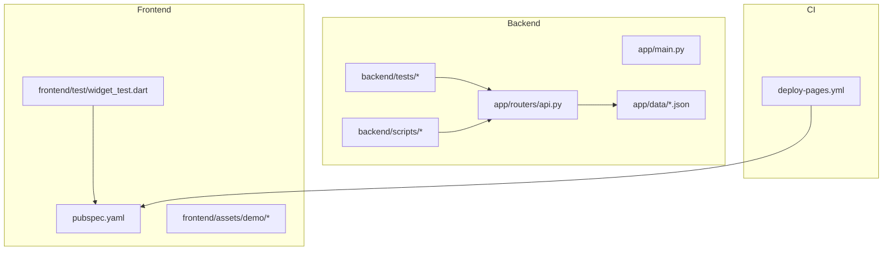
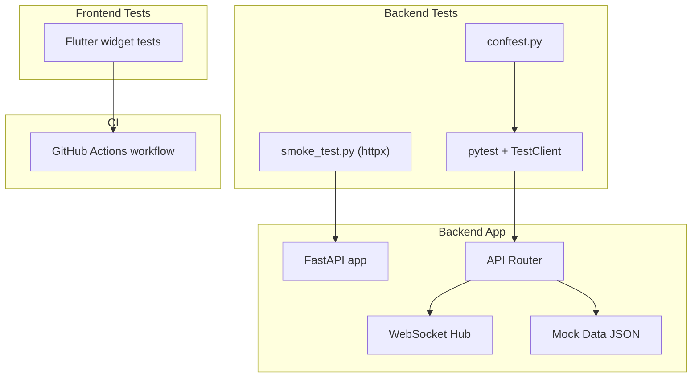
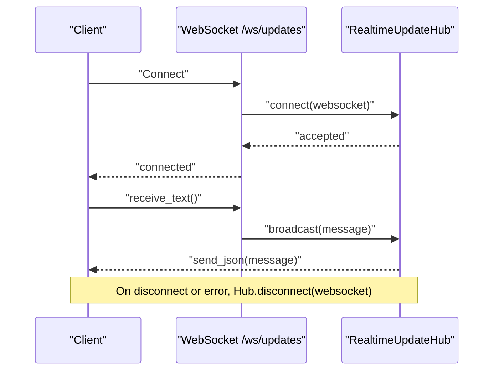
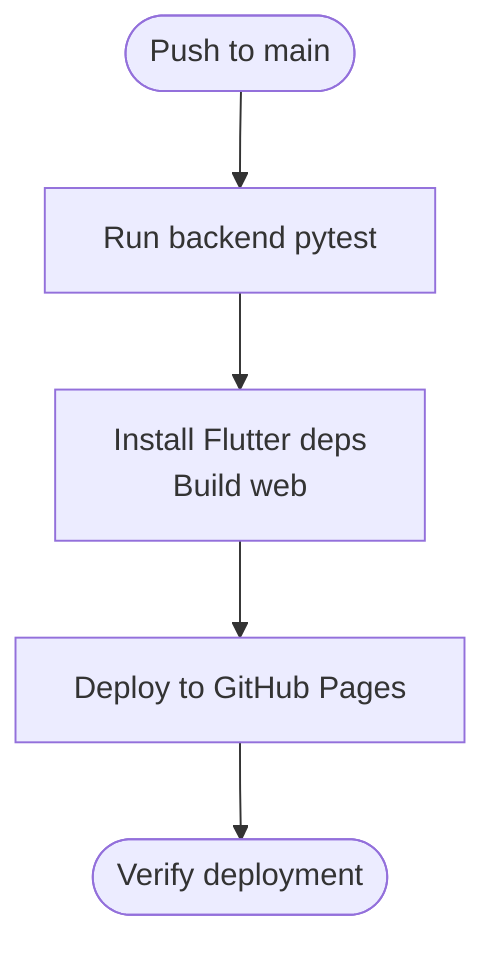
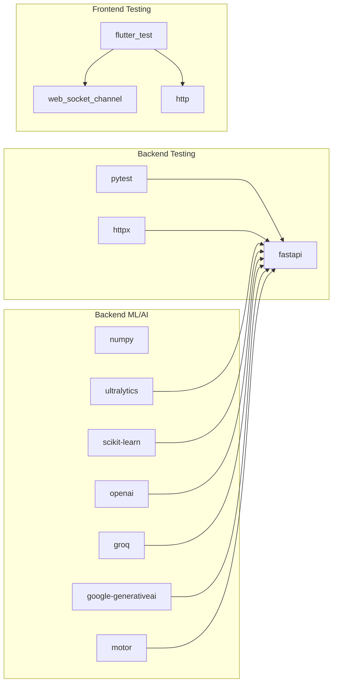

# Testing Strategy

<cite>
**Referenced Files in This Document**
- [requirements.txt](file://roadwatch_ai/backend/requirements.txt)
- [conftest.py](file://roadwatch_ai/backend/tests/conftest.py)
- [test_api_smoke.py](file://roadwatch_ai/backend/tests/test_api_smoke.py)
- [smoke_test.py](file://roadwatch_ai/backend/scripts/smoke_test.py)
- [main.py](file://roadwatch_ai/backend/app/main.py)
- [api.py](file://roadwatch_ai/backend/app/routers/api.py)
- [demo_detections.json](file://roadwatch_ai/backend/app/data/demo_detections.json)
- [mock_complaints.json](file://roadwatch_ai/backend/app/data/mock_complaints.json)
- [mock_risk_features.json](file://roadwatch_ai/backend/app/data/mock_risk_features.json)
- [mock_roads.json](file://roadwatch_ai/backend/app/data/mock_roads.json)
- [road_network_data.json](file://roadwatch_ai/backend/app/data/road_network_data.json)
- [pubspec.yaml](file://roadwatch_ai/frontend/pubspec.yaml)
- [widget_test.dart](file://roadwatch_ai/frontend/test/widget_test.dart)
- [deploy-pages.yml](file://roadwatch_ai/.github/workflows/deploy-pages.yml)
</cite>

## Table of Contents
1. [Introduction](#introduction)
2. [Project Structure](#project-structure)
3. [Core Components](#core-components)
4. [Architecture Overview](#architecture-overview)
5. [Detailed Component Analysis](#detailed-component-analysis)
6. [Dependency Analysis](#dependency-analysis)
7. [Performance Considerations](#performance-considerations)
8. [Troubleshooting Guide](#troubleshooting-guide)
9. [Conclusion](#conclusion)
10. [Appendices](#appendices)

## Introduction
This document defines the comprehensive testing strategy for RoadWatch AI, covering backend API testing with pytest (unit, integration, and smoke tests), frontend widget and integration testing with Flutter, and CI/CD automation with GitHub Actions. It explains test configuration, mock data usage, environment setup, and best practices for AI/ML services, WebSocket real-time updates, and offline synchronization. Guidance is provided for concurrency, error handling, and performance testing to ensure reliability across all system components.

## Project Structure
The repository organizes testing assets by platform:
- Backend: Python FastAPI application with pytest-based tests under backend/tests and auxiliary smoke test script under backend/scripts.
- Frontend: Flutter application with widget tests under frontend/test and CI workflow under .github/workflows.
- Shared data: JSON fixtures under backend/app/data support deterministic testing of AI/ML and data services.

**Diagram sources**
- [main.py:1-37](file://roadwatch_ai/backend/app/main.py#L1-L37)
- [api.py:1-427](file://roadwatch_ai/backend/app/routers/api.py#L1-L427)
- [conftest.py:1-7](file://roadwatch_ai/backend/tests/conftest.py#L1-L7)
- [test_api_smoke.py:1-122](file://roadwatch_ai/backend/tests/test_api_smoke.py#L1-L122)
- [smoke_test.py:1-66](file://roadwatch_ai/backend/scripts/smoke_test.py#L1-L66)
- [pubspec.yaml:1-38](file://roadwatch_ai/frontend/pubspec.yaml#L1-L38)
- [widget_test.dart:1-31](file://roadwatch_ai/frontend/test/widget_test.dart#L1-L31)
- [deploy-pages.yml:1-64](file://roadwatch_ai/.github/workflows/deploy-pages.yml#L1-L64)

**Section sources**
- [main.py:1-37](file://roadwatch_ai/backend/app/main.py#L1-L37)
- [api.py:1-427](file://roadwatch_ai/backend/app/routers/api.py#L1-L427)
- [conftest.py:1-7](file://roadwatch_ai/backend/tests/conftest.py#L1-L7)
- [test_api_smoke.py:1-122](file://roadwatch_ai/backend/tests/test_api_smoke.py#L1-L122)
- [smoke_test.py:1-66](file://roadwatch_ai/backend/scripts/smoke_test.py#L1-L66)
- [pubspec.yaml:1-38](file://roadwatch_ai/frontend/pubspec.yaml#L1-L38)
- [widget_test.dart:1-31](file://roadwatch_ai/frontend/test/widget_test.dart#L1-L31)
- [deploy-pages.yml:1-64](file://roadwatch_ai/.github/workflows/deploy-pages.yml#L1-L64)

## Core Components
- Backend FastAPI server exposes endpoints for health checks, road data retrieval, AI damage detection, complaint generation, risk prediction, chat, and real-time updates via WebSocket.
- Tests use pytest with FastAPI TestClient for smoke tests and a shared conftest for module path injection.
- Mock datasets under app/data power deterministic tests for AI/ML services and data queries.
- Frontend uses Flutter’s widget testing framework for UI smoke tests and integrates with CI via GitHub Actions.

Key backend endpoints and capabilities:
- Health and API info endpoints for readiness and model metadata.
- Image upload and damage detection pipeline with road health scoring.
- Complaint lifecycle with real-time broadcasting.
- Risk prediction service and chatbot service.
- WebSocket hub for real-time updates.
- Offline synchronization endpoint.

**Section sources**
- [api.py:66-93](file://roadwatch_ai/backend/app/routers/api.py#L66-L93)
- [api.py:164-190](file://roadwatch_ai/backend/app/routers/api.py#L164-L190)
- [api.py:198-247](file://roadwatch_ai/backend/app/routers/api.py#L198-L247)
- [api.py:335-345](file://roadwatch_ai/backend/app/routers/api.py#L335-L345)
- [api.py:348-365](file://roadwatch_ai/backend/app/routers/api.py#L348-L365)
- [api.py:122-132](file://roadwatch_ai/backend/app/routers/api.py#L122-L132)
- [api.py:403-426](file://roadwatch_ai/backend/app/routers/api.py#L403-L426)

## Architecture Overview
The testing architecture leverages:
- Backend: pytest with FastAPI TestClient for endpoint verification, plus a standalone HTTP client smoke test script.
- Frontend: Flutter widget tests for UI smoke checks.
- CI: GitHub Actions workflow builds and deploys Flutter web, enabling live deployment verification.

**Diagram sources**
- [test_api_smoke.py:1-122](file://roadwatch_ai/backend/tests/test_api_smoke.py#L1-L122)
- [smoke_test.py:1-66](file://roadwatch_ai/backend/scripts/smoke_test.py#L1-L66)
- [conftest.py:1-7](file://roadwatch_ai/backend/tests/conftest.py#L1-L7)
- [main.py:1-37](file://roadwatch_ai/backend/app/main.py#L1-L37)
- [api.py:1-427](file://roadwatch_ai/backend/app/routers/api.py#L1-L427)
- [widget_test.dart:1-31](file://roadwatch_ai/frontend/test/widget_test.dart#L1-L31)
- [deploy-pages.yml:1-64](file://roadwatch_ai/.github/workflows/deploy-pages.yml#L1-L64)

## Detailed Component Analysis

### Backend Testing with pytest
- Test configuration: conftest injects the project root into sys.path to enable importing app modules during tests.
- Smoke tests: Cover health, road data retrieval, damage detection, complaint generation, risk prediction, API info, search, nearby roads, road network queries, pagination, and chat.
- TestClient usage: Ensures FastAPI routing and response shapes are validated without external dependencies.
- Mock data: demo_detections.json, mock_complaints.json, mock_risk_features.json, mock_roads.json, and road_network_data.json provide deterministic inputs for AI/ML and data services.

Recommended test categories:
- Unit tests: Isolated service functions (e.g., scoring, prediction, repository helpers) using mocked dependencies.
- Integration tests: End-to-end flows across routers and services (e.g., detect-damage pipeline, complaint lifecycle).
- Smoke tests: Quick endpoint verification using both TestClient and httpx-based smoke_test.py.

Best practices:
- Parameterize tests with representative rows from mock datasets.
- Assert response schemas and constraints (e.g., risk level enums, pagination limits).
- Use fixtures to load JSON datasets and avoid repeated IO.

**Section sources**
- [conftest.py:1-7](file://roadwatch_ai/backend/tests/conftest.py#L1-L7)
- [test_api_smoke.py:1-122](file://roadwatch_ai/backend/tests/test_api_smoke.py#L1-L122)
- [smoke_test.py:1-66](file://roadwatch_ai/backend/scripts/smoke_test.py#L1-L66)
- [demo_detections.json:1-102](file://roadwatch_ai/backend/app/data/demo_detections.json#L1-L102)
- [mock_complaints.json:1-1817](file://roadwatch_ai/backend/app/data/mock_complaints.json#L1-L1817)
- [mock_risk_features.json:1-492](file://roadwatch_ai/backend/app/data/mock_risk_features.json#L1-L492)
- [mock_roads.json:1-1382](file://roadwatch_ai/backend/app/data/mock_roads.json#L1-L1382)
- [road_network_data.json:1-5589](file://roadwatch_ai/backend/app/data/road_network_data.json#L1-L5589)

### Frontend Testing Strategy with Flutter
- Widget tests: Basic smoke test verifies UI state transitions and widget interactions.
- Dependencies: http, provider, flutter_map, connectivity_plus, shared_preferences, path_provider, web_socket_channel, and others support networking, state, maps, connectivity, storage, and WebSocket channels.
- CI integration: GitHub Actions workflow installs Flutter dependencies, builds web artifacts, and deploys to GitHub Pages, validating frontend runtime behavior.

Testing guidance:
- Widget tests: Validate UI rendering and basic interactions (e.g., incrementing a counter).
- Integration tests: Simulate network requests and state updates using mock services or in-memory providers.
- WebSocket tests: Use web_socket_channel to simulate real-time updates and verify UI reactions.

**Section sources**
- [pubspec.yaml:1-38](file://roadwatch_ai/frontend/pubspec.yaml#L1-L38)
- [widget_test.dart:1-31](file://roadwatch_ai/frontend/test/widget_test.dart#L1-L31)
- [deploy-pages.yml:1-64](file://roadwatch_ai/.github/workflows/deploy-pages.yml#L1-L64)

### AI/ML Services Testing
Endpoints involved:
- Damage detection: Accepts image_id and road_id, returns detections and computed road health score.
- Risk prediction: Accepts indices and complaint counts, returns risk level.
- Chat: Accepts query, road_id, and history, returns assistant response with fallback on errors.

Testing approach:
- Use demo_detections.json for deterministic detection outputs.
- Parameterize with mock_risk_features.json rows to validate risk predictions.
- Assert response shape, enum constraints, and numeric bounds.
- For chat, verify fallback behavior when services are unavailable.

**Section sources**
- [api.py:164-190](file://roadwatch_ai/backend/app/routers/api.py#L164-L190)
- [api.py:335-345](file://roadwatch_ai/backend/app/routers/api.py#L335-L345)
- [api.py:348-365](file://roadwatch_ai/backend/app/routers/api.py#L348-L365)
- [demo_detections.json:1-102](file://roadwatch_ai/backend/app/data/demo_detections.json#L1-L102)
- [mock_risk_features.json:1-492](file://roadwatch_ai/backend/app/data/mock_risk_features.json#L1-L492)

### WebSocket Functionality Testing
- Realtime update hub maintains connections and broadcasts messages.
- Endpoint: /ws/updates accepts WebSocket connections and handles disconnects.
- Testing approach:
  - Validate connection acceptance and message broadcasting.
  - Simulate client disconnects and verify cleanup.
  - Integrate with UI tests to confirm real-time updates render correctly.

**Diagram sources**
- [api.py:38-58](file://roadwatch_ai/backend/app/routers/api.py#L38-L58)
- [api.py:122-132](file://roadwatch_ai/backend/app/routers/api.py#L122-L132)

**Section sources**
- [api.py:38-58](file://roadwatch_ai/backend/app/routers/api.py#L38-L58)
- [api.py:122-132](file://roadwatch_ai/backend/app/routers/api.py#L122-L132)

### Offline Synchronization Testing
- Endpoint: /sync-offline accepts a list of complaint creation requests and returns synchronized items.
- Behavior: Processes each item, updates repository, and broadcasts real-time updates.
- Testing approach:
  - Provide a batch of ComplaintCreateRequest payloads.
  - Assert returned count and items.
  - Verify real-time payload includes roads and items.

**Section sources**
- [api.py:403-426](file://roadwatch_ai/backend/app/routers/api.py#L403-L426)

### Test Coverage Guidelines
- Aim for high coverage of critical paths:
  - All API endpoints (health, data retrieval, ML, chat, WebSocket).
  - Error branches (invalid inputs, missing resources, exceptions).
  - Edge cases (empty lists, boundary pagination values, enum constraints).
- Use fixtures to load mock datasets and parameterize tests for robustness.
- For AI/ML:
  - Validate deterministic outputs for known inputs.
  - Assert numeric ranges and label enums.
- For real-time:
  - Verify broadcast messages and connection lifecycle.

[No sources needed since this section provides general guidance]

### Continuous Integration Testing Workflows
- Backend:
  - pytest runs smoke tests against the FastAPI app.
  - Optional: Add pytest markers and parametrize tests for broader coverage.
- Frontend:
  - GitHub Actions workflow installs Flutter dependencies, builds web, and deploys to GitHub Pages.
  - Variables: API_URL is required for live deployment; ensure it is configured in repository secrets or variables.

**Diagram sources**
- [deploy-pages.yml:1-64](file://roadwatch_ai/.github/workflows/deploy-pages.yml#L1-L64)

**Section sources**
- [deploy-pages.yml:1-64](file://roadwatch_ai/.github/workflows/deploy-pages.yml#L1-L64)

## Dependency Analysis
Backend dependencies supporting testing:
- pytest and httpx for API testing.
- numpy and scikit-learn for ML services.
- openai, groq, google-generativeai for chatbot services.
- ultralytics for YOLO-based detection.
- pymongo/motor for MongoDB access.
- pydantic/pydantic-settings for configuration.

Frontend dependencies supporting testing:
- flutter_test for widget tests.
- web_socket_channel for WebSocket testing.
- http for network mocking/testing.

**Diagram sources**
- [requirements.txt:1-18](file://roadwatch_ai/backend/requirements.txt#L1-L18)
- [pubspec.yaml:1-38](file://roadwatch_ai/frontend/pubspec.yaml#L1-L38)

**Section sources**
- [requirements.txt:1-18](file://roadwatch_ai/backend/requirements.txt#L1-L18)
- [pubspec.yaml:1-38](file://roadwatch_ai/frontend/pubspec.yaml#L1-L38)

## Performance Considerations
- API performance:
  - Use paginated endpoints for large datasets (e.g., budgets, complaints).
  - Compress responses with GZip middleware.
  - Minimize heavy computations in hot paths; cache where appropriate.
- AI/ML inference:
  - Pre-load models and reuse instances.
  - Validate image preprocessing and batching strategies.
- Frontend performance:
  - Lazy-load maps and images.
  - Debounce search and nearby queries.
- CI performance:
  - Cache Flutter dependencies and use matrix builds for multiple environments.

[No sources needed since this section provides general guidance]

## Troubleshooting Guide
Common issues and resolutions:
- Test import failures:
  - Ensure conftest inserts project root into sys.path.
- Missing environment variables:
  - For smoke_test.py, set ROADWATCH_API_URL to target host/port.
- WebSocket connection errors:
  - Verify CORS and GZip middleware configuration.
  - Confirm hub cleanup on exceptions.
- Frontend build failures:
  - Ensure API_URL is defined in GitHub Actions variables.
  - Use correct Flutter SDK version per workflow.

**Section sources**
- [conftest.py:1-7](file://roadwatch_ai/backend/tests/conftest.py#L1-L7)
- [smoke_test.py:1-66](file://roadwatch_ai/backend/scripts/smoke_test.py#L1-L66)
- [main.py:22-30](file://roadwatch_ai/backend/app/main.py#L22-L30)
- [api.py:122-132](file://roadwatch_ai/backend/app/routers/api.py#L122-L132)
- [deploy-pages.yml:37-45](file://roadwatch_ai/.github/workflows/deploy-pages.yml#L37-L45)

## Conclusion
RoadWatch AI employs a layered testing strategy: backend pytest smoke tests, AI/ML and WebSocket integration validations, and frontend widget tests integrated with GitHub Actions. By leveraging deterministic mock datasets, structured test configuration, and CI automation, the project ensures reliable operation across all components. Extending coverage to unit tests and adding performance benchmarks will further strengthen the testing posture.

[No sources needed since this section summarizes without analyzing specific files]

## Appendices

### Backend Test Categories and Examples
- Smoke tests: Health, road data, detection, complaints, risk, API info, search, nearby, network queries, pagination, chat.
- Integration tests: End-to-end flows for detect-damage, complaint lifecycle, risk prediction, and offline sync.
- Unit tests: Service-level functions using mocked dependencies and JSON fixtures.

**Section sources**
- [test_api_smoke.py:1-122](file://roadwatch_ai/backend/tests/test_api_smoke.py#L1-L122)
- [demo_detections.json:1-102](file://roadwatch_ai/backend/app/data/demo_detections.json#L1-L102)
- [mock_risk_features.json:1-492](file://roadwatch_ai/backend/app/data/mock_risk_features.json#L1-L492)
- [mock_complaints.json:1-1817](file://roadwatch_ai/backend/app/data/mock_complaints.json#L1-L1817)

### Frontend Test Categories and Examples
- Widget tests: UI smoke tests verifying interactions and state.
- Integration tests: Network and state integration using providers and channels.
- CI tests: Build and deploy pipeline validation.

**Section sources**
- [widget_test.dart:1-31](file://roadwatch_ai/frontend/test/widget_test.dart#L1-L31)
- [pubspec.yaml:1-38](file://roadwatch_ai/frontend/pubspec.yaml#L1-L38)
- [deploy-pages.yml:1-64](file://roadwatch_ai/.github/workflows/deploy-pages.yml#L1-L64)