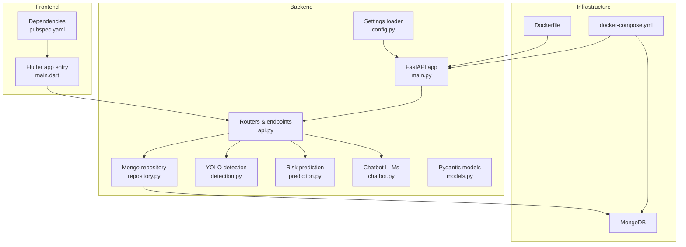
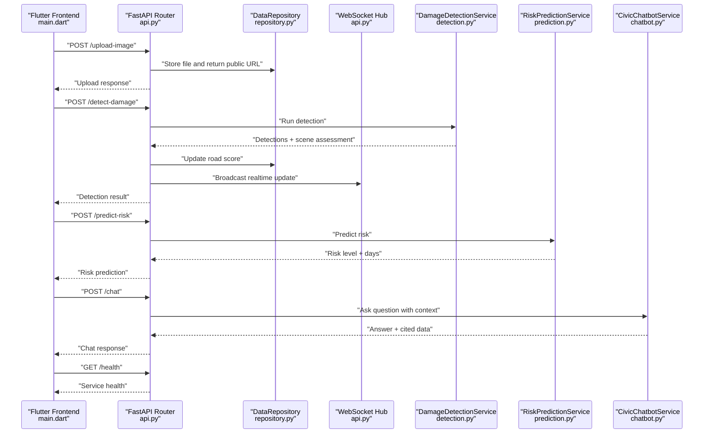
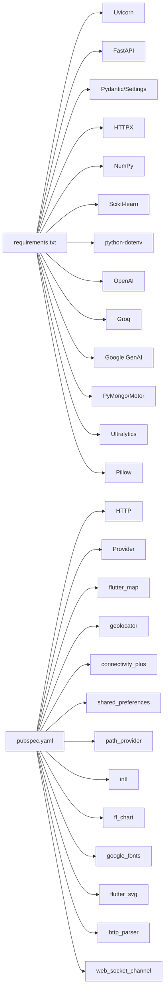

# Troubleshooting

<cite>
**Referenced Files in This Document**
- [requirements.txt](file://roadwatch_ai/backend/requirements.txt)
- [Dockerfile](file://roadwatch_ai/backend/Dockerfile)
- [docker-compose.yml](file://roadwatch_ai/docker-compose.yml)
- [main.py](file://roadwatch_ai/backend/app/main.py)
- [config.py](file://roadwatch_ai/backend/app/core/config.py)
- [repository.py](file://roadwatch_ai/backend/app/db/repository.py)
- [api.py](file://roadwatch_ai/backend/app/routers/api.py)
- [detection.py](file://roadwatch_ai/backend/app/services/detection.py)
- [prediction.py](file://roadwatch_ai/backend/app/services/prediction.py)
- [chatbot.py](file://roadwatch_ai/backend/app/services/chatbot.py)
- [models.py](file://roadwatch_ai/backend/app/schemas/models.py)
- [pubspec.yaml](file://roadwatch_ai/frontend/pubspec.yaml)
- [main.dart](file://roadwatch_ai/frontend/lib/main.dart)
- [SETUP.md](file://roadwatch_ai/docs/SETUP.md)
</cite>

## Table of Contents
1. [Introduction](#introduction)
2. [Project Structure](#project-structure)
3. [Core Components](#core-components)
4. [Architecture Overview](#architecture-overview)
5. [Detailed Component Analysis](#detailed-component-analysis)
6. [Dependency Analysis](#dependency-analysis)
7. [Performance Considerations](#performance-considerations)
8. [Troubleshooting Guide](#troubleshooting-guide)
9. [Conclusion](#conclusion)
10. [Appendices](#appendices)

## Introduction
This document provides comprehensive troubleshooting guidance for RoadWatch AI. It covers setup and environment issues, backend service startup failures, database connectivity, API endpoint problems, frontend compilation and Flutter dependency issues, platform-specific deployment pitfalls, AI/ML service debugging, WebSocket and offline synchronization diagnostics, performance tuning, and practical FAQs with step-by-step resolutions.

## Project Structure
RoadWatch AI consists of:
- Backend: FastAPI application with Uvicorn ASGI server, MongoDB via Motor/Pymongo, AI/ML services (Ultralytics YOLO, Scikit-learn), and WebSocket real-time updates.
- Frontend: Flutter web/mobile application with HTTP client, map integration, and local storage.
- Deployment: Docker Compose for backend and MongoDB, plus optional GitHub Pages deployment for the Flutter web app.

**Diagram sources**
- [main.py:1-37](file://roadwatch_ai/backend/app/main.py#L1-L37)
- [config.py:1-40](file://roadwatch_ai/backend/app/core/config.py#L1-L40)
- [repository.py:1-447](file://roadwatch_ai/backend/app/db/repository.py#L1-L447)
- [api.py:1-427](file://roadwatch_ai/backend/app/routers/api.py#L1-L427)
- [detection.py:1-319](file://roadwatch_ai/backend/app/services/detection.py#L1-L319)
- [prediction.py:1-79](file://roadwatch_ai/backend/app/services/prediction.py#L1-L79)
- [chatbot.py:1-280](file://roadwatch_ai/backend/app/services/chatbot.py#L1-L280)
- [models.py:1-177](file://roadwatch_ai/backend/app/schemas/models.py#L1-L177)
- [main.dart:1-116](file://roadwatch_ai/frontend/lib/main.dart#L1-L116)
- [pubspec.yaml:1-38](file://roadwatch_ai/frontend/pubspec.yaml#L1-L38)
- [Dockerfile:1-13](file://roadwatch_ai/backend/Dockerfile#L1-L13)
- [docker-compose.yml:1-35](file://roadwatch_ai/docker-compose.yml#L1-L35)

**Section sources**
- [main.py:1-37](file://roadwatch_ai/backend/app/main.py#L1-L37)
- [config.py:1-40](file://roadwatch_ai/backend/app/core/config.py#L1-L40)
- [repository.py:1-447](file://roadwatch_ai/backend/app/db/repository.py#L1-L447)
- [api.py:1-427](file://roadwatch_ai/backend/app/routers/api.py#L1-L427)
- [detection.py:1-319](file://roadwatch_ai/backend/app/services/detection.py#L1-L319)
- [prediction.py:1-79](file://roadwatch_ai/backend/app/services/prediction.py#L1-L79)
- [chatbot.py:1-280](file://roadwatch_ai/backend/app/services/chatbot.py#L1-L280)
- [models.py:1-177](file://roadwatch_ai/backend/app/schemas/models.py#L1-L177)
- [main.dart:1-116](file://roadwatch_ai/frontend/lib/main.dart#L1-L116)
- [pubspec.yaml:1-38](file://roadwatch_ai/frontend/pubspec.yaml#L1-L38)
- [Dockerfile:1-13](file://roadwatch_ai/backend/Dockerfile#L1-L13)
- [docker-compose.yml:1-35](file://roadwatch_ai/docker-compose.yml#L1-L35)

## Core Components
- Backend configuration and settings: Centralized environment-driven configuration with caching and defaults.
- Data repository: Abstraction over MongoDB and local JSON for demo mode; initializes collections and inserts seed data when empty.
- API router: Exposes health checks, image upload, damage detection, complaint generation, risk prediction, chat, and WebSocket updates.
- AI/ML services: YOLO-based detection with fallback heuristics, Random Forest risk prediction, and multi-provider chatbot with OpenAI, Groq, and Google Generative AI.
- Frontend: Flutter app wiring, theme, and initialization; relies on API URL configuration and platform keys.

Key troubleshooting anchors:
- Environment variables and settings loading.
- MongoDB connection and collection seeding.
- Endpoint error handling and safe error messaging.
- AI/ML service availability and fallbacks.
- WebSocket connection lifecycle and broadcasting.
- Frontend build/runtime configuration and platform keys.

**Section sources**
- [config.py:1-40](file://roadwatch_ai/backend/app/core/config.py#L1-L40)
- [repository.py:59-93](file://roadwatch_ai/backend/app/db/repository.py#L59-L93)
- [api.py:66-132](file://roadwatch_ai/backend/app/routers/api.py#L66-L132)
- [detection.py:28-94](file://roadwatch_ai/backend/app/services/detection.py#L28-L94)
- [prediction.py:21-79](file://roadwatch_ai/backend/app/services/prediction.py#L21-L79)
- [chatbot.py:33-176](file://roadwatch_ai/backend/app/services/chatbot.py#L33-L176)
- [main.dart:13-115](file://roadwatch_ai/frontend/lib/main.dart#L13-L115)

## Architecture Overview
End-to-end flow from frontend to backend and AI/ML services.

**Diagram sources**
- [api.py:134-191](file://roadwatch_ai/backend/app/routers/api.py#L134-L191)
- [repository.py:236-283](file://roadwatch_ai/backend/app/db/repository.py#L236-L283)
- [detection.py:36-94](file://roadwatch_ai/backend/app/services/detection.py#L36-L94)
- [prediction.py:42-79](file://roadwatch_ai/backend/app/services/prediction.py#L42-L79)
- [chatbot.py:52-176](file://roadwatch_ai/backend/app/services/chatbot.py#L52-L176)
- [main.dart:13-115](file://roadwatch_ai/frontend/lib/main.dart#L13-L115)

## Detailed Component Analysis

### Backend Startup and Configuration
Common issues:
- Virtual environment activation and dependency installation.
- Missing environment variables for MongoDB URI and API host/port.
- CORS origin misconfiguration causing frontend-blocked requests.
- Port conflicts or host binding issues.

Resolution steps:
- Verify Python virtual environment and installed packages per requirements.
- Confirm environment variables are loaded and settings cache is effective.
- Ensure API_HOST and API_PORT match the exposed port and container configuration.
- Set FRONTEND_ORIGIN appropriately for development vs. production.

**Section sources**
- [requirements.txt:1-18](file://roadwatch_ai/backend/requirements.txt#L1-L18)
- [config.py:10-39](file://roadwatch_ai/backend/app/core/config.py#L10-L39)
- [main.py:13-30](file://roadwatch_ai/backend/app/main.py#L13-L30)
- [Dockerfile:12-13](file://roadwatch_ai/backend/Dockerfile#L12-L13)
- [docker-compose.yml:19-28](file://roadwatch_ai/docker-compose.yml#L19-L28)

### Database Connectivity and Repository Initialization
Common issues:
- MongoDB URI invalid or unreachable.
- Network policies blocking localhost or container networks.
- Missing or empty collections preventing seed data insertion.
- PyMongo/Motor import failures leading to disabled repository features.

Resolution steps:
- Validate MONGO_URI and confirm MongoDB is reachable on the configured port.
- Check container networking if using Docker Compose.
- Ensure seed JSON files exist and are readable.
- Install optional dependencies if enabling full repository features.

**Section sources**
- [config.py:20-21](file://roadwatch_ai/backend/app/core/config.py#L20-L21)
- [repository.py:59-93](file://roadwatch_ai/backend/app/db/repository.py#L59-L93)
- [docker-compose.yml:4-11](file://roadwatch_ai/docker-compose.yml#L4-L11)

### API Endpoints and Error Handling
Common issues:
- 404 Not Found for roads or road network items.
- Validation errors on request payloads.
- Chat endpoint failures due to LLM provider unavailability.
- Upload restrictions rejecting unsupported content types.

Resolution steps:
- Verify resource existence before querying endpoints.
- Validate request payloads against Pydantic models.
- Check LLM API keys and provider SDK installations.
- Confirm allowed content types for uploads.

**Section sources**
- [api.py:250-276](file://roadwatch_ai/backend/app/routers/api.py#L250-L276)
- [api.py:317-332](file://roadwatch_ai/backend/app/routers/api.py#L317-L332)
- [api.py:348-366](file://roadwatch_ai/backend/app/routers/api.py#L348-L366)
- [api.py:134-161](file://roadwatch_ai/backend/app/routers/api.py#L134-L161)
- [models.py:36-41](file://roadwatch_ai/backend/app/schemas/models.py#L36-L41)
- [models.py:118-123](file://roadwatch_ai/backend/app/schemas/models.py#L118-L123)

### WebSocket Real-Time Updates
Common issues:
- Clients disconnecting unexpectedly.
- Broadcast failures due to stale connections.
- No clients connected to receive updates.

Resolution steps:
- Ensure proper accept and disconnect handling.
- Gracefully remove disconnected sockets from the hub.
- Test with a WebSocket client to verify connectivity.

**Section sources**
- [api.py:38-60](file://roadwatch_ai/backend/app/routers/api.py#L38-L60)
- [api.py:122-132](file://roadwatch_ai/backend/app/routers/api.py#L122-L132)

### AI/ML Services Debugging
Common issues:
- YOLO model path missing or inaccessible.
- Ultralytics import failure leading to fallback behavior.
- Scikit-learn import failure impacting risk prediction.
- LLM SDKs not installed causing provider unavailability.

Resolution steps:
- Verify YOLO_MODEL_PATH exists and is readable.
- Confirm scikit-learn and ultralytics are installed.
- Ensure LLM API keys are configured and SDKs are present.
- Review fallback logic and logs for provider errors.

**Section sources**
- [config.py:23-34](file://roadwatch_ai/backend/app/core/config.py#L23-L34)
- [detection.py:28-35](file://roadwatch_ai/backend/app/services/detection.py#L28-L35)
- [detection.py:78-94](file://roadwatch_ai/backend/app/services/detection.py#L78-L94)
- [prediction.py:21-41](file://roadwatch_ai/backend/app/services/prediction.py#L21-L41)
- [chatbot.py:33-51](file://roadwatch_ai/backend/app/services/chatbot.py#L33-L51)

### Frontend Compilation and Dependencies
Common issues:
- Missing Flutter dependencies after checkout.
- Platform-specific keys not configured.
- Incorrect API URL for backend integration.
- Build artifacts not updated after configuration changes.

Resolution steps:
- Run dependency resolution for Flutter.
- Add platform-specific API keys as instructed.
- Set API_URL via dart define for builds.
- Clean and rebuild web builds when changing API_URL.

**Section sources**
- [pubspec.yaml:9-32](file://roadwatch_ai/frontend/pubspec.yaml#L9-L32)
- [SETUP.md:55-83](file://roadwatch_ai/docs/SETUP.md#L55-L83)
- [SETUP.md:92-104](file://roadwatch_ai/docs/SETUP.md#L92-L104)
- [main.dart:13-115](file://roadwatch_ai/frontend/lib/main.dart#L13-L115)

### Platform-Specific Deployment Problems
Common issues:
- GitHub Pages workflow not injecting API_URL.
- CORS mismatches between frontend origin and backend.
- Docker port conflicts or wrong host binding.

Resolution steps:
- Ensure repository variable API_URL is set for GitHub Pages.
- Align FRONTEND_ORIGIN with the frontend origin used by the hosted app.
- Use docker-compose port mappings and verify host binding.

**Section sources**
- [SETUP.md:84-91](file://roadwatch_ai/docs/SETUP.md#L84-L91)
- [docker-compose.yml:19-29](file://roadwatch_ai/docker-compose.yml#L19-L29)
- [main.py:22-28](file://roadwatch_ai/backend/app/main.py#L22-L28)

## Dependency Analysis

**Diagram sources**
- [requirements.txt:1-18](file://roadwatch_ai/backend/requirements.txt#L1-L18)
- [pubspec.yaml:9-32](file://roadwatch_ai/frontend/pubspec.yaml#L9-L32)

**Section sources**
- [requirements.txt:1-18](file://roadwatch_ai/backend/requirements.txt#L1-L18)
- [pubspec.yaml:9-32](file://roadwatch_ai/frontend/pubspec.yaml#L9-L32)

## Performance Considerations
- API response slowness:
  - Validate database queries and indexes; review repository operations.
  - Monitor inference time for YOLO detection and adjust model size or device acceleration if needed.
  - Enable gzip middleware and avoid oversized payloads.
- Memory leaks:
  - Ensure WebSocket connections are properly removed on disconnect.
  - Avoid retaining large images in memory; stream or process in chunks.
- UI rendering issues:
  - Reduce unnecessary rebuilds; use Provider effectively.
  - Avoid heavy synchronous work on the UI thread; offload to background threads where appropriate.

[No sources needed since this section provides general guidance]

## Troubleshooting Guide

### Setup and Environment
- Backend virtual environment not activating:
  - Recreate the environment and reinstall dependencies.
  - Confirm shell activation script matches your OS.
- Missing environment variables:
  - Copy the example environment file and populate required keys.
  - Validate settings loading and caching.
- Docker Compose not starting:
  - Check service dependencies and port conflicts.
  - Inspect container logs for startup errors.

**Section sources**
- [SETUP.md:10-22](file://roadwatch_ai/docs/SETUP.md#L10-L22)
- [config.py:7-11](file://roadwatch_ai/backend/app/core/config.py#L7-L11)
- [docker-compose.yml:19-31](file://roadwatch_ai/docker-compose.yml#L19-L31)

### Backend Service Startup Failures
- Uvicorn fails to bind port:
  - Change PORT or API_PORT and ensure host binding matches container/network.
- CORS errors in browser:
  - Adjust FRONTEND_ORIGIN to match the frontend origin.
- Health check failing:
  - Verify MongoDB connectivity and seed data insertion.

**Section sources**
- [Dockerfile:12-13](file://roadwatch_ai/backend/Dockerfile#L12-L13)
- [main.py:22-30](file://roadwatch_ai/backend/app/main.py#L22-L30)
- [repository.py:59-93](file://roadwatch_ai/backend/app/db/repository.py#L59-L93)

### Database Connection Issues
- Connection refused or timeout:
  - Confirm MongoDB URI and network reachability.
  - Check firewall and container networking.
- Empty collections after startup:
  - Ensure seed JSON files exist and are readable.
  - Validate write permissions.

**Section sources**
- [config.py:20-21](file://roadwatch_ai/backend/app/core/config.py#L20-L21)
- [repository.py:41-52](file://roadwatch_ai/backend/app/db/repository.py#L41-L52)

### API Endpoint Problems
- 404 Not Found:
  - Verify resource IDs and routes.
- Validation errors:
  - Match request payloads to Pydantic models.
- Upload rejected:
  - Confirm content type is allowed.

**Section sources**
- [api.py:250-276](file://roadwatch_ai/backend/app/routers/api.py#L250-L276)
- [api.py:317-332](file://roadwatch_ai/backend/app/routers/api.py#L317-L332)
- [api.py:134-161](file://roadwatch_ai/backend/app/routers/api.py#L134-L161)
- [models.py:36-41](file://roadwatch_ai/backend/app/schemas/models.py#L36-L41)

### WebSocket Connection Issues
- Disconnections:
  - Ensure proper accept and disconnect handling.
  - Remove stale connections from the hub.
- No updates received:
  - Verify at least one client is connected.

**Section sources**
- [api.py:38-60](file://roadwatch_ai/backend/app/routers/api.py#L38-L60)
- [api.py:122-132](file://roadwatch_ai/backend/app/routers/api.py#L122-L132)

### AI/ML Services Debugging
- YOLO detection returns fallback:
  - Verify YOLO model path and installation.
- Risk prediction fallback:
  - Confirm scikit-learn installation.
- Chatbot provider errors:
  - Check API keys and SDK presence; review fallback behavior.

**Section sources**
- [detection.py:28-35](file://roadwatch_ai/backend/app/services/detection.py#L28-L35)
- [detection.py:78-94](file://roadwatch_ai/backend/app/services/detection.py#L78-L94)
- [prediction.py:21-41](file://roadwatch_ai/backend/app/services/prediction.py#L21-L41)
- [chatbot.py:33-51](file://roadwatch_ai/backend/app/services/chatbot.py#L33-L51)

### Frontend Compilation Errors
- Dependency resolution failures:
  - Run dependency resolution for Flutter.
- Platform keys missing:
  - Add platform-specific keys as documented.
- API URL mismatch:
  - Set API_URL via dart define for builds.

**Section sources**
- [pubspec.yaml:9-32](file://roadwatch_ai/frontend/pubspec.yaml#L9-L32)
- [SETUP.md:55-83](file://roadwatch_ai/docs/SETUP.md#L55-L83)
- [SETUP.md:92-104](file://roadwatch_ai/docs/SETUP.md#L92-L104)

### Platform-Specific Deployment Problems
- GitHub Pages not reaching backend:
  - Set repository variable API_URL.
- CORS mismatches:
  - Align FRONTEND_ORIGIN with the hosted frontend origin.
- Docker port conflicts:
  - Adjust port mappings and verify host binding.

**Section sources**
- [SETUP.md:84-91](file://roadwatch_ai/docs/SETUP.md#L84-L91)
- [docker-compose.yml:19-29](file://roadwatch_ai/docker-compose.yml#L19-L29)
- [main.py:22-28](file://roadwatch_ai/backend/app/main.py#L22-L28)

### Offline Synchronization Problems
- Sync endpoint returns partial results:
  - Validate input payloads and complaint generation flow.
  - Confirm realtime broadcast after sync completion.

**Section sources**
- [api.py:403-427](file://roadwatch_ai/backend/app/routers/api.py#L403-L427)

### Logging and Diagnostics
- Backend logs:
  - Use uvicorn logs and Python logging to capture exceptions.
- Frontend logs:
  - Use Flutter run logs and browser devtools console/network tabs.
- Error message interpretation:
  - Chat endpoint wraps errors in responses; check cited_data for provider errors.

**Section sources**
- [api.py:360-366](file://roadwatch_ai/backend/app/routers/api.py#L360-L366)
- [chatbot.py:169-176](file://roadwatch_ai/backend/app/services/chatbot.py#L169-L176)

### FAQ

- Q: Backend does not start and shows port binding error.
  - A: Change PORT or API_PORT and ensure host binding matches container/network configuration.

- Q: Frontend cannot connect to backend after deploying to GitHub Pages.
  - A: Set repository variable API_URL and ensure it matches the deployed backend URL.

- Q: Uploads fail with unsupported content type.
  - A: Restrict uploads to allowed image types as enforced by the endpoint.

- Q: WebSocket updates do not arrive.
  - A: Ensure a client connects and remains connected; verify hub broadcast logic.

- Q: YOLO detection returns no results.
  - A: Verify model path and installation; fallback heuristics may apply.

- Q: Risk prediction returns unexpected values.
  - A: Confirm scikit-learn installation and training data availability.

- Q: Chatbot returns generic fallback responses.
  - A: Check LLM API keys and provider SDK presence; review fallback logic.

- Q: Flutter build fails after changing API URL.
  - A: Re-run dependency resolution and rebuild with the updated API_URL.

**Section sources**
- [Dockerfile:12-13](file://roadwatch_ai/backend/Dockerfile#L12-L13)
- [SETUP.md:84-104](file://roadwatch_ai/docs/SETUP.md#L84-L104)
- [api.py:134-161](file://roadwatch_ai/backend/app/routers/api.py#L134-L161)
- [api.py:122-132](file://roadwatch_ai/backend/app/routers/api.py#L122-L132)
- [detection.py:28-35](file://roadwatch_ai/backend/app/services/detection.py#L28-L35)
- [prediction.py:21-41](file://roadwatch_ai/backend/app/services/prediction.py#L21-L41)
- [chatbot.py:33-51](file://roadwatch_ai/backend/app/services/chatbot.py#L33-L51)
- [pubspec.yaml:9-32](file://roadwatch_ai/frontend/pubspec.yaml#L9-L32)

## Conclusion
This guide consolidates actionable troubleshooting steps for RoadWatch AI across backend, database, AI/ML services, frontend, and deployment. Use the structured sections and FAQs to quickly diagnose and resolve common issues, and leverage the referenced files for precise configuration and behavior verification.

[No sources needed since this section summarizes without analyzing specific files]

## Appendices

### Diagnostic Checklist
- Backend
  - Environment variables loaded and cached.
  - MongoDB reachable and seeded.
  - Uvicorn bound to correct host/port.
  - CORS origin aligned with frontend.
- API
  - Health endpoint responds.
  - Uploads permitted for allowed types.
  - Endpoints validated against models.
  - WebSocket hub maintains active connections.
- AI/ML
  - YOLO model path valid.
  - Scikit-learn and Ultralytics installed.
  - LLM API keys configured.
- Frontend
  - Dependencies resolved.
  - API_URL set for builds.
  - Platform keys configured.
- Deployment
  - GitHub Pages workflow configured.
  - Docker port mappings correct.

[No sources needed since this section provides general guidance]